## Overview

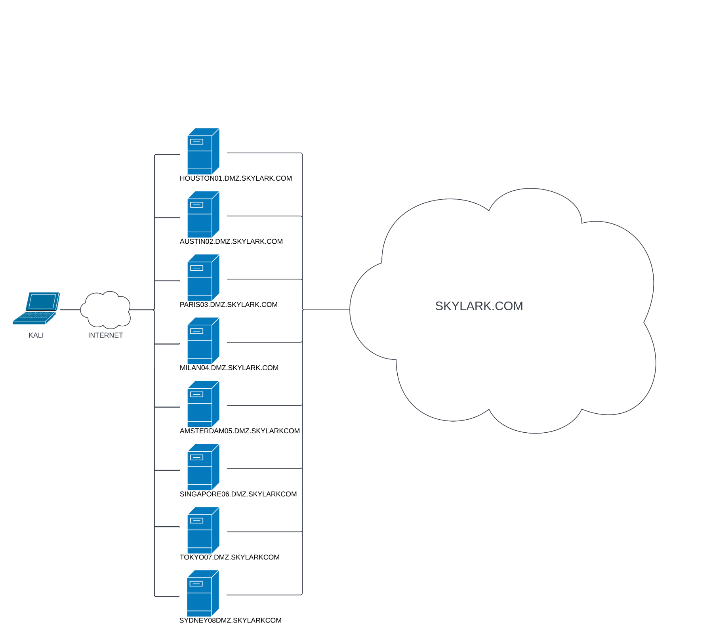

## Nmap
* `192.168.x.220`
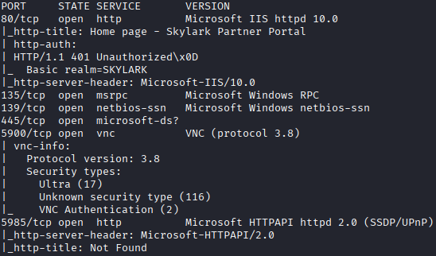
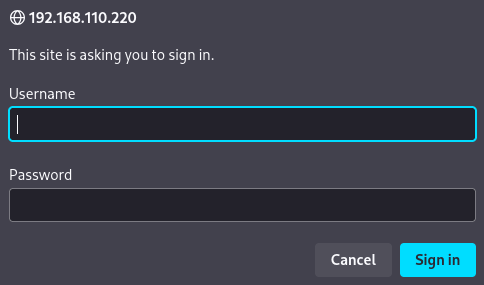

* `192.168.x.221`
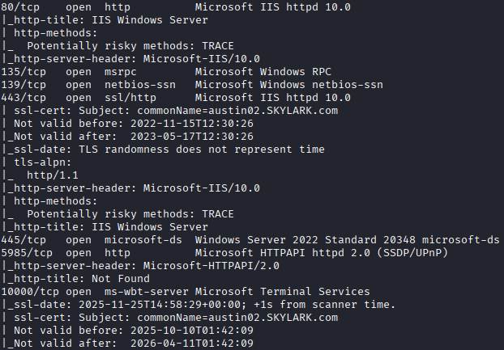

* `192.168.x.222`
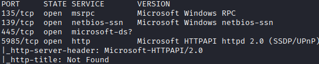

* `192.168.x.223`
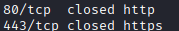

* `192.168.x.224`
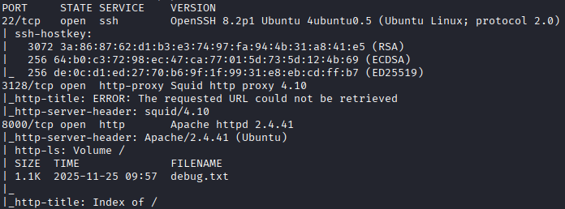
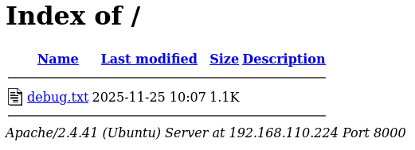
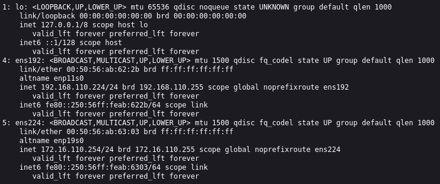

* `192.168.x.225`
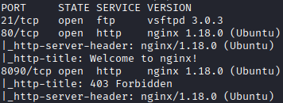
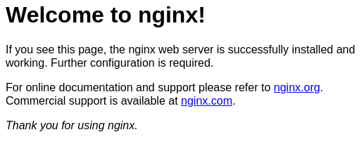
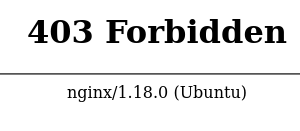

* `192.168.x.226`
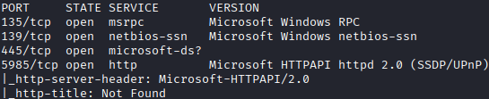

* `192.168.x.227`
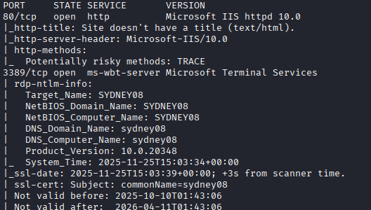

* `192.168.x.250`
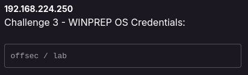
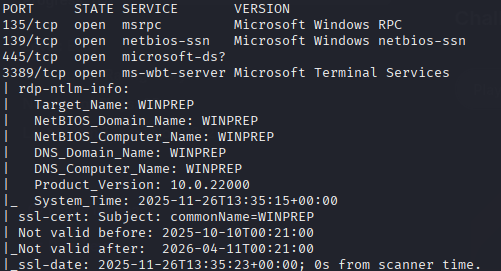

## Possible Exploit
1. `192.168.x.224`
    1. apache
    `CVE-2020-11984`
    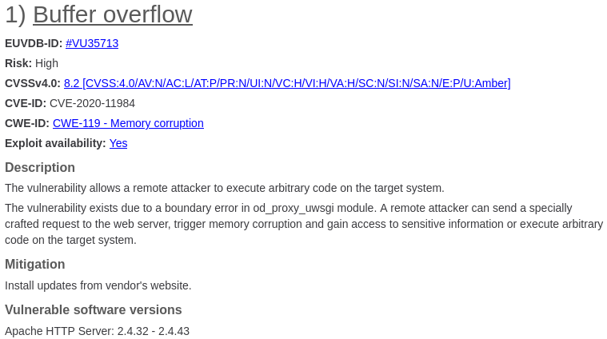
    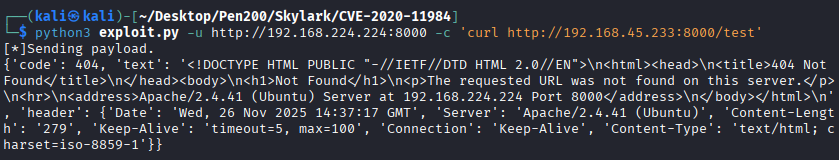
    `CVE-2021-44790`
    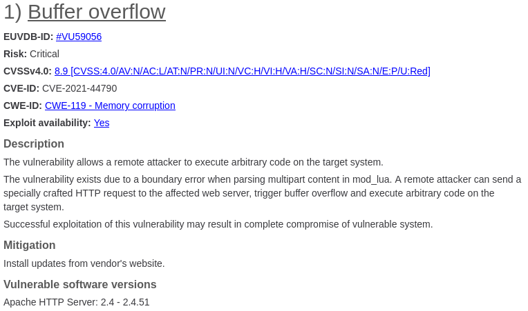
    `CVE-2022-22721`
    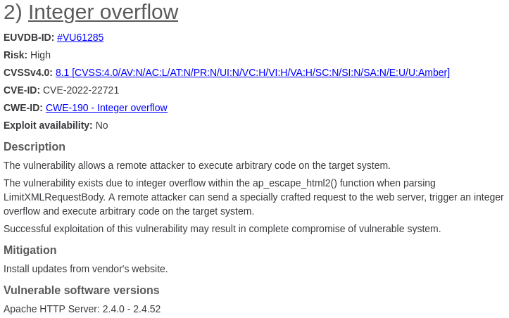
    `CVE-2024-38473`
    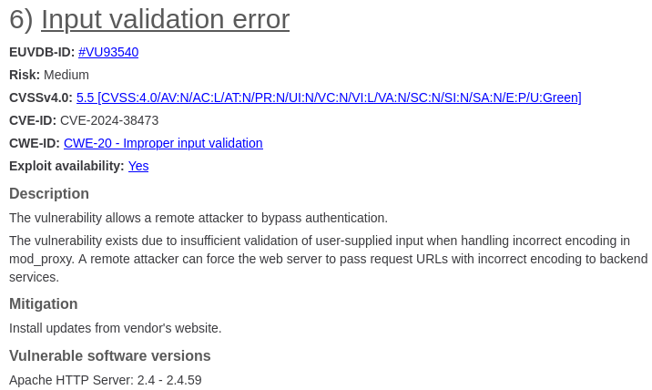
    2. squid
    `CVE-2020-11945`
    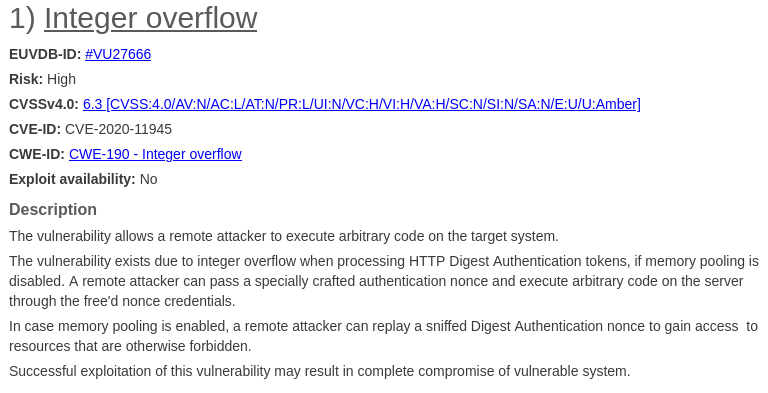
    `CVE-2019-12519`
    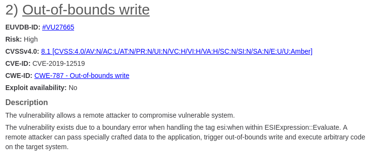