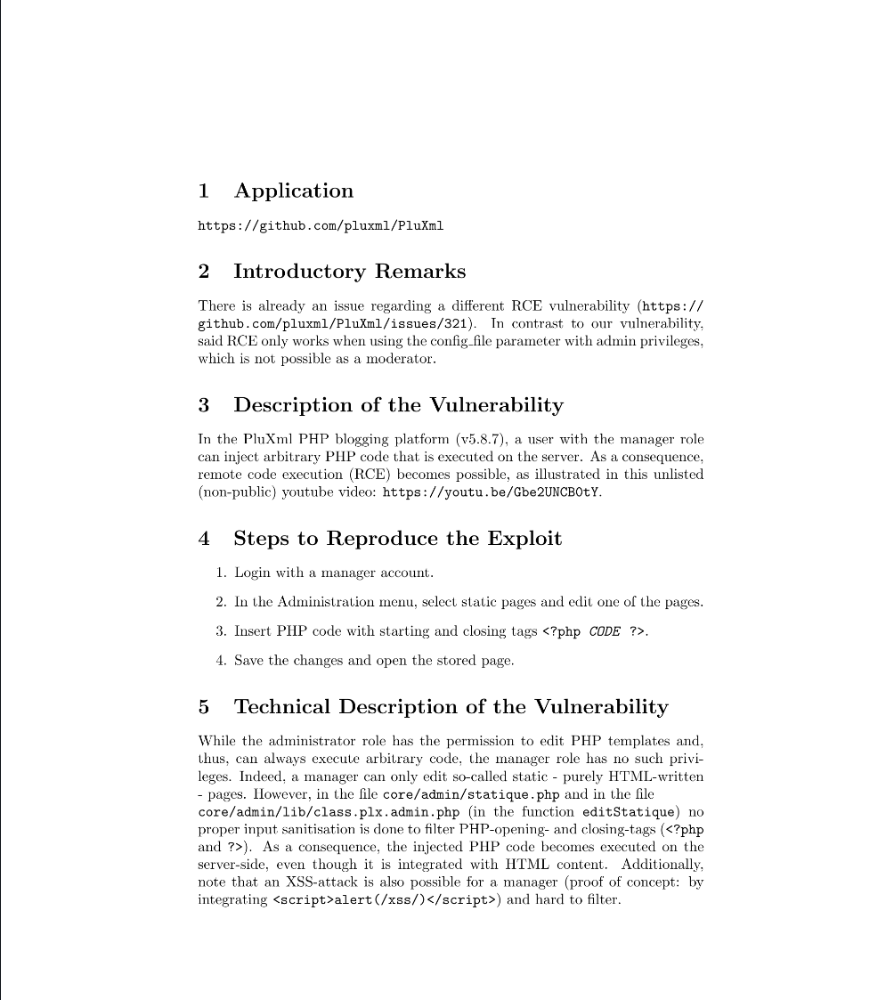
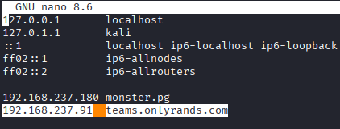
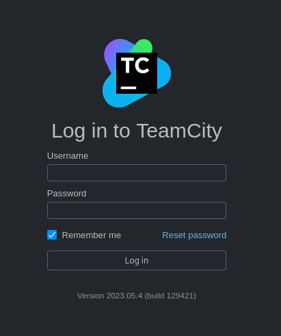
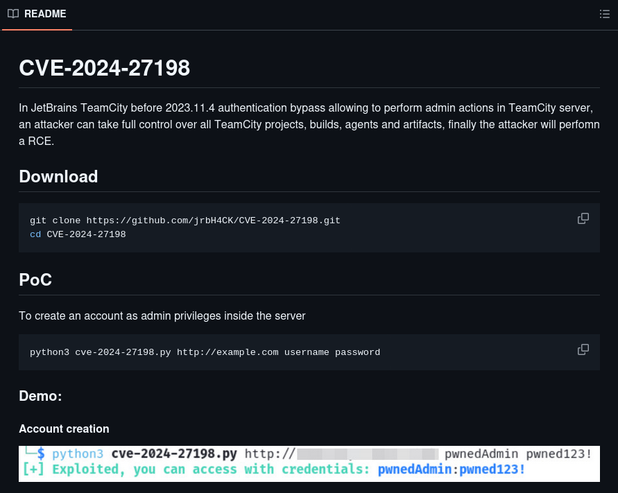
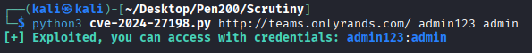
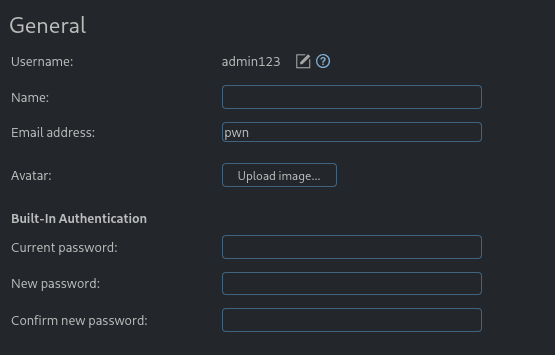

## NMAP
```
PORT    STATE  SERVICE REASON         VERSION
22/tcp  open   ssh     syn-ack ttl 61 OpenSSH 8.2p1 Ubuntu 4ubuntu0.11 (Ubuntu Linux; protocol 2.0)
| ssh-hostkey: 
|   3072 62:36:1a:5c:d3:e3:7b:e1:70:f8:a3:b3:1c:4c:24:38 (RSA)
| ssh-rsa AAAAB3NzaC1yc2EAAAADAQABAAABgQDFR/u8yZrrxkDWw/8gy/fNFksvT+QIL8O/6eD8zVxwKwgBURa9uRtOC8Dk6P+ktLwXJ9oSUitZeXVWjijbehpZBVHvywEOj9nc0bmk0+M/DGGbr1etS7cDvRzRATUtMPxQfYhzXqHlZe6Q2GfA0c75uybUXxOha8CTdK0Iv/maUUaiaPv3LGebQ4CpNaXNQfYVpCdsxLn5MxFi+tfenn/4CinBPn1Ahnx499V1G0ANTaKLsEETjqaMd5jnmml2wH1GmKfKf/6FevWv0Q9Ylsi3x/ipkDpcQAMRQ/aw5NuSSDrGTdo0wRuuoEf5Ybenp9haPVxUAPHbEcMI2hdcP5B3Cd03qimMhHEkFXE8sTUxRKHG+hg7cF8On1EXZsH1fsVyrFAAoHRrap5CsubmNXT93EcK7lc65DbKgeqls643x0p/4WOUiLXFstm6X4JCdEyhvWmnYtL3qDKMuQbCwrCJGeDjoaZTjHXbpjSxSnvtO04RT84x2t8MThyeYO3kSyM=
|   256 ee:25:fc:23:66:05:c0:c1:ec:47:c6:bb:00:c7:4f:53 (ECDSA)
| ecdsa-sha2-nistp256 AAAAE2VjZHNhLXNoYTItbmlzdHAyNTYAAAAIbmlzdHAyNTYAAABBBNBWjceIJ9NSOLk8zk68zCychWoLxrcrsuJYy2C1pvpfOhVBrr8QBhYbJxzzGJ7DpuMT/DXiCwuLXdu0zeR4/Dk=
|   256 83:5c:51:ac:32:e5:3a:21:7c:f6:c2:cd:93:68:58:d8 (ED25519)
|_ssh-ed25519 AAAAC3NzaC1lZDI1NTE5AAAAIG3LJwn9us7wxvkL0E6EEgOPG3P0fa0fRVuJuXeASZvs
25/tcp  open   smtp    syn-ack ttl 61 Postfix smtpd
|_smtp-commands: onlyrands.com, PIPELINING, SIZE 10240000, VRFY, ETRN, STARTTLS, ENHANCEDSTATUSCODES, 8BITMIME, DSN, SMTPUTF8, CHUNKING
|_ssl-date: TLS randomness does not represent time
| ssl-cert: Subject: commonName=onlyrands.com
| Subject Alternative Name: DNS:onlyrands.com
| Issuer: commonName=onlyrands.com
| Public Key type: rsa
| Public Key bits: 2048
| Signature Algorithm: sha256WithRSAEncryption
| Not valid before: 2024-06-07T09:33:24
| Not valid after:  2034-06-05T09:33:24
| MD5:   c8cd:3971:35a3:7fc5:3769:ef5a:f9bc:57cb
| SHA-1: b41d:66cb:a6a2:b31a:2c73:6e42:c04e:17e5:003c:da69
| -----BEGIN CERTIFICATE-----
| MIIC5TCCAc2gAwIBAgIUNIm+chfkmJj6erEydimvYkkmFSAwDQYJKoZIhvcNAQEL
| BQAwGDEWMBQGA1UEAwwNb25seXJhbmRzLmNvbTAeFw0yNDA2MDcwOTMzMjRaFw0z
| NDA2MDUwOTMzMjRaMBgxFjAUBgNVBAMMDW9ubHlyYW5kcy5jb20wggEiMA0GCSqG
| SIb3DQEBAQUAA4IBDwAwggEKAoIBAQDPZBwhB0ccLHM6saGPQCHQckSsaDVmRlOv
| kqJDnApq0KcOLr2oX8xPuMBi/u3IUzLWrW9cawLVfd6flF5+ThdcvNPzjms0xOYh
| xqRwWD1CWPK5nbV/DWDfz7IaHdOFpN00cCNIblbZHl/Fts4rcWtm42aI/beilShQ
| LqqEPn2UU2ti6C4FmFdXdzHxA03Qy0rIIUNS2Gt0/dYH0AEhRSW4KtNLT3/0edzu
| OVMFIRumKNZvW0izOm72l0ak3g6A9dKTo8hAGaFjD+ZYhRr57CYtfF9QlZQxGPfm
| sax05QR4PNg0MzwH9/wok26sR0D1Cia1G/AU3rNoPXBk46l2GbtLAgMBAAGjJzAl
| MAkGA1UdEwQCMAAwGAYDVR0RBBEwD4INb25seXJhbmRzLmNvbTANBgkqhkiG9w0B
| AQsFAAOCAQEATfflEYN/YhQ318kgr06n/2uEgM54rKbrMCG4SItNdylp1KtmAx+Y
| ON7L/ayq3cBZGY2IQAJtTmbA30iPunaHS9ZG76f9XxuKhFyTDmjJjlGy8mJAMT1Q
| o9CMamHElIPEWklobL+N9ZHh6r62Gw6ByTzBTLVUh+EQF5M8vKHLD7GxpZlmWcBn
| NFGoTImjeMWGIp/P/GZJQhiKaE5AxbMjX7hZH8eWaRpt6aI+C+ZQlVB5m1scH4l4
| iracOJCaxrEjDGpOYiiSp4kh5+9NiaVHiNkmpswaEtdO7SVxToTKjeC8omNhF5iY
| jX7rqCVAbRHl0MCuk7NhAdRgwmfNT9VweQ==
|_-----END CERTIFICATE-----
80/tcp  open   http    syn-ack ttl 61 nginx 1.18.0 (Ubuntu)
|_http-title: OnlyRands
|_http-server-header: nginx/1.18.0 (Ubuntu)
| http-methods: 
|_  Supported Methods: GET HEAD
443/tcp closed https   reset ttl 61
Service Info: Host:  onlyrands.com; OS: Linux; CPE: cpe:/o:linux:linux_kernel
```

## 80 HTTP







* login function

  

  

  

* rce
https://medium.com/@adamforsythebartlett/scrutiny-walkthrough-proving-grounds-practice-01737dd96583

## Privilege Escalation

## REF
https://medium.com/@adamforsythebartlett/scrutiny-walkthrough-proving-grounds-practice-01737dd96583