## NMAP
```
PORT     STATE  SERVICE      REASON         VERSION
20/tcp   closed ftp-data     reset ttl 61
21/tcp   open   ftp          syn-ack ttl 61 vsftpd 3.0.5
22/tcp   open   ssh          syn-ack ttl 61 OpenSSH 9.6p1 Ubuntu 3ubuntu13.9 (Ubuntu Linux; protocol 2.0)
| ssh-hostkey: 
|   256 f2:5a:a9:66:65:3e:d0:b8:9d:a5:16:8c:e8:16:37:e2 (ECDSA)
| ecdsa-sha2-nistp256 AAAAE2VjZHNhLXNoYTItbmlzdHAyNTYAAAAIbmlzdHAyNTYAAABBBGT2bbuknyDQCZL8wcewIxfJHCT3ZA9MHovHm5vV8gnY+WaklYD1KkExYX16RT7Du6kDkOd7/VtgT8wyumO7X74=
|   256 9b:2d:1d:f8:13:74:ce:96:82:4e:19:35:f9:7e:1b:68 (ED25519)
|_ssh-ed25519 AAAAC3NzaC1lZDI1NTE5AAAAIP9T+RtTpSheh2mjfbGIXvNadPVCLuheP1AqmUPx6yic
80/tcp   open   http         syn-ack ttl 61 nginx 1.24.0 (Ubuntu)
|_http-generator: WordPress 6.7.2
|_http-title: Workaholic
| http-methods: 
|_  Supported Methods: GET HEAD POST
|_http-favicon: Unknown favicon MD5: 6BD852FF8C391FD56DF5A8EF4C2DB7FC
|_http-server-header: nginx/1.24.0 (Ubuntu)
|_http-trane-info: Problem with XML parsing of /evox/about
990/tcp  closed ftps         reset ttl 61
1024/tcp closed kdm          reset ttl 61
1025/tcp closed NFS-or-IIS   reset ttl 61
1026/tcp closed LSA-or-nterm reset ttl 61
1027/tcp closed IIS          reset ttl 61
1028/tcp closed unknown      reset ttl 61
1029/tcp closed ms-lsa       reset ttl 61
1030/tcp closed iad1         reset ttl 61
1031/tcp closed iad2         reset ttl 61
1032/tcp closed iad3         reset ttl 61
1033/tcp closed netinfo      reset ttl 61
1034/tcp closed zincite-a    reset ttl 61
1035/tcp closed multidropper reset ttl 61
1036/tcp closed nsstp        reset ttl 61
1037/tcp closed ams          reset ttl 61
1038/tcp closed mtqp         reset ttl 61
1039/tcp closed sbl          reset ttl 61
1040/tcp closed netsaint     reset ttl 61
1041/tcp closed danf-ak2     reset ttl 61
1042/tcp closed afrog        reset ttl 61
1043/tcp closed boinc        reset ttl 61
1044/tcp closed dcutility    reset ttl 61
1045/tcp closed fpitp        reset ttl 61
1046/tcp closed wfremotertm  reset ttl 61
1047/tcp closed neod1        reset ttl 61
1048/tcp closed neod2        reset ttl 61
Service Info: OSs: Unix, Linux; CPE: cpe:/o:linux:linux_kernel
```

## 21 FTP

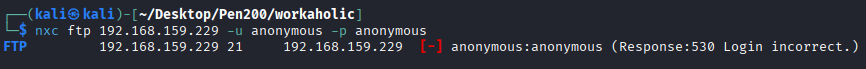

## 80 HTTP

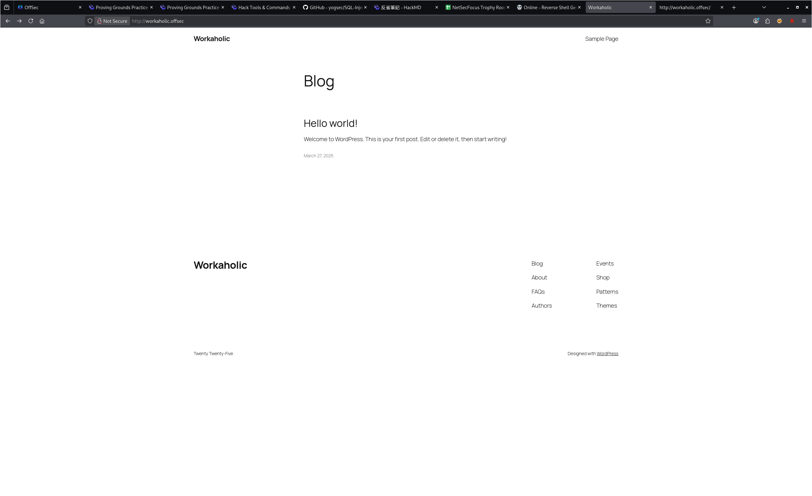

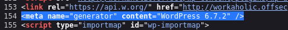

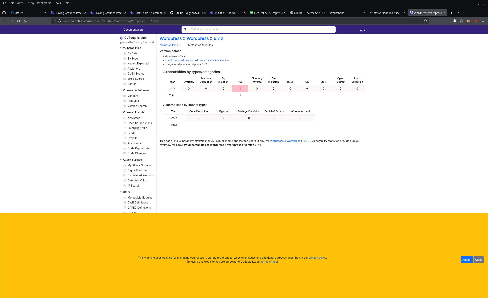

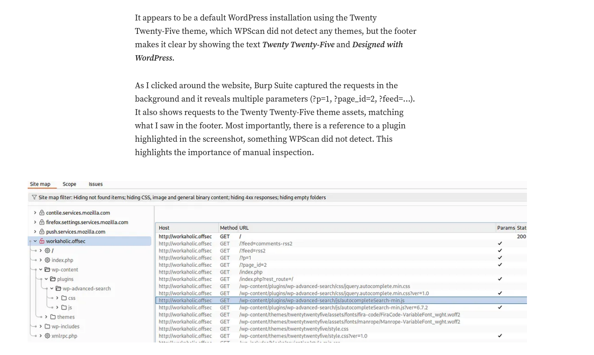

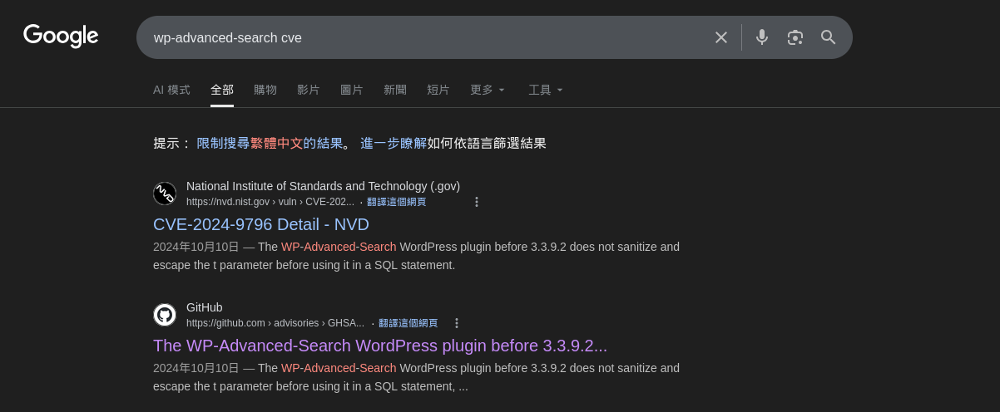

https://github.com/BwithE/CVE-2024-9796/blob/main/README.md

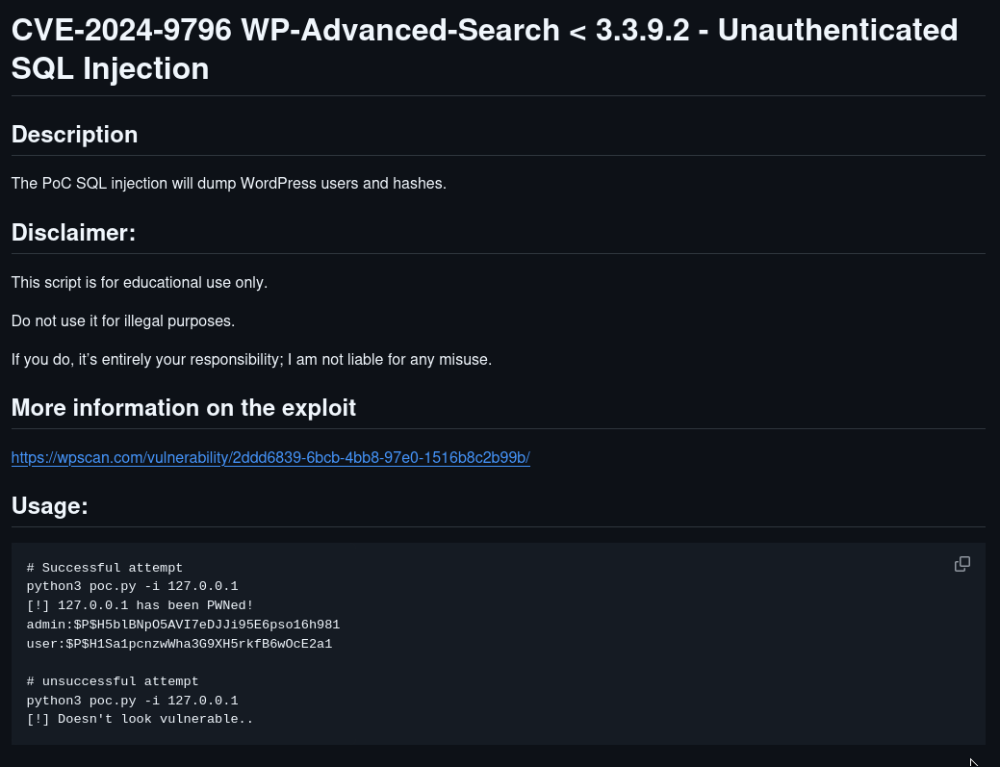

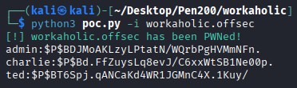

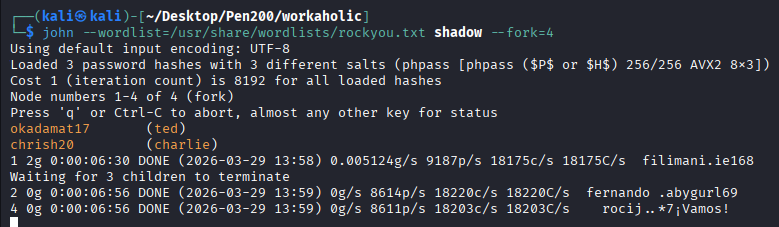

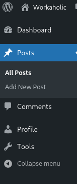

ted跟charlie在網站裡都沒有權限

## 22 SSH

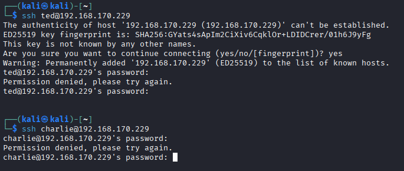

## 21 FTP AGAIN

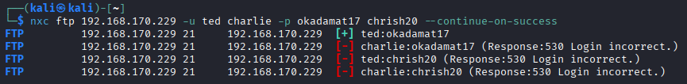

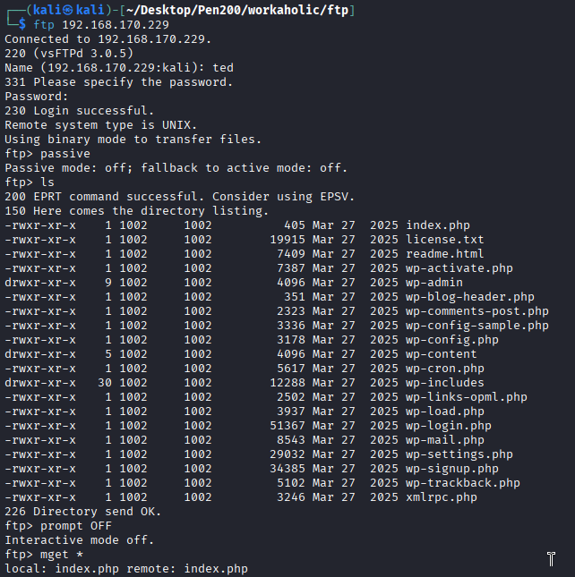

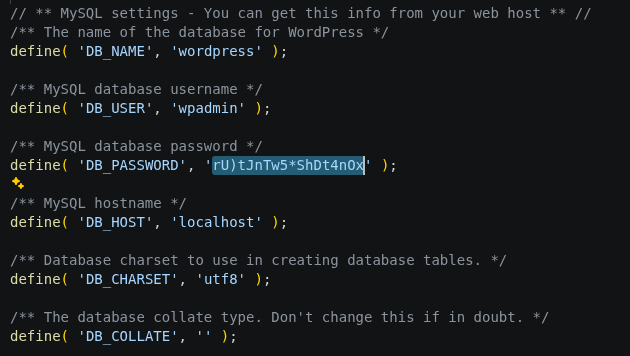

## Password spray

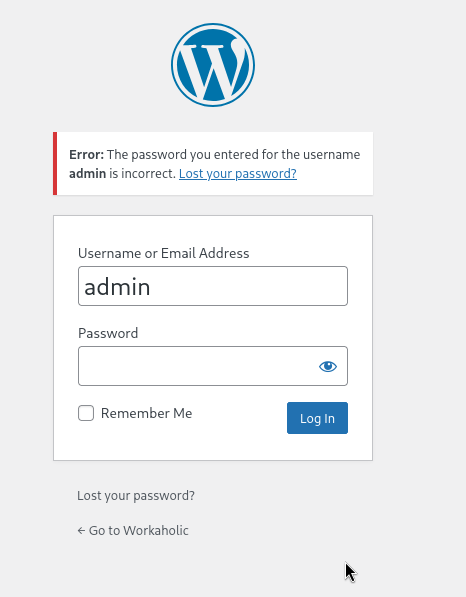

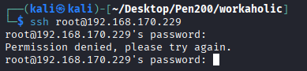

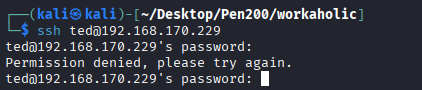

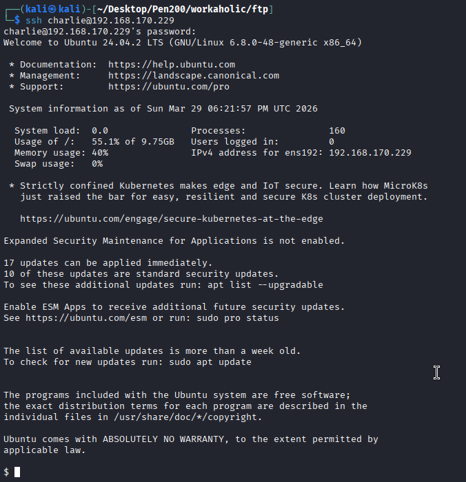

## Privilege Escalation
1. password reuse
`okadamat17`

   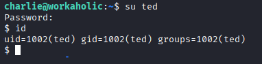

2. linpeas

   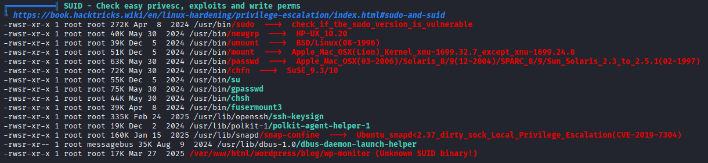

   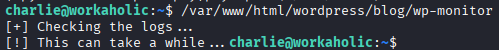

   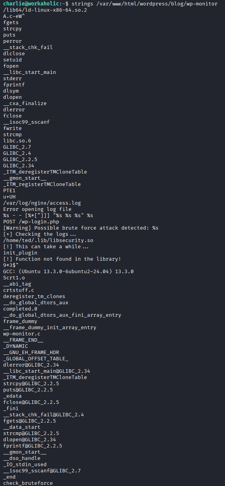

   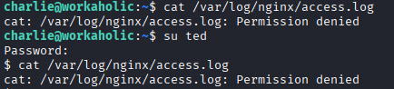

   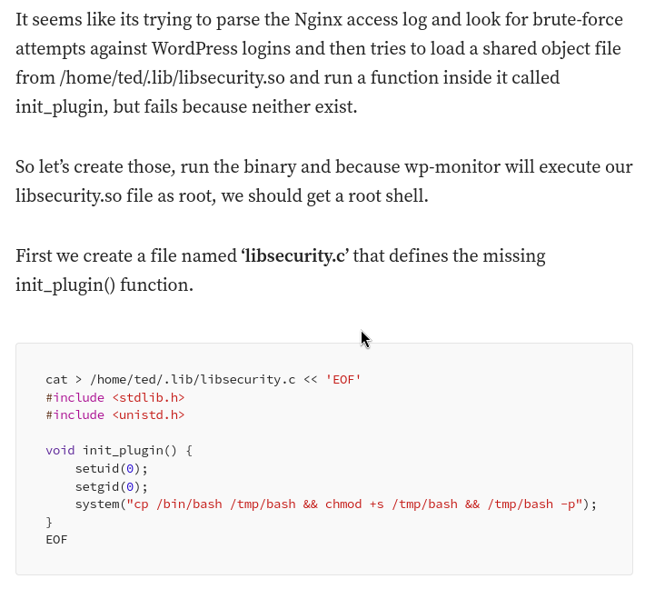

   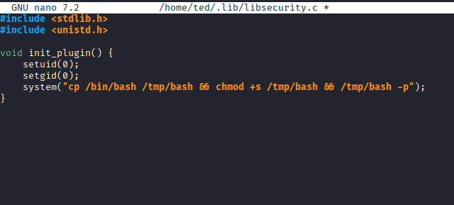

   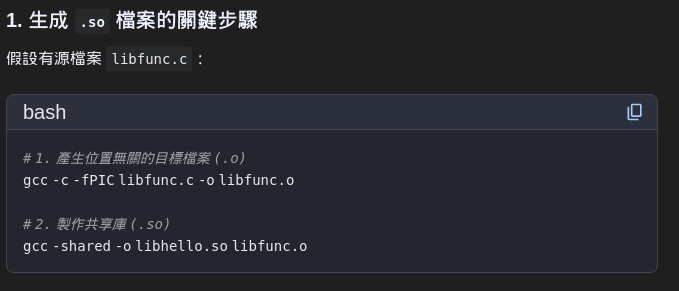

   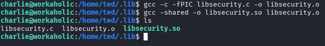

   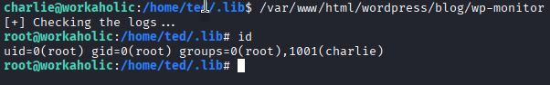

