## NMAP
```
PORT     STATE SERVICE REASON         VERSION
22/tcp   open  ssh     syn-ack ttl 61 OpenSSH 8.9p1 Ubuntu 3ubuntu0.1 (Ubuntu Linux; protocol 2.0)
| ssh-hostkey: 
|   256 b9:bc:8f:01:3f:85:5d:f9:5c:d9:fb:b6:15:a0:1e:74 (ECDSA)
| ecdsa-sha2-nistp256 AAAAE2VjZHNhLXNoYTItbmlzdHAyNTYAAAAIbmlzdHAyNTYAAABBBBYESg2KmNLhFh1KJaN2UFCVAEv6MWr58pqp2fIpCSBEK2wDJ5ap2XVBVGLk9Po4eKBbqTo96yttfVUvXWXoN3M=
|   256 53:d9:7f:3d:22:8a:fd:57:98:fe:6b:1a:4c:ac:79:67 (ED25519)
|_ssh-ed25519 AAAAC3NzaC1lZDI1NTE5AAAAIBdIs4PWZ8yY2OQ6Jlk84Ihd5+15Nb3l0qvpf1ls3wfa
9666/tcp open  http    syn-ack ttl 61 CherryPy wsgiserver
| http-title: Login - pyLoad 
|_Requested resource was /login?next=http://192.168.171.26:9666/
| http-robots.txt: 1 disallowed entry 
|_/
| http-methods: 
|_  Supported Methods: HEAD GET OPTIONS
|_http-favicon: Unknown favicon MD5: 71AAC1BA3CF57C009DA1994F94A2CC89
|_http-server-header: Cheroot/8.6.0
Service Info: OS: Linux; CPE: cpe:/o:linux:linux_kernel
```

## 9666 HTTP
`http://192.168.171.26:9666` 302-> `http://192.168.171.26:9666/login?next=http://192.168.171.26:9666/`

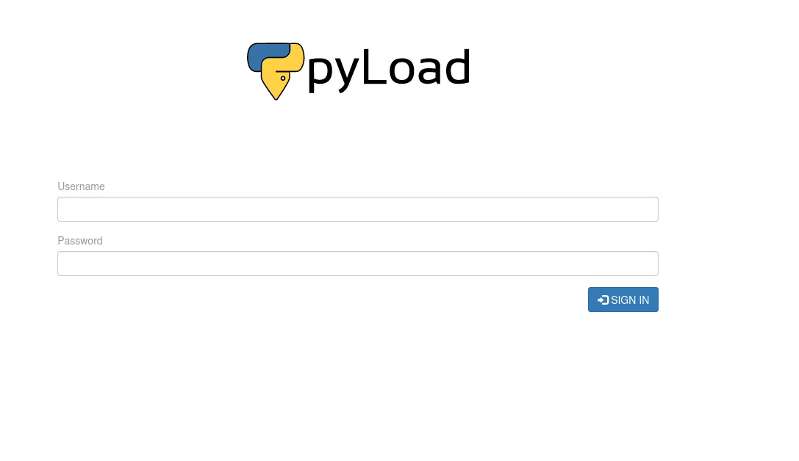

`admin:admin`

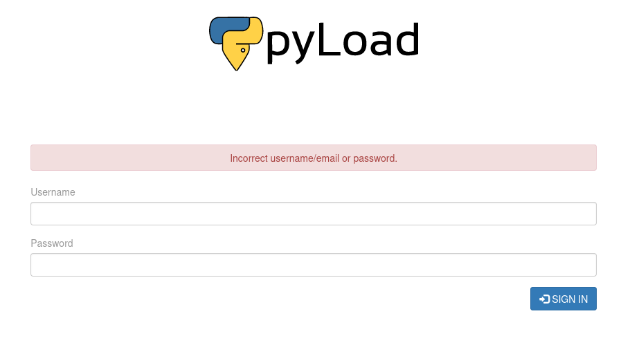

`admin:password`

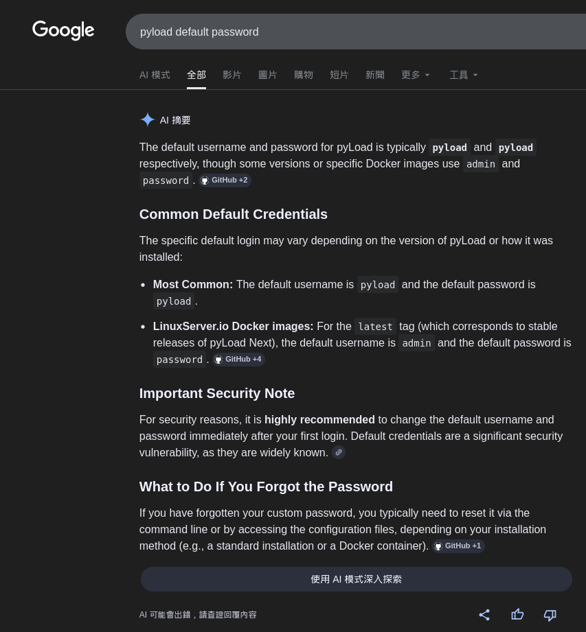

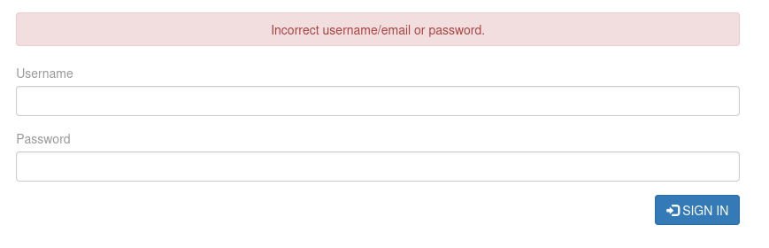

https://github.com/pyload/pyload
`pyload:pyload`

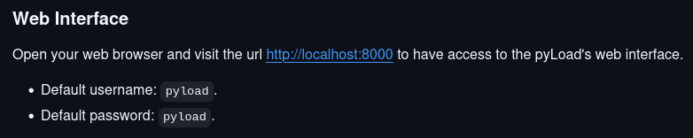

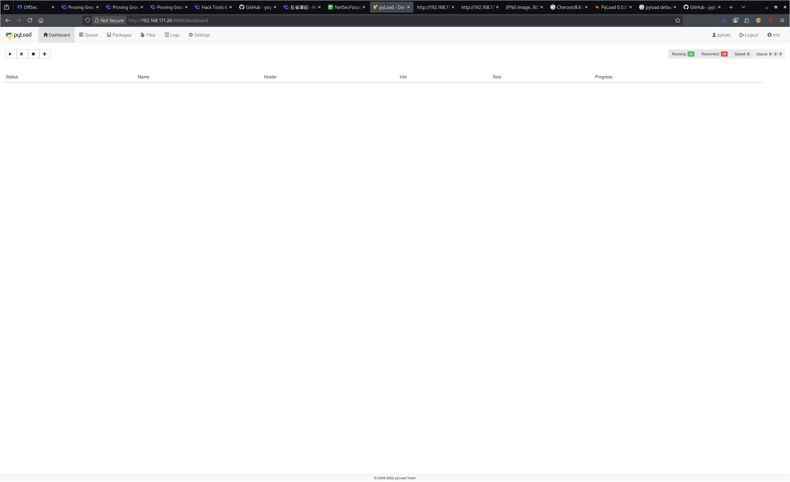

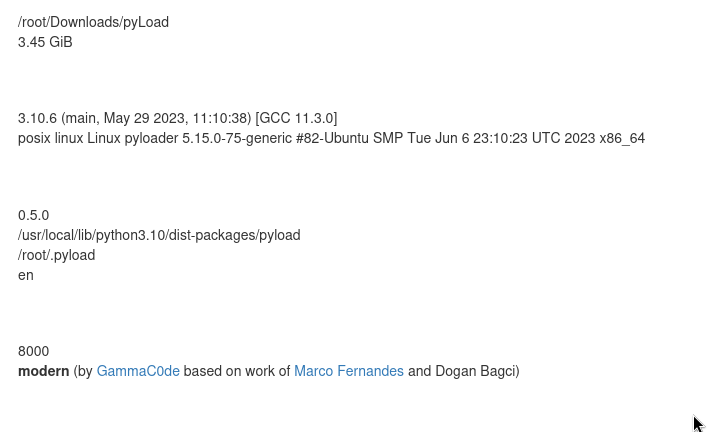

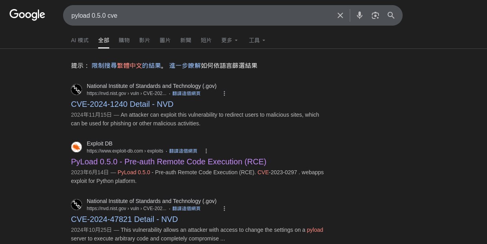

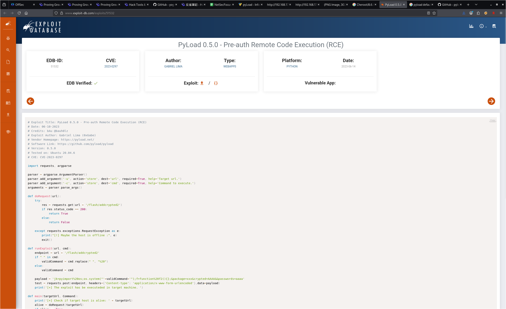

* exploi-db

  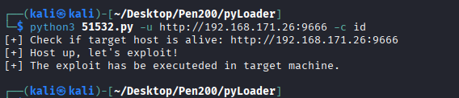

  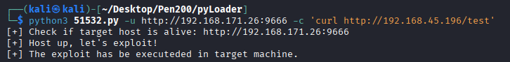

  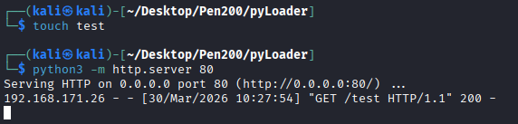

  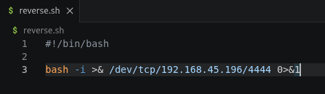

上面的執行失敗，原因未知

  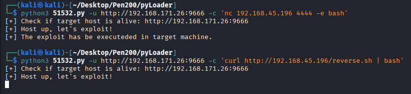

  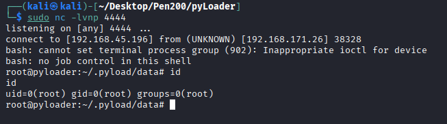

