https://portal.offsec.com/machine/law-52188/overview/details

## Introduce

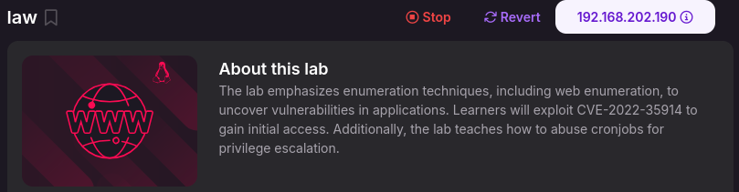

## Reconnaissance
* CVE-2022-35914

  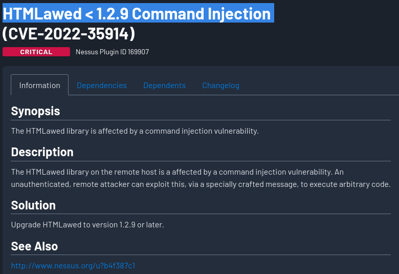

* namp

  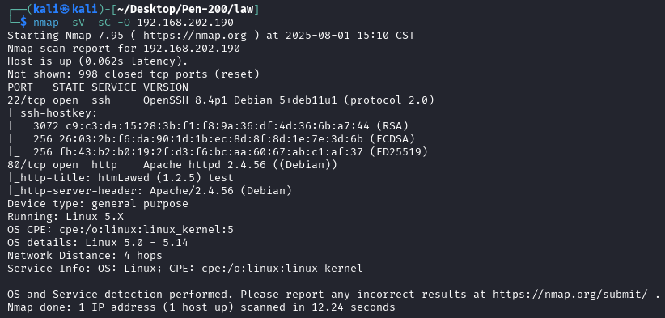

* web

  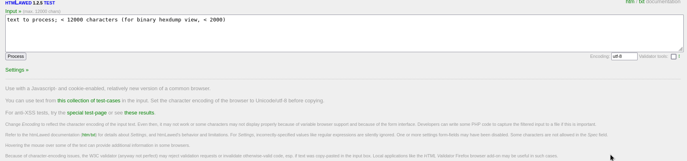

  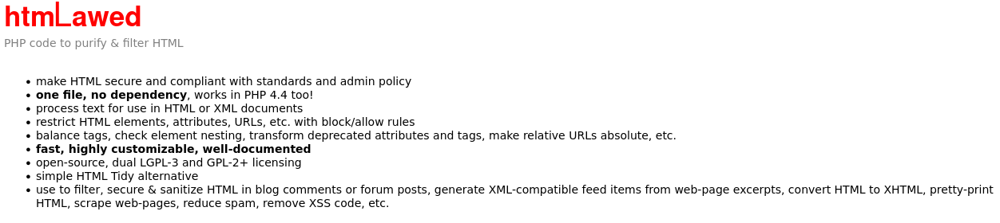

  

## Exploit
* CVE-2022-35914

  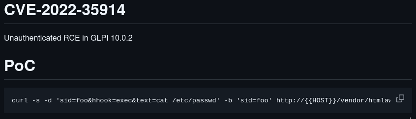

  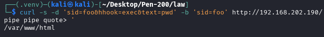

  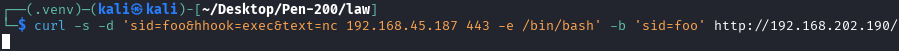

  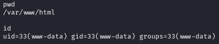

## Privilege Escalation
* sudo -l

  

* SUID

  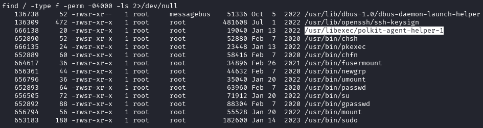

  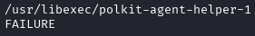

* Capabilities

  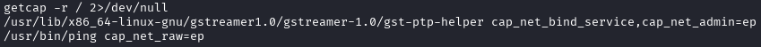

* Cron Jobs

  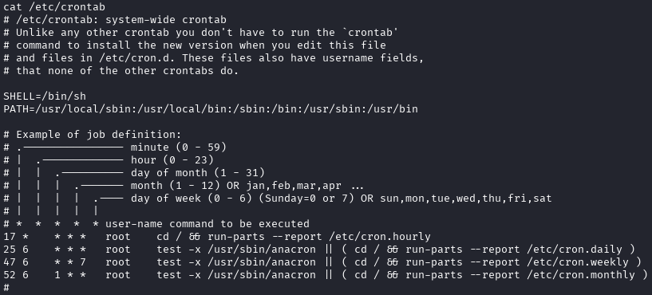

* cleanup

  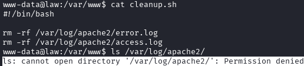

  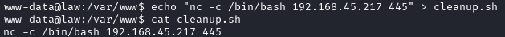

  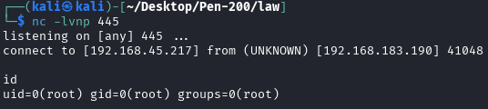

  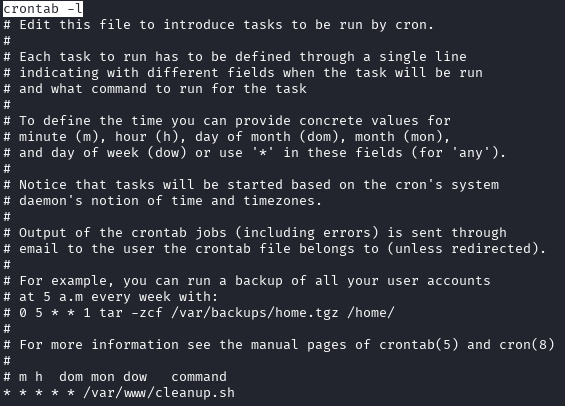

