## NMAP
```
PORT   STATE SERVICE REASON          VERSION
80/tcp open  http    syn-ack ttl 125 Apache httpd 2.4.48 ((Win64) OpenSSL/1.1.1k PHP/8.0.7)
| http-methods: 
|_  Supported Methods: GET HEAD POST OPTIONS
|_http-favicon: Unknown favicon MD5: 556F31ACD686989B1AFCF382C05846AA
|_http-server-header: Apache/2.4.48 (Win64) OpenSSL/1.1.1k PHP/8.0.7
|_http-title: Craft
```

## 80 HTTP

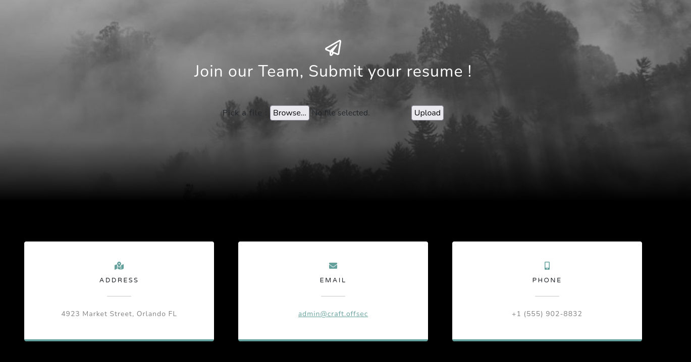

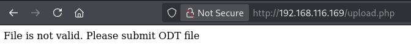

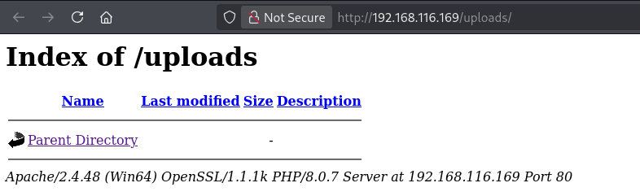


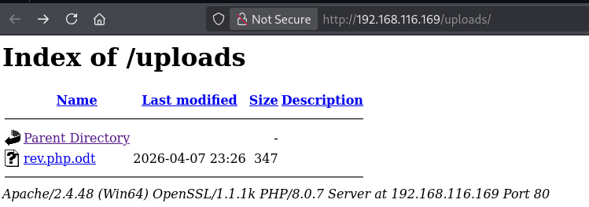

- odt reverse shell
https://medium.com/@akshay__0/initial-access-via-malicious-odt-macro-ac7f5d15796d

  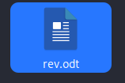

  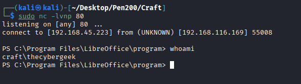

## Privilege Escalation

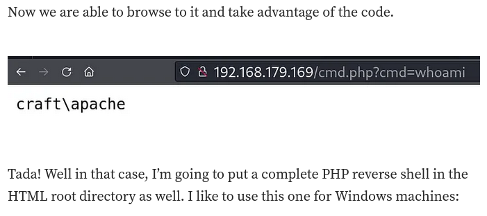


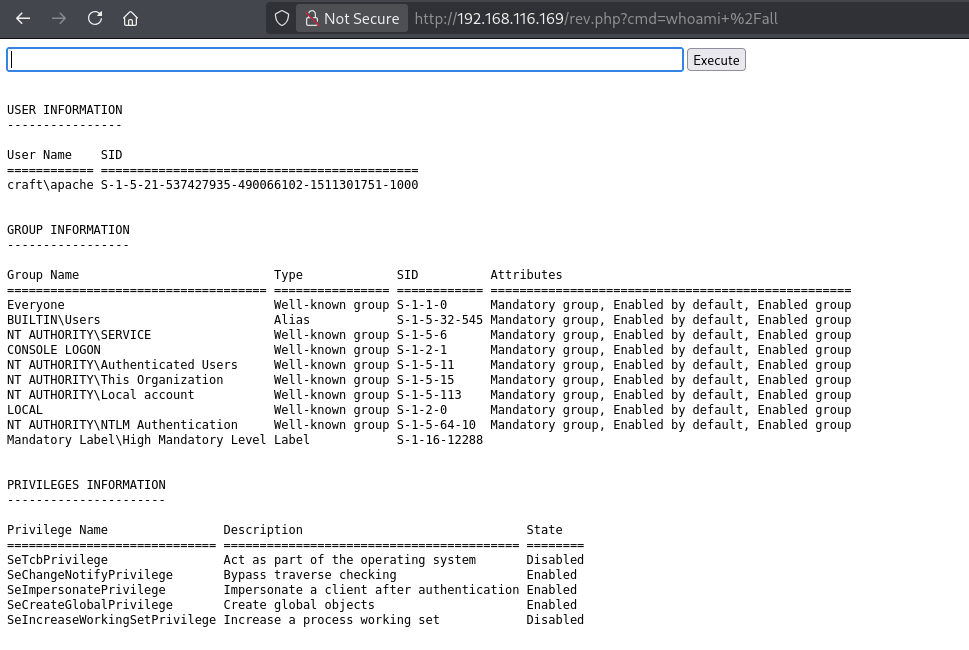

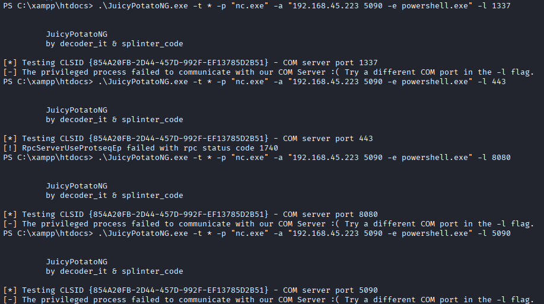

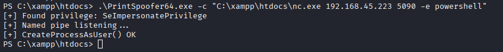

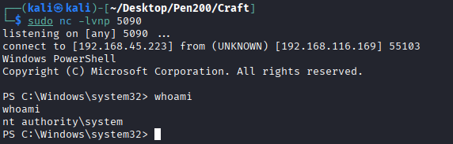
