## NMAP
```
PORT      STATE SERVICE       REASON          VERSION
135/tcp   open  msrpc         syn-ack ttl 125 Microsoft Windows RPC
139/tcp   open  netbios-ssn   syn-ack ttl 125 Microsoft Windows netbios-ssn
445/tcp   open  microsoft-ds? syn-ack ttl 125
3128/tcp  open  http-proxy    syn-ack ttl 125 Squid http proxy 4.14
|_http-server-header: squid/4.14
|_http-title: ERROR: The requested URL could not be retrieved
49666/tcp open  msrpc         syn-ack ttl 125 Microsoft Windows RPC
49667/tcp open  msrpc         syn-ack ttl 125 Microsoft Windows RPC
Service Info: OS: Windows; CPE: cpe:/o:microsoft:windows

Host script results:
| smb2-time: 
|   date: 2026-04-16T02:32:35
|_  start_date: N/A
| p2p-conficker: 
|   Checking for Conficker.C or higher...
|   Check 1 (port 26044/tcp): CLEAN (Timeout)
|   Check 2 (port 52603/tcp): CLEAN (Timeout)
|   Check 3 (port 38221/udp): CLEAN (Timeout)
|   Check 4 (port 45882/udp): CLEAN (Timeout)
|_  0/4 checks are positive: Host is CLEAN or ports are blocked
| smb2-security-mode: 
|   3:1:1: 
|_    Message signing enabled but not required
|_clock-skew: 2s
```

## 445 SMB

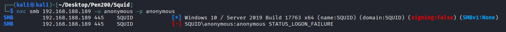

## 3128 HTTP-PROXY

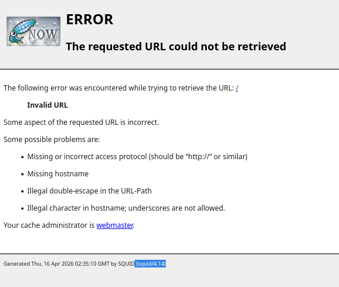

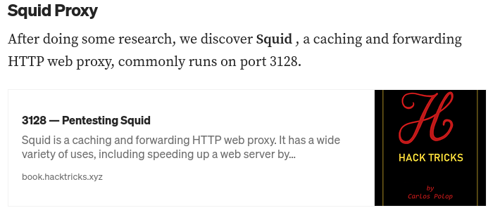

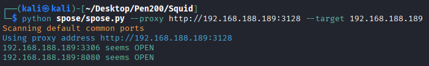

## 8080

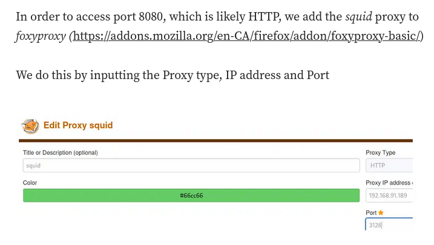

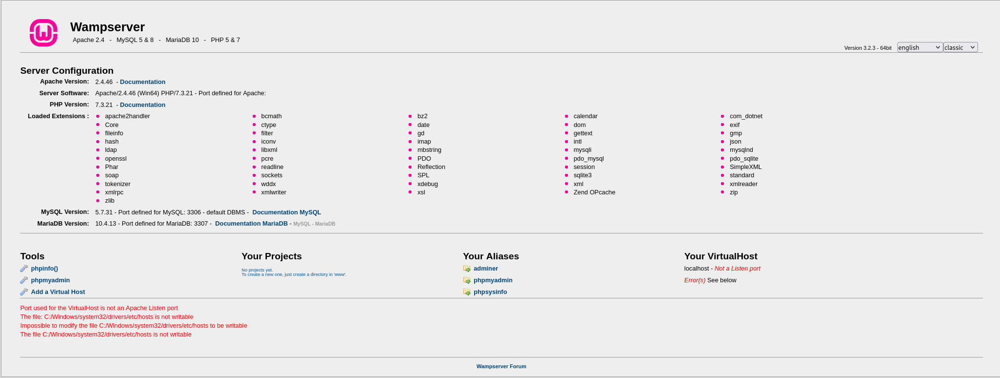

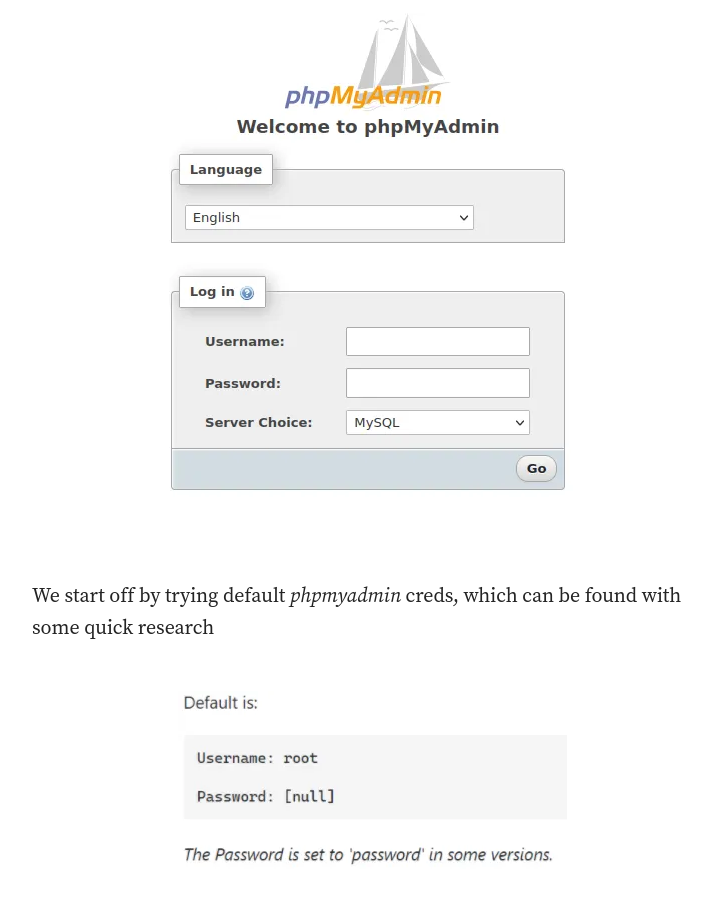

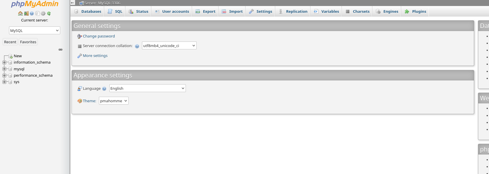

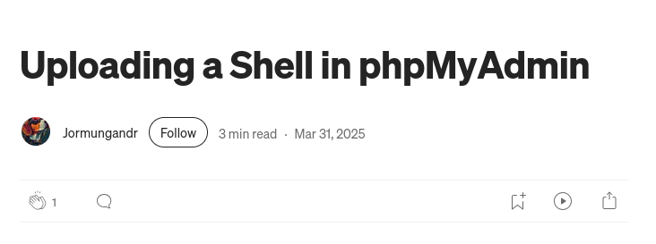

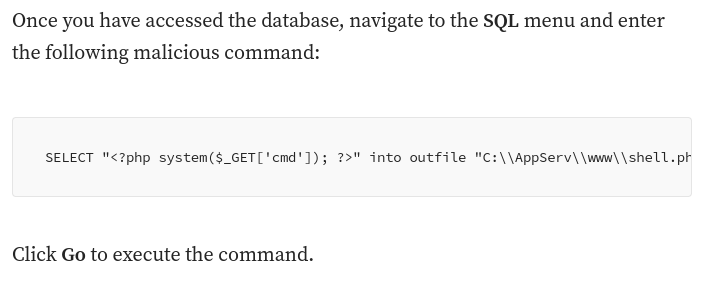

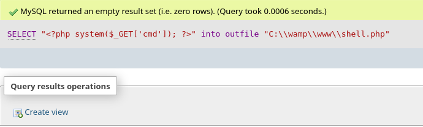

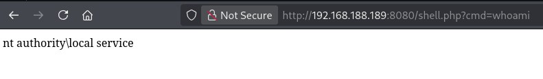

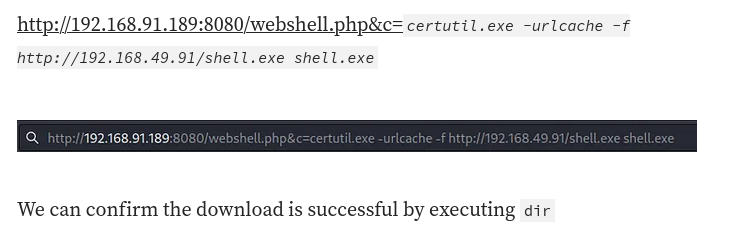

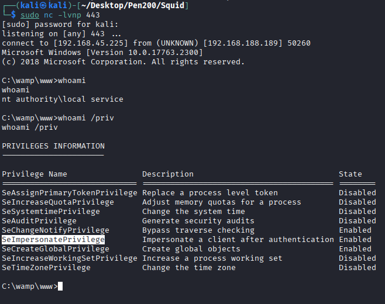

## Privilege Escalation

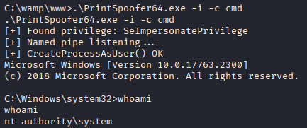

## REF
https://infosecwriteups.com/proving-grounds-practice-squid-walkthrough-f761d2da973f