## NMAP
```
PORT      STATE SERVICE     REASON         VERSION
22/tcp    open  ssh         syn-ack ttl 61 OpenSSH 7.9p1 Debian 10+deb10u2 (protocol 2.0)
| ssh-hostkey: 
|   2048 a8:e1:60:68:be:f5:8e:70:70:54:b4:27:ee:9a:7e:7f (RSA)
| ssh-rsa AAAAB3NzaC1yc2EAAAADAQABAAABAQDssyyACw3AHaTatHhBU1VyBRbKOirrDG8M9IjpJPTf/v8mdIqiXk1HsBdoFZcsmWJVV4OXC7GMcHa+s0tZceTmgGf5TpiCB2yXUYPZre183LjJWM6KQMZVI0LHz9Yd3ji2bdD5jjtVxwnjrdx8GlU1THMGbzZivfSsPF18arMIq3ukYBS09Ov1SIKR4DJ7pjtBRutRBZKI/8/H+uB2u47AQRwbWuVaOmtZyDrfvgL/IqAFRQrbeP1VNQAErzHl8wNuk1vR+yROv0j7smTqoqqc8aB751O63gtBdCvKzpigwFDLyxYuzu8dW1Hh6ZQzaQZgWkw6SZeExAijK7yXSU61
|   256 bb:99:9a:45:3f:35:0b:b3:49:e6:cf:11:49:87:8d:94 (ECDSA)
| ecdsa-sha2-nistp256 AAAAE2VjZHNhLXNoYTItbmlzdHAyNTYAAAAIbmlzdHAyNTYAAABBBNUPmkVV/Q+iD07j1sFmdFWp7yppofTTgfzAhvMkyGPulIdMDbzFgW/pRAq3R3zZV7aEcWAMfFHgdXfj3W4FUuc=
|   256 f2:eb:fc:45:d7:e9:80:77:66:a3:93:53:de:00:57:9c (ED25519)
|_ssh-ed25519 AAAAC3NzaC1lZDI1NTE5AAAAIIPO1eLYoJ0AhVJ5NIDfaSrfUis34Bw5bKMMdFWzHPx0
139/tcp   open  netbios-ssn syn-ack ttl 61 Samba smbd 3.X - 4.X (workgroup: WORKGROUP)
445/tcp   open  netbios-ssn syn-ack ttl 61 Samba smbd 4.9.5-Debian (workgroup: WORKGROUP)
631/tcp   open  ipp         syn-ack ttl 61 CUPS 2.2
|_http-title: Forbidden - CUPS v2.2.10
| http-methods: 
|   Supported Methods: GET HEAD OPTIONS POST PUT
|_  Potentially risky methods: PUT
2181/tcp  open  zookeeper   syn-ack ttl 61 Zookeeper 3.4.6-1569965 (Built on 02/20/2014)
2222/tcp  open  ssh         syn-ack ttl 61 OpenSSH 7.9p1 Debian 10+deb10u2 (protocol 2.0)
| ssh-hostkey: 
|   2048 a8:e1:60:68:be:f5:8e:70:70:54:b4:27:ee:9a:7e:7f (RSA)
| ssh-rsa AAAAB3NzaC1yc2EAAAADAQABAAABAQDssyyACw3AHaTatHhBU1VyBRbKOirrDG8M9IjpJPTf/v8mdIqiXk1HsBdoFZcsmWJVV4OXC7GMcHa+s0tZceTmgGf5TpiCB2yXUYPZre183LjJWM6KQMZVI0LHz9Yd3ji2bdD5jjtVxwnjrdx8GlU1THMGbzZivfSsPF18arMIq3ukYBS09Ov1SIKR4DJ7pjtBRutRBZKI/8/H+uB2u47AQRwbWuVaOmtZyDrfvgL/IqAFRQrbeP1VNQAErzHl8wNuk1vR+yROv0j7smTqoqqc8aB751O63gtBdCvKzpigwFDLyxYuzu8dW1Hh6ZQzaQZgWkw6SZeExAijK7yXSU61
|   256 bb:99:9a:45:3f:35:0b:b3:49:e6:cf:11:49:87:8d:94 (ECDSA)
| ecdsa-sha2-nistp256 AAAAE2VjZHNhLXNoYTItbmlzdHAyNTYAAAAIbmlzdHAyNTYAAABBBNUPmkVV/Q+iD07j1sFmdFWp7yppofTTgfzAhvMkyGPulIdMDbzFgW/pRAq3R3zZV7aEcWAMfFHgdXfj3W4FUuc=
|   256 f2:eb:fc:45:d7:e9:80:77:66:a3:93:53:de:00:57:9c (ED25519)
|_ssh-ed25519 AAAAC3NzaC1lZDI1NTE5AAAAIIPO1eLYoJ0AhVJ5NIDfaSrfUis34Bw5bKMMdFWzHPx0
8080/tcp  open  http        syn-ack ttl 61 Jetty 1.0
|_http-server-header: Jetty(1.0)
|_http-title: Error 404 Not Found
8081/tcp  open  http        syn-ack ttl 61 nginx 1.14.2
| http-methods: 
|_  Supported Methods: GET HEAD POST OPTIONS
|_http-server-header: nginx/1.14.2
|_http-title: Did not follow redirect to http://192.168.196.98:8080/exhibitor/v1/ui/index.html
39605/tcp open  java-rmi    syn-ack ttl 61 Java RMI
Service Info: Host: PELICAN; OS: Linux; CPE: cpe:/o:linux:linux_kernel
```

## 445 SMB

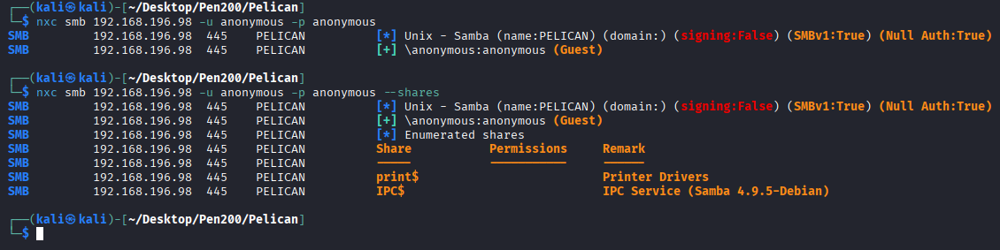

## 8081

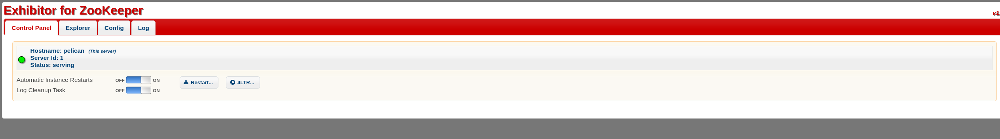

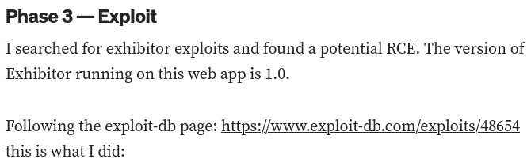

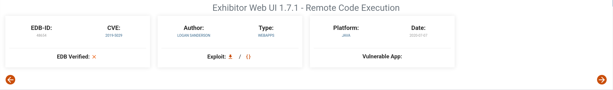

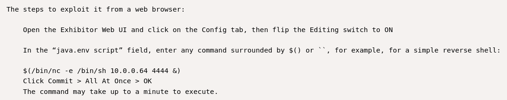

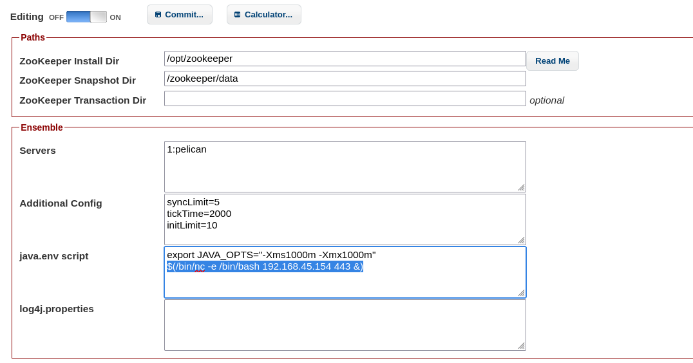

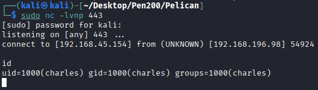

## Privilege Escalation

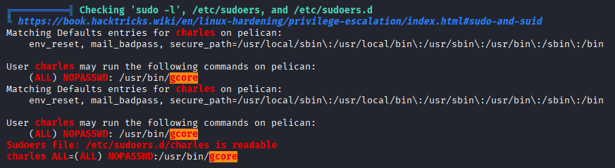

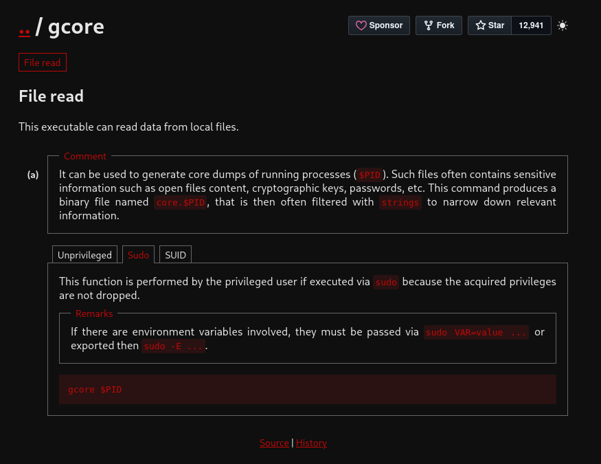

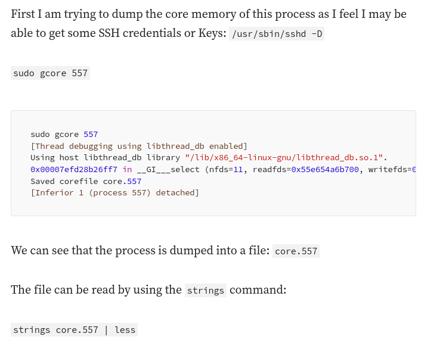

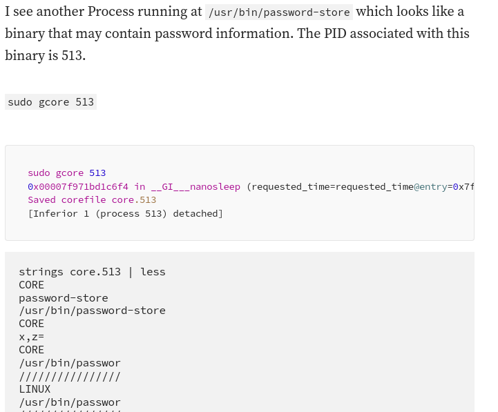

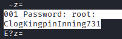

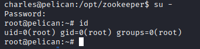

## REF
https://medium.com/@fehzanvayani/oscp-proving-grounds-pelican-9d59ebe6c6fb