## NMAP
```
PORT      STATE  SERVICE REASON         VERSION
22/tcp    open   ssh     syn-ack ttl 61 OpenSSH 7.9p1 Debian 10+deb10u2 (protocol 2.0)
| ssh-hostkey: 
|   2048 37:80:01:4a:43:86:30:c9:79:e7:fb:7f:3b:a4:1e:dd (RSA)
| ssh-rsa AAAAB3NzaC1yc2EAAAADAQABAAABAQDBCcfKYKMXuTWeyLKlFNHgmebcXbFAjSpbr39R8GFHYRmc/mZXKNgEoa5gkFAVr8kVVul4X6//DcnRuHtrCpHcnTIZLT9g1DPB09VsLzsjT0TpmqkcDYtZazo1mjnBZdaM+AxoDMghZd8AXiNrCl7jCN+vRjUQc8T1wD4PoC02XjeCAI8Yha++Mv9ZrSPZ+/gBvgZPL3pdQhVGUSUHOmXod4xcdm5ReNiZRNZklOhhscbGfSCqQIdJogegZfMrlueeG3EY7Kkf5CxAUDH/9ir2dEDDifIpqKV8W7ncKEpsZiqgDh36OdMX4LPJ0NmZiT/g8CvINx7k4HWj3ksT+5C7
|   256 b6:18:a1:e1:98:fb:6c:c6:87:55:45:10:c6:d4:45:b9 (ECDSA)
| ecdsa-sha2-nistp256 AAAAE2VjZHNhLXNoYTItbmlzdHAyNTYAAAAIbmlzdHAyNTYAAABBBEK0B9iLJQztyEpGiNffHgQuGcxZRO/BOi+r0j/P8Hkz02pIWW2hFrArbzehUNQ46ZmFwMhxxmrIOLBpUt9ZGBw=
|   256 ab:8f:2d:e8:a2:04:e7:b7:65:d3:fe:5e:93:1e:03:67 (ED25519)
|_ssh-ed25519 AAAAC3NzaC1lZDI1NTE5AAAAIOAlO2qlRhyMwzzf3xAK4wOGz1UD5t9+QQO5J3QjTkaZ
80/tcp    open   http    syn-ack ttl 61
| http-methods: 
|_  Supported Methods: GET HEAD OPTIONS
| http-title: Boolean
|_Requested resource was http://192.168.212.231/login
| fingerprint-strings: 
|   DNSStatusRequestTCP, DNSVersionBindReqTCP, GenericLines, Help, JavaRMI, Kerberos, LANDesk-RC, LDAPBindReq, LDAPSearchReq, LPDString, NCP, NotesRPC, RPCCheck, RTSPRequest, SIPOptions, SMBProgNeg, SSLSessionReq, TLSSessionReq, TerminalServer, TerminalServerCookie, WMSRequest, X11Probe, afp, giop, ms-sql-s, oracle-tns: 
|     HTTP/1.1 400 Bad Request
|   FourOhFourRequest, GetRequest, HTTPOptions: 
|     HTTP/1.0 403 Forbidden
|     Content-Type: text/html; charset=UTF-8
|_    Content-Length: 0
|_http-favicon: Unknown favicon MD5: D41D8CD98F00B204E9800998ECF8427E
3000/tcp  closed ppp     reset ttl 61
33017/tcp open   http    syn-ack ttl 61 Apache httpd 2.4.38 ((Debian))
| http-methods: 
|_  Supported Methods: GET HEAD POST OPTIONS
|_http-title: Development
|_http-server-header: Apache/2.4.38 (Debian)
```

## 80 HTTP

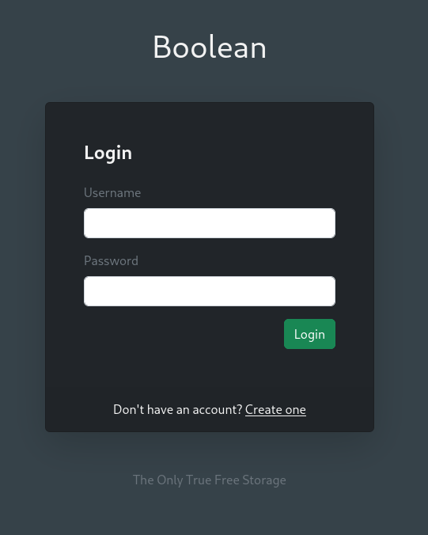

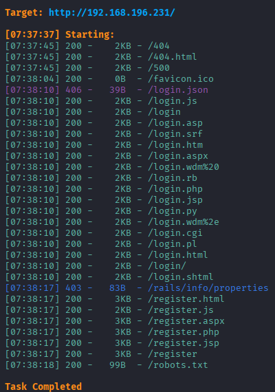

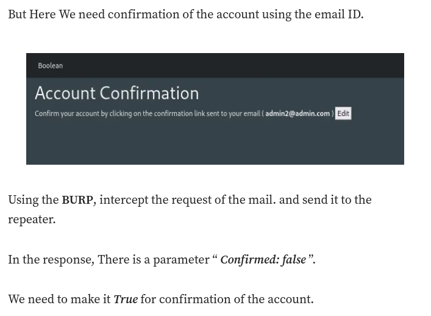

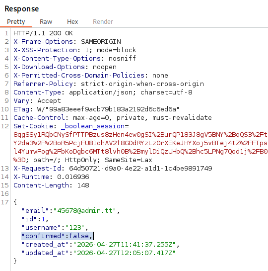

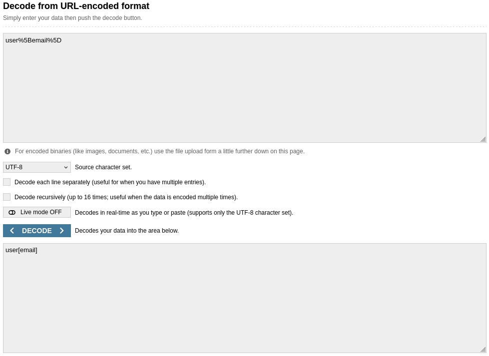

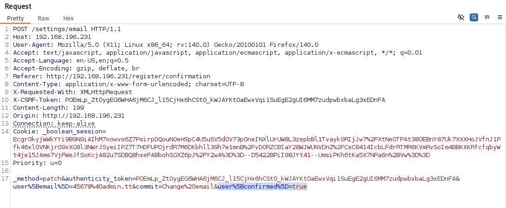

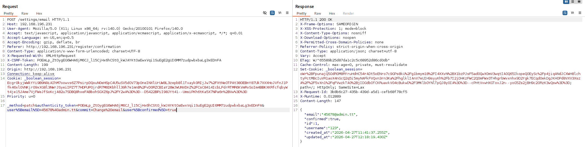

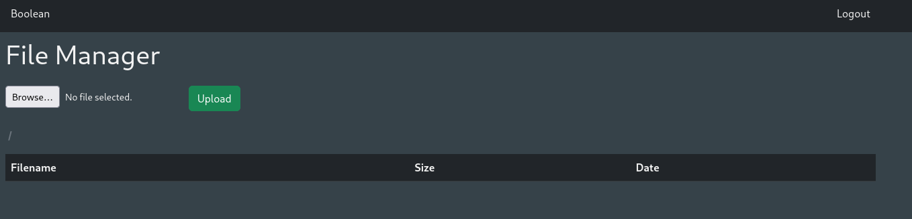

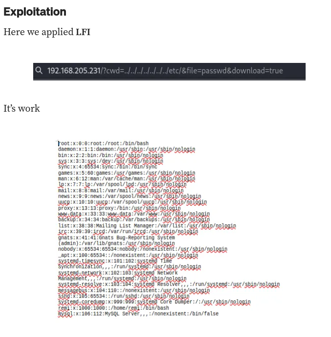

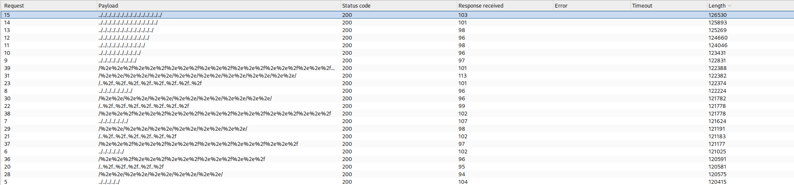

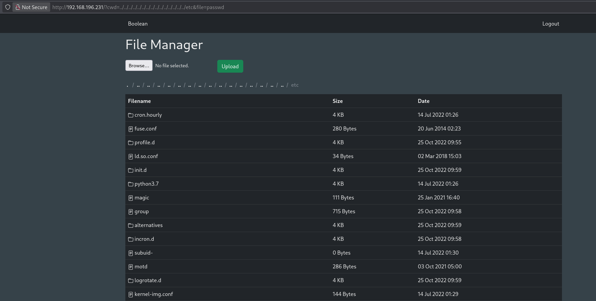

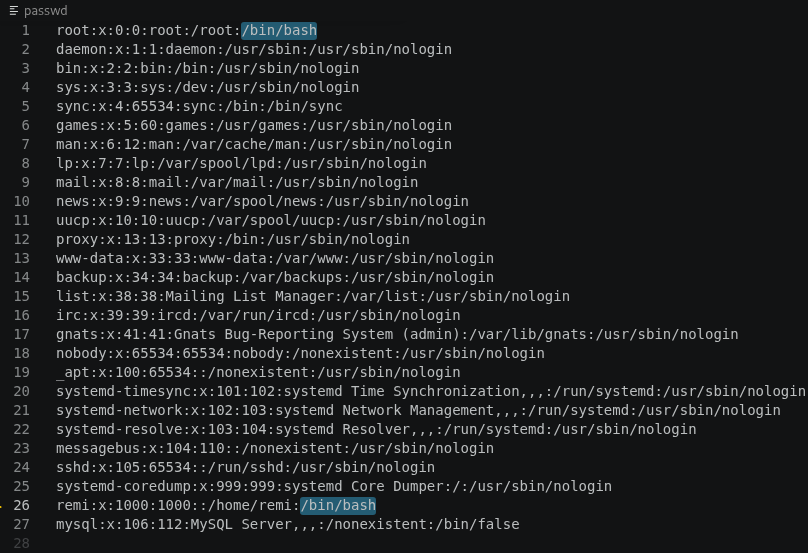

`http://192.168.196.231/?cwd=../../../../../../../../../../../../../../../etc&file=shadow&download=true`

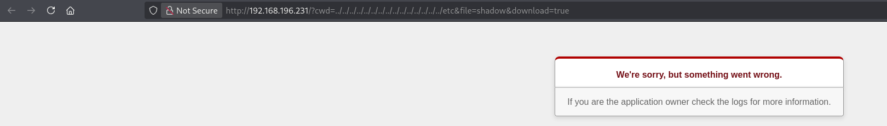

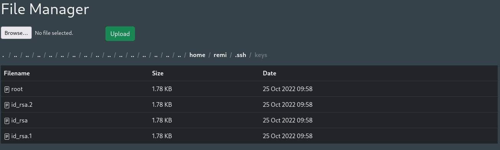

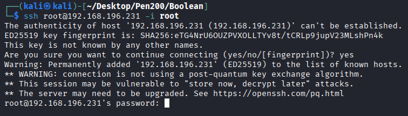

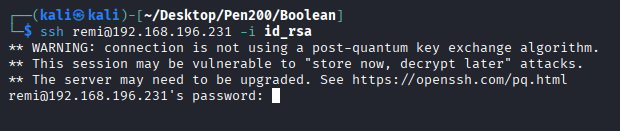

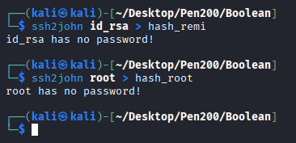

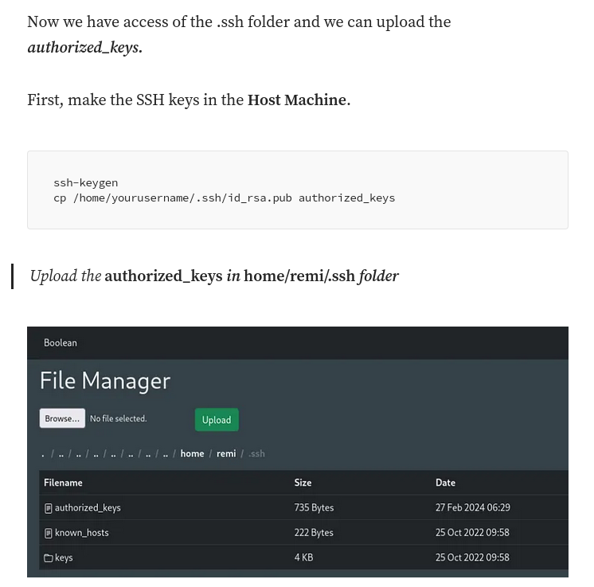

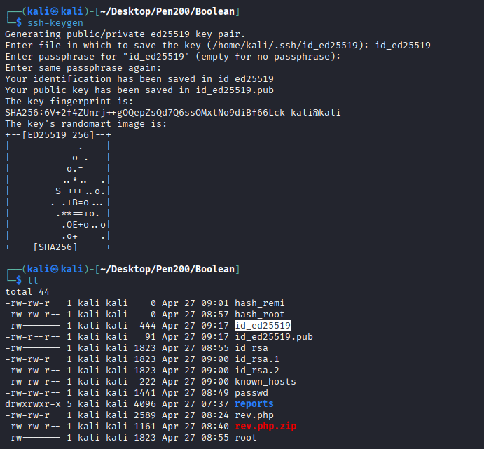

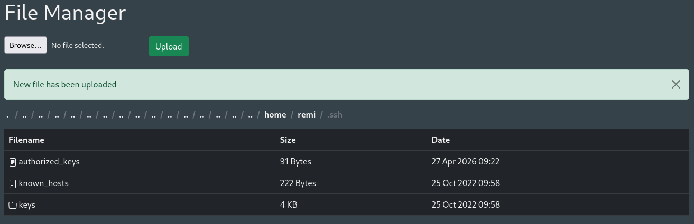

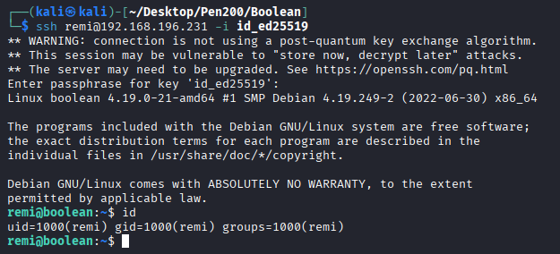

## 33017 HTTP

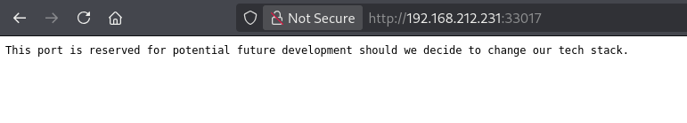

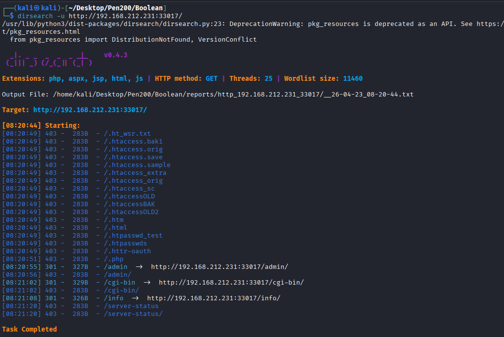

## Privilege Escalation

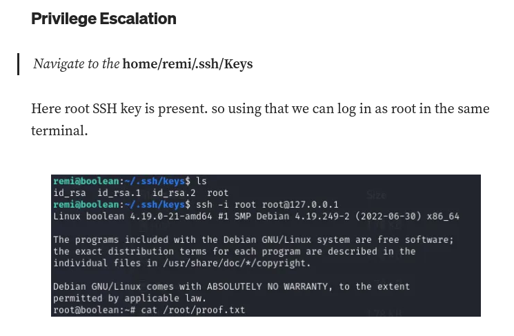

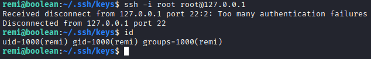

## REF
https://medium.com/@raj.patel33605/boolean-offsec-proving-groundswriteup-8f626bbb1b3f