https://portal.offsec.com/machine/lavita-150736/overview/details

## Used Tools
* pspy
* linpeas

## Introduce

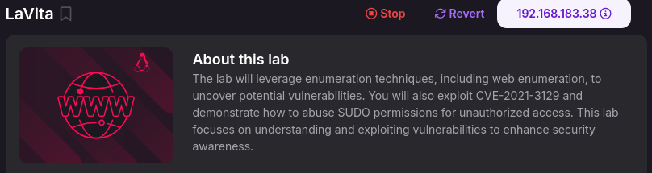

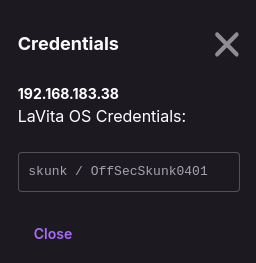

## Reconnaissance
* nmap

  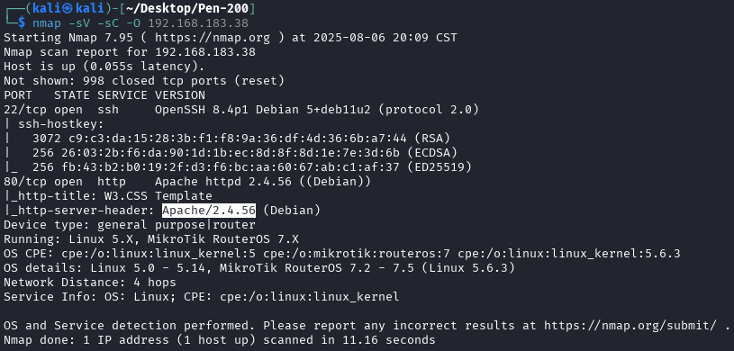

* web
    * Compents
        1. w3css

           

           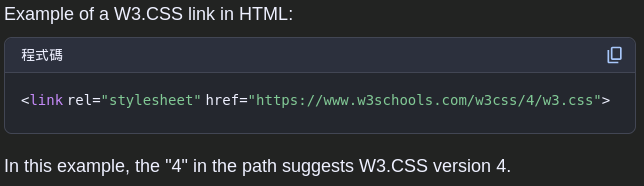

           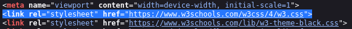

           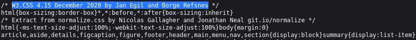

           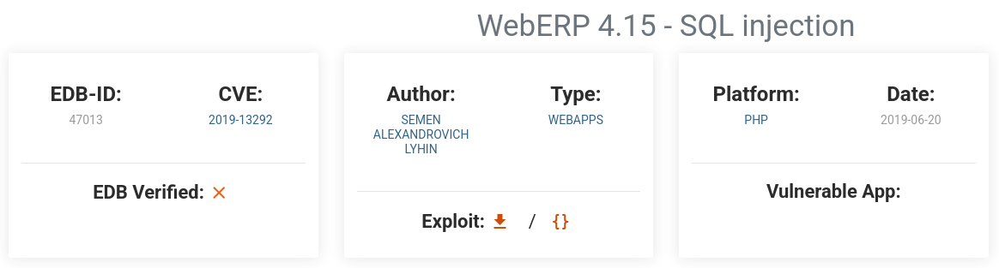

           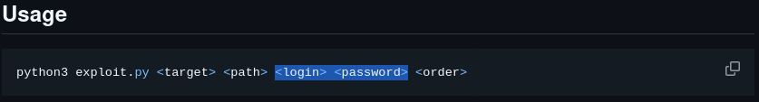

        
        2. Laravel

           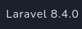

           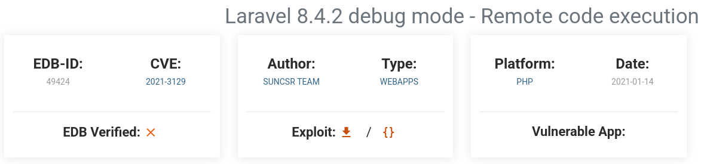

           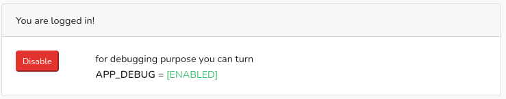
        

## Exploit

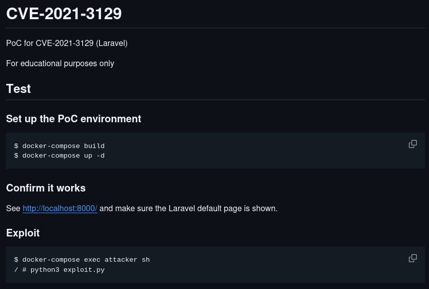

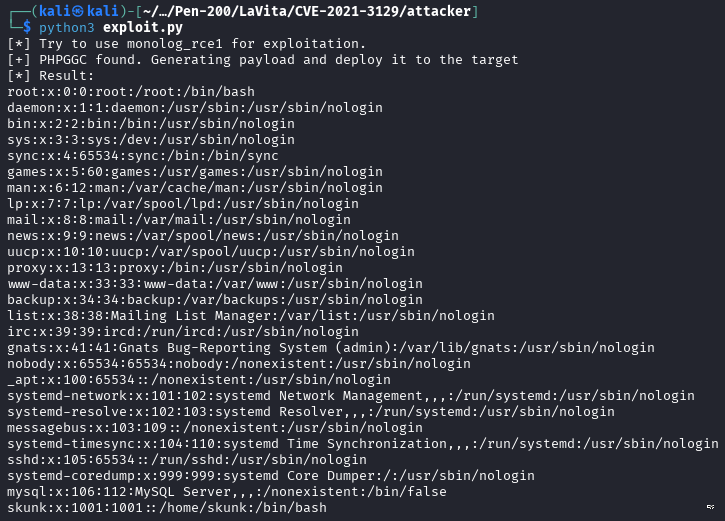

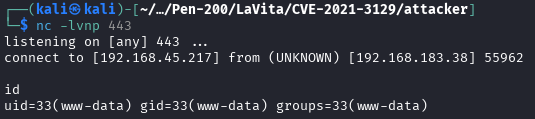

## Privilege Escalation

* sudo -l

  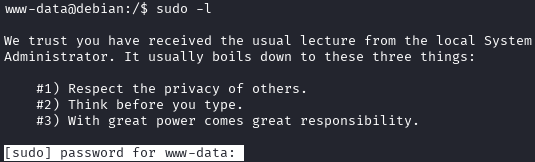

* SUID

  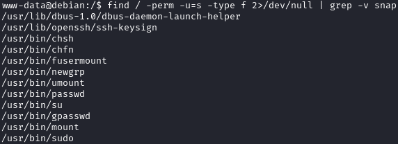

* Capabilities

  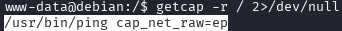

* crontab

  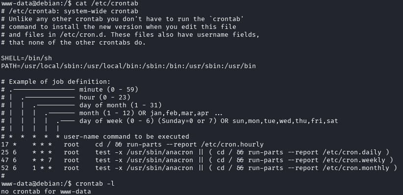

* other file
    * rev.sh

      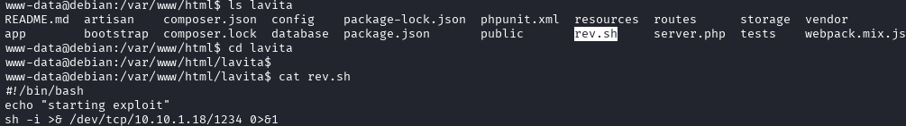

      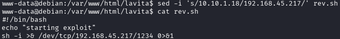

      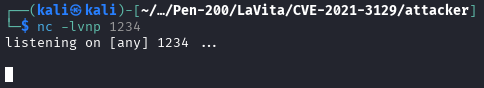

* env

  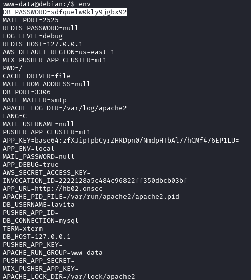

* Linpeas

  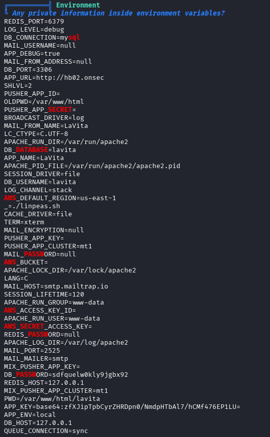

  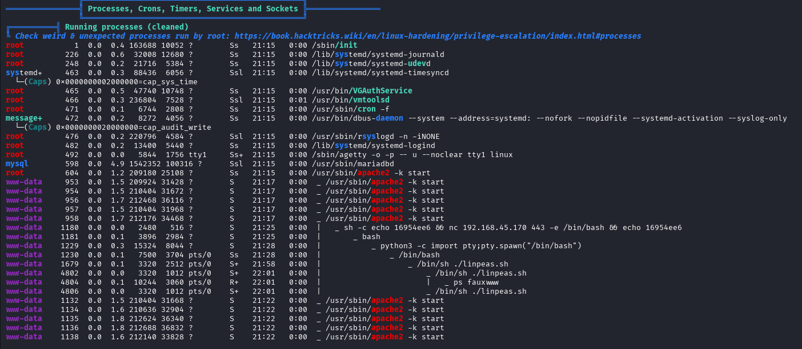

  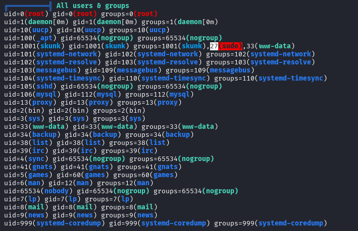

* pspy

  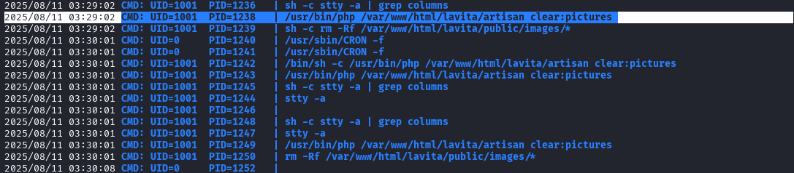

  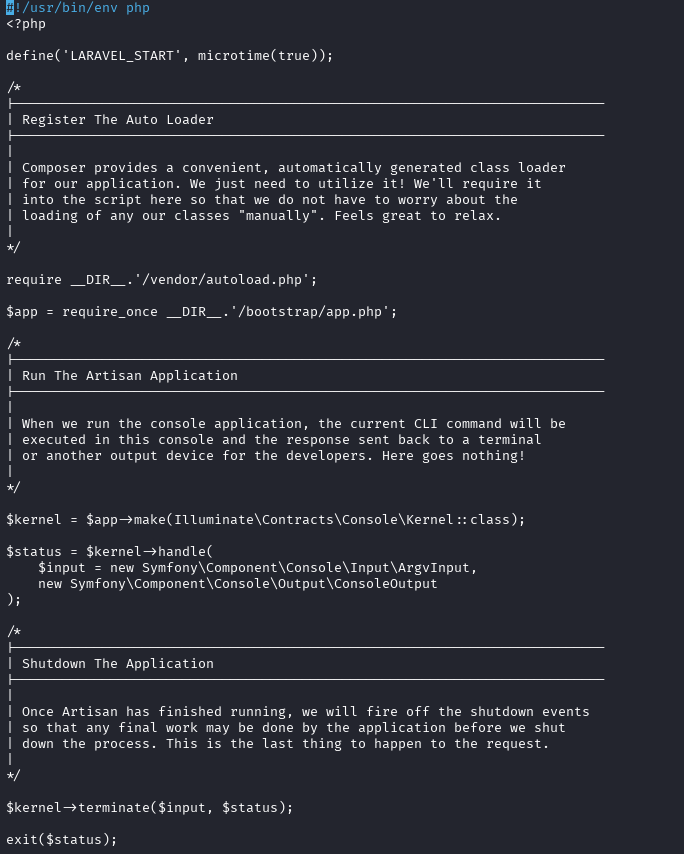

* user skunk

  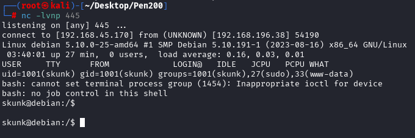

  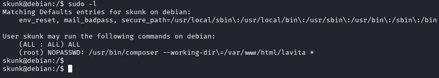

  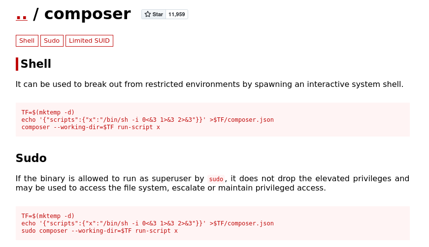

  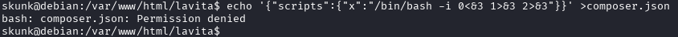

  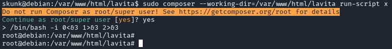
