## NMAP

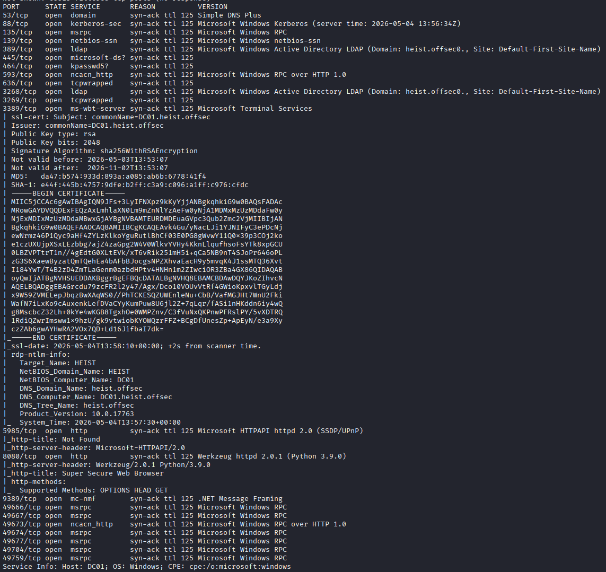

## 8080 HTTP

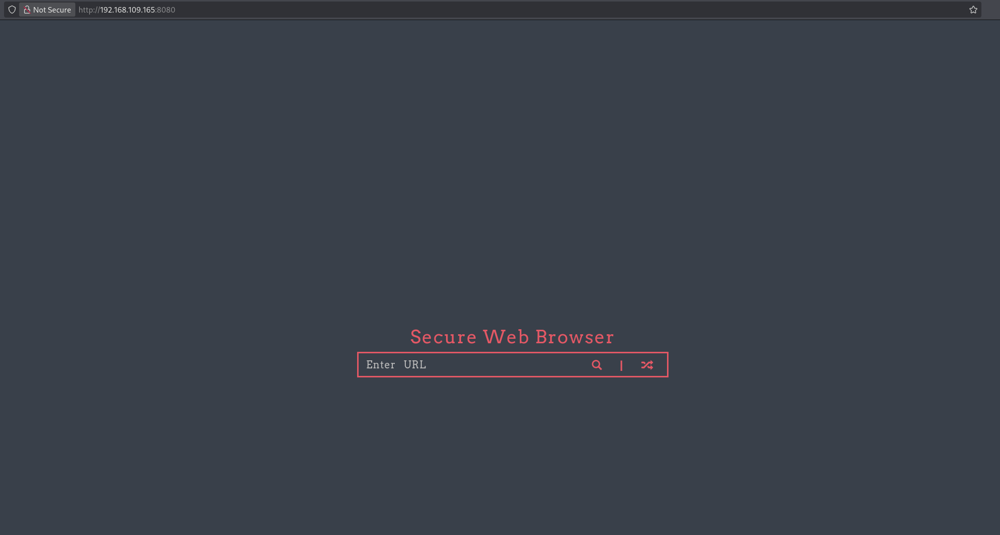

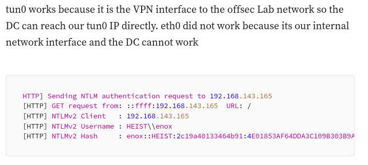

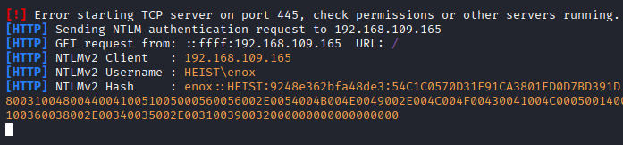

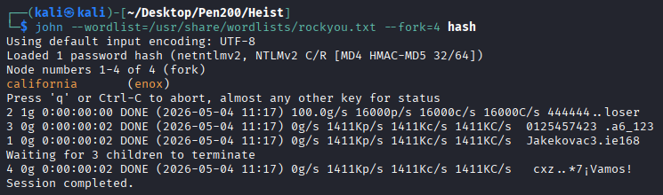

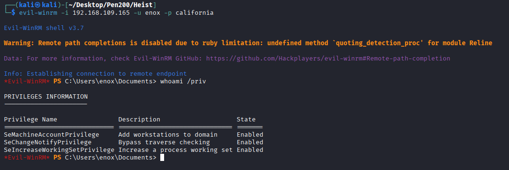

## Privilege Escalation

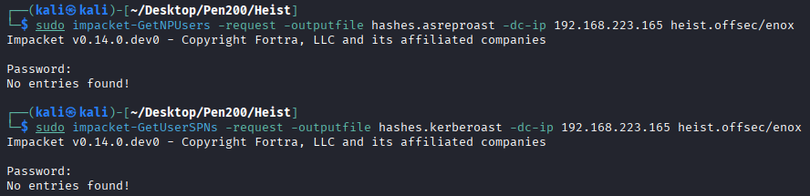

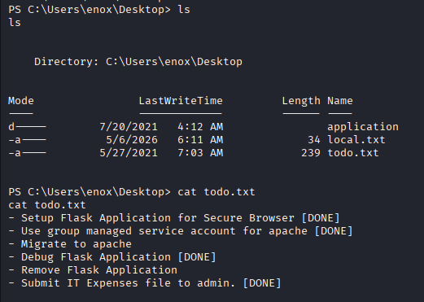

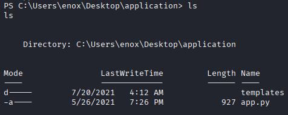

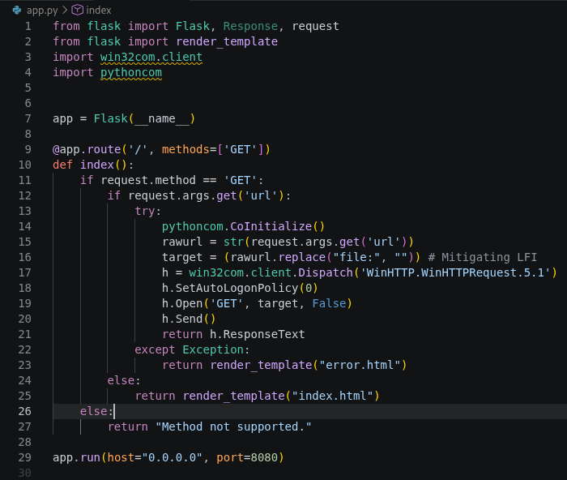

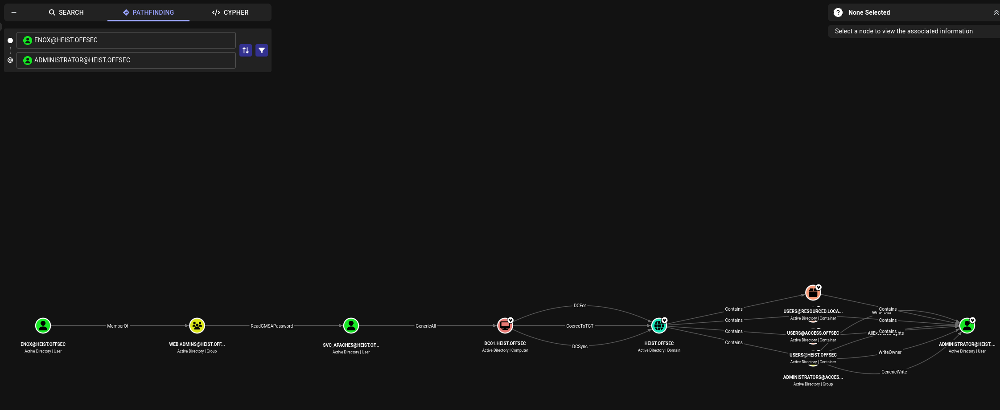

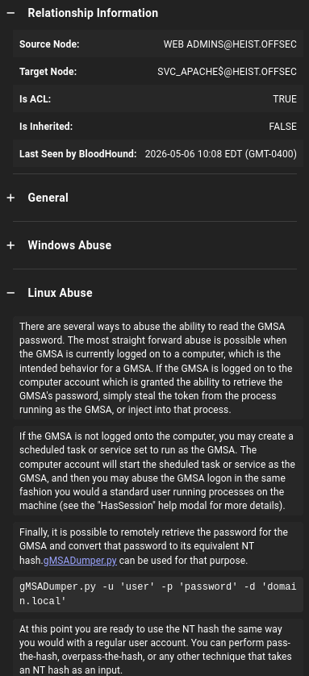

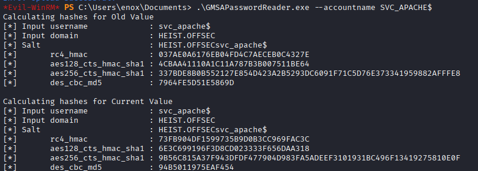

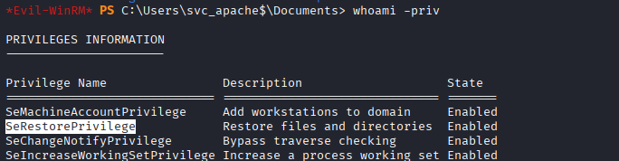

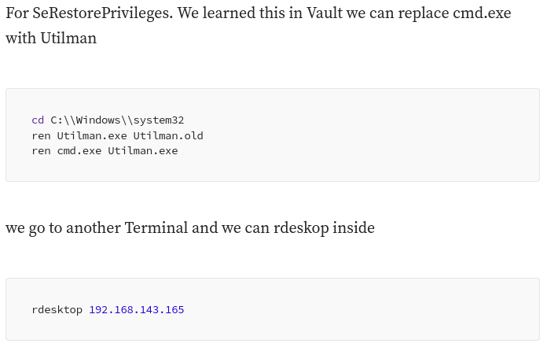

## REF
https://medium.com/@ryanchamruiyang/proving-grounds-heist-walkthrough-by-ryan-cham-1b21c9ccffa5
https://medium.com/@bdsalazar/proving-grounds-heist-hard-windows-active-directory-box-walkthrough-a-journey-to-9469ae735a34