## NMAP

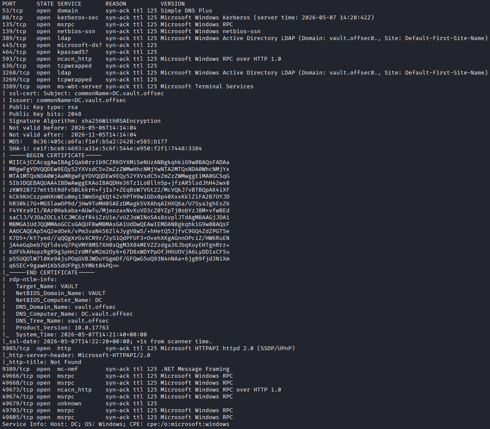

`vault.offsec`
## 445 SMB

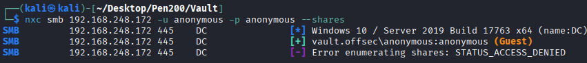

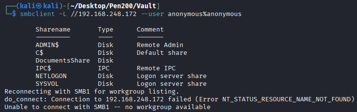

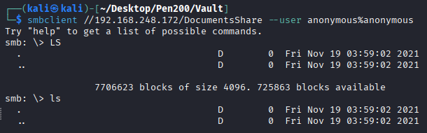

## 389 LDAP

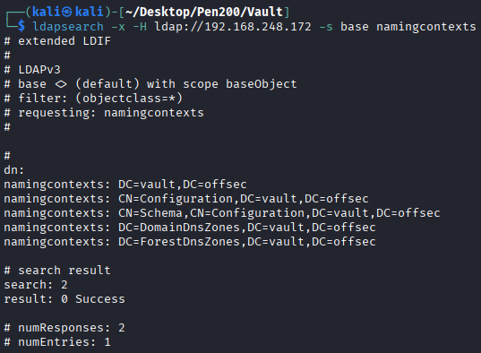

## 445 SMB Again

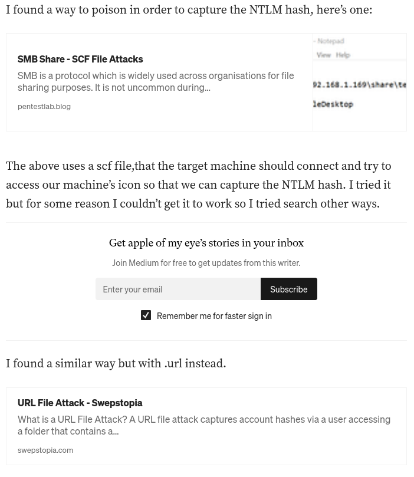

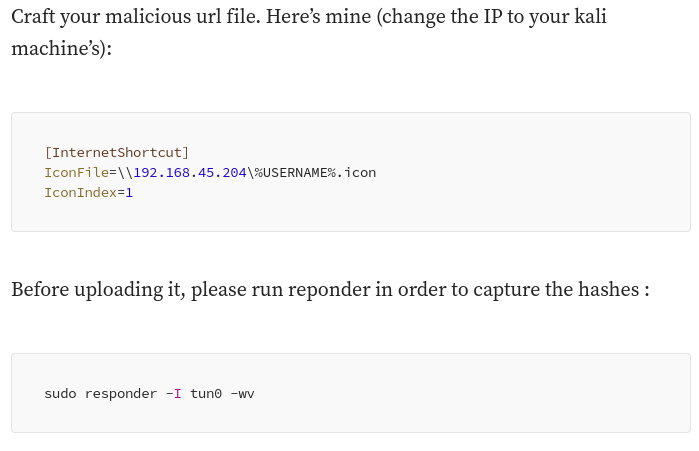

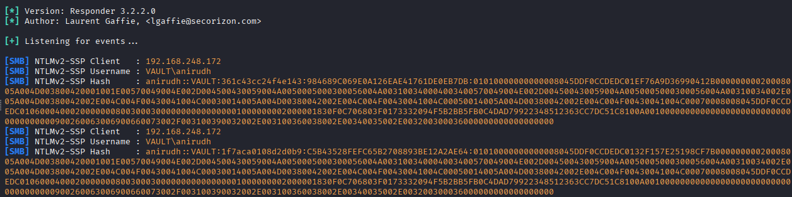

`anirudh` `SecureHM`

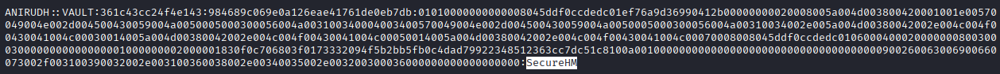

## AS-REQ

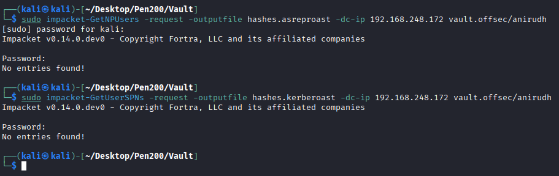

## BLOODHOUND

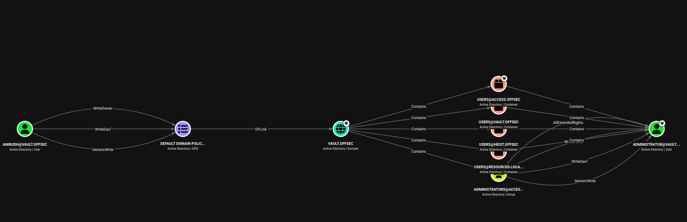

## Privilege Escalation

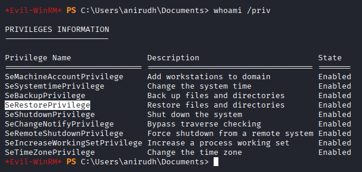

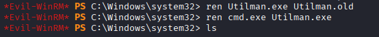

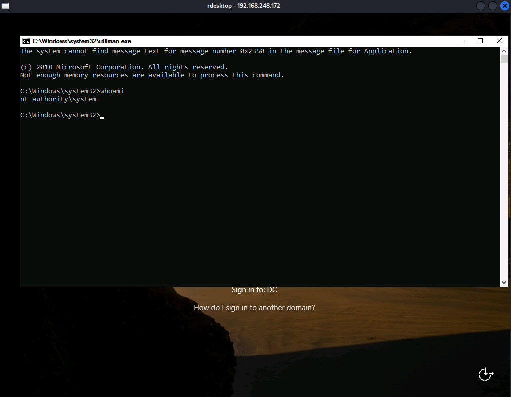

## REF
https://medium.com/@carlosbudiman/oscp-proving-grounds-vault-hard-active-directory-fb8ae465667a
