## NMAP

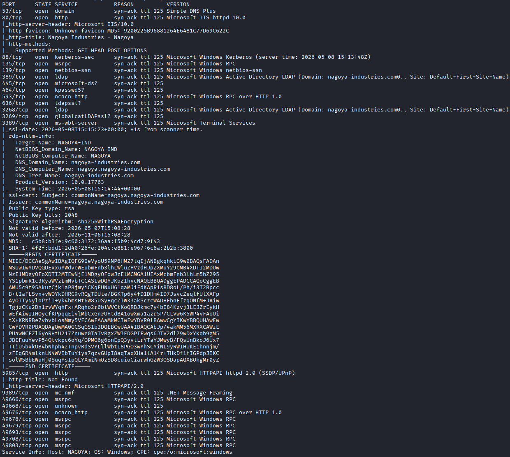

## 80 HTTP

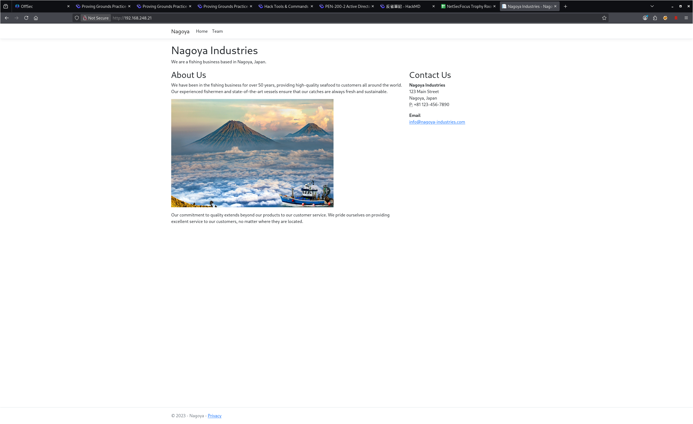

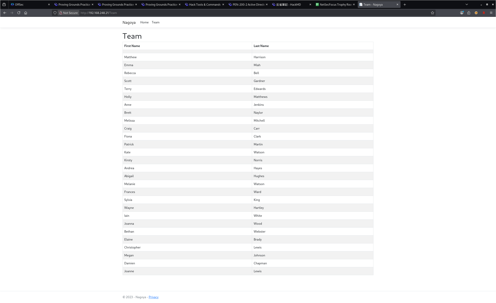

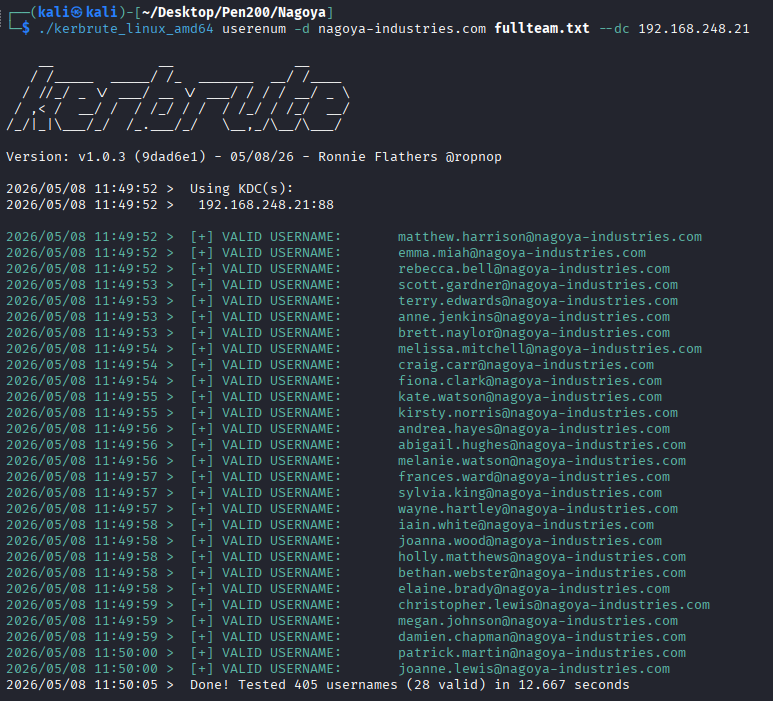

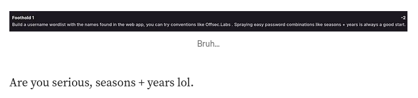

`craig.carr` + `Spring2023`

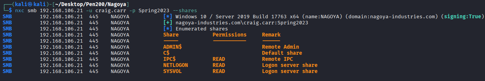

## SMB 

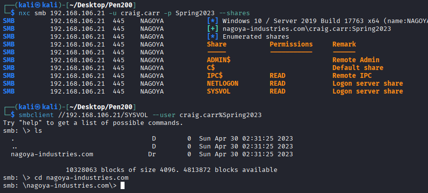

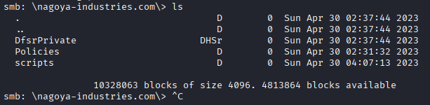

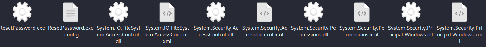

## ResetPassword.exe

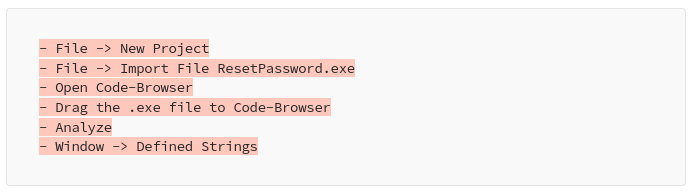

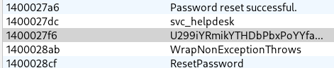

`svc_helpdesk` + `U299iYRmikYTHDbPbxPoYYfa2j4x4cdg`

## BloodHound

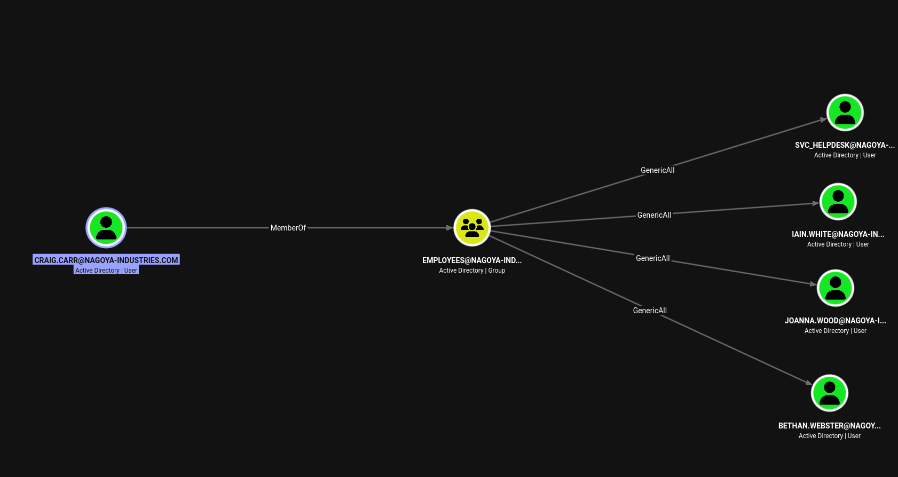

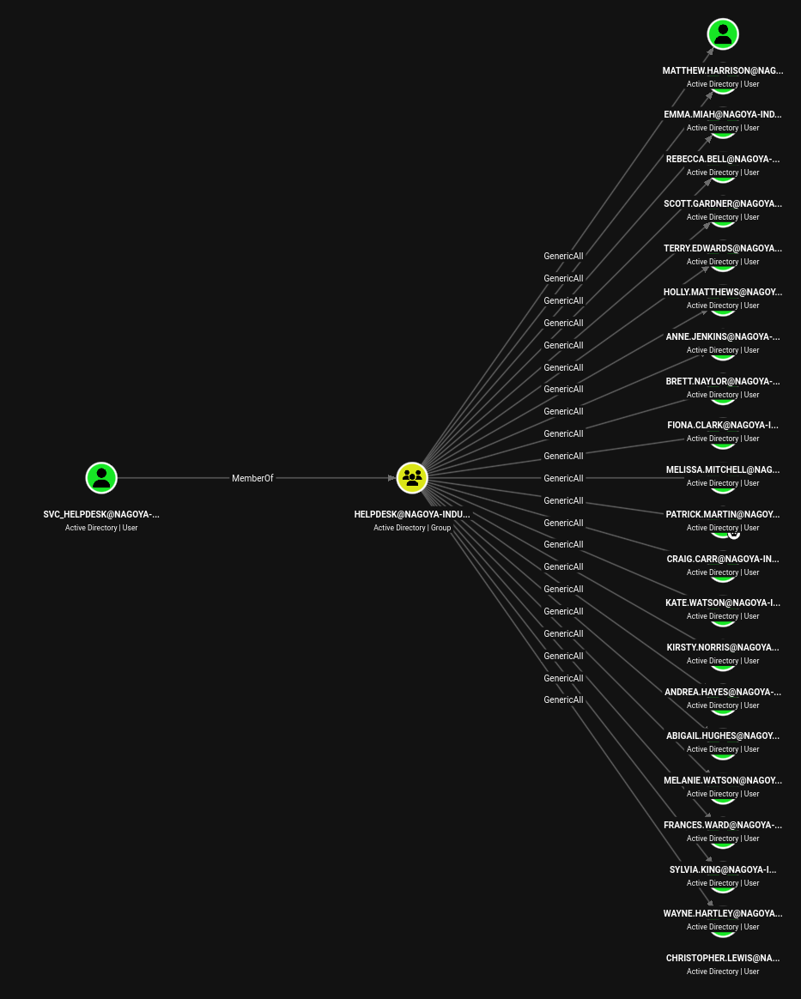

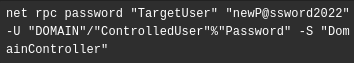

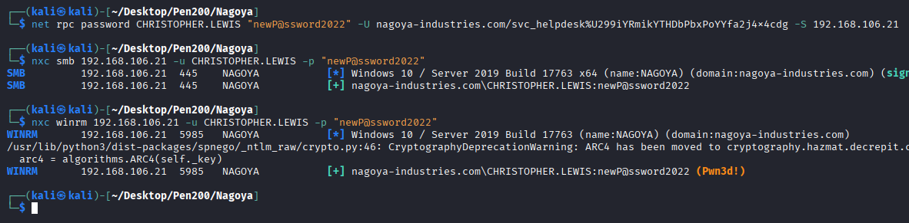

`net rpc password CHRISTOPHER.LEWIS "newP@ssword2022" -U nagoya-industries.com/svc_helpdesk%U299iYRmikYTHDbPbxPoYYfa2j4x4cdg -S 192.168.106.21`
## AS-REP & Kerberoasting

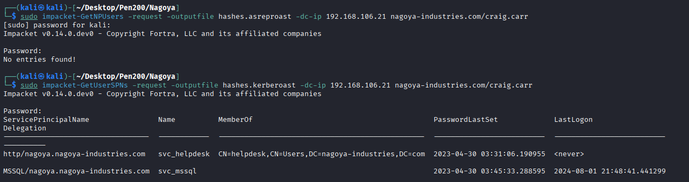

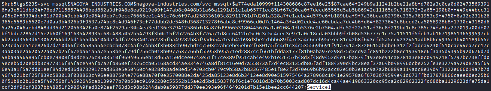

`svc_mssql` + `Service1`

## MSSQL

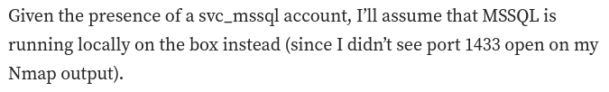

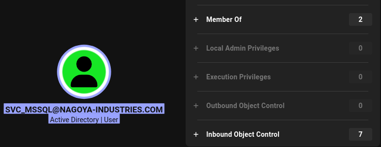

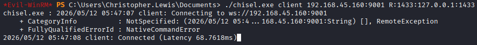

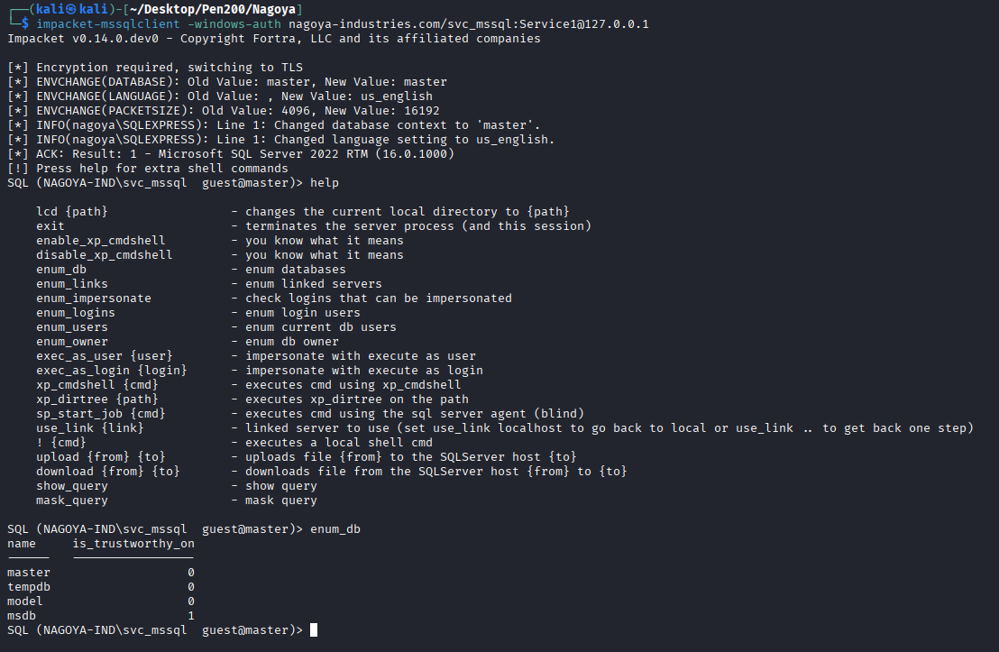

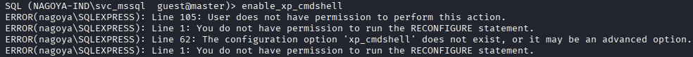

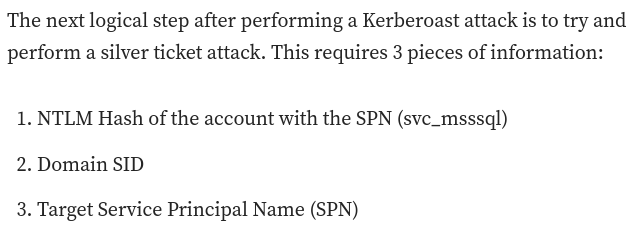

## Sliver Ticket

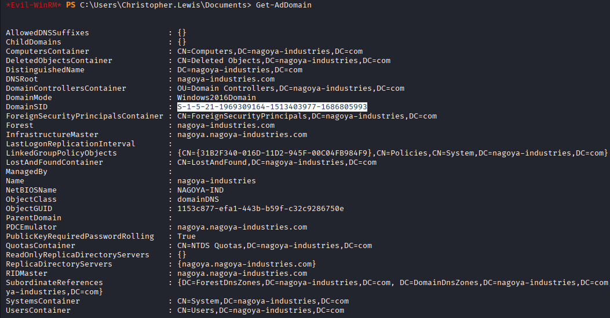

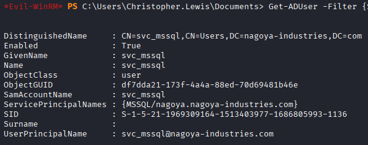

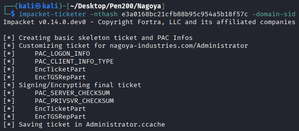

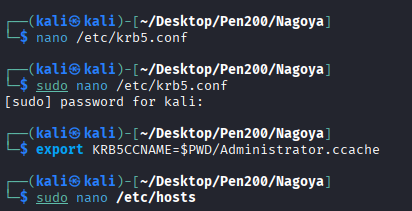

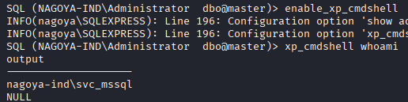

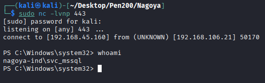

## Privilege Escalation

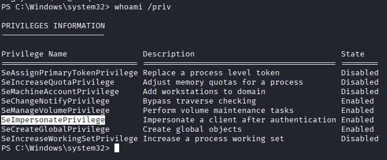

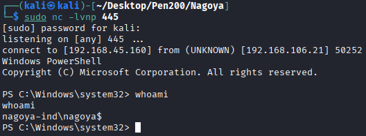

## REF
https://medium.com/@johnniketas/proving-grounds-nagoya-8e2aa702556f
https://medium.com/@carlosbudiman/oscp-proving-grounds-nagoya-hard-active-directory-bd548b5a740d
https://infosecwriteups.com/proving-grounds-practice-nagoya-19eec0a917a1