## NMAP

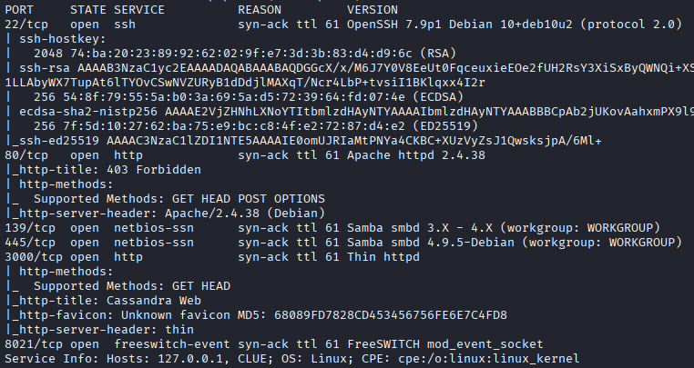

## 445 SMB

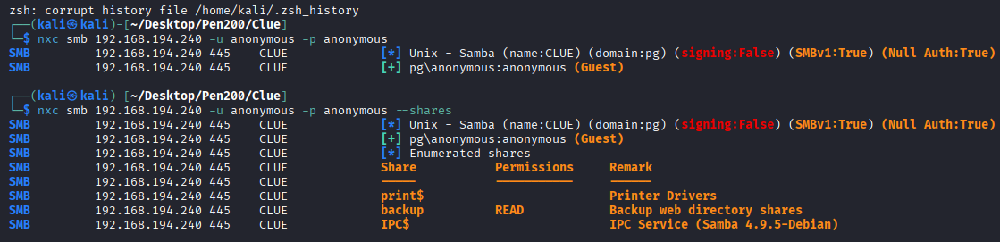

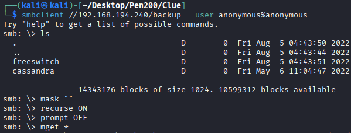

## 3000 HTTP

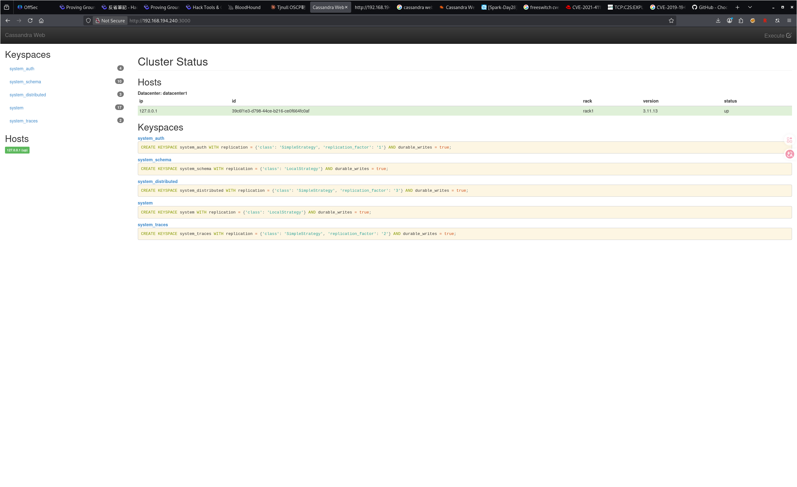

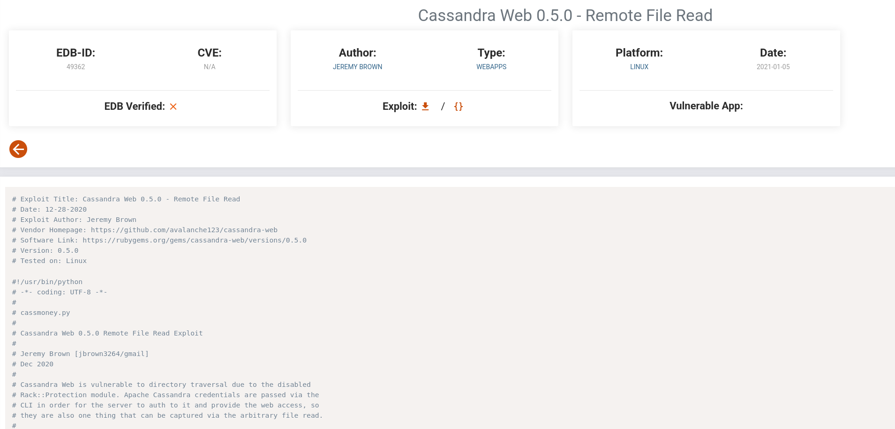

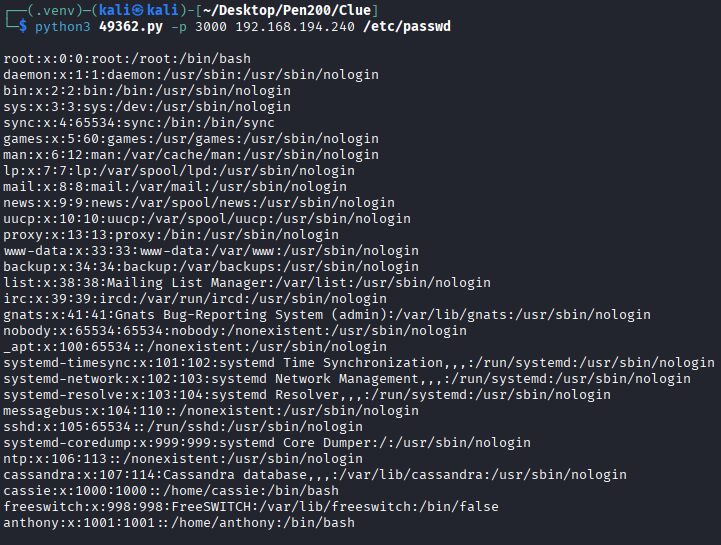

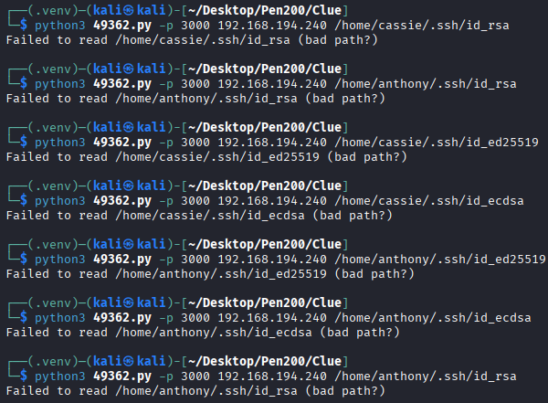

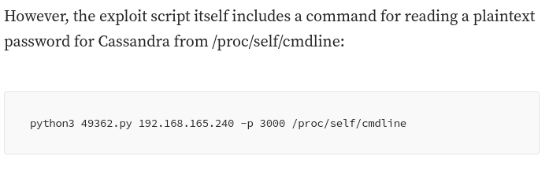

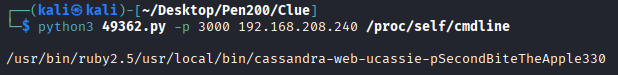

`SecondBiteTheApple330`

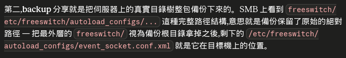

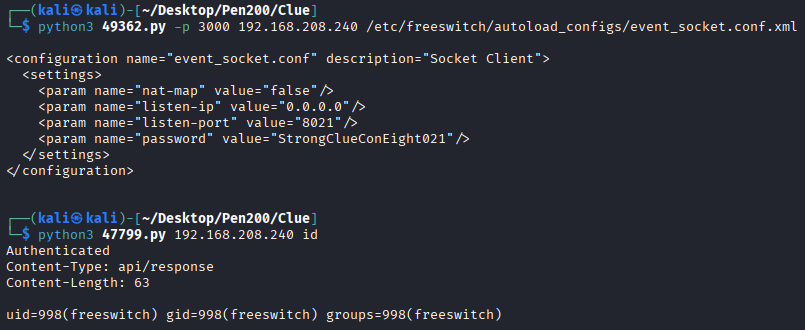

## Privilege Escalation

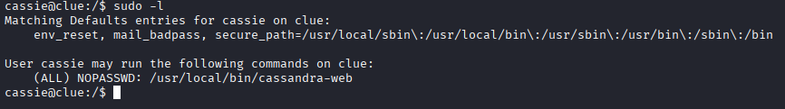

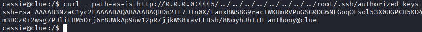

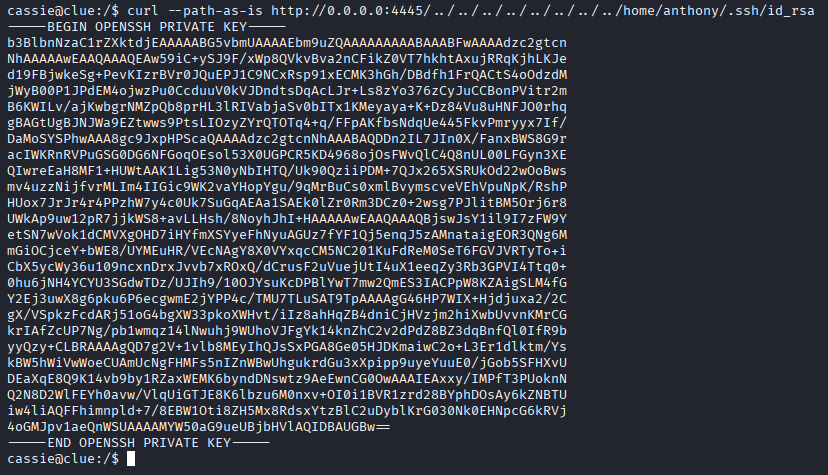

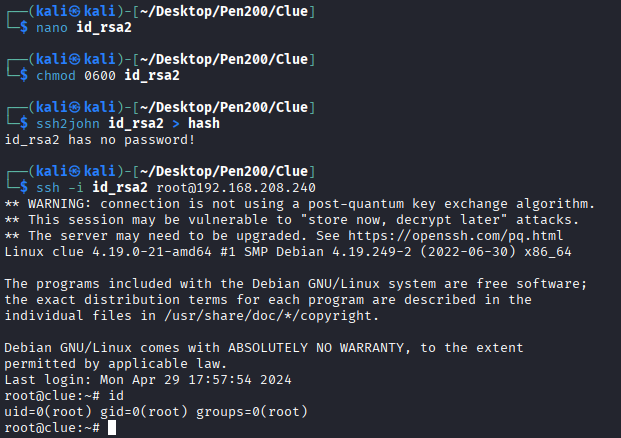

## REF
https://medium.com/@johnniketas/proving-grounds-clue-b0e197d9be56
https://medium.com/@ardian.danny/oscp-practice-series-69-proving-grounds-clue-91eb61a5af44