## NMAP

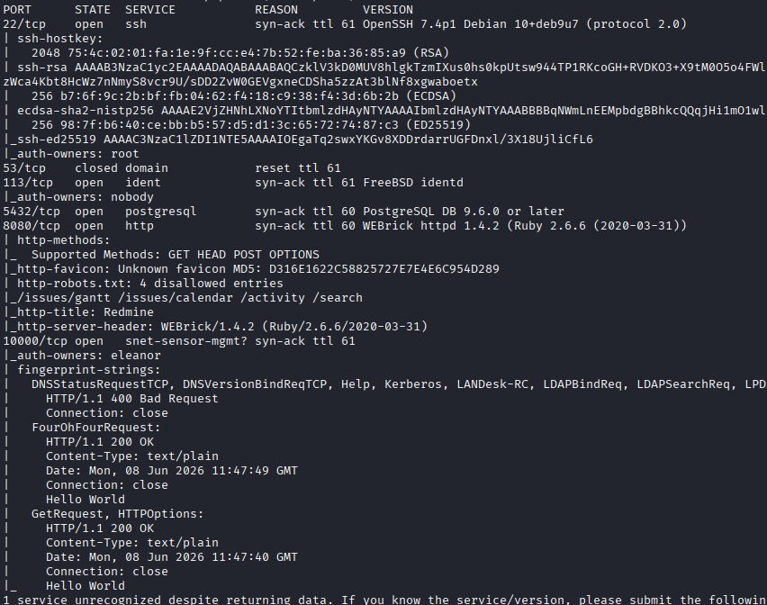

## 8080 HTTP
`admin` `admin`

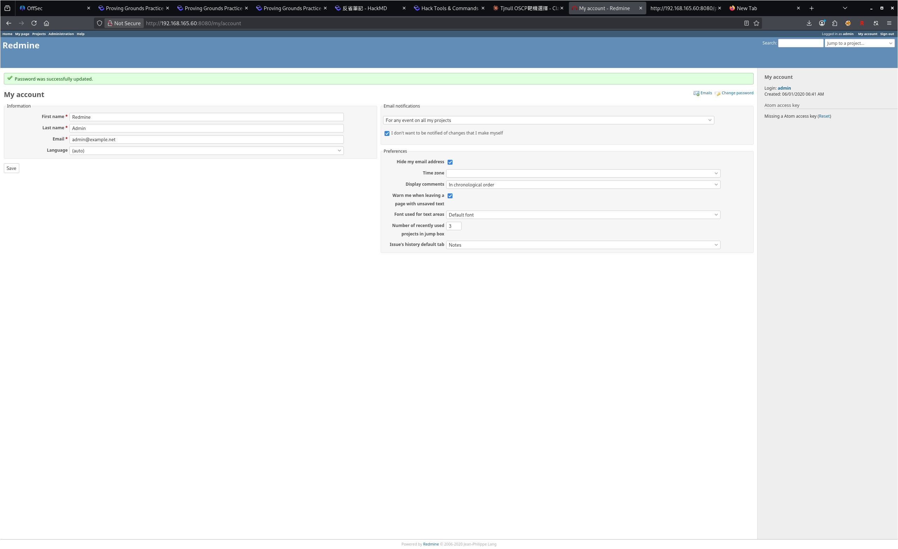

找不到可用的點

## 113 ident

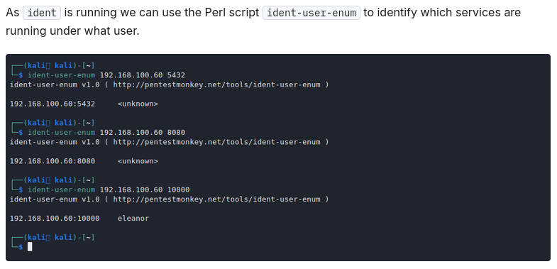

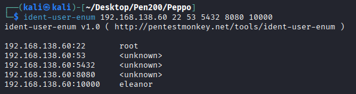

## 5432 postgresql

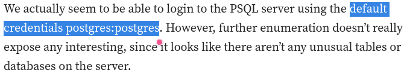

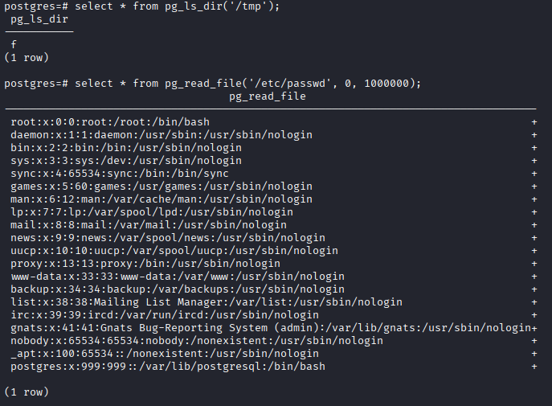

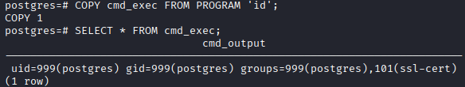

## 22 ssh

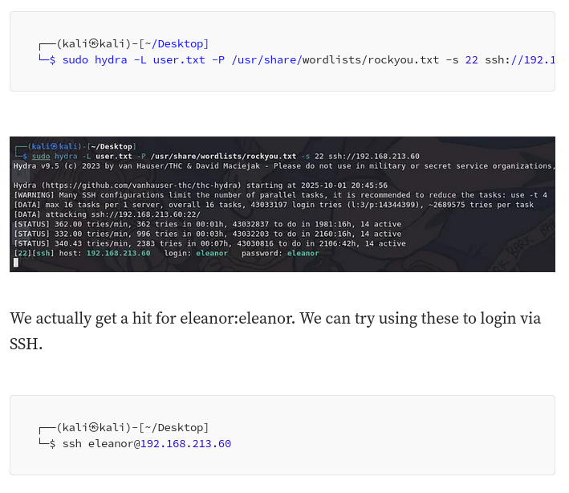

## rbash escape

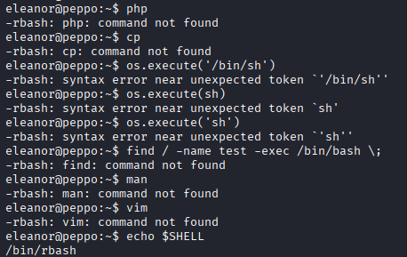

github全失敗

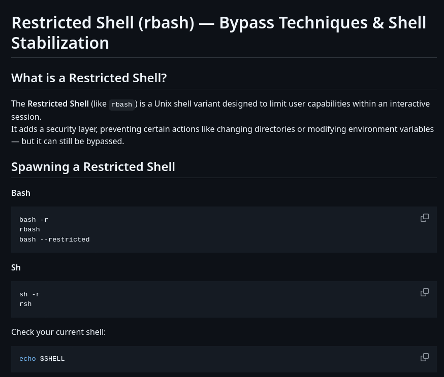

家目錄底下有一個/bin

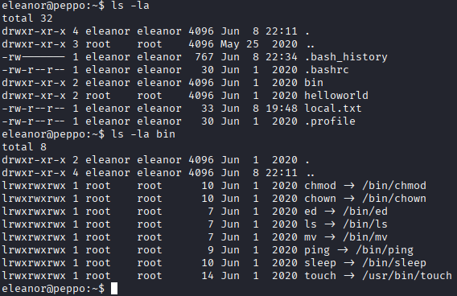

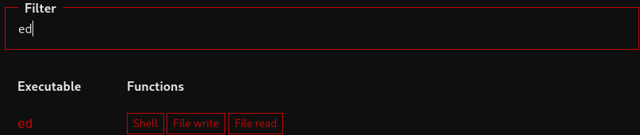

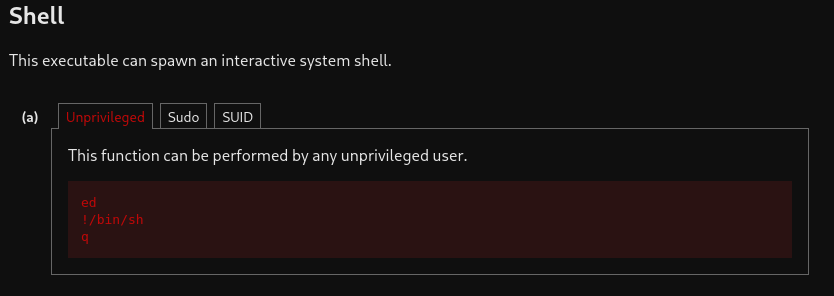

## Privilege Escalation
* /home/eleanor/helloworld

  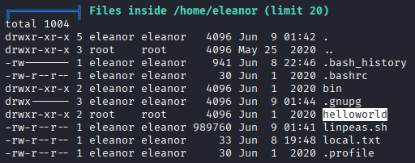

  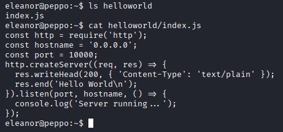

* docker

  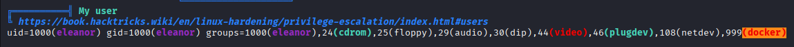

  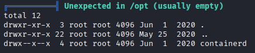

  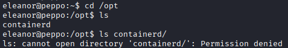

  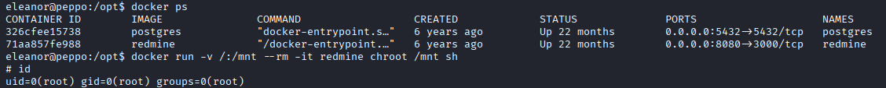

## REF
https://medium.com/@dumbangrydog/pg-practice-peppo-linux-4aeddcefb3ed
https://medium.com/@omaymaW/peppo-proving-grounds-practice-linux-c2c2e46e2485