## NMAP

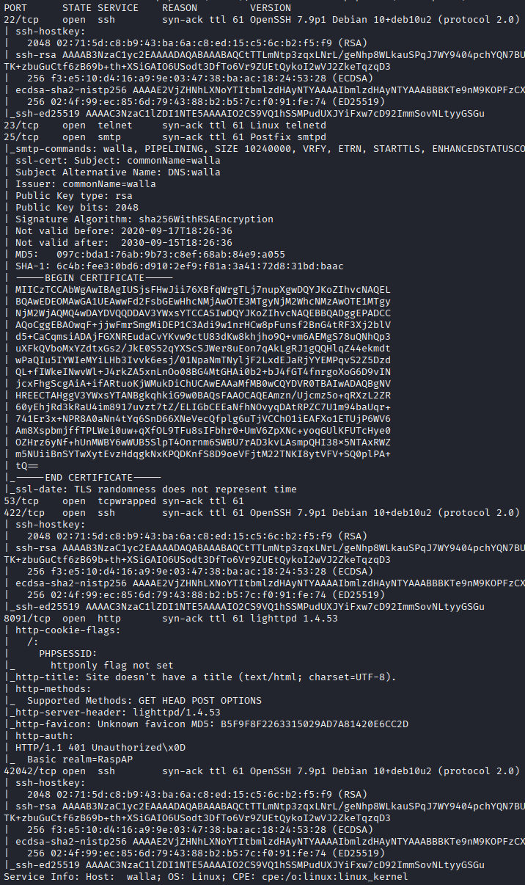

## 23 telnet

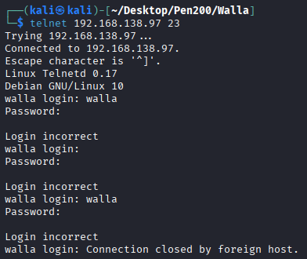

## 8091 HTTP

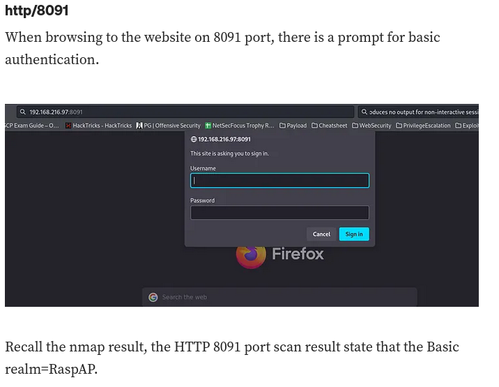

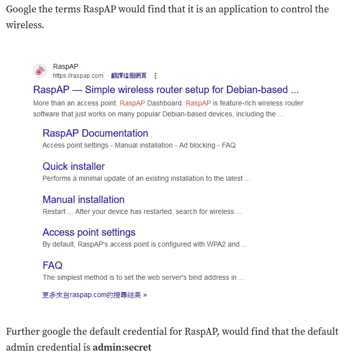

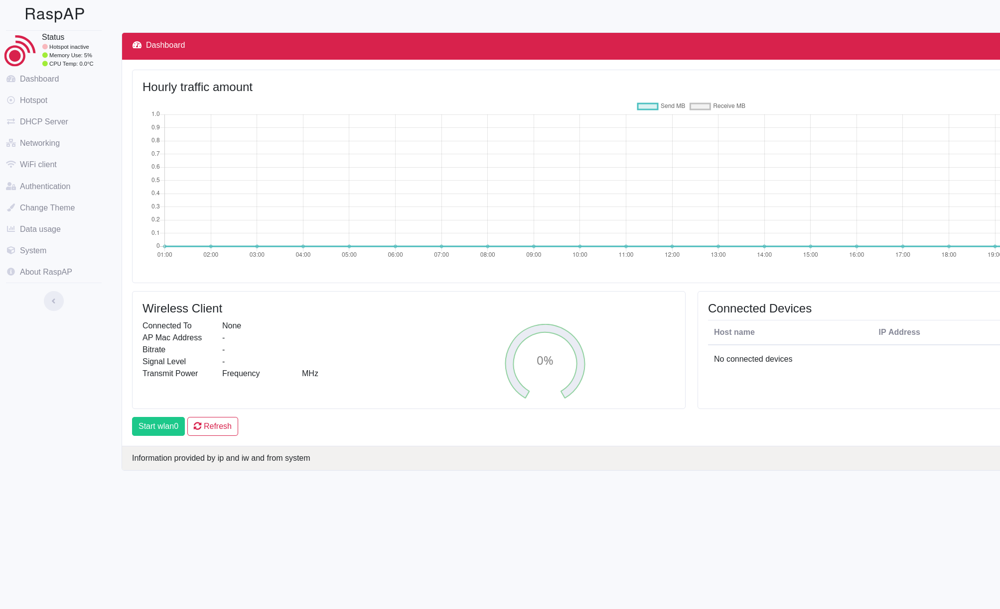

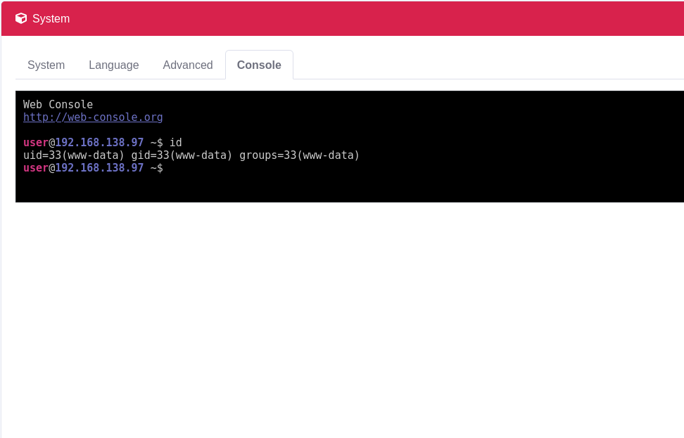

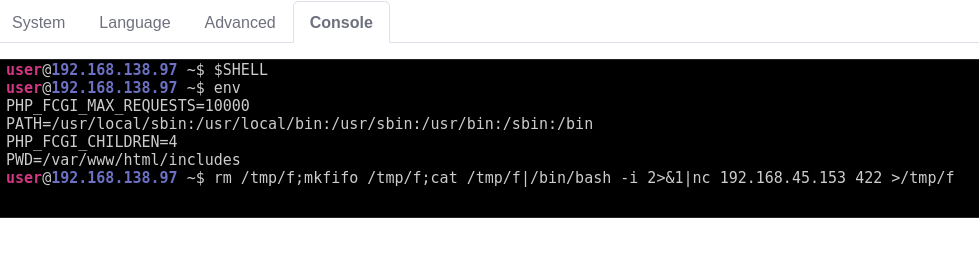

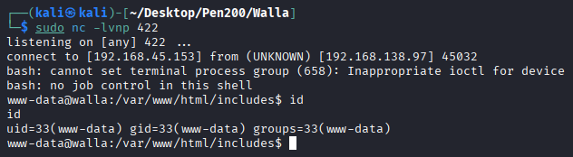

## Privilege Escalation
* 網站config

  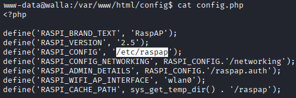

  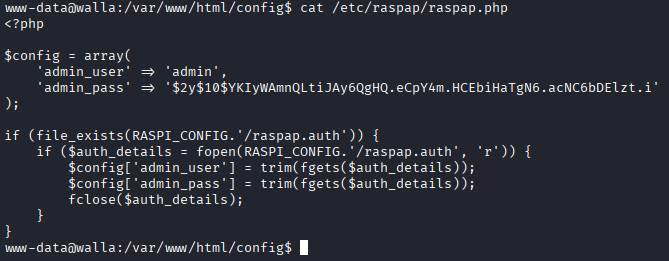

  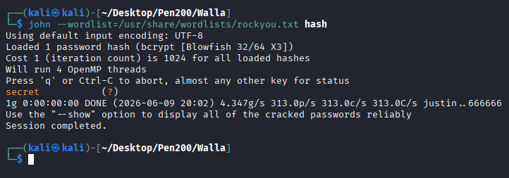

看起來是網站密碼

* 可寫入檔案

  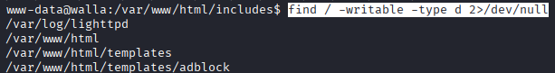

  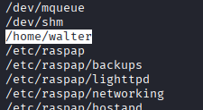

  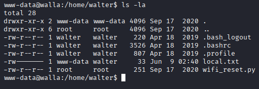

  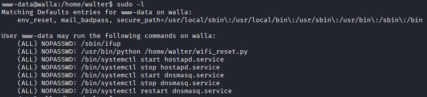

  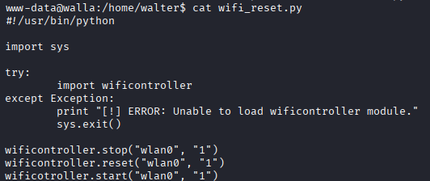

  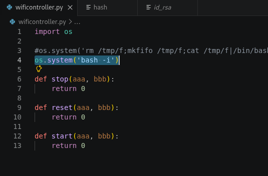

  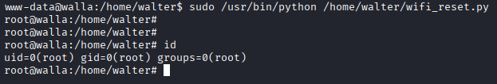

## REF
https://medium.com/@robertip/oscp-practice-walla-proving-ground-practice-16a749487528