## NMAP

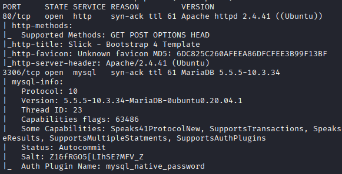

## 80 HTTP

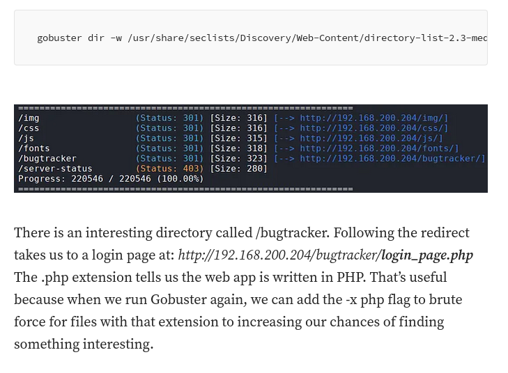

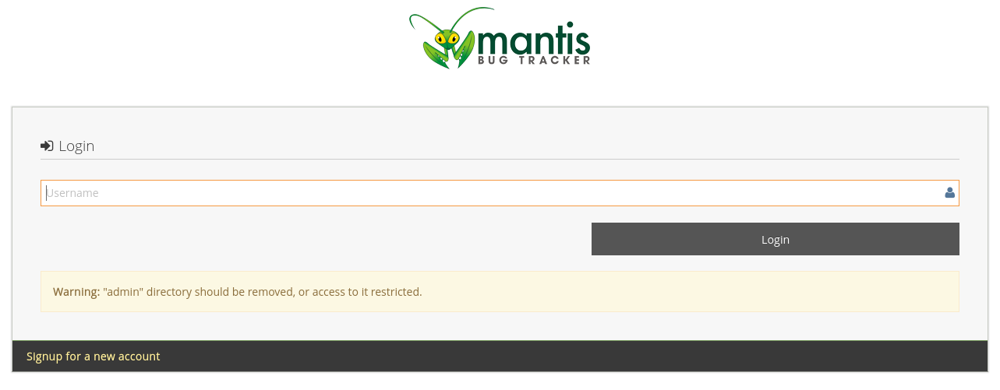

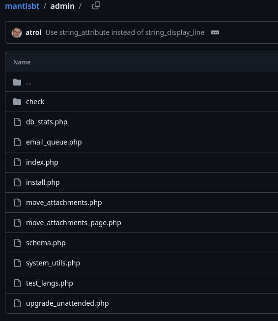

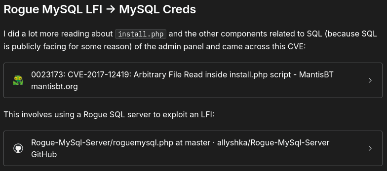

`SuperSequelPassword`

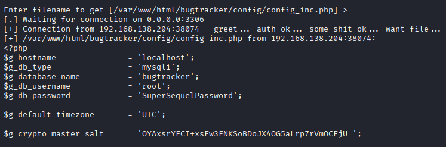

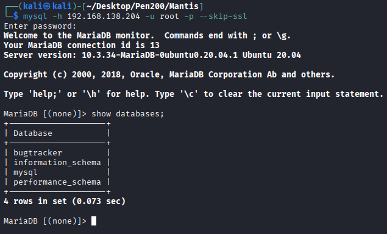

## 3306 MYSQL

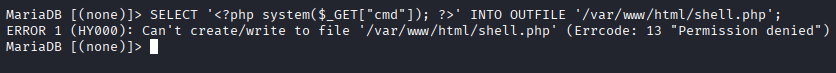

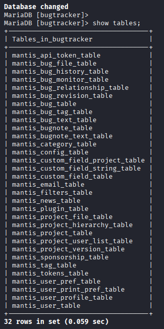

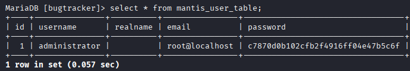

`prayingmantis`

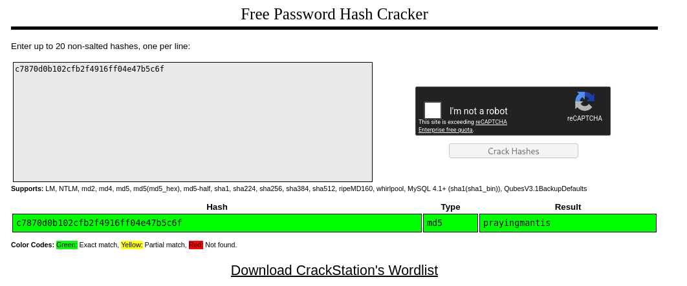

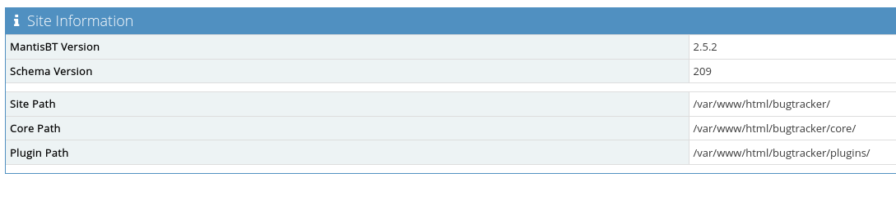

## RCE

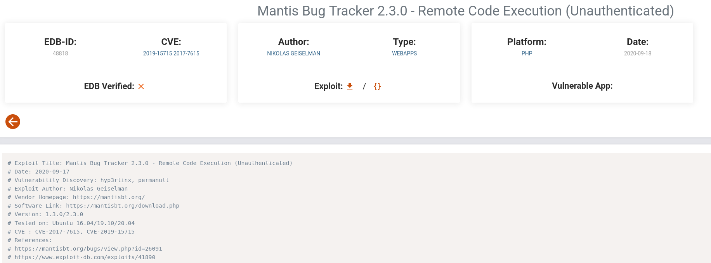

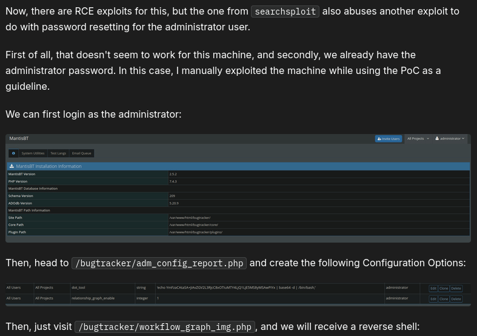

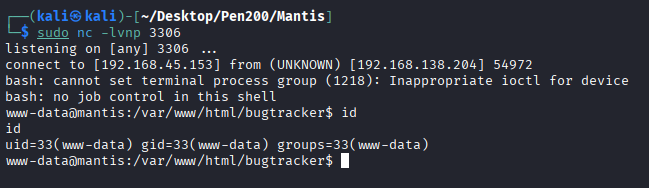

## Privilege Escalation

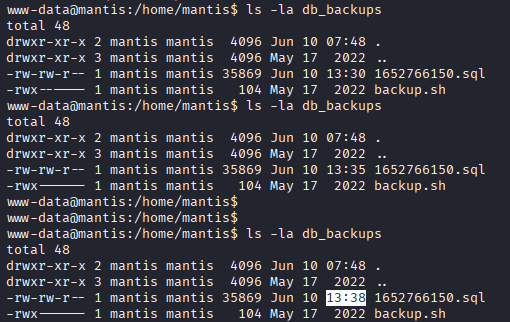

`BugTracker007`

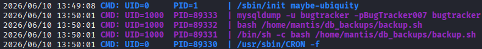

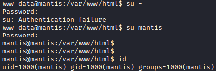

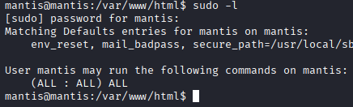

## REF
https://medium.com/@NullEsc/proving-grounds-mantis-d044d68bcf6c
https://rouvin.gitbook.io/ibreakstuff/writeups/proving-grounds-practice/linux/mantis