## NMAP

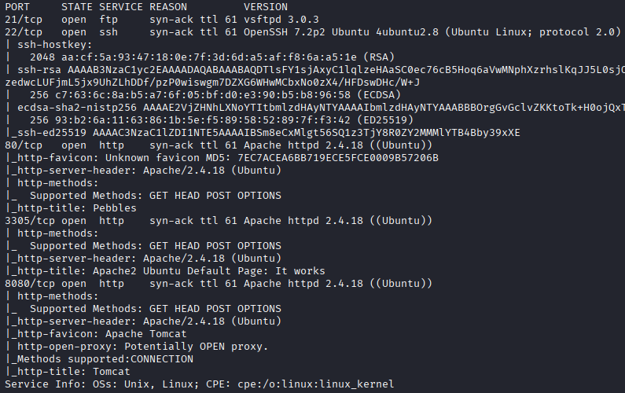

## 21 FTP

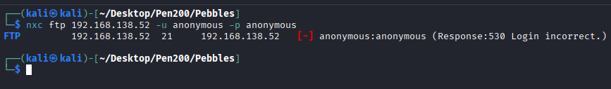

## 8080 HTTP

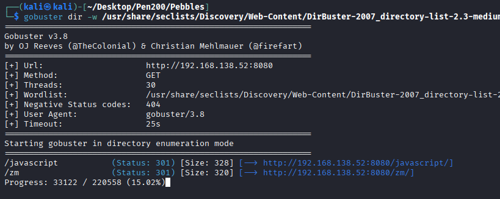

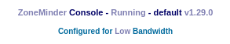

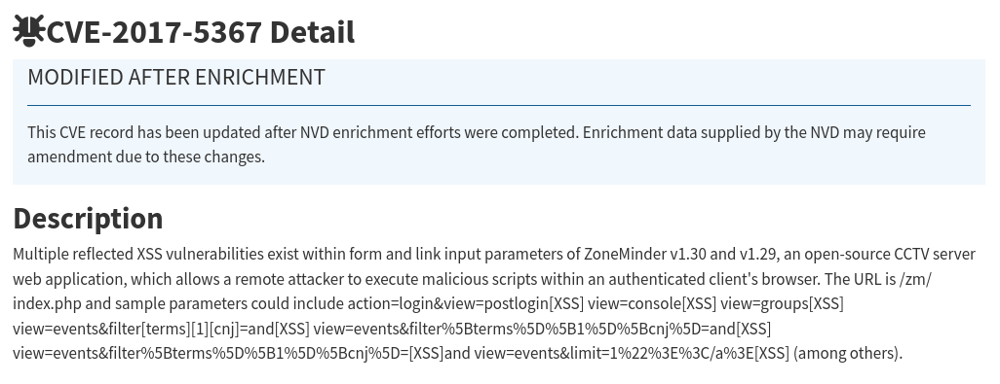

* XSS

  

  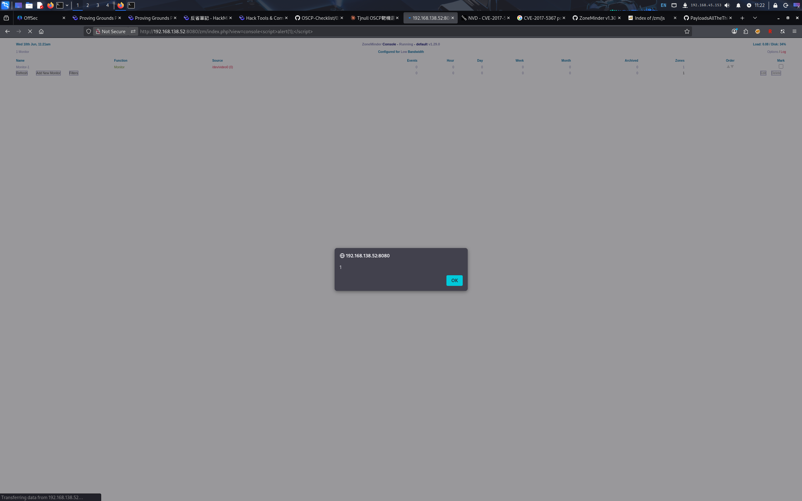

  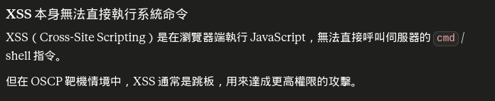

* SQLi

  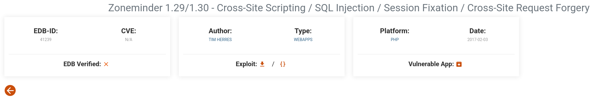

  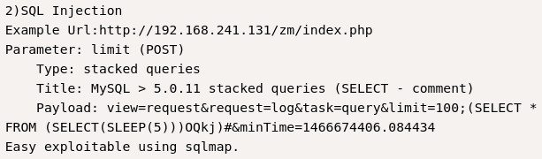

  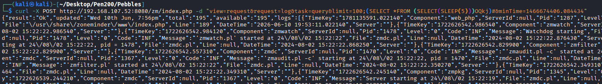

  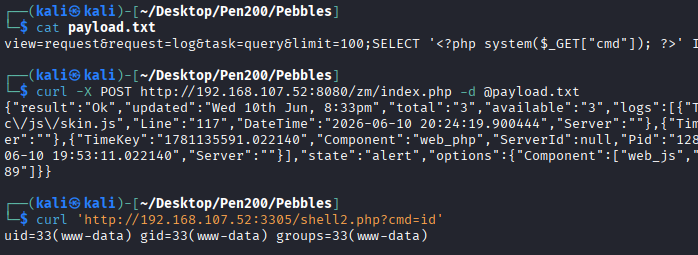

## Privilege Escalation
* mysql

  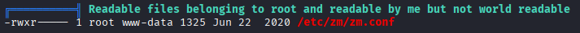

`ShinyLucentMarker361`

  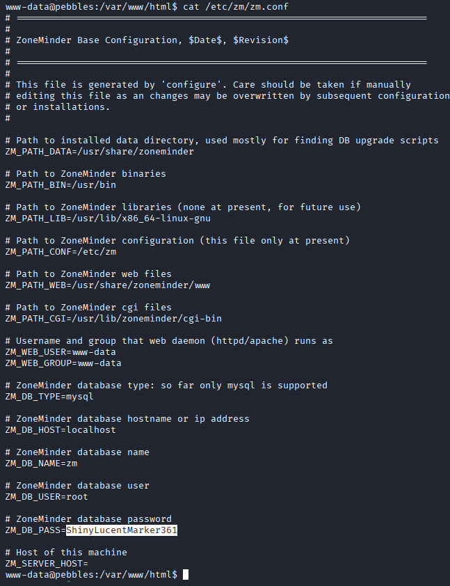

  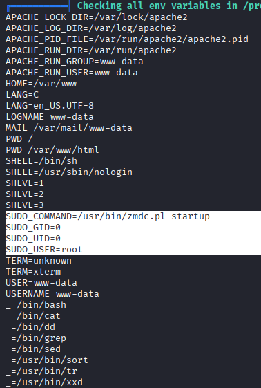

  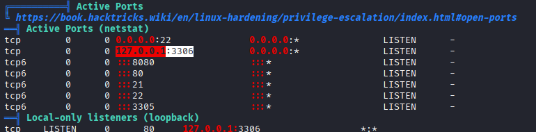

  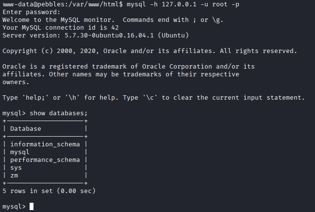

  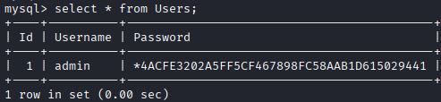

  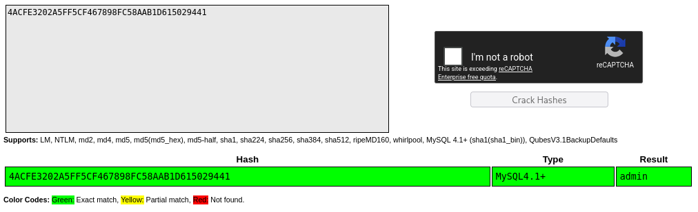

  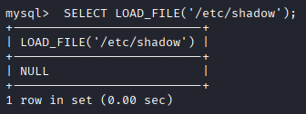

  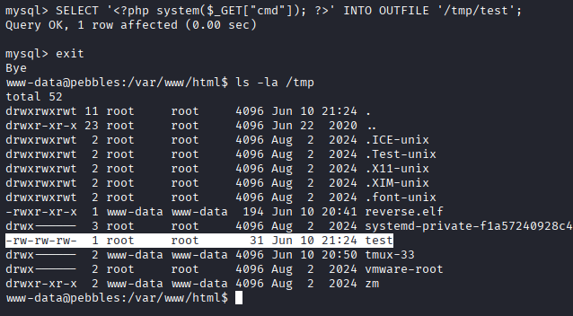

mysql寫入的檔案是root權限，但沒辦法讀取/etc/shadow

  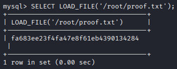

* crontab

  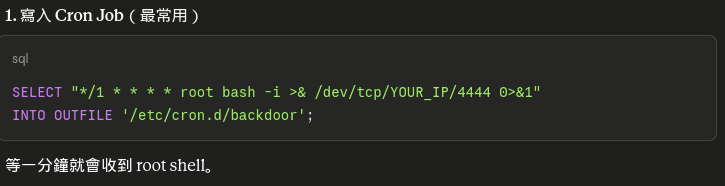

  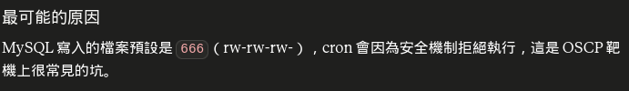

* 惡意.so檔 -> shell

  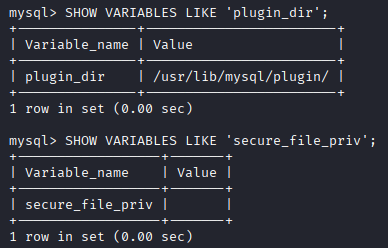

  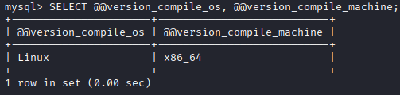

  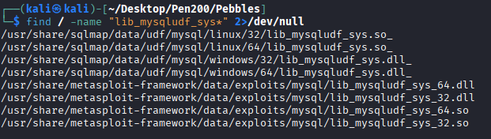

  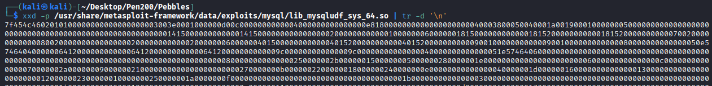

  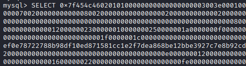

  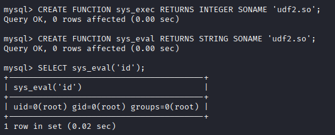

  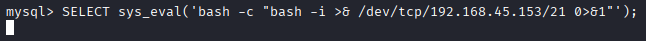

  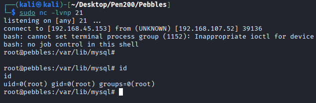

## REF
https://medium.com/@ryanchamruiyang/sql-injection-inside-after-enumerating-the-zm-06785352221d
https://medium.com/offensive-security-walk-throughs/oscp-proving-grounds-walkthrough-pebbels-4598805db790