Proving Grounds Practice-5 Jacko
https://portal.offsec.com/machine/jacko-264/overview/details
## Used Tools
* Impacket-smbserver

## Introduce

## Reconnaissance
* nmap

  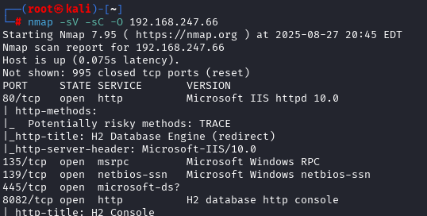

* web

  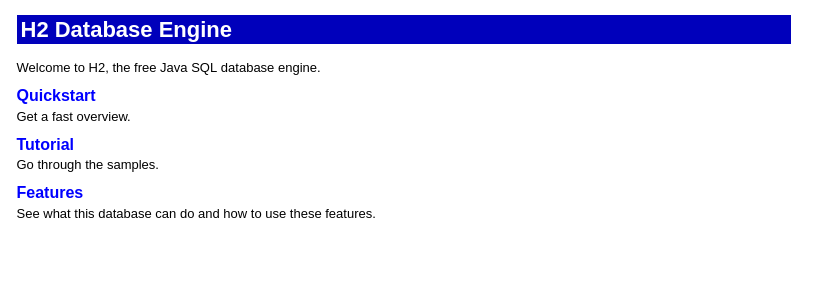

  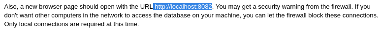

    * port 8082

      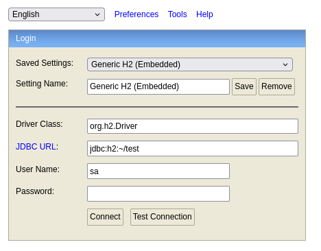

      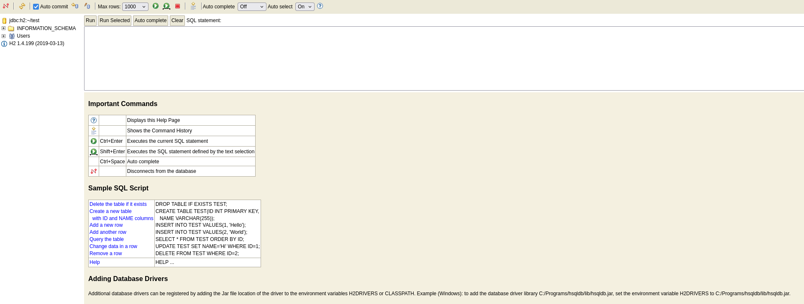

      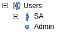

## Exploit
* Exploit Database

  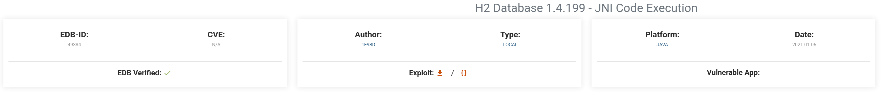

  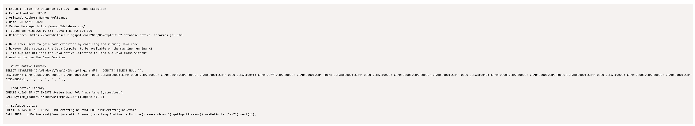

  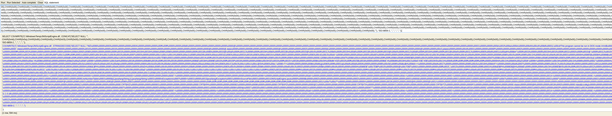

  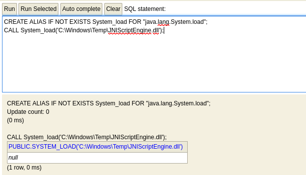

  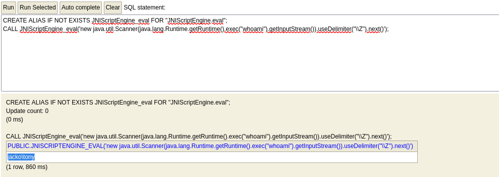

## Connect to target
* Impacket-smbserver

  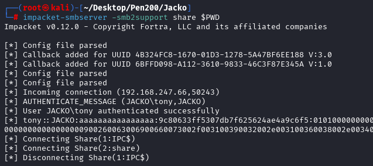

  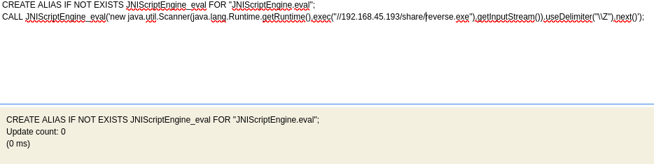

  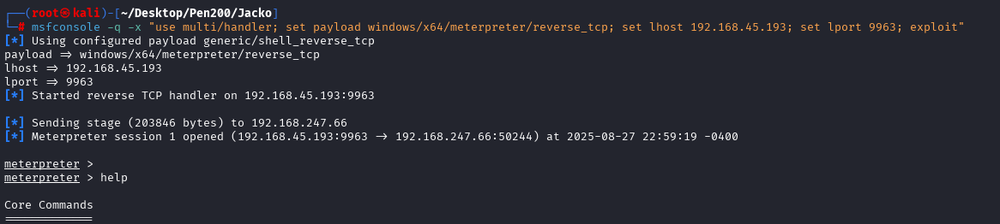

## Privilege Escalation
* Installed Program

  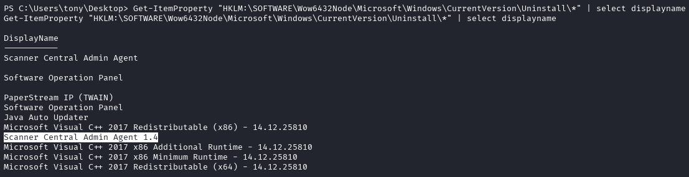

  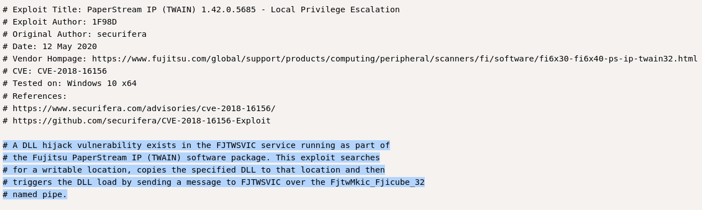

  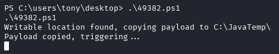

  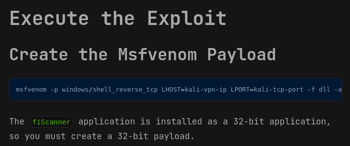
