## Introduce

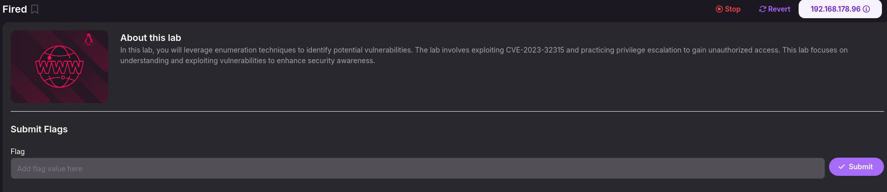

## Reconnaissance
* nmap

  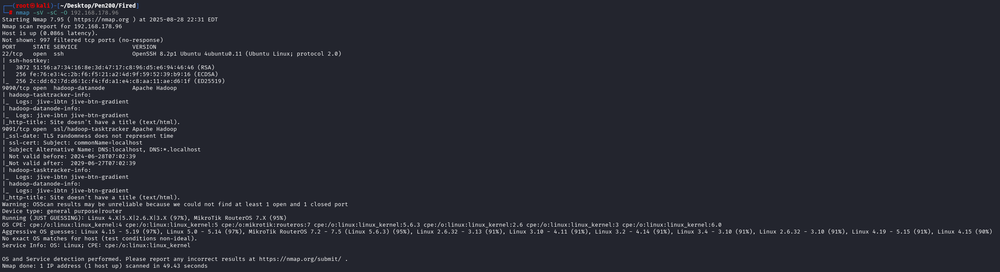

* web

  

  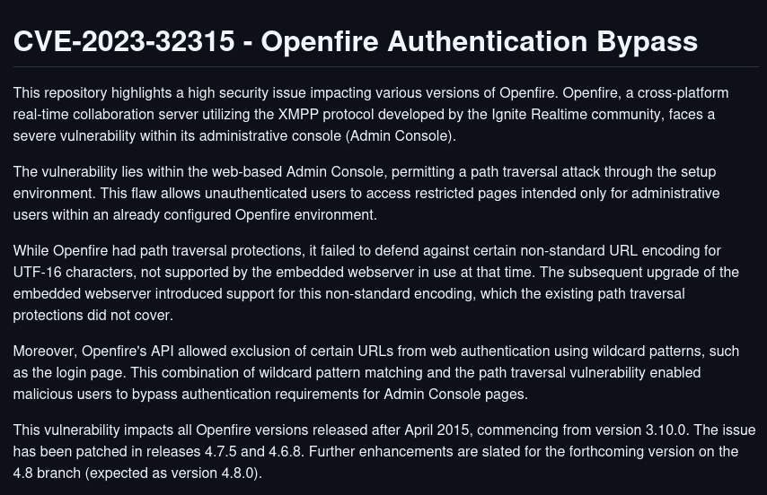

## Exploit
* CVE-2023-32315
  1. K3ysTr0K3R(Create User)

     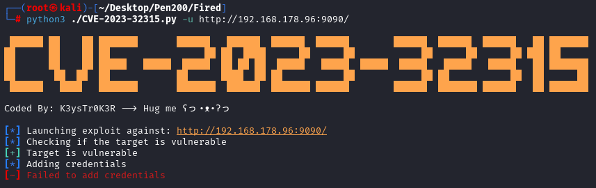

     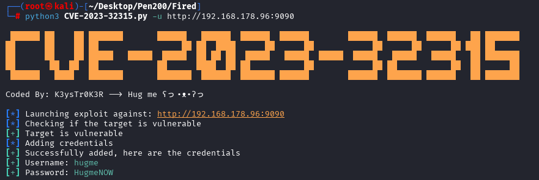

     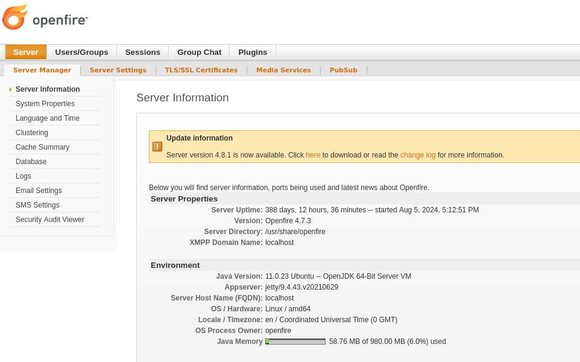

  2. tangxiaofeng7(Upload webshell)

     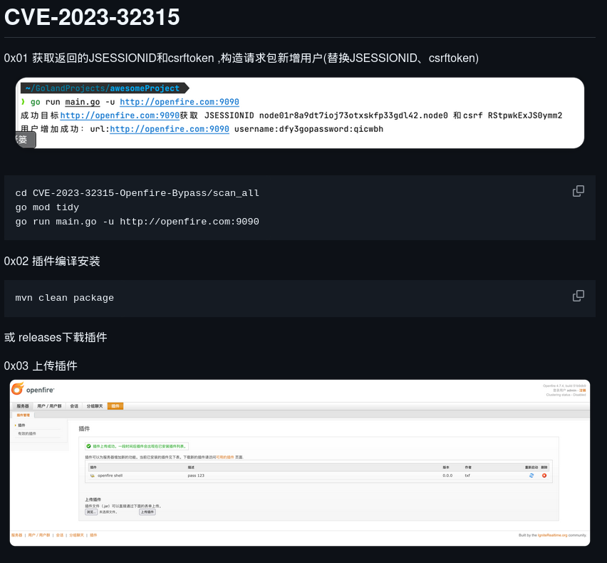

     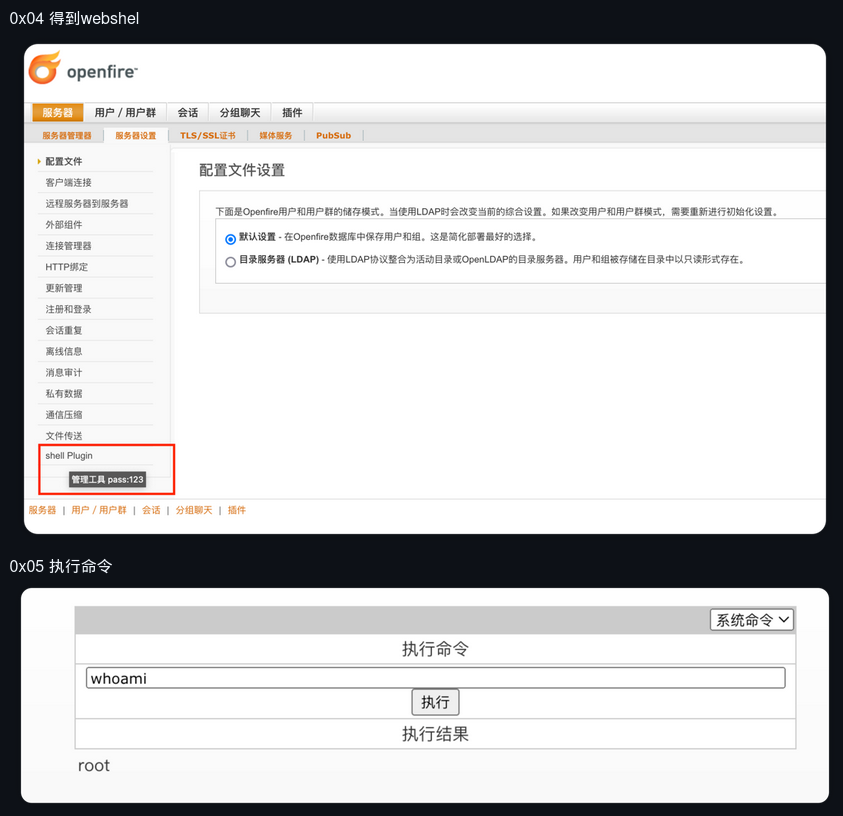

     

     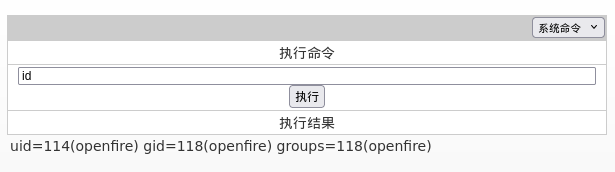

## Privilege Escalation

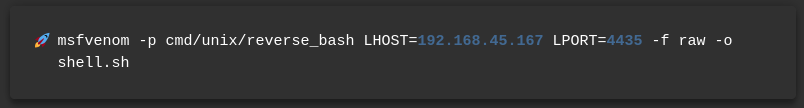

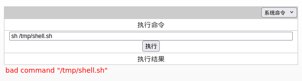

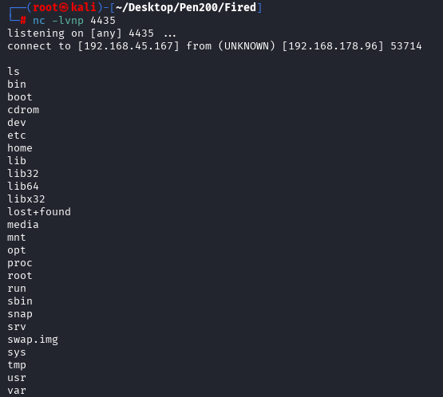

* sudo -l

  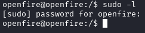

* SUID

  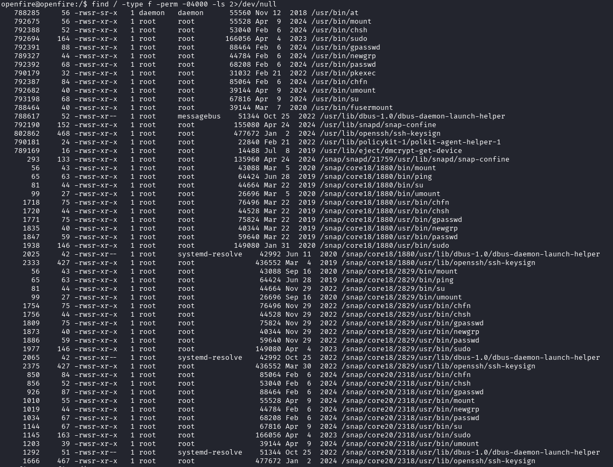

* linpeas

  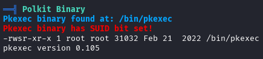

  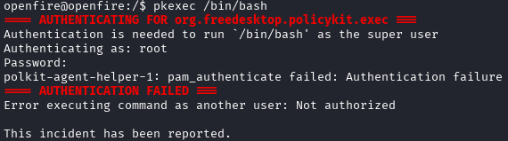

  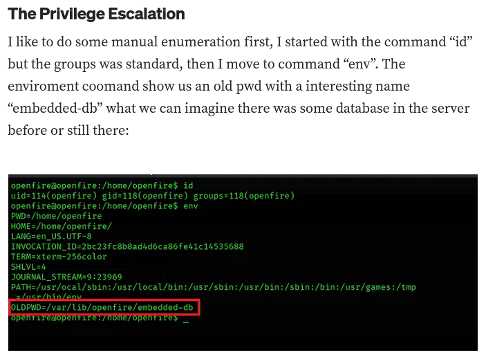

  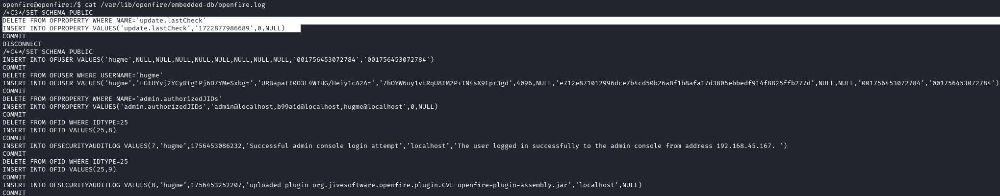

  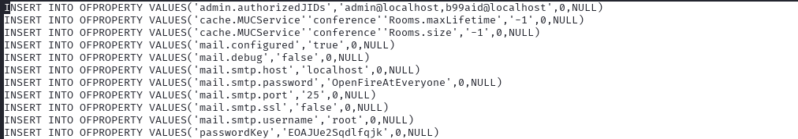

  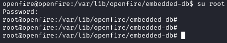

## REF
https://medium.com/@MEGAZORDI/oscp-practice-proving-grounds-fired-99745bfe2977