## Introduce

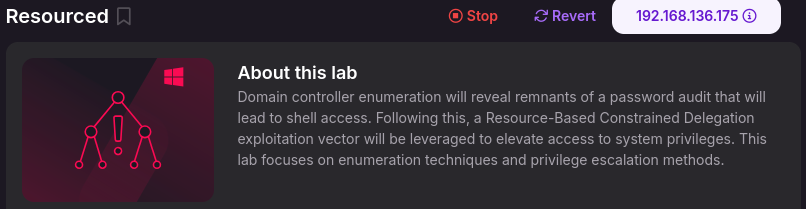

## Reconnaissance
* nmap

  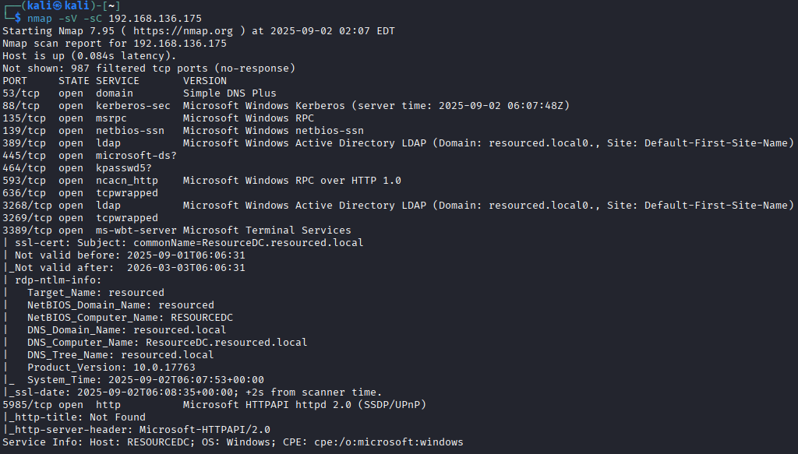

* smb

  

  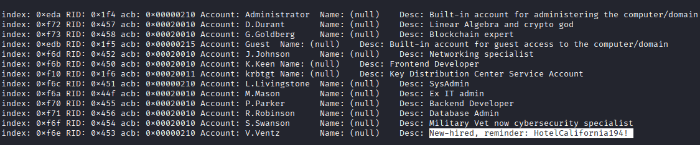

  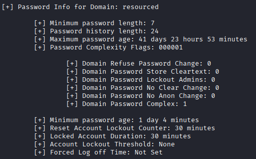

  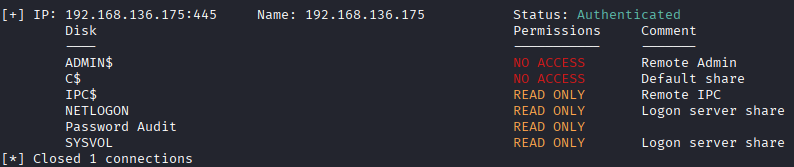

## enumeration
* SYSVOL

  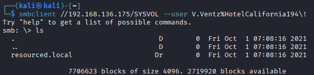

  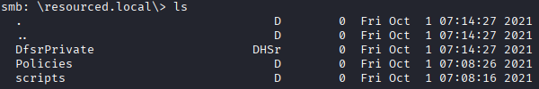

  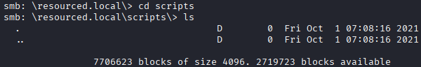

  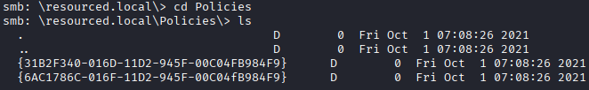

  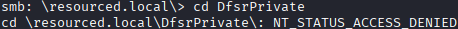

* IPC

  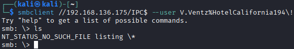

* Password Audit

  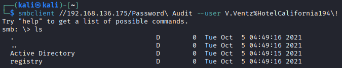

  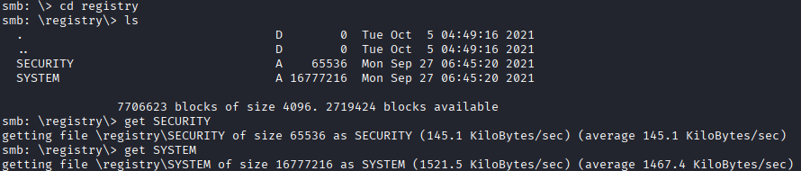

  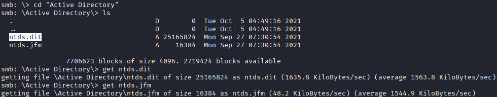

## Abuse hash

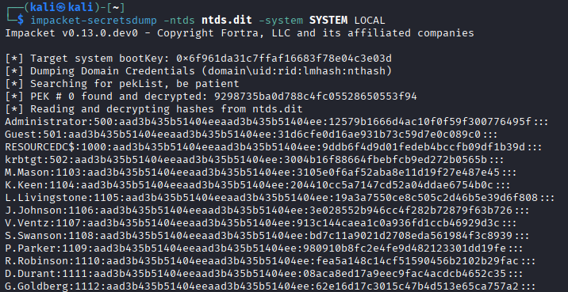

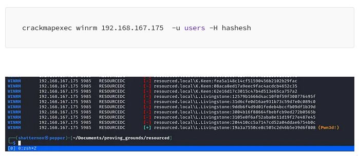

* nxc winrm

  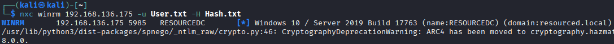

  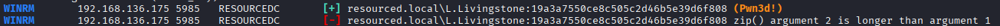

* evil-winrm
`evil-winrm -i 192.168.136.175 -u L.Livingstone -H 19a3a7550ce8c505c2d46b5e39d6f808`

  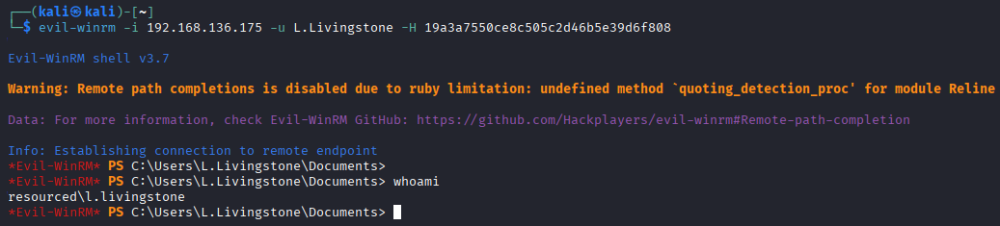

## Privilege Escalation

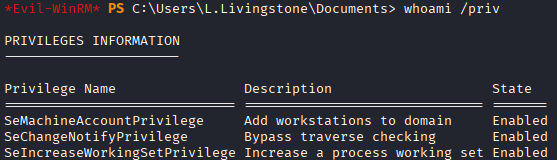

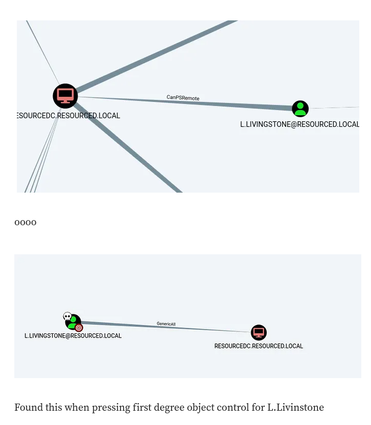

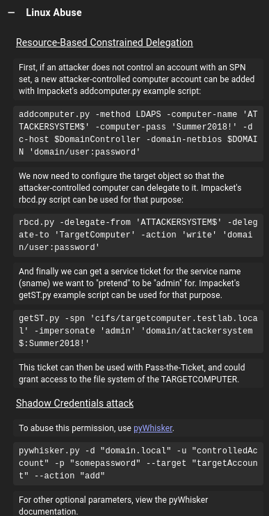

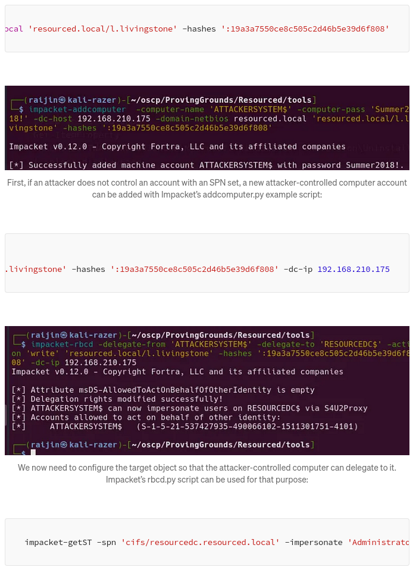

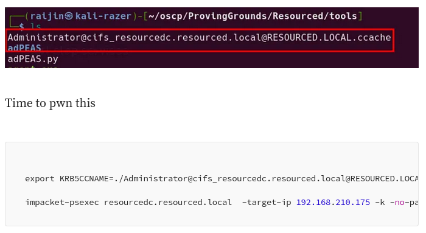

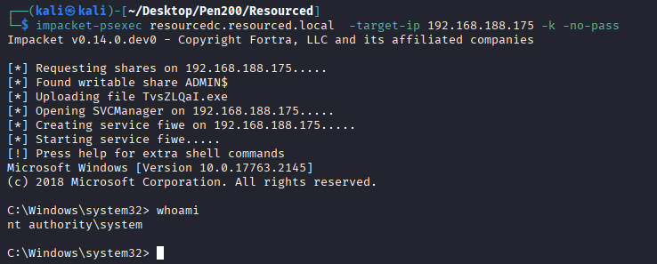

## REF
https://medium.com/@carlosbudiman/oscp-proving-grounds-resourced-intermediate-active-directory-3ca615a1ada3